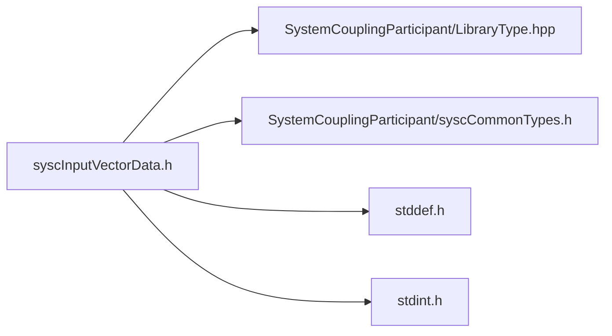

# File syscInputVectorData.h

![][C]

**Location**: `syscInputVectorData.h`


## Classes

* [SyscInputVectorData](structSyscInputVectorData.md#structSyscInputVectorData)

## Includes

* SystemCouplingParticipant/LibraryType.hpp
* SystemCouplingParticipant/syscCommonTypes.h
* <stddef.h>
* <stdint.h>





## Functions

<a id="group__SyscParticipantLibraryCAPI_1ga8609363d94eccb5ac5113332b5bd0d77"></a>
### Function syscGetInputVectorData

<a id="group__SyscParticipantLibraryCAPI_1ga21f7b8327230f78d41e61bdac3f073c0"></a>
### Function syscGetInputVectorDataCompactDouble

<a id="group__SyscParticipantLibraryCAPI_1ga1dab4c326c88b20cb402ca06c84d39c2"></a>
### Function syscGetInputVectorDataCompactFloat

<a id="group__SyscParticipantLibraryCAPI_1ga5432989ff9b68845634e551c6246e42e"></a>
### Function syscGetInputVectorDataSplitDouble

<a id="group__SyscParticipantLibraryCAPI_1ga774cdf0f3bb11efe50a587e6a11e7539"></a>
### Function syscGetInputVectorDataSplitFloat

<a id="group__SyscParticipantLibraryCAPI_1gadc1d6ed1a05cf21b0b38af4ea8247eb3"></a>
### Function syscGetInputVectorDataCompactDoubleDim

<a id="group__SyscParticipantLibraryCAPI_1ga0e5591d56881dec17e9ebaa087a7a198"></a>
### Function syscGetInputVectorDataCompactFloatDim

<a id="group__SyscParticipantLibraryCAPI_1gab707ea57d70a474cfdab07c35dc7dcf7"></a>
### Function syscGetInput2DVectorDataSplitDouble

<a id="group__SyscParticipantLibraryCAPI_1gad39531d8943485fe6a586ce4dbdc5107"></a>
### Function syscGetInput2DVectorDataSplitFloat

## Source


```
/*
* Copyright ANSYS, Inc. Unauthorized use, distribution, or duplication is prohibited.
*/

#pragma once

#include "SystemCouplingParticipant/LibraryType.hpp"

#include "SystemCouplingParticipant/syscCommonTypes.h"

#include <stddef.h>
#include <stdint.h>

#ifdef __cplusplus
extern "C" {
#endif


typedef struct {
  enum SyscPrimitiveType primitiveType; 
  void* data0;                          
  void* data1;                          
  void* data2;                          
  size_t size;                          
  enum SyscDimension dimension;         
} SyscInputVectorData;


SyscInputVectorData syscGetInputVectorData();


SyscInputVectorData syscGetInputVectorDataCompactDouble(
  double* const data,
  size_t dataSize);


SyscInputVectorData syscGetInputVectorDataCompactFloat(
  float* const data,
  size_t dataSize);


SyscInputVectorData syscGetInputVectorDataSplitDouble(
  double* const data0,
  double* const data1,
  double* const data2,
  size_t dataSize);


SyscInputVectorData syscGetInputVectorDataSplitFloat(
  float* const data0,
  float* const data1,
  float* const data2,
  size_t dataSize);


SyscInputVectorData syscGetInputVectorDataCompactDoubleDim(
  double* const data,
  size_t dataSize,
  enum SyscDimension dimension);


SyscInputVectorData syscGetInputVectorDataCompactFloatDim(
  float* const data,
  size_t dataSize,
  enum SyscDimension dimension);


SyscInputVectorData syscGetInput2DVectorDataSplitDouble(
  double* const data0,
  double* const data1,
  size_t dataSize);


SyscInputVectorData syscGetInput2DVectorDataSplitFloat(
  float* const data0,
  float* const data1,
  size_t dataSize);


#ifdef __cplusplus
}
#endif
```


[public]: https://img.shields.io/badge/-public-brightgreen (public)
[C]: https://img.shields.io/badge/language-C-blue (C)