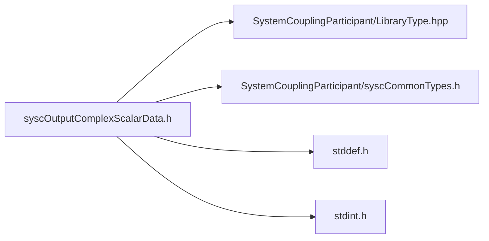

# File syscOutputComplexScalarData.h

![][C]

**Location**: `syscOutputComplexScalarData.h`


## Classes

* [SyscOutputComplexScalarData](structSyscOutputComplexScalarData.md#structSyscOutputComplexScalarData)

## Includes

* SystemCouplingParticipant/LibraryType.hpp
* SystemCouplingParticipant/syscCommonTypes.h
* <stddef.h>
* <stdint.h>





## Functions

<a id="group__SyscParticipantLibraryCAPI_1ga1ed999efcf217211831e6e440c9b6789"></a>
### Function syscGetOutputComplexScalarData

<a id="group__SyscParticipantLibraryCAPI_1ga55ed1d17c6d2f849b9588531d7c516d9"></a>
### Function syscGetOutputComplexScalarDataSplitDouble

<a id="group__SyscParticipantLibraryCAPI_1ga0e86f0bfb33258007eb2b2ecd6b44dec"></a>
### Function syscGetOutputComplexScalarDataSplitFloat

<a id="group__SyscParticipantLibraryCAPI_1ga08d88f4495f347260e4678ab6bedbf75"></a>
### Function syscGetOutputComplexScalarDataCompactDouble

<a id="group__SyscParticipantLibraryCAPI_1ga3d806d095d2d333f2a78abb38f7cddf6"></a>
### Function syscGetOutputComplexScalarDataCompactFloat

## Source


```
/*
* Copyright ANSYS, Inc. Unauthorized use, distribution, or duplication is prohibited.
*/

#pragma once

#include "SystemCouplingParticipant/LibraryType.hpp"

#include "SystemCouplingParticipant/syscCommonTypes.h"

#include <stddef.h>
#include <stdint.h>

#ifdef __cplusplus
extern "C" {
#endif


typedef struct {
  enum SyscPrimitiveType primitiveType; 
  const void* data1;                    
  const void* data2;                    
  size_t size;                          
} SyscOutputComplexScalarData;


SyscOutputComplexScalarData syscGetOutputComplexScalarData();


SyscOutputComplexScalarData syscGetOutputComplexScalarDataSplitDouble(
  const double* const dataReal,
  const double* const dataImag,
  size_t dataSize);


SyscOutputComplexScalarData syscGetOutputComplexScalarDataSplitFloat(
  const float* const dataReal,
  const float* const dataImag,
  size_t dataSize);


SyscOutputComplexScalarData syscGetOutputComplexScalarDataCompactDouble(
  const double* const data,
  size_t dataSize);


SyscOutputComplexScalarData syscGetOutputComplexScalarDataCompactFloat(
  const float* const data,
  size_t dataSize);


#ifdef __cplusplus
}
#endif
```


[public]: https://img.shields.io/badge/-public-brightgreen (public)
[C]: https://img.shields.io/badge/language-C-blue (C)