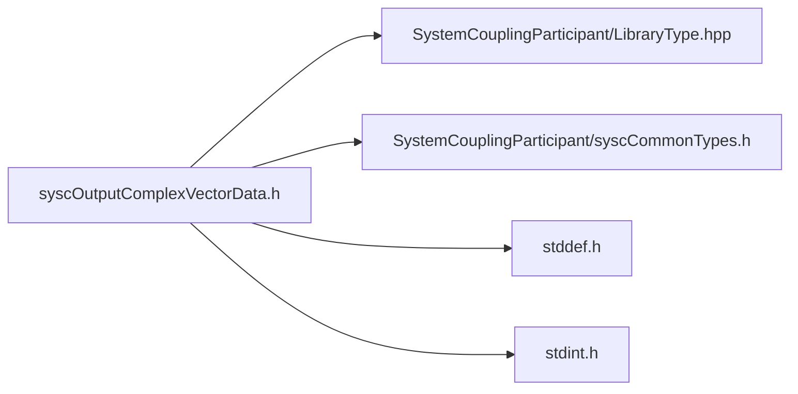

# File syscOutputComplexVectorData.h

![][C]

**Location**: `syscOutputComplexVectorData.h`


## Classes

* [SyscOutputComplexVectorData](structSyscOutputComplexVectorData.md#structSyscOutputComplexVectorData)

## Includes

* SystemCouplingParticipant/LibraryType.hpp
* SystemCouplingParticipant/syscCommonTypes.h
* <stddef.h>
* <stdint.h>





## Functions

<a id="group__SyscParticipantLibraryCAPI_1gafd1174430666266b1337c8e1d3569aa6"></a>
### Function syscGetOutputComplexVectorData

<a id="group__SyscParticipantLibraryCAPI_1gab9832696d96ffd32917b2211497c31e1"></a>
### Function syscGetOutputCompactComplexCompactVectorDataDouble

<a id="group__SyscParticipantLibraryCAPI_1ga1bddd7590dc1c4e4b488981694a723fc"></a>
### Function syscGetOutputCompactComplexCompactVectorDataFloat

<a id="group__SyscParticipantLibraryCAPI_1ga619a769c0b474a093ca8df07fa23c745"></a>
### Function syscGetOutputSplitComplexCompactVectorDataDouble

<a id="group__SyscParticipantLibraryCAPI_1ga9c6fb47e5c54e7f1ee9bfdd2a6b78f96"></a>
### Function syscGetOutputSplitComplexCompactVectorDataFloat

<a id="group__SyscParticipantLibraryCAPI_1ga36581954b1bed9e21ddd6d6951478a45"></a>
### Function syscGetOutputCompactComplexSplitVectorDataDouble

<a id="group__SyscParticipantLibraryCAPI_1ga6fab1156fcb4f29d454bd3574b7472a7"></a>
### Function syscGetOutputCompactComplexSplitVectorDataFloat

<a id="group__SyscParticipantLibraryCAPI_1gaceabb4ea93346ecbbdda387e7f067465"></a>
### Function syscGetOutputSplitComplexSplitVectorDataDouble

<a id="group__SyscParticipantLibraryCAPI_1ga3d957a5fa32db290017e2f23d15311f2"></a>
### Function syscGetOutputSplitComplexSplitVectorDataFloat

<a id="group__SyscParticipantLibraryCAPI_1gac98c66232a8c5c204c4bad9f0dd5585c"></a>
### Function syscGetOutputCompactComplexCompactVectorDataDoubleDim

<a id="group__SyscParticipantLibraryCAPI_1gab1ea60c9d226cf14e580d6d3c945f3ab"></a>
### Function syscGetOutputCompactComplexCompactVectorDataFloatDim

## Source


```
/*
* Copyright ANSYS, Inc. Unauthorized use, distribution, or duplication is prohibited.
*/

#pragma once

#include "SystemCouplingParticipant/LibraryType.hpp"

#include "SystemCouplingParticipant/syscCommonTypes.h"

#include <stddef.h>
#include <stdint.h>

#ifdef __cplusplus
extern "C" {
#endif


typedef struct {
  enum SyscPrimitiveType primitiveType; 
  const void* data1;                    
  const void* data2;                    
  const void* data3;                    
  const void* data4;                    
  const void* data5;                    
  const void* data6;                    
  size_t size;                          
  enum SyscDimension dimension;         
} SyscOutputComplexVectorData;


SyscOutputComplexVectorData syscGetOutputComplexVectorData();


SyscOutputComplexVectorData syscGetOutputCompactComplexCompactVectorDataDouble(
  const double* const data,
  size_t dataSize);


SyscOutputComplexVectorData syscGetOutputCompactComplexCompactVectorDataFloat(
  const float* const data,
  size_t dataSize);


SyscOutputComplexVectorData syscGetOutputSplitComplexCompactVectorDataDouble(
  const double* const dataReal,
  const double* const dataImag,
  size_t dataSize);


SyscOutputComplexVectorData syscGetOutputSplitComplexCompactVectorDataFloat(
  const float* const dataReal,
  const float* const dataImag,
  size_t dataSize);


SyscOutputComplexVectorData syscGetOutputCompactComplexSplitVectorDataDouble(
  const double* const data1,
  const double* const data2,
  const double* const data3,
  size_t dataSize);


SyscOutputComplexVectorData syscGetOutputCompactComplexSplitVectorDataFloat(
  const float* const data1,
  const float* const data2,
  const float* const data3,
  size_t dataSize);


SyscOutputComplexVectorData syscGetOutputSplitComplexSplitVectorDataDouble(
  const double* const data1Real,
  const double* const data1Imag,
  const double* const data2Real,
  const double* const data2Imag,
  const double* const data3Real,
  const double* const data3Imag,
  size_t dataSize);


SyscOutputComplexVectorData syscGetOutputSplitComplexSplitVectorDataFloat(
  const float* const data1Real,
  const float* const data1Imag,
  const float* const data2Real,
  const float* const data2Imag,
  const float* const data3Real,
  const float* const data3Imag,
  size_t dataSize);


SyscOutputComplexVectorData syscGetOutputCompactComplexCompactVectorDataDoubleDim(
  const double* const data,
  size_t dataSize,
  enum SyscDimension dimension);


SyscOutputComplexVectorData syscGetOutputCompactComplexCompactVectorDataFloatDim(
  const float* const data,
  size_t dataSize,
  enum SyscDimension dimension);


#ifdef __cplusplus
}
#endif
```


[public]: https://img.shields.io/badge/-public-brightgreen (public)
[C]: https://img.shields.io/badge/language-C-blue (C)