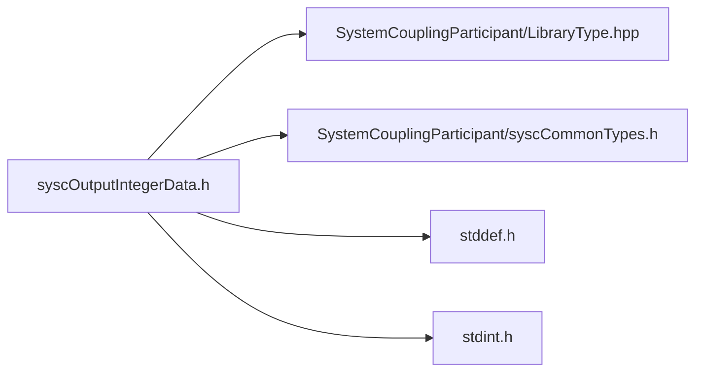

# File syscOutputIntegerData.h

![][C]

**Location**: `syscOutputIntegerData.h`


## Classes

* [SyscOutputIntegerData](structSyscOutputIntegerData.md#structSyscOutputIntegerData)

## Includes

* SystemCouplingParticipant/LibraryType.hpp
* SystemCouplingParticipant/syscCommonTypes.h
* <stddef.h>
* <stdint.h>





## Functions

<a id="group__SyscParticipantLibraryCAPI_1gac46cbb29463ecf81dfbba42a81e5b5c9"></a>
### Function syscGetOutputIntegerData

<a id="group__SyscParticipantLibraryCAPI_1gaea5bb5bd0b4ddd4217745dad38b405b2"></a>
### Function syscGetOutputIntegerDataInt32

<a id="group__SyscParticipantLibraryCAPI_1ga43be8cb6b2e2b156d7c40fa3cbf28f03"></a>
### Function syscGetOutputIntegerDataInt64

<a id="group__SyscParticipantLibraryCAPI_1ga46a87bfd729531e482d320f695537c0b"></a>
### Function syscGetOutputIntegerDataUInt16

<a id="group__SyscParticipantLibraryCAPI_1gaed7a48d94e2545e78562b8ff911dfd2a"></a>
### Function syscGetOutputIntegerDataUInt64

## Source


```
/*
* Copyright ANSYS, Inc. Unauthorized use, distribution, or duplication is prohibited.
*/

#pragma once

#include "SystemCouplingParticipant/LibraryType.hpp"

#include "SystemCouplingParticipant/syscCommonTypes.h"

#include <stddef.h>
#include <stdint.h>

#ifdef __cplusplus
extern "C" {
#endif


typedef struct {
  enum SyscPrimitiveType primitiveType; 
  const void* data;                     
  size_t size;                          
} SyscOutputIntegerData;


SyscOutputIntegerData syscGetOutputIntegerData();


SyscOutputIntegerData syscGetOutputIntegerDataInt32(
  const int32_t* const data,
  size_t dataSize);


SyscOutputIntegerData syscGetOutputIntegerDataInt64(
  const int64_t* const data,
  size_t dataSize);


SyscOutputIntegerData syscGetOutputIntegerDataUInt16(
  const uint16_t* const data,
  size_t dataSize);


SyscOutputIntegerData syscGetOutputIntegerDataUInt64(
  const uint64_t* const data,
  size_t dataSize);


#ifdef __cplusplus
}
#endif
```


[public]: https://img.shields.io/badge/-public-brightgreen (public)
[C]: https://img.shields.io/badge/language-C-blue (C)