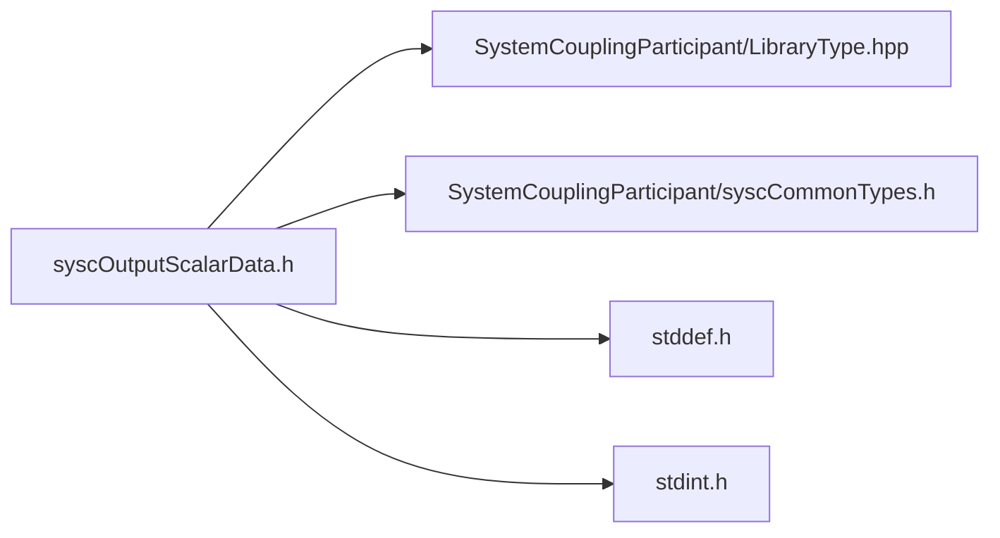

# File syscOutputScalarData.h

![][C]

**Location**: `syscOutputScalarData.h`


## Classes

* [SyscOutputScalarData](structSyscOutputScalarData.md#structSyscOutputScalarData)

## Includes

* SystemCouplingParticipant/LibraryType.hpp
* SystemCouplingParticipant/syscCommonTypes.h
* <stddef.h>
* <stdint.h>





## Functions

<a id="group__SyscParticipantLibraryCAPI_1ga0097e203d597949f887e2f804c01fd21"></a>
### Function syscGetOutputScalarData

<a id="group__SyscParticipantLibraryCAPI_1ga8a2803af36638c2ce3387bf89b83cda0"></a>
### Function syscGetOutputScalarDataDouble

<a id="group__SyscParticipantLibraryCAPI_1ga0b0ae9e5ede552958b8bce1efd9b4978"></a>
### Function syscGetOutputScalarDataFloat

<a id="group__SyscParticipantLibraryCAPI_1ga2334c8e25481b098d4263a2f60a7dac2"></a>
### Function syscGetOutputScalarDataInt32

<a id="group__SyscParticipantLibraryCAPI_1ga7a305d185afe565e1d3e8de66d7beca3"></a>
### Function syscGetOutputScalarDataInt64

<a id="group__SyscParticipantLibraryCAPI_1gabfcf7be83419cc31611e2ad100fdecb6"></a>
### Function syscGetOutputScalarDataUInt16

<a id="group__SyscParticipantLibraryCAPI_1ga6645e1e9d1b163cea069ce42077f419f"></a>
### Function syscGetOutputScalarDataUInt64

## Source


```
/*
* Copyright ANSYS, Inc. Unauthorized use, distribution, or duplication is prohibited.
*/

#pragma once

#include "SystemCouplingParticipant/LibraryType.hpp"

#include "SystemCouplingParticipant/syscCommonTypes.h"

#include <stddef.h>
#include <stdint.h>

#ifdef __cplusplus
extern "C" {
#endif


typedef struct {
  enum SyscPrimitiveType primitiveType; 
  const void* data;                     
  size_t size;                          
} SyscOutputScalarData;


SyscOutputScalarData syscGetOutputScalarData();


SyscOutputScalarData syscGetOutputScalarDataDouble(
  const double* const data,
  size_t dataSize);


SyscOutputScalarData syscGetOutputScalarDataFloat(
  const float* const data,
  size_t dataSize);


SyscOutputScalarData syscGetOutputScalarDataInt32(
  const int32_t* const data,
  size_t dataSize);


SyscOutputScalarData syscGetOutputScalarDataInt64(
  const int64_t* const data,
  size_t dataSize);


SyscOutputScalarData syscGetOutputScalarDataUInt16(
  const uint16_t* const data,
  size_t dataSize);


SyscOutputScalarData syscGetOutputScalarDataUInt64(
  const uint64_t* const data,
  size_t dataSize);


#ifdef __cplusplus
}
#endif
```


[public]: https://img.shields.io/badge/-public-brightgreen (public)
[C]: https://img.shields.io/badge/language-C-blue (C)