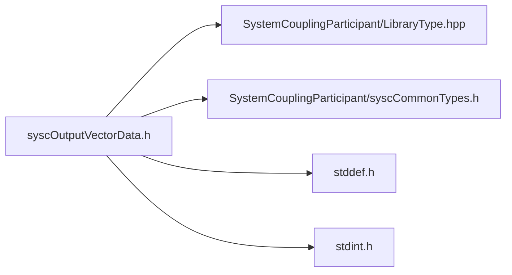

# File syscOutputVectorData.h

![][C]

**Location**: `syscOutputVectorData.h`


## Classes

* [SyscOutputVectorData](structSyscOutputVectorData.md#structSyscOutputVectorData)

## Includes

* SystemCouplingParticipant/LibraryType.hpp
* SystemCouplingParticipant/syscCommonTypes.h
* <stddef.h>
* <stdint.h>





## Functions

<a id="group__SyscParticipantLibraryCAPI_1ga950a6f2a746b4667aa10216ad3adfba6"></a>
### Function syscGetOutputVectorData

<a id="group__SyscParticipantLibraryCAPI_1gacb630e9f5b846eb243f4cb6e67907885"></a>
### Function syscGetOutputVectorDataCompactDouble

<a id="group__SyscParticipantLibraryCAPI_1ga1bec0ed33e0603a25d69f98efd68177a"></a>
### Function syscGetOutputVectorDataCompactFloat

<a id="group__SyscParticipantLibraryCAPI_1gaaa51c47ef1d83c217ac1d10080de120c"></a>
### Function syscGetOutputVectorDataSplitDouble

<a id="group__SyscParticipantLibraryCAPI_1gac91454fccf5ff91fdb82fa976bf5bc3c"></a>
### Function syscGetOutputVectorDataSplitFloat

<a id="group__SyscParticipantLibraryCAPI_1ga3ff75e8ebe2bf6e850544f378cb240c6"></a>
### Function syscGetOutputVectorDataCompactDoubleDim

<a id="group__SyscParticipantLibraryCAPI_1gaa09a2e4358b2a5459db179c5da641be8"></a>
### Function syscGetOutputVectorDataCompactFloatDim

<a id="group__SyscParticipantLibraryCAPI_1gac737552145182f1de70e347531477a88"></a>
### Function syscGetOutput2DVectorDataSplitDouble

<a id="group__SyscParticipantLibraryCAPI_1ga22d069eb2d95a8060a0dfdaf9a5d43aa"></a>
### Function syscGetOutput2DVectorDataSplitFloat

## Source


```
/*
* Copyright ANSYS, Inc. Unauthorized use, distribution, or duplication is prohibited.
*/

#pragma once

#include "SystemCouplingParticipant/LibraryType.hpp"

#include "SystemCouplingParticipant/syscCommonTypes.h"

#include <stddef.h>
#include <stdint.h>

#ifdef __cplusplus
extern "C" {
#endif


typedef struct {
  enum SyscPrimitiveType primitiveType; 
  const void* data0;                    
  const void* data1;                    
  const void* data2;                    
  size_t size;                          
  enum SyscDimension dimension;         
} SyscOutputVectorData;


SyscOutputVectorData syscGetOutputVectorData();


SyscOutputVectorData syscGetOutputVectorDataCompactDouble(
  const double* const data,
  size_t dataSize);


SyscOutputVectorData syscGetOutputVectorDataCompactFloat(
  const float* const data,
  size_t dataSize);


SyscOutputVectorData syscGetOutputVectorDataSplitDouble(
  const double* const data0,
  const double* const data1,
  const double* const data2,
  size_t dataSize);


SyscOutputVectorData syscGetOutputVectorDataSplitFloat(
  const float* const data0,
  const float* const data1,
  const float* const data2,
  size_t dataSize);


SyscOutputVectorData syscGetOutputVectorDataCompactDoubleDim(
  const double* const data,
  size_t dataSize,
  enum SyscDimension dimension);


SyscOutputVectorData syscGetOutputVectorDataCompactFloatDim(
  const float* const data,
  size_t dataSize,
  enum SyscDimension dimension);


SyscOutputVectorData syscGetOutput2DVectorDataSplitDouble(
  const double* const data0,
  const double* const data1,
  size_t dataSize);


SyscOutputVectorData syscGetOutput2DVectorDataSplitFloat(
  const float* const data0,
  const float* const data1,
  size_t dataSize);


#ifdef __cplusplus
}
#endif
```


[public]: https://img.shields.io/badge/-public-brightgreen (public)
[C]: https://img.shields.io/badge/language-C-blue (C)