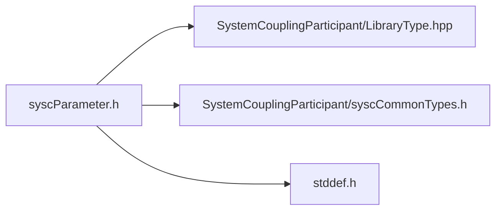

# File syscParameter.h

![][C]

**Location**: `syscParameter.h`


## Classes

* [SyscParameter](structSyscParameter.md#structSyscParameter)

## Includes

* SystemCouplingParticipant/LibraryType.hpp
* SystemCouplingParticipant/syscCommonTypes.h
* <stddef.h>





## Typedefs

<a id="group__SyscParticipantLibraryCAPI_1ga9d97e53f3f34b91249f3002d73dc939e"></a>
### Typedef SyscParameter

## Functions

<a id="group__SyscParticipantLibraryCAPI_1gaf44d7cf2e3d05e5cf0990b6fe946c50d"></a>
### Function syscGetParameter

<a id="group__SyscParticipantLibraryCAPI_1gafa0e858b9dc47ded43bd3fbf97c25206"></a>
### Function syscGetParameterD

## Source


```
/*
* Copyright ANSYS, Inc. Unauthorized use, distribution, or duplication is prohibited.
*/

#pragma once

#include "SystemCouplingParticipant/LibraryType.hpp"

#include "SystemCouplingParticipant/syscCommonTypes.h"

#include <stddef.h>

#ifdef __cplusplus
extern "C" {
#endif


typedef struct SyscParameter {
  char name[SYSC_STRING_LENGTH];        
  char displayName[SYSC_STRING_LENGTH]; 
} SyscParameter;

 SyscParameter syscGetParameter(
  const char* name);

 SyscParameter syscGetParameterD(
  const char* name,
  const char* displayName);


#ifdef __cplusplus
}
#endif
```


[public]: https://img.shields.io/badge/-public-brightgreen (public)
[C]: https://img.shields.io/badge/language-C-blue (C)