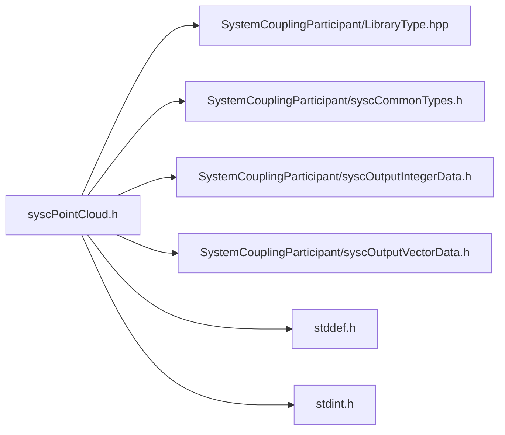

# File syscPointCloud.h

![][C]

**Location**: `syscPointCloud.h`


## Classes

* [SyscPointCloud](structSyscPointCloud.md#structSyscPointCloud)

## Includes

* SystemCouplingParticipant/LibraryType.hpp
* SystemCouplingParticipant/syscCommonTypes.h
* SystemCouplingParticipant/syscOutputIntegerData.h
* SystemCouplingParticipant/syscOutputVectorData.h
* <stddef.h>
* <stdint.h>





## Functions

<a id="group__SyscParticipantLibraryCAPI_1ga256e2f74a04a52d19232bd163921131c"></a>
### Function syscGetPointCloudEmpty

<a id="group__SyscParticipantLibraryCAPI_1ga0a8b0fe8c0c57374a3ef69d1f678fdab"></a>
### Function syscGetPointCloud

## Source


```
/*
* Copyright ANSYS, Inc. Unauthorized use, distribution, or duplication is prohibited.
*/

#pragma once

#include "SystemCouplingParticipant/LibraryType.hpp"

#include "SystemCouplingParticipant/syscCommonTypes.h"
#include "SystemCouplingParticipant/syscOutputIntegerData.h"
#include "SystemCouplingParticipant/syscOutputVectorData.h"

#include <stddef.h>
#include <stdint.h>

#ifdef __cplusplus
extern "C" {
#endif


/* *********** Point cloud ************************************************ */

typedef struct {
  SyscOutputIntegerData nodeIds;   
  SyscOutputVectorData nodeCoords; 

  int64_t connectivityStamp;

  int64_t coordinatesStamp;

  int64_t partitioningStamp;

} SyscPointCloud;


SyscPointCloud syscGetPointCloudEmpty();


SyscPointCloud syscGetPointCloud(
  SyscOutputIntegerData nodeIds,
  SyscOutputVectorData nodeCoords);


#ifdef __cplusplus
}
#endif
```


[public]: https://img.shields.io/badge/-public-brightgreen (public)
[C]: https://img.shields.io/badge/language-C-blue (C)