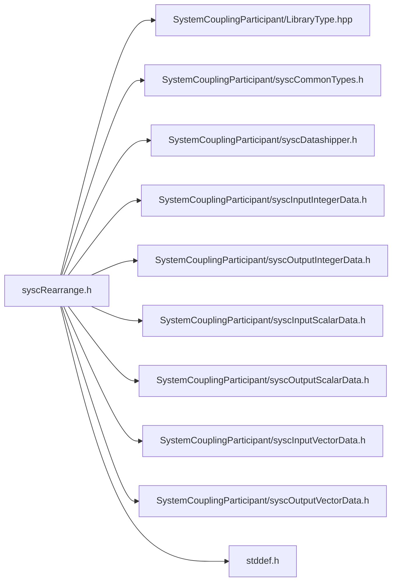

# File syscRearrange.h

![][C]

**Location**: `syscRearrange.h`


## Includes

* SystemCouplingParticipant/LibraryType.hpp
* SystemCouplingParticipant/syscCommonTypes.h
* SystemCouplingParticipant/syscDatashipper.h
* SystemCouplingParticipant/syscInputIntegerData.h
* SystemCouplingParticipant/syscOutputIntegerData.h
* SystemCouplingParticipant/syscInputScalarData.h
* SystemCouplingParticipant/syscOutputScalarData.h
* SystemCouplingParticipant/syscInputVectorData.h
* SystemCouplingParticipant/syscOutputVectorData.h
* <stddef.h>





## Functions

<a id="syscRearrange_8h_1aa7da5a6e9de1d2a0e31d5c7a37480c89"></a>
### Function syscRearrangeIntegers

![][public]


```
SyscError syscRearrangeIntegers(SyscOutputIntegerData source, SyscInputIntegerData target)
```


Provide a function to rearrange data in parallel. See sysc::rearrange() function documentation from C++ APIs.

**Returns**:

[SyscParticipantInfo](structSyscParticipantInfo.md#structSyscParticipantInfo) A [SyscParticipantInfo](structSyscParticipantInfo.md#structSyscParticipantInfo) struct


**Parameters**:

* [SyscOutputIntegerData](structSyscOutputIntegerData.md#structSyscOutputIntegerData) **source**
* [SyscInputIntegerData](structSyscInputIntegerData.md#structSyscInputIntegerData) **target**

**Return type**: [SyscError](structSyscError.md#structSyscError)

<a id="syscRearrange_8h_1a1b75355cf60c6f19fa0531c57756ad0e"></a>
### Function syscRearrangeScalars

![][public]


```
SyscError syscRearrangeScalars(SyscOutputScalarData source, SyscInputScalarData target)
```


Provide a function to rearrange data in parallel. See sysc::rearrange() function documentation from C++ APIs.

**Returns**:

[SyscParticipantInfo](structSyscParticipantInfo.md#structSyscParticipantInfo) A [SyscParticipantInfo](structSyscParticipantInfo.md#structSyscParticipantInfo) struct


**Parameters**:

* [SyscOutputScalarData](structSyscOutputScalarData.md#structSyscOutputScalarData) **source**
* [SyscInputScalarData](structSyscInputScalarData.md#structSyscInputScalarData) **target**

**Return type**: [SyscError](structSyscError.md#structSyscError)

<a id="syscRearrange_8h_1aa3c2f689d8e624f598d8f77853856509"></a>
### Function syscRearrangeVectors

![][public]


```
SyscError syscRearrangeVectors(SyscOutputVectorData source, SyscInputVectorData target)
```


Provide a function to rearrange data in parallel. See sysc::rearrange() function documentation from C++ APIs.

**Returns**:

[SyscParticipantInfo](structSyscParticipantInfo.md#structSyscParticipantInfo) A [SyscParticipantInfo](structSyscParticipantInfo.md#structSyscParticipantInfo) struct


**Parameters**:

* [SyscOutputVectorData](structSyscOutputVectorData.md#structSyscOutputVectorData) **source**
* [SyscInputVectorData](structSyscInputVectorData.md#structSyscInputVectorData) **target**

**Return type**: [SyscError](structSyscError.md#structSyscError)

## Source


```
/*
* Copyright ANSYS, Inc. Unauthorized use, distribution, or duplication is prohibited.
*/

#pragma once

#include "SystemCouplingParticipant/LibraryType.hpp"

#include "SystemCouplingParticipant/syscCommonTypes.h"
#include "SystemCouplingParticipant/syscDatashipper.h"
#include "SystemCouplingParticipant/syscInputIntegerData.h"
#include "SystemCouplingParticipant/syscOutputIntegerData.h"
#include "SystemCouplingParticipant/syscInputScalarData.h"
#include "SystemCouplingParticipant/syscOutputScalarData.h"
#include "SystemCouplingParticipant/syscInputVectorData.h"
#include "SystemCouplingParticipant/syscOutputVectorData.h"

#include <stddef.h>

#ifdef __cplusplus
extern "C" {
#endif

 SyscError syscRearrangeIntegers(SyscOutputIntegerData source, SyscInputIntegerData target);

 SyscError syscRearrangeScalars(SyscOutputScalarData source, SyscInputScalarData target);

 SyscError syscRearrangeVectors(SyscOutputVectorData source, SyscInputVectorData target);

#ifdef __cplusplus
}
#endif
```


[public]: https://img.shields.io/badge/-public-brightgreen (public)
[C]: https://img.shields.io/badge/language-C-blue (C)