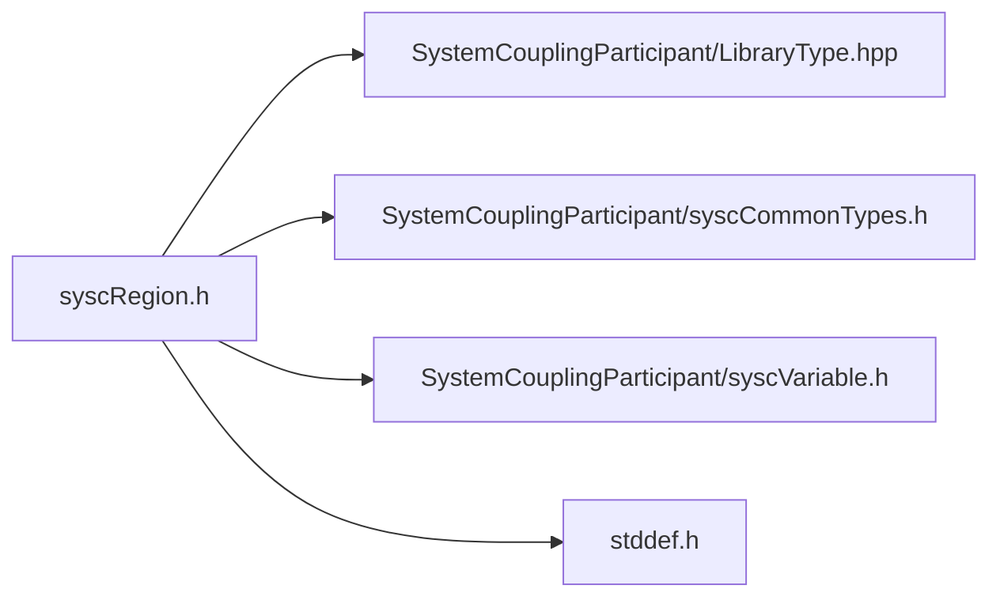

# File syscRegion.h

![][C]

**Location**: `syscRegion.h`


## Classes

* [SyscRegion](structSyscRegion.md#structSyscRegion)

## Includes

* SystemCouplingParticipant/LibraryType.hpp
* SystemCouplingParticipant/syscCommonTypes.h
* SystemCouplingParticipant/syscVariable.h
* <stddef.h>





## Typedefs

<a id="group__SyscParticipantLibraryCAPI_1gac5687e76cd2c5d1249d8b3ac43ff29b4"></a>
### Typedef SyscRegion

## Functions

<a id="group__SyscParticipantLibraryCAPI_1gaf8dee311cddc012ce6b54998fde8e29f"></a>
### Function syscGetRegion

<a id="group__SyscParticipantLibraryCAPI_1ga26c8d2435b5cd3c525d5221298ad3aaa"></a>
### Function syscGetRegionT

<a id="group__SyscParticipantLibraryCAPI_1ga88d428a1852eeec9b7b7156e33b57822"></a>
### Function syscGetRegionDT

<a id="group__SyscParticipantLibraryCAPI_1ga9e0af352921275419da93341f7186f46"></a>
### Function syscGetRegionTM

<a id="group__SyscParticipantLibraryCAPI_1gaaae89f288494cc67e8f05cab0f5d1b8b"></a>
### Function syscGetRegionDTM

<a id="group__SyscParticipantLibraryCAPI_1ga9ae6fafcce6987fa18ba762a1ee7a7be"></a>
### Function syscAddInputVariable

<a id="group__SyscParticipantLibraryCAPI_1ga9615f371d829935af745eb63a1ea99bc"></a>
### Function syscAddOutputVariable

<a id="group__SyscParticipantLibraryCAPI_1gabec39110fe9da4d54a32653e6bf43196"></a>
### Function syscGetNumInputVariables

<a id="group__SyscParticipantLibraryCAPI_1gaef15224138a4f29e892a63e5e8db2feb"></a>
### Function syscGetInputVariable

<a id="group__SyscParticipantLibraryCAPI_1ga99fda03ac99e590196d180ea23214217"></a>
### Function syscGetNumOutputVariables

<a id="group__SyscParticipantLibraryCAPI_1ga55a99079e5dc9d025f3816d5e7bdd163"></a>
### Function syscGetOutputVariable

## Source


```
/*
* Copyright ANSYS, Inc. Unauthorized use, distribution, or duplication is prohibited.
*/

#pragma once

#include "SystemCouplingParticipant/LibraryType.hpp"

#include "SystemCouplingParticipant/syscCommonTypes.h"
#include "SystemCouplingParticipant/syscVariable.h"

#include <stddef.h>

#ifdef __cplusplus
extern "C" {
#endif


typedef struct SyscRegion {
  char name[SYSC_STRING_LENGTH];                              
  enum SyscTopology topology;                                 
  enum SyscRegionDiscretizationType regionDiscretizationType; 
  char displayName[SYSC_STRING_LENGTH];                       
} SyscRegion;


SyscRegion syscGetRegion(const char* name);


SyscRegion syscGetRegionT(const char* name, enum SyscTopology topology);


SyscRegion syscGetRegionDT(
  const char* name,
  const char* displayName,
  enum SyscTopology topology);


SyscRegion syscGetRegionTM(
  const char* name,
  enum SyscTopology topology,
  enum SyscRegionDiscretizationType regionDiscretizationType);


SyscRegion syscGetRegionDTM(
  const char* name,
  const char* displayName,
  enum SyscTopology topology,
  enum SyscRegionDiscretizationType regionDiscretizationType);


SyscError syscAddInputVariable(
  const SyscRegion region,
  const SyscVariable variable);


SyscError syscAddOutputVariable(
  const SyscRegion region,
  const SyscVariable variable);


size_t syscGetNumInputVariables(const SyscRegion region);


SyscVariable syscGetInputVariable(const SyscRegion region, size_t index);


size_t syscGetNumOutputVariables(const SyscRegion region);


SyscVariable syscGetOutputVariable(const SyscRegion region, size_t index);


#ifdef __cplusplus
}
#endif
```


[public]: https://img.shields.io/badge/-public-brightgreen (public)
[C]: https://img.shields.io/badge/language-C-blue (C)