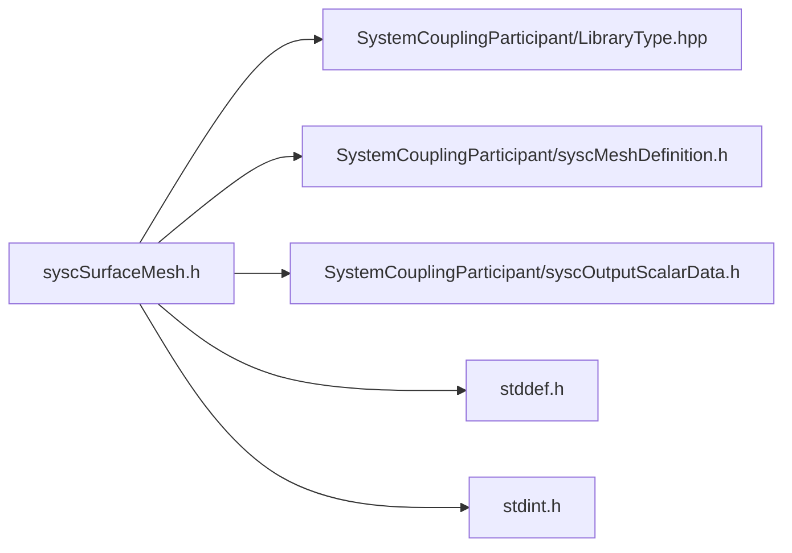

# File syscSurfaceMesh.h

![][C]

**Location**: `syscSurfaceMesh.h`


## Classes

* [SyscSurfaceMesh](structSyscSurfaceMesh.md#structSyscSurfaceMesh)

## Includes

* SystemCouplingParticipant/LibraryType.hpp
* SystemCouplingParticipant/syscMeshDefinition.h
* SystemCouplingParticipant/syscOutputScalarData.h
* <stddef.h>
* <stdint.h>





## Functions

<a id="group__SyscParticipantLibraryCAPI_1ga9f7aaa68f00cc2d98f98c458b5388f3a"></a>
### Function syscGetSurfaceMesh

<a id="group__SyscParticipantLibraryCAPI_1gafad33a17c7266f386e1bf42c66a9340f"></a>
### Function syscGetSurfaceMeshNF

<a id="group__SyscParticipantLibraryCAPI_1gaf61b2f4b29e77812cee161e63ff28e34"></a>
### Function syscGetSurfaceMeshNTCI

<a id="group__SyscParticipantLibraryCAPI_1ga239ac08da048715f5832302851960053"></a>
### Function syscGetSurfaceMeshNCI

<a id="group__SyscParticipantLibraryCAPI_1ga734facb70a9948732d08eaccf4bb5102"></a>
### Function syscGetSurfaceMeshNCIF

<a id="group__SyscParticipantLibraryCAPI_1ga481a20e443f5b245640441f47e455c67"></a>
### Function syscGetSurfaceMeshNTI

<a id="group__SyscParticipantLibraryCAPI_1ga0241a6779e5c1e1dc0a339893805a9dd"></a>
### Function syscGetSurfaceMeshA

<a id="group__SyscParticipantLibraryCAPI_1ga0745adffa475d10edb703906ed5d2772"></a>
### Function syscGetSurfaceMeshB

## Source


```
/*
* Copyright ANSYS, Inc. Unauthorized use, distribution, or duplication is prohibited.
*/

#pragma once

#include "SystemCouplingParticipant/LibraryType.hpp"

#include "SystemCouplingParticipant/syscMeshDefinition.h"
#include "SystemCouplingParticipant/syscOutputScalarData.h"

#include <stddef.h>
#include <stdint.h>

#ifdef __cplusplus
extern "C" {
#endif


/* *********** Surface mesh ************************************************ */

typedef struct {
  SyscNodeData nodes;

  SyscFaceData faces;

  char side0[SYSC_STRING_LENGTH];

  char side1[SYSC_STRING_LENGTH];

  int64_t connectivityStamp;

  int64_t coordinatesStamp;

  int64_t partitioningStamp;
} SyscSurfaceMesh;


SyscSurfaceMesh syscGetSurfaceMesh();


SyscSurfaceMesh syscGetSurfaceMeshNF(
  SyscNodeData nodes,
  SyscFaceData faces);


SyscSurfaceMesh syscGetSurfaceMeshNTCI(
  SyscNodeData nodes,
  SyscElementTypeData elemTypes,
  SyscElementNodeCountData elemNodeCounts,
  SyscElementNodeConnectivityData elemNodeConnectivity);


SyscSurfaceMesh syscGetSurfaceMeshNCI(
  SyscNodeData nodes,
  SyscElementNodeCountData elemNodeCounts,
  SyscElementNodeConnectivityData elemNodeConnectivity);


SyscSurfaceMesh syscGetSurfaceMeshNCIF(
  SyscNodeData nodes,
  SyscElementNodeCountData elemNodeCounts,
  SyscElementNodeConnectivityData elemNodeConnectivity,
  SyscFaceCellConnectivityData faceCellConnectivty);


SyscSurfaceMesh syscGetSurfaceMeshNTI(
  SyscNodeData nodes,
  SyscElementTypeData elemTypes,
  SyscElementNodeConnectivityData elemNodeConnectivity);


SyscSurfaceMesh syscGetSurfaceMeshA(
  SyscOutputScalarData nodeIds,
  SyscOutputVectorData nodeCoords,
  SyscOutputScalarData elemNodeCounts,
  SyscOutputScalarData elemNodeIds);


SyscSurfaceMesh syscGetSurfaceMeshB(
  SyscOutputVectorData nodeCoords,
  SyscOutputScalarData elemNodeCounts,
  SyscOutputScalarData elemNodeIds);


#ifdef __cplusplus
}
#endif
```


[public]: https://img.shields.io/badge/-public-brightgreen (public)
[C]: https://img.shields.io/badge/language-C-blue (C)