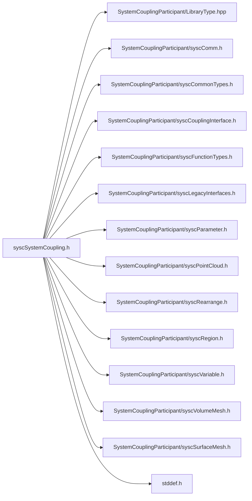

# File syscSystemCoupling.h

![][C]

**Location**: `syscSystemCoupling.h`


## Includes

* SystemCouplingParticipant/LibraryType.hpp
* SystemCouplingParticipant/syscComm.h
* SystemCouplingParticipant/syscCommonTypes.h
* SystemCouplingParticipant/syscCouplingInterface.h
* SystemCouplingParticipant/syscFunctionTypes.h
* SystemCouplingParticipant/syscLegacyInterfaces.h
* SystemCouplingParticipant/syscParameter.h
* SystemCouplingParticipant/syscPointCloud.h
* SystemCouplingParticipant/syscRearrange.h
* SystemCouplingParticipant/syscRegion.h
* SystemCouplingParticipant/syscVariable.h
* SystemCouplingParticipant/syscVolumeMesh.h
* SystemCouplingParticipant/syscSurfaceMesh.h
* <stddef.h>





## Functions

<a id="group__SyscParticipantLibraryCAPI_1ga862e7375111dcee847bc05463c72b329"></a>
### Function syscStartStandaloneParallel

<a id="group__SyscParticipantLibraryCAPI_1ga1404ad75fb1f5b1515dae967b71b1725"></a>
### Function syscConnect

<a id="group__SyscParticipantLibraryCAPI_1ga68a9b5b64715ad6ffde1c7b145bb4d0f"></a>
### Function syscConnectParallel

<a id="group__SyscParticipantLibraryCAPI_1ga8d84278ef4d48a739948f0a952cb2a00"></a>
### Function syscConnectUseStruct

<a id="group__SyscParticipantLibraryCAPI_1gac695e9f06d272958b8fc81bff07708fb"></a>
### Function syscConnectParallelUseStruct

<a id="group__SyscParticipantLibraryCAPI_1ga3c895512d255076ce0b7dcc0b527991b"></a>
### Function syscAddRegion

<a id="group__SyscParticipantLibraryCAPI_1ga360d447bbaffa2035ddd9675457027cc"></a>
### Function syscAddInputParameter

<a id="group__SyscParticipantLibraryCAPI_1gaf25cfa8761182ab33ee1a58171ba8aff"></a>
### Function syscAddOutputParameter

<a id="group__SyscParticipantLibraryCAPI_1ga0c8432c9735a99af8f502a0d399fcb53"></a>
### Function syscGetNumInputParameters

<a id="group__SyscParticipantLibraryCAPI_1gaa589afb854fc7ccbc1aadd35148748c4"></a>
### Function syscGetNumOutputParameters

<a id="group__SyscParticipantLibraryCAPI_1ga0a1c350da5591ae0ece58abaa8dfd9d2"></a>
### Function syscGetAddedInputParameter

<a id="group__SyscParticipantLibraryCAPI_1gaa7fff9647ad264d5f2d6231472667e0d"></a>
### Function syscGetAddedOutputParameter

<a id="group__SyscParticipantLibraryCAPI_1gac60dbcde01c9373bfd367aaaa956cba5"></a>
### Function syscGetNumRealAttributes

<a id="group__SyscParticipantLibraryCAPI_1gaf49b872e961009e614ed67759e1a60d4"></a>
### Function syscGetNumIntegerAttributes

<a id="group__SyscParticipantLibraryCAPI_1gaefc1d756871febf4805c2df08334e7b8"></a>
### Function syscGetAddedRealAttribute

<a id="group__SyscParticipantLibraryCAPI_1ga700bc8178a51d4eeaa596eb6d4737fcb"></a>
### Function syscGetAddedIntegerAttribute

<a id="group__SyscParticipantLibraryCAPI_1gad0272110e6eaf4c7f16bf96d3556106e"></a>
### Function syscAddRealAttribute

<a id="group__SyscParticipantLibraryCAPI_1ga7ef7712e40081015520c18ae54509930"></a>
### Function syscAddIntegerAttribute

<a id="group__SyscParticipantLibraryCAPI_1ga534e802afae31ae7134e23a00d2872f9"></a>
### Function syscGetParameterValue

<a id="group__SyscParticipantLibraryCAPI_1ga67c13bf8cd7fedeb86ac32b6d919eeb0"></a>
### Function syscSetParameterValue

<a id="group__SyscParticipantLibraryCAPI_1gaf5625adaeb366d18725d1e9560d5910d"></a>
### Function syscGetRealAttributeValue

<a id="group__SyscParticipantLibraryCAPI_1ga126dcce7d793eb854bdccd42e6a62e10"></a>
### Function syscGetIntegerAttributeValue

<a id="group__SyscParticipantLibraryCAPI_1ga5330416d093678fc96231257a88ea337"></a>
### Function syscAddCouplingInterface

<a id="group__SyscParticipantLibraryCAPI_1gadec9e44f001d4ec2b8139e096ab93ac7"></a>
### Function syscAddCouplingInterfaceA

<a id="group__SyscParticipantLibraryCAPI_1ga831884747873b947fcdc57ef31adce27"></a>
### Function syscCompleteSetup

<a id="group__SyscParticipantLibraryCAPI_1ga06c366cb935ade55b7b90de9691d3f38"></a>
### Function syscRegisterInputScalarDataAccess

<a id="group__SyscParticipantLibraryCAPI_1ga04bbb44826997f602707b9e01d07d78e"></a>
### Function syscRegisterInputScalarDataAccessWithPointer

<a id="group__SyscParticipantLibraryCAPI_1ga6b2aee555f07109357958edc9898b8b5"></a>
### Function syscRegisterInputScalarDataMultiZoneAccess

<a id="group__SyscParticipantLibraryCAPI_1ga36e9fe53c70f9c15cbcfc3957f80852b"></a>
### Function syscRegisterInputVectorDataAccess

<a id="group__SyscParticipantLibraryCAPI_1ga46b386f0c3ed52071dd851b55763b1c8"></a>
### Function syscRegisterInputVectorDataAccessWithPointer

<a id="group__SyscParticipantLibraryCAPI_1gad7774418be78b8b39c9b45b7fcade1d3"></a>
### Function syscRegisterInputVectorDataMultiZoneAccess

<a id="group__SyscParticipantLibraryCAPI_1ga6e187589ca426402ee045ccecfec21d3"></a>
### Function syscRegisterOutputScalarDataAccess

<a id="group__SyscParticipantLibraryCAPI_1ga2c90e2ea571de3b7ce5e1ca65a996d8a"></a>
### Function syscRegisterOutputScalarDataAccessWithPointer

<a id="group__SyscParticipantLibraryCAPI_1ga7880daf983c8bac7db920281fdc937c1"></a>
### Function syscRegisterOutputScalarDataMultiZoneAccess

<a id="group__SyscParticipantLibraryCAPI_1gaa3956909f65a425bec64c86ec5d5515b"></a>
### Function syscRegisterOutputVectorDataAccess

<a id="group__SyscParticipantLibraryCAPI_1ga9793fb31fe905768b175842ceab722e5"></a>
### Function syscRegisterOutputVectorDataAccessWithPointer

<a id="group__SyscParticipantLibraryCAPI_1gad5c33007c0067ab6edf8a72ab422ff7d"></a>
### Function syscRegisterOutputVectorDataMultiZoneAccess

<a id="group__SyscParticipantLibraryCAPI_1ga1f4ab3d781755660f64b5a2cb691abe9"></a>
### Function syscRegisterInputComplexScalarDataAccess

<a id="group__SyscParticipantLibraryCAPI_1ga55a307bf13f2d002f05660d781fef50e"></a>
### Function syscRegisterInputComplexScalarDataAccessWithPointer

<a id="group__SyscParticipantLibraryCAPI_1gaf281613584c91fb460de5e4557f16767"></a>
### Function syscRegisterInputComplexVectorDataAccess

<a id="group__SyscParticipantLibraryCAPI_1gadfee511d3a3021907ee187716fff0944"></a>
### Function syscRegisterInputComplexVectorDataAccessWithPointer

<a id="group__SyscParticipantLibraryCAPI_1ga1c0e074f2239faf10594e3139d32efe1"></a>
### Function syscRegisterOutputComplexScalarDataAccess

<a id="group__SyscParticipantLibraryCAPI_1ga5a7faf0c3fe80ffc7925da217ecce202"></a>
### Function syscRegisterOutputComplexScalarDataAccessWithPointer

<a id="group__SyscParticipantLibraryCAPI_1ga1cb92c5ccc643abce68fba25f61e3d41"></a>
### Function syscRegisterOutputComplexVectorDataAccess

<a id="group__SyscParticipantLibraryCAPI_1ga859961191e2943afd73b8e31cbd010c9"></a>
### Function syscRegisterOutputComplexVectorDataAccessWithPointer

<a id="group__SyscParticipantLibraryCAPI_1ga044974d4f159fd35669b77e5111fe7e0"></a>
### Function syscRegisterSurfMeshAccess

<a id="group__SyscParticipantLibraryCAPI_1gadddd0903fcab2450b14f54157e283302"></a>
### Function syscRegisterSurfaceMeshAccessWithPointer

<a id="group__SyscParticipantLibraryCAPI_1ga3261b0b3eb6278c380a5b59894a7b533"></a>
### Function syscRegisterSurfaceMeshMultiZoneAccess

<a id="group__SyscParticipantLibraryCAPI_1ga27ba2e330c4d2c20b692a7ab66852721"></a>
### Function syscRegisterVolumeMeshAccess

<a id="group__SyscParticipantLibraryCAPI_1ga3b90426f24a434668b5270930192fec6"></a>
### Function syscRegisterVolumeMeshAccessWithPointer

<a id="group__SyscParticipantLibraryCAPI_1gab71a3bc5775e830b2dac81dd6828cb13"></a>
### Function syscRegisterVolumeMeshMultiZoneAccess

<a id="group__SyscParticipantLibraryCAPI_1gade30d8ccbbad0236ace57edfe55181d5"></a>
### Function syscRegisterPointCloudAccess

<a id="group__SyscParticipantLibraryCAPI_1gaedae298744b65c453c7dac3e8dc1d68a"></a>
### Function syscRegisterPointCloudAccessWithPointer

<a id="group__SyscParticipantLibraryCAPI_1ga77d6e90a118be65eeb86ce08a3a3dea5"></a>
### Function syscRegisterPointCloudMultiZoneAccess

<a id="group__SyscParticipantLibraryCAPI_1gad49e03082ae93fdd7f96a3b7601ca9a8"></a>
### Function syscRegisterZoneCountAccess

<a id="group__SyscParticipantLibraryCAPI_1ga30880d98428a08962ab027267c66c2ae"></a>
### Function syscRegisterRestartPointCreation

<a id="group__SyscParticipantLibraryCAPI_1gaa26049072c61f17c4e1296490c00abc5"></a>
### Function syscInitializeAnalysis

<a id="group__SyscParticipantLibraryCAPI_1gaea2bf4afeff9dd606125e00bb6c475a0"></a>
### Function syscDoIteration

<a id="group__SyscParticipantLibraryCAPI_1gaf701624f0add6b5d7a5fd2d9dcf8e298"></a>
### Function syscDoTimeStep

<a id="group__SyscParticipantLibraryCAPI_1gace1009120d02713ffe0b625d1cadd33d"></a>
### Function syscGetCurrentTimeStep

<a id="group__SyscParticipantLibraryCAPI_1ga8445069f0234978743203e1d5c0cb62c"></a>
### Function syscUpdateInputs

<a id="group__SyscParticipantLibraryCAPI_1ga3b5e8e0315bbbe48526324439c422733"></a>
### Function syscUpdateOutputs

<a id="group__SyscParticipantLibraryCAPI_1ga09a7259037537f2d3d0403788d80e2e1"></a>
### Function syscDisconnect

<a id="group__SyscParticipantLibraryCAPI_1ga009687c58ccf588d2c94d879a2769541"></a>
### Function syscFatalError

<a id="group__SyscParticipantLibraryCAPI_1gafc80abbd0874c5da3d80ec2d8258eb02"></a>
### Function syscNonFatalError

<a id="group__SyscParticipantLibraryCAPI_1ga456487cb20f8a9b6c392eec4d0eaceb7"></a>
### Function syscCheckSurfaceMeshValidity

<a id="group__SyscParticipantLibraryCAPI_1gad55adabb4ed5bdb44833c06671541921"></a>
### Function syscWriteSetupFile

<a id="group__SyscParticipantLibraryCAPI_1gafb6abc910fc014d46cb46dc86cf48c60"></a>
### Function syscWriteResults

<a id="group__SyscParticipantLibraryCAPI_1ga5783653d3a5994b0bccb7471843e72eb"></a>
### Function syscGetNumRegions

<a id="group__SyscParticipantLibraryCAPI_1ga73a2e2125fd1a583b152012a8d7f9ce9"></a>
### Function syscGetAddedRegion

<a id="group__SyscParticipantLibraryCAPI_1ga47273dac1bc54d406c085bee823c5131"></a>
### Function syscGetSolutionControl

<a id="group__SyscParticipantLibraryCAPI_1ga8987dbe52eb06c7d089663d4c29c17ed"></a>
### Function syscGetNumCouplingInterfaces

<a id="group__SyscParticipantLibraryCAPI_1ga13a0798c28a54535f42c8cf240ed7d40"></a>
### Function syscGetAddedCouplingInterface

## Source


```
/*
* Copyright ANSYS, Inc. Unauthorized use, distribution, or duplication is prohibited.
*/

#pragma once

#include "SystemCouplingParticipant/LibraryType.hpp"

#include "SystemCouplingParticipant/syscComm.h"
#include "SystemCouplingParticipant/syscCommonTypes.h"
#include "SystemCouplingParticipant/syscCouplingInterface.h"
#include "SystemCouplingParticipant/syscFunctionTypes.h"
#include "SystemCouplingParticipant/syscLegacyInterfaces.h"
#include "SystemCouplingParticipant/syscParameter.h"
#include "SystemCouplingParticipant/syscPointCloud.h"
#include "SystemCouplingParticipant/syscRearrange.h"
#include "SystemCouplingParticipant/syscRegion.h"
#include "SystemCouplingParticipant/syscVariable.h"
#include "SystemCouplingParticipant/syscVolumeMesh.h"
#include "SystemCouplingParticipant/syscSurfaceMesh.h"

#include <stddef.h>

#ifdef __cplusplus
extern "C" {
#endif


SyscError syscStartStandaloneParallel(const size_t mpiCommunicator);


SyscError syscConnect(
  const char* scHost,
  const unsigned short scPort,
  const char* participantName,
  const char* buildInformation);


SyscError syscConnectParallel(
  const char* scHost,
  const unsigned short scPort,
  const char* participantName,
  const size_t communicator,
  const char* buildInformation);


SyscError syscConnectUseStruct(
  SyscParticipantInfo participantInfo);


SyscError syscConnectParallelUseStruct(
  SyscParticipantInfo participantInfo,
  const size_t communicator);


SyscError syscAddRegion(
  const SyscRegion region);


SyscError syscAddInputParameter(
  const SyscParameter parameter);


SyscError syscAddOutputParameter(
  const SyscParameter parameter);


size_t syscGetNumInputParameters();


size_t syscGetNumOutputParameters();


SyscParameter syscGetAddedInputParameter(size_t index);


SyscParameter syscGetAddedOutputParameter(size_t index);


size_t syscGetNumRealAttributes();


size_t syscGetNumIntegerAttributes();


SyscRealAttribute syscGetAddedRealAttribute(size_t index);


SyscIntegerAttribute syscGetAddedIntegerAttribute(size_t index);


SyscError syscAddRealAttribute(
  const SyscRealAttribute attribute);


SyscError syscAddIntegerAttribute(
  const SyscIntegerAttribute attribute);


double syscGetParameterValue(const char* parameterName, SyscError* errorCode);


SyscError syscSetParameterValue(
  const char* parameterName,
  double value);


double syscGetRealAttributeValue(
  const char* attributeName,
  SyscError* errorCode);


int64_t syscGetIntegerAttributeValue(
  const char* attributeName,
  SyscError* errorCode);


SyscError syscAddCouplingInterface(
  const SyscCouplingInterface couplingInterface);


SyscError syscAddCouplingInterfaceA(
  const SyscCouplingInterface couplingInterface,
  int autoGenerateDataTransfers);


SyscError syscCompleteSetup(const SyscSetupInfo setupInfo);


SyscError syscRegisterInputScalarDataAccess(
  SyscInputScalarDataAccess dataAccess);


SyscError syscRegisterInputScalarDataAccessWithPointer(
  SyscOpaqueDataAccess opaqueDataAccess,
  SyscInputScalarDataAccessWithPointer dataAccess);


SyscError syscRegisterInputScalarDataMultiZoneAccess(
  SyscOpaqueDataAccess opaqueDataAccess,
  SyscInputScalarDataMultiZoneAccess dataAccess);


SyscError syscRegisterInputVectorDataAccess(
  SyscInputVectorDataAccess dataAccess);


SyscError syscRegisterInputVectorDataAccessWithPointer(
  SyscOpaqueDataAccess opaqueDataAccess,
  SyscInputVectorDataAccessWithPointer dataAccess);


SyscError syscRegisterInputVectorDataMultiZoneAccess(
  SyscOpaqueDataAccess opaqueDataAccess,
  SyscInputVectorDataMultiZoneAccess dataAccess);


SyscError syscRegisterOutputScalarDataAccess(
  SyscOutputScalarDataAccess dataAccess);


SyscError syscRegisterOutputScalarDataAccessWithPointer(
  SyscOpaqueDataAccess opaqueDataAccess,
  SyscOutputScalarDataAccessWithPointer dataAccess);


SyscError syscRegisterOutputScalarDataMultiZoneAccess(
  SyscOpaqueDataAccess opaqueDataAccess,
  SyscOutputScalarDataMultiZoneAccess dataAccess);


SyscError syscRegisterOutputVectorDataAccess(
  SyscOutputVectorDataAccess dataAccess);


SyscError syscRegisterOutputVectorDataAccessWithPointer(
  SyscOpaqueDataAccess opaqueDataAccess,
  SyscOutputVectorDataAccessWithPointer dataAccess);


SyscError syscRegisterOutputVectorDataMultiZoneAccess(
  SyscOpaqueDataAccess opaqueDataAccess,
  SyscOutputVectorDataMultiZoneAccess dataAccess);


SyscError syscRegisterInputComplexScalarDataAccess(
  SyscInputComplexScalarDataAccess dataAccess);


SyscError syscRegisterInputComplexScalarDataAccessWithPointer(
  SyscOpaqueDataAccess opaqueDataAccess,
  SyscInputComplexScalarDataAccessWithPointer dataAccess);


SyscError syscRegisterInputComplexVectorDataAccess(
  SyscInputComplexVectorDataAccess dataAccess);


SyscError syscRegisterInputComplexVectorDataAccessWithPointer(
  SyscOpaqueDataAccess opaqueDataAccess,
  SyscInputComplexVectorDataAccessWithPointer dataAccess);


SyscError syscRegisterOutputComplexScalarDataAccess(
  SyscOutputComplexScalarDataAccess dataAccess);


SyscError syscRegisterOutputComplexScalarDataAccessWithPointer(
  SyscOpaqueDataAccess opaqueDataAccess,
  SyscOutputComplexScalarDataAccessWithPointer dataAccess);


SyscError syscRegisterOutputComplexVectorDataAccess(
  SyscOutputComplexVectorDataAccess dataAccess);


SyscError syscRegisterOutputComplexVectorDataAccessWithPointer(
  SyscOpaqueDataAccess opaqueDataAccess,
  SyscOutputComplexVectorDataAccessWithPointer dataAccess);


SyscError syscRegisterSurfMeshAccess(SyscSurfMeshAccess meshAccess);


SyscError syscRegisterSurfaceMeshAccessWithPointer(
  SyscOpaqueDataAccess opaqueDataAccess,
  SyscSurfaceMeshAccessWithPointer meshAccess);


SyscError syscRegisterSurfaceMeshMultiZoneAccess(
  SyscOpaqueDataAccess opaqueDataAccess,
  SyscSurfaceMeshMultiZoneAccess meshAccess);


SyscError syscRegisterVolumeMeshAccess(SyscVolumeMeshAccess meshAccess);


SyscError syscRegisterVolumeMeshAccessWithPointer(
  SyscOpaqueDataAccess opaqueDataAccess,
  SyscVolumeMeshAccessWithPointer meshAccess);


SyscError syscRegisterVolumeMeshMultiZoneAccess(
  SyscOpaqueDataAccess opaqueDataAccess,
  SyscVolumeMeshMultiZoneAccess meshAccess);


SyscError syscRegisterPointCloudAccess(SyscPointCloudAccess pointCloudAccess);


SyscError syscRegisterPointCloudAccessWithPointer(
  SyscOpaqueDataAccess opaqueDataAccess,
  SyscPointCloudAccessWithPointer pointCloudAccess);


SyscError syscRegisterPointCloudMultiZoneAccess(
  SyscOpaqueDataAccess opaqueDataAccess,
  SyscPointCloudMultiZoneAccess pointCloudAccess);


SyscError syscRegisterZoneCountAccess(
  SyscOpaqueDataAccess opaqueDataAccess,
  SyscZoneCountAccess zoneCountAccess);


SyscError syscRegisterRestartPointCreation(
  SyscRestartPointCreation restartPointCreation);


SyscError syscInitializeAnalysis();


int syscDoIteration();


int syscDoTimeStep();


SyscTimeStep syscGetCurrentTimeStep();


SyscError syscUpdateInputs();


SyscError syscUpdateOutputs(const enum SyscConvergenceStatus convStatus);


SyscError syscDisconnect();


void syscFatalError(const char* errorMessage);


void syscNonFatalError(const char* errorMessage);


SyscError syscCheckSurfaceMeshValidity(SyscSurfaceMesh mesh);


int syscWriteSetupFile(const SyscSetupFileInfo setupFileInfo);


SyscError syscWriteResults(const SyscResultsInfo resultsInfo);


size_t syscGetNumRegions();


SyscRegion syscGetAddedRegion(size_t index);


SyscSolutionControl syscGetSolutionControl();


size_t syscGetNumCouplingInterfaces();


SyscCouplingInterface syscGetAddedCouplingInterface(size_t index);


#ifdef __cplusplus
}
#endif
```


[public]: https://img.shields.io/badge/-public-brightgreen (public)
[C]: https://img.shields.io/badge/language-C-blue (C)