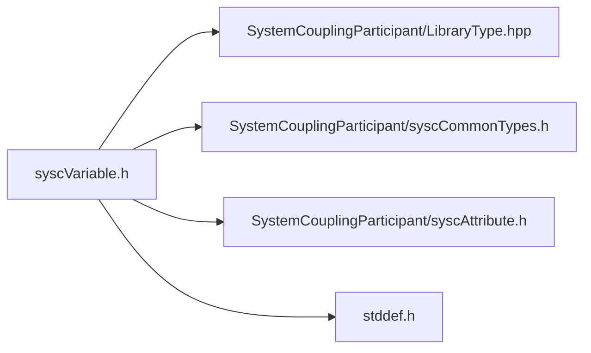

# File syscVariable.h

![][C]

**Location**: `syscVariable.h`


## Classes

* [SyscVariable](structSyscVariable.md#structSyscVariable)

## Includes

* SystemCouplingParticipant/LibraryType.hpp
* SystemCouplingParticipant/syscCommonTypes.h
* SystemCouplingParticipant/syscAttribute.h
* <stddef.h>





## Typedefs

<a id="group__SyscParticipantLibraryCAPI_1ga7a8d294476240d2f3844a608e71efe29"></a>
### Typedef SyscVariable

## Functions

<a id="group__SyscParticipantLibraryCAPI_1ga11cda8cc3f7f76d71b87baabbfe53304"></a>
### Function syscGetVariable

<a id="group__SyscParticipantLibraryCAPI_1ga41420b43584d7b7ab11d94c2c4e4ccdb"></a>
### Function syscGetVariableDTELQD

<a id="group__SyscParticipantLibraryCAPI_1ga3aceb66e0d37a5de11b76fd4c1d7293d"></a>
### Function syscGetVariableTE

<a id="group__SyscParticipantLibraryCAPI_1ga8c3a0f01eb353ffcb981281a76dde4b3"></a>
### Function syscGetVariableTEQ

<a id="group__SyscParticipantLibraryCAPI_1gabcbdf21641e68a17e941a6c8da2afdc9"></a>
### Function syscGetVariableQ

<a id="group__SyscParticipantLibraryCAPI_1ga36e1b9748fe759040360468c2b863753"></a>
### Function syscVariableAddRealAttribute

<a id="group__SyscParticipantLibraryCAPI_1ga2c8d8b670d660f646fbe0d81dbc7914b"></a>
### Function syscVariableAddIntegerAttribute

<a id="group__SyscParticipantLibraryCAPI_1ga3cb95d52ef66ec8339bff5dc9c2c28bb"></a>
### Function syscVariableGetNumRealAttributes

<a id="group__SyscParticipantLibraryCAPI_1gae744a1029ca1d356c8ef9a81b6a41df6"></a>
### Function syscVariableGetNumIntegerAttributes

<a id="group__SyscParticipantLibraryCAPI_1ga7d8fce6af6169d53f48e92cb90224bff"></a>
### Function syscVariableGetRealAttribute

<a id="group__SyscParticipantLibraryCAPI_1gacd6d89e8e016b12cf558b312619201a4"></a>
### Function syscVariableGetIntegerAttribute

## Source


```
/*
* Copyright ANSYS, Inc. Unauthorized use, distribution, or duplication is prohibited.
*/

#pragma once

#include "SystemCouplingParticipant/LibraryType.hpp"

#include "SystemCouplingParticipant/syscCommonTypes.h"
#include "SystemCouplingParticipant/syscAttribute.h"

#include <stddef.h>

#ifdef __cplusplus
extern "C" {
#endif


typedef struct SyscVariable {
  char name[SYSC_STRING_LENGTH];        
  enum SyscQuantityType quantityType;   
  enum SyscLocation location;           
  char displayName[SYSC_STRING_LENGTH]; 
  enum SyscTensorType tensorType;       
  int isExtensive;                      
  enum SyscDataType dataType;           
} SyscVariable;

 SyscVariable syscGetVariable(
  const char* name);

 SyscVariable syscGetVariableDTELQD(
  const char* name,
  const char* displayName,
  enum SyscTensorType tensorType,
  int isExtensive,
  enum SyscLocation location,
  enum SyscQuantityType quantityType,
  enum SyscDataType dataType);

 SyscVariable syscGetVariableTE(
  const char* name,
  enum SyscTensorType tensorType,
  int isExtensive,
  enum SyscLocation location);

 SyscVariable syscGetVariableTEQ(
  const char* name,
  const char* displayName,
  enum SyscTensorType tensorType,
  int isExtensive,
  enum SyscLocation location,
  enum SyscQuantityType quantityType);

 SyscVariable syscGetVariableQ(
  const char* name,
  const char* displayName,
  enum SyscLocation location,
  enum SyscQuantityType quantityType);


SyscError syscVariableAddRealAttribute(
  SyscVariable variable,
  SyscRealAttribute attribute);


SyscError syscVariableAddIntegerAttribute(
  SyscVariable variable,
  SyscIntegerAttribute attribute);


size_t syscVariableGetNumRealAttributes(SyscVariable variable);


size_t syscVariableGetNumIntegerAttributes(SyscVariable variable);


SyscRealAttribute syscVariableGetRealAttribute(
  SyscVariable variable,
  size_t index);


SyscIntegerAttribute syscVariableGetIntegerAttribute(
  SyscVariable variable,
  size_t index);


#ifdef __cplusplus
}
#endif
```


[public]: https://img.shields.io/badge/-public-brightgreen (public)
[C]: https://img.shields.io/badge/language-C-blue (C)