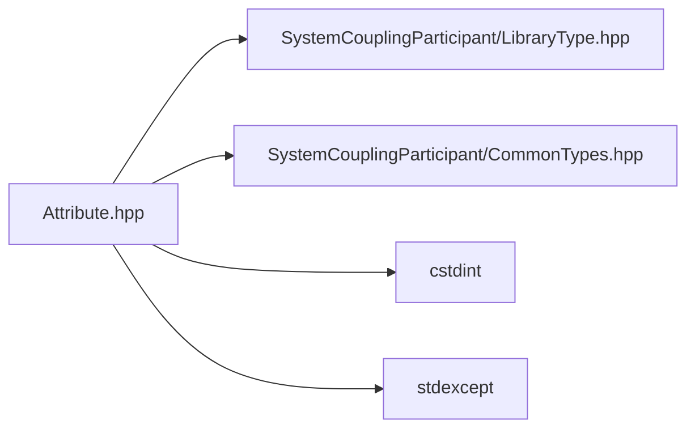

# File Attribute.hpp

![][C++]

**Location**: `Attribute.hpp`


## Classes

* [sysc::RealAttribute](classsysc_1_1RealAttribute.md#classsysc_1_1RealAttribute)
* [sysc::IntegerAttribute](classsysc_1_1IntegerAttribute.md#classsysc_1_1IntegerAttribute)
* [sysc::StringAttribute](classsysc_1_1StringAttribute.md#classsysc_1_1StringAttribute)

## Namespaces

* [sysc](namespacesysc.md#namespacesysc)

## Includes

* SystemCouplingParticipant/LibraryType.hpp
* SystemCouplingParticipant/CommonTypes.hpp
* <cstdint>
* <stdexcept>





## Source


```cpp
/*
 * Copyright ANSYS, Inc. Unauthorized use, distribution, or duplication is prohibited.
 */

#pragma once

#include "SystemCouplingParticipant/LibraryType.hpp"

#include "SystemCouplingParticipant/CommonTypes.hpp"

#include <cstdint>
#include <stdexcept>

namespace sysc {

class SYSTEM_COUPLING_PARTICIPANT_DLL RealAttribute {
public:
  RealAttribute(
    AttributeName name,
    double value,
    Dimensionality dimensionality);

  RealAttribute(
    AttributeName name,
    double value,
    Dimensionality dimensionality,
    bool modifiable);

  RealAttribute(
    AttributeName name,
    double value,
    Dimensionality dimensionality,
    bool modifiable,
    bool hasLowerBound,
    double lowerBound,
    bool hasUpperBound,
    double upperBound);

  const AttributeName& getName() const noexcept;

  double getValue() const noexcept;

  const Dimensionality& getDimensionality() const noexcept;

  bool isModifiable() const noexcept;

  std::string getUnits() const;

  void setLowerBound(double lowerBound) noexcept;

  void setUpperBound(double upperBound) noexcept;

  bool hasLowerBound() const noexcept;

  bool hasUpperBound() const noexcept;

  double getLowerBound() const;

  double getUpperBound() const;

private:
  AttributeName m_name;
  double m_value{0.0};
  double m_lowerBound{0.0};
  double m_upperBound{0.0};
  bool m_hasLowerBound{false};
  bool m_hasUpperBound{false};
  Dimensionality m_dimensionality;
  bool m_modifiable{true};
};

class SYSTEM_COUPLING_PARTICIPANT_DLL IntegerAttribute {
public:
  IntegerAttribute(
    AttributeName name,
    std::int64_t value);

  IntegerAttribute(
    AttributeName name,
    std::int64_t value,
    bool modifiable);

  IntegerAttribute(
    AttributeName name,
    std::int64_t value,
    bool modifiable,
    bool hasLowerBound,
    std::int64_t lowerBound,
    bool hasUpperBound,
    std::int64_t upperBound);

  const AttributeName& getName() const noexcept;

  std::int64_t getValue() const noexcept;

  bool isModifiable() const noexcept;

  void setLowerBound(std::int64_t lowerBound) noexcept;

  void setUpperBound(std::int64_t upperBound) noexcept;

  bool hasLowerBound() const noexcept;

  bool hasUpperBound() const noexcept;

  std::int64_t getLowerBound() const;

  std::int64_t getUpperBound() const;

private:
  AttributeName m_name;
  std::int64_t m_value{0};
  std::int64_t m_lowerBound{0};
  std::int64_t m_upperBound{0};
  bool m_hasLowerBound{false};
  bool m_hasUpperBound{false};
  bool m_modifiable{true};
};

class SYSTEM_COUPLING_PARTICIPANT_DLL StringAttribute {
public:
  StringAttribute(
    AttributeName name,
    std::string value);

  StringAttribute(
    AttributeName name,
    std::string value,
    bool modifiable);

  const AttributeName& getName() const noexcept;

  std::string getValue() const;

  bool isModifiable() const noexcept;

private:
  AttributeName m_name;
  std::string m_value{0};
  bool m_modifiable{true};
};

}  // namespace sysc
```


[private]: https://img.shields.io/badge/-private-red (private)
[public]: https://img.shields.io/badge/-public-brightgreen (public)
[const]: https://img.shields.io/badge/-const-lightblue (const)
[C++]: https://img.shields.io/badge/language-C%2B%2B-blue (C++)