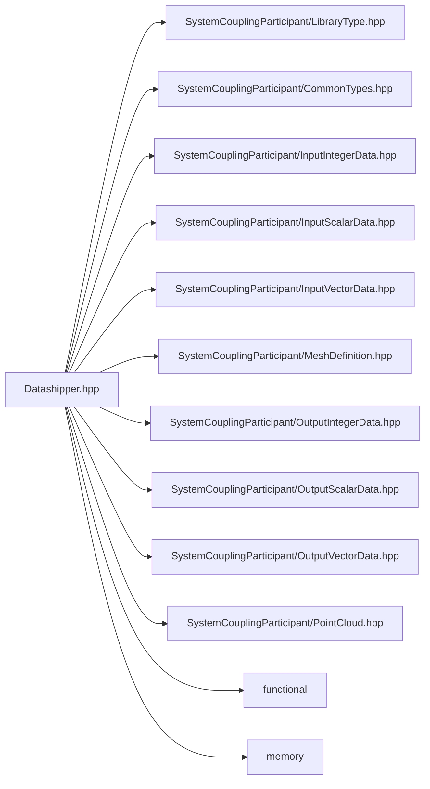

# File Datashipper.hpp

![][C++]

**Location**: `Datashipper.hpp`


## Classes

* [sysc::Datashipper](classsysc_1_1Datashipper.md#classsysc_1_1Datashipper)

## Namespaces

* [sysc](namespacesysc.md#namespacesysc)

## Includes

* SystemCouplingParticipant/LibraryType.hpp
* SystemCouplingParticipant/CommonTypes.hpp
* SystemCouplingParticipant/InputIntegerData.hpp
* SystemCouplingParticipant/InputScalarData.hpp
* SystemCouplingParticipant/InputVectorData.hpp
* SystemCouplingParticipant/MeshDefinition.hpp
* SystemCouplingParticipant/OutputIntegerData.hpp
* SystemCouplingParticipant/OutputScalarData.hpp
* SystemCouplingParticipant/OutputVectorData.hpp
* SystemCouplingParticipant/PointCloud.hpp
* <functional>
* <memory>





## Source


```cpp
/*
* Copyright ANSYS, Inc. Unauthorized use, distribution, or duplication is prohibited.
*/

#pragma once

#include "SystemCouplingParticipant/LibraryType.hpp"

#include "SystemCouplingParticipant/CommonTypes.hpp"
#include "SystemCouplingParticipant/InputIntegerData.hpp"
#include "SystemCouplingParticipant/InputScalarData.hpp"
#include "SystemCouplingParticipant/InputVectorData.hpp"
#include "SystemCouplingParticipant/MeshDefinition.hpp"
#include "SystemCouplingParticipant/OutputIntegerData.hpp"
#include "SystemCouplingParticipant/OutputScalarData.hpp"
#include "SystemCouplingParticipant/OutputVectorData.hpp"
#include "SystemCouplingParticipant/PointCloud.hpp"

#include <functional>
#include <memory>

namespace sysc {

struct DatashipperHandler;

class SYSTEM_COUPLING_PARTICIPANT_DLL Datashipper {
public:
  Datashipper() = delete;

  Datashipper(const Datashipper&) = delete;

  Datashipper(Datashipper&&) = default;

  Datashipper& operator=(const Datashipper&) = delete;

  Datashipper& operator=(Datashipper&&) = default;

  Datashipper(std::size_t globalSize, OutputIntegerData indexMap);

  void collect(OutputIntegerData distributed, InputIntegerData collected);

  void collect(
    OutputIntegerData distributed,
    InputIntegerData collected,
    std::uint16_t numComponents);

  void collect(OutputScalarData distributed, InputScalarData collected);

  void collect(OutputVectorData distributed, InputVectorData collected);

  void collect(NodeData distributed, InputNodeData collected);

  void collect(FaceData distributed, InputFaceData collected);

  void collect(CellData distributed, InputCellData collected);

  void collect(PointCloud distributed, InputPointCloud collected);

  void distribute(OutputIntegerData collected, InputIntegerData distributed);

  void distribute(OutputIntegerData collected, InputIntegerData distributed, std::uint16_t numComponents);

  void distribute(OutputScalarData collected, InputScalarData distributed);

  void distribute(OutputVectorData collected, InputVectorData distributed);

  void distribute(NodeData collected, InputNodeData distributed);

  void distribute(FaceData collected, InputFaceData distributed);

  void distribute(CellData collected, InputCellData distributed);

  void distribute(PointCloud collected, InputPointCloud distributed);

private:
  std::unique_ptr<DatashipperHandler, std::function<void(DatashipperHandler*)>> m_ds;
};

}  // namespace sysc
```


[private]: https://img.shields.io/badge/-private-red (private)
[public]: https://img.shields.io/badge/-public-brightgreen (public)
[const]: https://img.shields.io/badge/-const-lightblue (const)
[C++]: https://img.shields.io/badge/language-C%2B%2B-blue (C++)