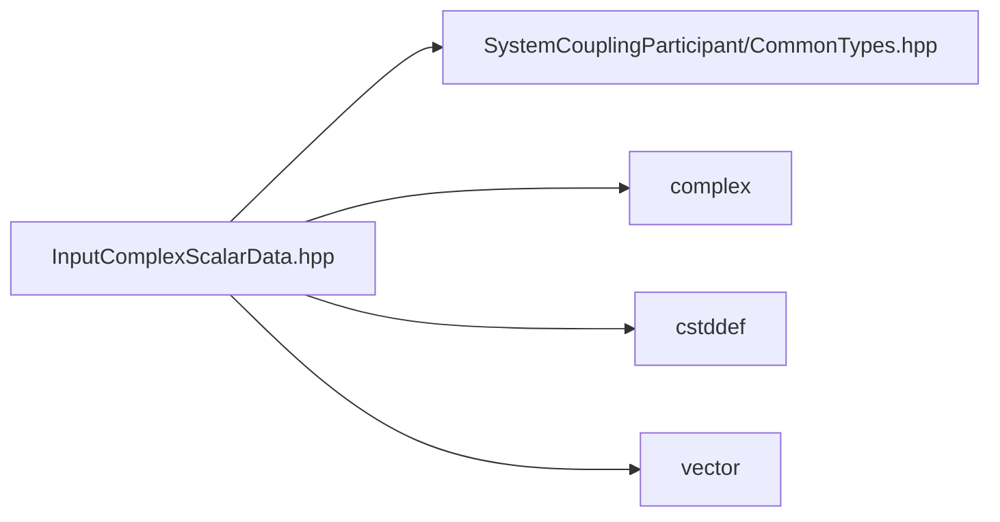

# File InputComplexScalarData.hpp

![][C++]

**Location**: `InputComplexScalarData.hpp`


## Classes

* [sysc::InputComplexScalarData](structsysc_1_1InputComplexScalarData.md#structsysc_1_1InputComplexScalarData)

## Namespaces

* [sysc](namespacesysc.md#namespacesysc)

## Includes

* SystemCouplingParticipant/CommonTypes.hpp
* <complex>
* <cstddef>
* <vector>





## Source


```cpp
/*
 * © 2025 ANSYS, Inc. Unauthorized use, distribution, or duplication is prohibited.
 */

#pragma once

#include "SystemCouplingParticipant/CommonTypes.hpp"

#include <complex>
#include <cstddef>
#include <vector>

namespace sysc {

struct InputComplexScalarData {
public:
  InputComplexScalarData(double* dataComplex, std::size_t size) :
      m_data1(dataComplex),
      m_size(size)
  {
  }

  InputComplexScalarData(
    double* dataReal,
    double* dataImaginary,
    std::size_t size) :
      m_isSplitComplex(true),
      m_data1(dataReal),
      m_data2(dataImaginary),
      m_size(size)
  {
  }

  InputComplexScalarData(float* dataComplex, std::size_t size) :
      m_dataType(PrimitiveType::Float),
      m_data1(dataComplex),
      m_size(size)
  {
  }

  InputComplexScalarData(
    float* dataReal,
    float* dataImaginary,
    std::size_t size) :
      m_dataType(PrimitiveType::Float),
      m_isSplitComplex(true),
      m_data1(dataReal),
      m_data2(dataImaginary),
      m_size(size)
  {
  }

  InputComplexScalarData(std::complex<double>* dataComplex, std::size_t size) :
      InputComplexScalarData(reinterpret_cast<double*>(dataComplex), size)
  {
  }

  InputComplexScalarData(std::vector<std::complex<double>>& dataComplex) :
      InputComplexScalarData(dataComplex.data(), dataComplex.size())
  {
  }

  InputComplexScalarData(
    std::vector<double>& dataReal,
    std::vector<double>& dataImaginary) :
      InputComplexScalarData(
        dataReal.data(), dataImaginary.data(), dataReal.size())
  {
  }

  InputComplexScalarData(std::complex<float>* dataComplex, std::size_t size) :
      InputComplexScalarData(reinterpret_cast<float*>(dataComplex), size)
  {
  }

  InputComplexScalarData(std::vector<std::complex<float>>& dataComplex) :
      InputComplexScalarData(dataComplex.data(), dataComplex.size())
  {
  }

  InputComplexScalarData(
    std::vector<float>& dataReal,
    std::vector<float>& dataImaginary) :
      InputComplexScalarData(
        dataReal.data(), dataImaginary.data(), dataReal.size())
  {
  }

  InputComplexScalarData() = default;

  InputComplexScalarData(const InputComplexScalarData&) = default;

  InputComplexScalarData(InputComplexScalarData&&) = default;

  InputComplexScalarData& operator=(const InputComplexScalarData&) = default;

  InputComplexScalarData& operator=(InputComplexScalarData&&) = default;

  std::size_t size() const noexcept { return m_size; }

  bool empty() const noexcept { return m_size == 0; }

  sysc::PrimitiveType getDataType() const noexcept { return m_dataType; }

  bool isSplitComplex() const noexcept { return m_isSplitComplex; }

  void* getData1() const noexcept { return m_data1; }

  void* getData2() const noexcept { return m_data2; }

private:
  PrimitiveType m_dataType{PrimitiveType::Double};
  bool m_isSplitComplex{false};

  void* m_data1{nullptr};
  void* m_data2{nullptr};

  std::size_t m_size{0};
};

using ComplexScalarData = InputComplexScalarData;

}  // namespace sysc
```


[private]: https://img.shields.io/badge/-private-red (private)
[public]: https://img.shields.io/badge/-public-brightgreen (public)
[const]: https://img.shields.io/badge/-const-lightblue (const)
[C++]: https://img.shields.io/badge/language-C%2B%2B-blue (C++)