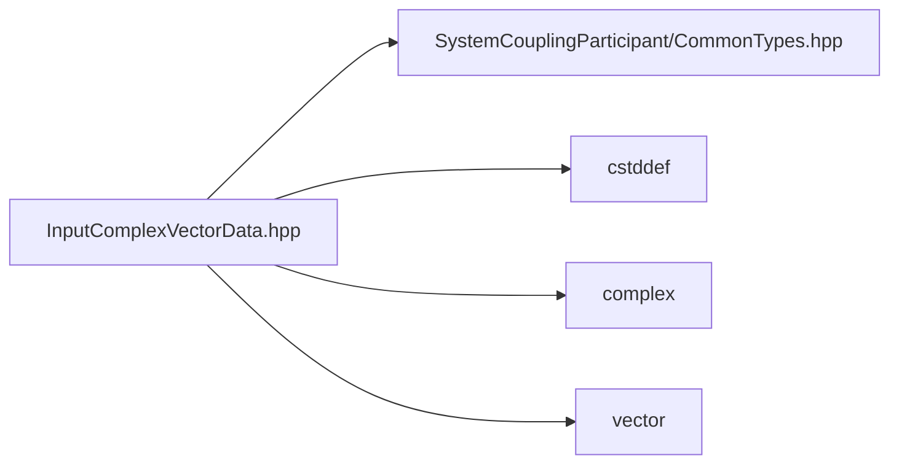

# File InputComplexVectorData.hpp

![][C++]

**Location**: `InputComplexVectorData.hpp`


## Classes

* [sysc::InputComplexVectorData](structsysc_1_1InputComplexVectorData.md#structsysc_1_1InputComplexVectorData)

## Namespaces

* [sysc](namespacesysc.md#namespacesysc)

## Includes

* SystemCouplingParticipant/CommonTypes.hpp
* <cstddef>
* <complex>
* <vector>





## Source


```cpp
/*
 * © 2025 ANSYS, Inc. Unauthorized use, distribution, or duplication is prohibited.
 */

#pragma once

#include "SystemCouplingParticipant/CommonTypes.hpp"

#include <cstddef>
#include <complex>
#include <vector>

namespace sysc {

struct InputComplexVectorData {
public:
  InputComplexVectorData(
    double* dataComplex,
    std::size_t size,
    Dimension dimension) :
      m_data1(dataComplex),
      m_size(size),
      m_dimension(dimension) {}

  InputComplexVectorData(
    double* dataReal,
    double* dataImaginary,
    std::size_t size) :
      m_isSplitComplex(true),
      m_data1(dataReal),
      m_data2(dataImaginary),
      m_size(size) {}

  InputComplexVectorData(
    double* dataComplex1,
    double* dataComplex2,
    double* dataComplex3,
    std::size_t size) :
      m_isSplitVector(true),
      m_data1(dataComplex1),
      m_data2(dataComplex2),
      m_data3(dataComplex3),
      m_size(size) {}

  InputComplexVectorData(
    double* dataReal1,
    double* dataImaginary1,
    double* dataReal2,
    double* dataImaginary2,
    double* dataReal3,
    double* dataImaginary3,
    std::size_t size) :
      m_isSplitVector(true),
      m_isSplitComplex(true),
      m_data1(dataReal1),
      m_data2(dataImaginary1),
      m_data3(dataReal2),
      m_data4(dataImaginary2),
      m_data5(dataReal3),
      m_data6(dataImaginary3),
      m_size(size) {}

  InputComplexVectorData(
    float* dataComplex,
    std::size_t size,
    Dimension dimension) :
      m_dataType(PrimitiveType::Float),
      m_data1(dataComplex),
      m_size(size),
      m_dimension(dimension) {}

  InputComplexVectorData(
    float* dataReal,
    float* dataImaginary,
    std::size_t size) :
      m_dataType(PrimitiveType::Float),
      m_isSplitComplex(true),
      m_data1(dataReal),
      m_data2(dataImaginary),
      m_size(size) {}

  InputComplexVectorData(
    float* dataComplex1,
    float* dataComplex2,
    float* dataComplex3,
    std::size_t size) :
      m_dataType(PrimitiveType::Float),
      m_isSplitVector(true),
      m_data1(dataComplex1),
      m_data2(dataComplex2),
      m_data3(dataComplex3),
      m_size(size) {}

  InputComplexVectorData(
    float* dataReal1,
    float* dataImaginary1,
    float* dataReal2,
    float* dataImaginary2,
    float* dataReal3,
    float* dataImaginary3,
    std::size_t size) :
      m_dataType(PrimitiveType::Float),
      m_isSplitVector(true),
      m_isSplitComplex(true),
      m_data1(dataReal1),
      m_data2(dataImaginary1),
      m_data3(dataReal2),
      m_data4(dataImaginary2),
      m_data5(dataReal3),
      m_data6(dataImaginary3),
      m_size(size) {}

  InputComplexVectorData(double* dataComplex, std::size_t size) :
      InputComplexVectorData(dataComplex, size, Dimension::D3)
  {
  }

  InputComplexVectorData(float* dataComplex, std::size_t size) :
      InputComplexVectorData(dataComplex, size, Dimension::D3)
  {
  }

  InputComplexVectorData(
    std::complex<double>* dataComplex,
    std::size_t size,
    Dimension dimension) :
      m_data1(reinterpret_cast<double*>(dataComplex)),
      m_size(size),
      m_dimension(dimension) {}

  InputComplexVectorData(std::complex<double>* dataComplex, std::size_t size) :
      InputComplexVectorData(dataComplex, size, Dimension::D3)
  {
  }

  InputComplexVectorData(
    std::vector<std::complex<double>>& dataComplex,
    Dimension dimension) :
      InputComplexVectorData(
        dataComplex.data(),
        dataComplex.size() / getNumDimensions(dimension),
        dimension) {}

  InputComplexVectorData(std::vector<std::complex<double>>& dataComplex) :
      InputComplexVectorData(dataComplex, Dimension::D3) {}

  InputComplexVectorData(
    std::vector<double>& dataReal,
    std::vector<double>& dataImaginary) :
      InputComplexVectorData(
        dataReal.data(),
        dataImaginary.data(),
        dataReal.size() / getNumDimensions(Dimension::D3)) {}

  InputComplexVectorData(
    std::complex<double>* dataComplex1,
    std::complex<double>* dataComplex2,
    std::complex<double>* dataComplex3,
    std::size_t size) :
      InputComplexVectorData(
        reinterpret_cast<double*>(dataComplex1),
        reinterpret_cast<double*>(dataComplex2),
        reinterpret_cast<double*>(dataComplex3),
        size)
  {
  }

  InputComplexVectorData(
    std::vector<std::complex<double>>& dataComplex1,
    std::vector<std::complex<double>>& dataComplex2,
    std::vector<std::complex<double>>& dataComplex3) :
      InputComplexVectorData(
        dataComplex1.data(),
        dataComplex2.data(),
        dataComplex3.data(),
        dataComplex1.size()) {}

  InputComplexVectorData(
    std::vector<double>& dataReal1,
    std::vector<double>& dataImaginary1,
    std::vector<double>& dataReal2,
    std::vector<double>& dataImaginary2,
    std::vector<double>& dataReal3,
    std::vector<double>& dataImaginary3) :
      InputComplexVectorData(
        dataReal1.data(),
        dataImaginary1.data(),
        dataReal2.data(),
        dataImaginary2.data(),
        dataReal3.data(),
        dataImaginary3.data(),
        dataReal1.size()) {}

  InputComplexVectorData(
    std::complex<float>* dataComplex,
    std::size_t size,
    Dimension dimension) :
      InputComplexVectorData(reinterpret_cast<float*>(dataComplex), size, dimension)
  {
  }

  InputComplexVectorData(
    std::complex<float>* dataComplex,
    std::size_t size) :
      InputComplexVectorData(dataComplex, size, Dimension::D3) {}

  InputComplexVectorData(
    std::vector<std::complex<float>>& dataComplex,
    Dimension dimension) :
      InputComplexVectorData(
        dataComplex.data(),
        dataComplex.size() / getNumDimensions(dimension),
        dimension) {}

  InputComplexVectorData(std::vector<std::complex<float>>& dataComplex) :
      InputComplexVectorData(dataComplex, Dimension::D3) {}

  InputComplexVectorData(
    std::vector<float>& dataReal,
    std::vector<float>& dataImaginary) :
      InputComplexVectorData(
        dataReal.data(),
        dataImaginary.data(),
        dataReal.size() / getNumDimensions(Dimension::D3)) {}

  InputComplexVectorData(
    std::vector<std::complex<float>>& dataComplex1,
    std::vector<std::complex<float>>& dataComplex2,
    std::vector<std::complex<float>>& dataComplex3) :
      InputComplexVectorData(
        dataComplex1.data(),
        dataComplex2.data(),
        dataComplex3.data(),
        dataComplex1.size()) {}

  InputComplexVectorData(
    std::complex<float>* dataComplex1,
    std::complex<float>* dataComplex2,
    std::complex<float>* dataComplex3,
    std::size_t size) :
      InputComplexVectorData(
        reinterpret_cast<float*>(dataComplex1),
        reinterpret_cast<float*>(dataComplex2),
        reinterpret_cast<float*>(dataComplex3),
        size) {}

  InputComplexVectorData(
    std::vector<float>& dataReal1,
    std::vector<float>& dataImaginary1,
    std::vector<float>& dataReal2,
    std::vector<float>& dataImaginary2,
    std::vector<float>& dataReal3,
    std::vector<float>& dataImaginary3) :
      InputComplexVectorData(
        dataReal1.data(),
        dataImaginary1.data(),
        dataReal2.data(),
        dataImaginary2.data(),
        dataReal3.data(),
        dataImaginary3.data(),
        dataReal1.size()) {}

  InputComplexVectorData() = default;

  InputComplexVectorData(const InputComplexVectorData&) = default;

  InputComplexVectorData(InputComplexVectorData&&) = default;

  InputComplexVectorData& operator=(const InputComplexVectorData&) = default;

  InputComplexVectorData& operator=(InputComplexVectorData&&) = default;

  std::size_t size() const noexcept { return m_size; }

  bool empty() const noexcept { return m_size == 0; }

  sysc::PrimitiveType getDataType() const noexcept { return m_dataType; }

  bool isSplitVector() const noexcept { return m_isSplitVector; }

  bool isSplitComplex() const noexcept { return m_isSplitComplex; }

  void* getData1() const noexcept { return m_data1; }

  void* getData2() const noexcept { return m_data2; }

  void* getData3() const noexcept { return m_data3; }

  void* getData4() const noexcept { return m_data4; }

  void* getData5() const noexcept { return m_data5; }

  void* getData6() const noexcept { return m_data6; }

  Dimension getDimension() const noexcept { return m_dimension; }

private:
  sysc::PrimitiveType m_dataType{sysc::Double};
  bool m_isSplitVector{false};
  bool m_isSplitComplex{false};

  void* m_data1{nullptr};
  void* m_data2{nullptr};
  void* m_data3{nullptr};
  void* m_data4{nullptr};
  void* m_data5{nullptr};
  void* m_data6{nullptr};

  std::size_t m_size{0};
  Dimension m_dimension{Dimension::D3};
};

using ComplexVectorData = InputComplexVectorData;

}  // namespace sysc
```


[private]: https://img.shields.io/badge/-private-red (private)
[public]: https://img.shields.io/badge/-public-brightgreen (public)
[const]: https://img.shields.io/badge/-const-lightblue (const)
[C++]: https://img.shields.io/badge/language-C%2B%2B-blue (C++)