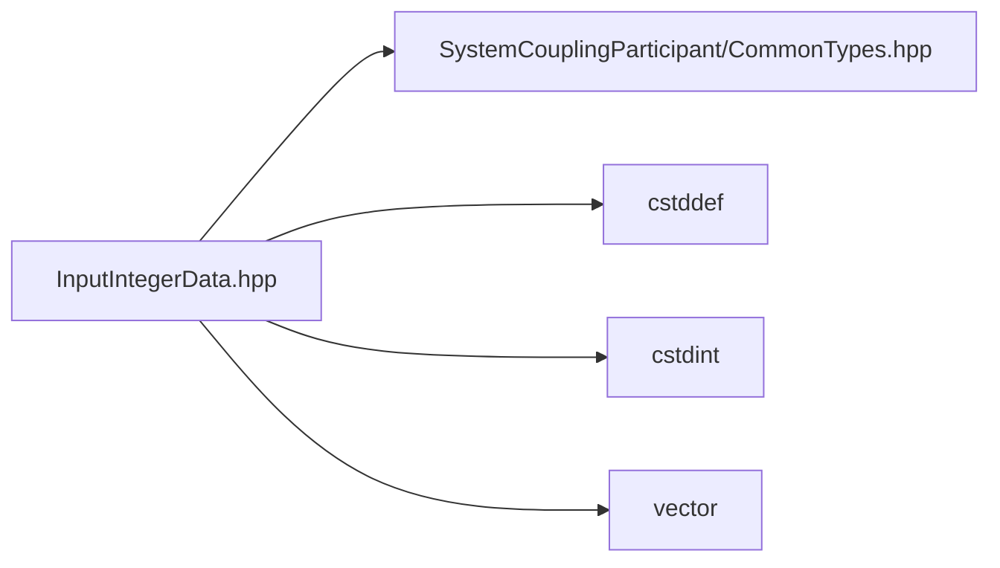

# File InputIntegerData.hpp

![][C++]

**Location**: `InputIntegerData.hpp`


## Classes

* [sysc::InputIntegerData](structsysc_1_1InputIntegerData.md#structsysc_1_1InputIntegerData)

## Namespaces

* [sysc](namespacesysc.md#namespacesysc)

## Includes

* SystemCouplingParticipant/CommonTypes.hpp
* <cstddef>
* <cstdint>
* <vector>





## Source


```cpp
/*
 * © 2025 ANSYS, Inc. Unauthorized use, distribution, or duplication is prohibited.
 */

#pragma once

#include "SystemCouplingParticipant/CommonTypes.hpp"

#include <cstddef>
#include <cstdint>
#include <vector>

namespace sysc {

struct InputIntegerData {
public:
  InputIntegerData(std::uint16_t* data, std::size_t size) :
      m_dataType(sysc::UnsignedInt16),
      m_data(data),
      m_size(size)
  {
  }

  InputIntegerData(std::vector<std::uint16_t>& data) :
      InputIntegerData(data.data(), data.size())
  {
  }

  InputIntegerData(std::uint64_t* data, std::size_t size) :
      m_dataType(sysc::UnsignedInt64),
      m_data(data),
      m_size(size)
  {
  }

  InputIntegerData(std::vector<std::uint64_t>& data) :
      InputIntegerData(data.data(), data.size())
  {
  }

  InputIntegerData(std::int32_t* data, std::size_t size) :
      m_dataType(sysc::Int32),
      m_data(data),
      m_size(size)
  {
  }

  InputIntegerData(std::vector<std::int32_t>& data) :
      InputIntegerData(data.data(), data.size())
  {
  }

  InputIntegerData(std::int64_t* data, std::size_t size) :
      m_dataType(sysc::Int64),
      m_data(data),
      m_size(size)
  {
  }

  InputIntegerData(std::vector<std::int64_t>& data) :
      InputIntegerData(data.data(), data.size())
  {
  }

  InputIntegerData() = default;

  InputIntegerData(const InputIntegerData&) = default;

  InputIntegerData(InputIntegerData&&) = default;

  InputIntegerData& operator=(const InputIntegerData&) = default;

  InputIntegerData& operator=(InputIntegerData&&) = default;

  std::size_t size() const noexcept
  {
    return m_size;
  }

  bool empty() const noexcept
  {
    return m_size == 0;
  }

  sysc::PrimitiveType getDataType() const noexcept
  {
    return m_dataType;
  }

  void* getData() const noexcept
  {
    return m_data;
  }

private:
  sysc::PrimitiveType m_dataType{sysc::PrimitiveType::Int32};
  void* m_data{nullptr};
  std::size_t m_size{0};
};

using IntegerData = InputIntegerData;

}  // namespace sysc
```


[private]: https://img.shields.io/badge/-private-red (private)
[public]: https://img.shields.io/badge/-public-brightgreen (public)
[const]: https://img.shields.io/badge/-const-lightblue (const)
[C++]: https://img.shields.io/badge/language-C%2B%2B-blue (C++)