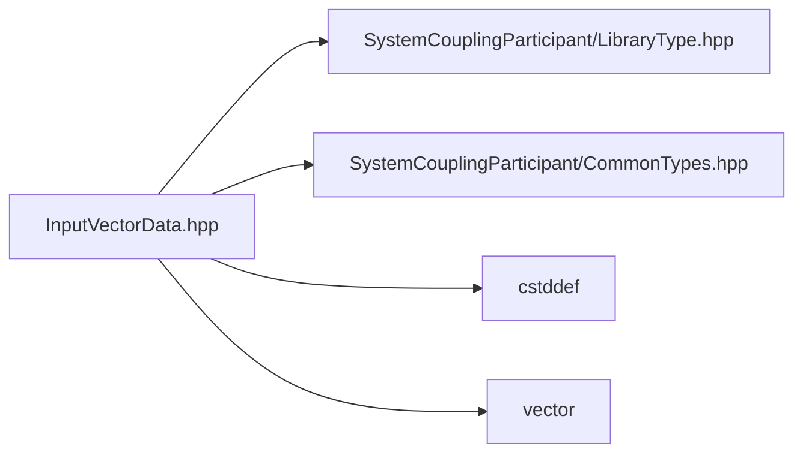

# File InputVectorData.hpp

![][C++]

**Location**: `InputVectorData.hpp`


## Classes

* [sysc::InputVectorData](structsysc_1_1InputVectorData.md#structsysc_1_1InputVectorData)

## Namespaces

* [sysc](namespacesysc.md#namespacesysc)

## Includes

* SystemCouplingParticipant/LibraryType.hpp
* SystemCouplingParticipant/CommonTypes.hpp
* <cstddef>
* <vector>





## Source


```cpp
/*
 * © 2025 ANSYS, Inc. Unauthorized use, distribution, or duplication is prohibited.
 */

#pragma once

#include "SystemCouplingParticipant/LibraryType.hpp"

#include "SystemCouplingParticipant/CommonTypes.hpp"

#include <cstddef>
#include <vector>

namespace sysc {

struct InputVectorData {
public:
  InputVectorData(double* data, std::size_t size, Dimension dimension) :
      m_data0(data),
      m_size(size),
      m_dimension(dimension)
  {
  }

  InputVectorData(double* data, std::size_t size) :
      InputVectorData(data, size, Dimension::D3)
  {
  }

  InputVectorData(float* data, std::size_t size, Dimension dimension) :
      m_dataType(sysc::PrimitiveType::Float),
      m_data0(data),
      m_size(size),
      m_dimension(dimension)
  {
  }

  InputVectorData(float* data, std::size_t size) :
      InputVectorData(data, size, Dimension::D3)
  {
  }

  InputVectorData(std::vector<double>& data, Dimension dimension) :
      InputVectorData(data.data(), data.size() / getNumDimensions(dimension), dimension)
  {
  }

  InputVectorData(std::vector<double>& data) :
      InputVectorData(data, Dimension::D3)
  {
  }

  InputVectorData(std::vector<float>& data, Dimension dimension) :
      InputVectorData(data.data(), data.size() / getNumDimensions(dimension), dimension)
  {
  }

  InputVectorData(std::vector<float>& data) :
      InputVectorData(data, Dimension::D3)
  {
  }

  InputVectorData(
    double* data0,
    double* data1,
    double* data2,
    std::size_t size) :
      m_isSplitVector(true),
      m_data0(data0),
      m_data1(data1),
      m_data2(data2),
      m_size(size)
  {
  }

  InputVectorData(
    double* data0,
    double* data1,
    std::size_t size) :
      m_isSplitVector(true),
      m_data0(data0),
      m_data1(data1),
      m_size(size),
      m_dimension(Dimension::D2)
  {
  }

  InputVectorData(
    float* data0,
    float* data1,
    float* data2,
    std::size_t size) :
      m_dataType(sysc::PrimitiveType::Float),
      m_isSplitVector(true),
      m_data0(data0),
      m_data1(data1),
      m_data2(data2),
      m_size(size)
  {
  }

  InputVectorData(
    float* data0,
    float* data1,
    std::size_t size) :
      m_dataType(sysc::PrimitiveType::Float),
      m_isSplitVector(true),
      m_data0(data0),
      m_data1(data1),
      m_size(size),
      m_dimension(Dimension::D2)
  {
  }

  InputVectorData(
    std::vector<double>& data0,
    std::vector<double>& data1,
    std::vector<double>& data2) :
      InputVectorData(data0.data(), data1.data(), data2.data(), data0.size())
  {
    if (data0.size() != data1.size() || data0.size() != data2.size()) {
      std::string msg = "InputVectorData constructor: ";
      msg += "not all STL vectors are of the same size.";
      throw std::runtime_error(msg);
    }
  }

  InputVectorData(
    std::vector<double>& data0,
    std::vector<double>& data1) :
      InputVectorData(data0.data(), data1.data(), data0.size())
  {
    if (data0.size() != data1.size()) {
      std::string msg = "InputVectorData constructor: ";
      msg += "not all STL vectors are of the same size.";
      throw std::runtime_error(msg);
    }
  }

  InputVectorData(
    std::vector<float>& data0,
    std::vector<float>& data1,
    std::vector<float>& data2) :
      InputVectorData(data0.data(), data1.data(), data2.data(), data0.size())
  {
    if (data0.size() != data1.size() || data0.size() != data2.size()) {
      std::string msg = "InputVectorData constructor: ";
      msg += "not all STL vectors are of the same size.";
      throw std::runtime_error(msg);
    }
  }

  InputVectorData(
    std::vector<float>& data0,
    std::vector<float>& data1) :
      InputVectorData(data0.data(), data1.data(), data0.size())
  {
    if (data0.size() != data1.size()) {
      std::string msg = "InputVectorData constructor: ";
      msg += "not all STL vectors are of the same size.";
      throw std::runtime_error(msg);
    }
  }

  InputVectorData() = default;

  InputVectorData(const InputVectorData&) = default;

  InputVectorData(InputVectorData&&) = default;

  InputVectorData& operator=(const InputVectorData&) = default;

  InputVectorData& operator=(InputVectorData&&) = default;

  std::size_t size() const noexcept { return m_size; }

  bool empty() const noexcept { return m_size == 0; }

  sysc::PrimitiveType getDataType() const noexcept { return m_dataType; }

  bool isSplitVector() const noexcept { return m_isSplitVector; }

  void* getData0() const noexcept { return m_data0; }

  void* getData1() const noexcept { return m_data1; }

  void* getData2() const noexcept { return m_data2; }

  Dimension getDimension() const noexcept { return m_dimension; }

private:
  sysc::PrimitiveType m_dataType{sysc::Double};
  bool m_isSplitVector{false};
  void* m_data0{nullptr};
  void* m_data1{nullptr};
  void* m_data2{nullptr};
  std::size_t m_size{0};
  Dimension m_dimension{Dimension::D3};
};

using VectorData = InputVectorData;

}  // namespace sysc
```


[private]: https://img.shields.io/badge/-private-red (private)
[public]: https://img.shields.io/badge/-public-brightgreen (public)
[const]: https://img.shields.io/badge/-const-lightblue (const)
[C++]: https://img.shields.io/badge/language-C%2B%2B-blue (C++)