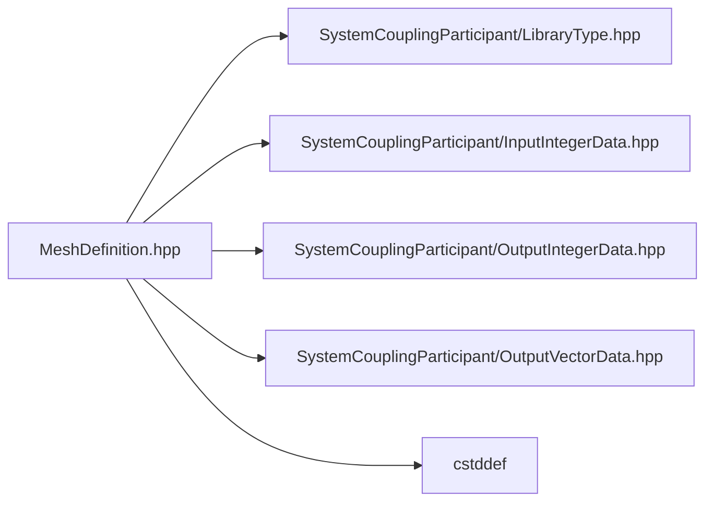

# File MeshDefinition.hpp

![][C++]

**Location**: `MeshDefinition.hpp`


## Classes

* [sysc::InputElementIdData](structsysc_1_1InputElementIdData.md#structsysc_1_1InputElementIdData)
* [sysc::InputElementTypeData](structsysc_1_1InputElementTypeData.md#structsysc_1_1InputElementTypeData)
* [sysc::InputElementNodeCountData](structsysc_1_1InputElementNodeCountData.md#structsysc_1_1InputElementNodeCountData)
* [sysc::InputElementNodeConnectivityData](structsysc_1_1InputElementNodeConnectivityData.md#structsysc_1_1InputElementNodeConnectivityData)
* [sysc::InputFaceCellConnectivityData](structsysc_1_1InputFaceCellConnectivityData.md#structsysc_1_1InputFaceCellConnectivityData)
* [sysc::InputNodeData](structsysc_1_1InputNodeData.md#structsysc_1_1InputNodeData)
* [sysc::InputFaceData](structsysc_1_1InputFaceData.md#structsysc_1_1InputFaceData)
* [sysc::InputCellData](structsysc_1_1InputCellData.md#structsysc_1_1InputCellData)
* [sysc::ElementIdData](structsysc_1_1ElementIdData.md#structsysc_1_1ElementIdData)
* [sysc::ElementTypeData](structsysc_1_1ElementTypeData.md#structsysc_1_1ElementTypeData)
* [sysc::ElementNodeCountData](structsysc_1_1ElementNodeCountData.md#structsysc_1_1ElementNodeCountData)
* [sysc::ElementNodeConnectivityData](structsysc_1_1ElementNodeConnectivityData.md#structsysc_1_1ElementNodeConnectivityData)
* [sysc::FaceCellConnectivityData](structsysc_1_1FaceCellConnectivityData.md#structsysc_1_1FaceCellConnectivityData)
* [sysc::CellIdData](structsysc_1_1CellIdData.md#structsysc_1_1CellIdData)
* [sysc::NodeData](structsysc_1_1NodeData.md#structsysc_1_1NodeData)
* [sysc::FaceData](structsysc_1_1FaceData.md#structsysc_1_1FaceData)
* [sysc::CellData](structsysc_1_1CellData.md#structsysc_1_1CellData)

## Namespaces

* [sysc](namespacesysc.md#namespacesysc)

## Includes

* SystemCouplingParticipant/LibraryType.hpp
* SystemCouplingParticipant/InputIntegerData.hpp
* SystemCouplingParticipant/OutputIntegerData.hpp
* SystemCouplingParticipant/OutputVectorData.hpp
* <cstddef>





## Source


```cpp
/*
 * Copyright ANSYS. All rights reserved.
 */

#pragma once

#include "SystemCouplingParticipant/LibraryType.hpp"

#include "SystemCouplingParticipant/InputIntegerData.hpp"
#include "SystemCouplingParticipant/OutputIntegerData.hpp"
#include "SystemCouplingParticipant/OutputVectorData.hpp"

#include <cstddef>

namespace sysc {


struct InputElementIdData {
  IntegerData elementIds;

  InputElementIdData(
    IntegerData elementIds) :
      elementIds(elementIds)
  {
  }

  InputElementIdData() = default;

  InputElementIdData(const InputElementIdData&) = default;

  InputElementIdData(InputElementIdData&&) = default;

  InputElementIdData& operator=(const InputElementIdData&) = default;

  InputElementIdData& operator=(InputElementIdData&&) = default;
};

struct InputElementTypeData {
  IntegerData elementTypes;

  InputElementTypeData(
    IntegerData elementTypes) :
      elementTypes(elementTypes)
  {
  }

  InputElementTypeData() = default;

  InputElementTypeData(const InputElementTypeData&) = default;

  InputElementTypeData(InputElementTypeData&&) = default;

  InputElementTypeData& operator=(const InputElementTypeData&) = default;

  InputElementTypeData& operator=(InputElementTypeData&&) = default;
};

struct InputElementNodeCountData {
  IntegerData elemNodeCounts; 

  InputElementNodeCountData(
    IntegerData elemNodeCounts) :
      elemNodeCounts(elemNodeCounts)
  {
  }

  InputElementNodeCountData() = default;

  InputElementNodeCountData(const InputElementNodeCountData&) = default;

  InputElementNodeCountData(InputElementNodeCountData&&) = default;

  InputElementNodeCountData& operator=(const InputElementNodeCountData&) = default;

  InputElementNodeCountData& operator=(InputElementNodeCountData&&) = default;
};

struct InputElementNodeConnectivityData {
  IntegerData elemNodeIds; 

  InputElementNodeConnectivityData(IntegerData elemNodeIds) :
      elemNodeIds(elemNodeIds)
  {
  }

  InputElementNodeConnectivityData() = default;

  InputElementNodeConnectivityData(const InputElementNodeConnectivityData&) = default;

  InputElementNodeConnectivityData(InputElementNodeConnectivityData&&) = default;

  InputElementNodeConnectivityData& operator=(const InputElementNodeConnectivityData&) = default;

  InputElementNodeConnectivityData& operator=(InputElementNodeConnectivityData&&) = default;
};

struct InputFaceCellConnectivityData {
  IntegerData cell0Ids; 
  IntegerData cell1Ids; 

  InputFaceCellConnectivityData(IntegerData cell0Ids, IntegerData cell1Ids) :
      cell0Ids(cell0Ids),
      cell1Ids(cell1Ids) {}

  InputFaceCellConnectivityData() = default;

  InputFaceCellConnectivityData(const InputFaceCellConnectivityData&) = default;

  InputFaceCellConnectivityData(InputFaceCellConnectivityData&&) = default;

  InputFaceCellConnectivityData& operator=(const InputFaceCellConnectivityData&) = default;

  InputFaceCellConnectivityData& operator=(InputFaceCellConnectivityData&&) = default;
};

struct InputNodeData {
  IntegerData nodeIds;

  VectorData nodeCoords;

  InputNodeData(IntegerData nodeIds, VectorData nodeCoords) :
      nodeIds(nodeIds),
      nodeCoords(nodeCoords)
  {
  }

  InputNodeData(VectorData nodeCoords) :
      nodeCoords(nodeCoords) {}

  InputNodeData() = default;

  InputNodeData(const InputNodeData&) = default;

  InputNodeData(InputNodeData&&) = default;

  InputNodeData& operator=(const InputNodeData&) = default;

  InputNodeData& operator=(InputNodeData&&) = default;

  std::size_t size() const noexcept
  {
    return nodeCoords.size();
  }
};

struct InputFaceData {
  InputElementIdData faceIds;

  InputElementTypeData faceTypes;

  InputElementNodeCountData faceNodeCounts;

  InputElementNodeConnectivityData faceNodeConnectivity;

  InputFaceCellConnectivityData faceCellConnectivity;

  InputFaceData(
    InputElementIdData faceIds,
    InputElementTypeData faceTypes,
    InputElementNodeCountData faceNodeCounts,
    InputElementNodeConnectivityData faceNodeConnectivity,
    InputFaceCellConnectivityData faceCellConnectivity) :
      faceIds(faceIds),
      faceTypes(faceTypes),
      faceNodeCounts(faceNodeCounts),
      faceNodeConnectivity(faceNodeConnectivity),
      faceCellConnectivity(faceCellConnectivity)
  {
  }

  InputFaceData() = default;

  InputFaceData(const InputFaceData&) = default;

  InputFaceData(InputFaceData&&) = default;

  InputFaceData& operator=(const InputFaceData&) = default;

  InputFaceData& operator=(InputFaceData&&) = default;

  std::size_t size() const
  {
    const std::size_t faceIdsSize = faceIds.elementIds.size();
    const std::size_t faceTypesSize = faceTypes.elementTypes.size();
    const std::size_t faceNodesSize = faceNodeCounts.elemNodeCounts.size();
    std::size_t faceCount = faceTypesSize > faceNodesSize ? faceTypesSize : faceNodesSize;
    faceCount = faceIdsSize > faceCount ? faceIdsSize : faceCount;
    return faceCount;
  }
};

struct InputCellData {
  InputElementIdData cellIds;

  InputElementTypeData cellTypes;

  InputElementNodeConnectivityData cellNodeConnectivity;

  InputCellData(
    InputElementIdData cellIds,
    InputElementTypeData cellTypes,
    InputElementNodeConnectivityData cellNodeConnectivity) :
      cellIds(cellIds),
      cellTypes(cellTypes),
      cellNodeConnectivity(cellNodeConnectivity)
  {
  }

  InputCellData(InputElementIdData cellIds) :
      cellIds(cellIds)
  {
  }

  InputCellData(
    InputElementTypeData cellTypes,
    InputElementNodeConnectivityData cellNodeConnectivity) :
      cellTypes(cellTypes),
      cellNodeConnectivity(cellNodeConnectivity)
  {
  }

  InputCellData() = default;

  InputCellData(const InputCellData&) = default;

  InputCellData(InputCellData&&) = default;

  InputCellData& operator=(const InputCellData&) = default;

  InputCellData& operator=(InputCellData&&) = default;

  std::size_t size() const
  {
    const std::size_t cellIdsSize = cellIds.elementIds.size();
    const std::size_t cellTypesSize = cellTypes.elementTypes.size();
    const std::size_t cellCount = cellIdsSize > cellTypesSize ? cellIdsSize : cellTypesSize;
    return cellCount;
  }
};

// ===================

struct ElementIdData {
  OutputIntegerData elementIds;

  ElementIdData(InputElementIdData elemIdData) :
      elementIds(elemIdData.elementIds)
  {
  }

  ElementIdData(
    OutputIntegerData elementIds) :
      elementIds(elementIds)
  {
  }

  ElementIdData() = default;

  ElementIdData(const ElementIdData&) = default;

  ElementIdData(ElementIdData&&) = default;

  ElementIdData& operator=(const ElementIdData&) = default;

  ElementIdData& operator=(ElementIdData&&) = default;
};

struct ElementTypeData {
  OutputIntegerData elementTypes;

  ElementTypeData(InputElementTypeData elemTypeData) :
      elementTypes(elemTypeData.elementTypes)
  {
  }

  ElementTypeData(
    OutputIntegerData elementTypes) :
      elementTypes(elementTypes)
  {
  }

  ElementTypeData() = default;

  ElementTypeData(const ElementTypeData&) = default;

  ElementTypeData(ElementTypeData&&) = default;

  ElementTypeData& operator=(const ElementTypeData&) = default;

  ElementTypeData& operator=(ElementTypeData&&) = default;
};

struct ElementNodeCountData {
  OutputIntegerData elemNodeCounts; 

  ElementNodeCountData(InputElementNodeCountData inputData) :
      elemNodeCounts(inputData.elemNodeCounts)
  {
  }

  ElementNodeCountData(
    OutputIntegerData elemNodeCounts) :
      elemNodeCounts(elemNodeCounts)
  {
  }

  ElementNodeCountData() = default;

  ElementNodeCountData(const ElementNodeCountData&) = default;

  ElementNodeCountData(ElementNodeCountData&&) = default;

  ElementNodeCountData& operator=(const ElementNodeCountData&) = default;

  ElementNodeCountData& operator=(ElementNodeCountData&&) = default;
};

struct ElementNodeConnectivityData {
  OutputIntegerData elemNodeIds; 

  ElementNodeConnectivityData(InputElementNodeConnectivityData inputData) :
      elemNodeIds(inputData.elemNodeIds)
  {
  }

  ElementNodeConnectivityData(const OutputIntegerData& elemNodeIds) :
      elemNodeIds(elemNodeIds)
  {
  }

  ElementNodeConnectivityData() = default;

  ElementNodeConnectivityData(const ElementNodeConnectivityData&) = default;

  ElementNodeConnectivityData(ElementNodeConnectivityData&&) = default;

  ElementNodeConnectivityData& operator=(const ElementNodeConnectivityData&) = default;

  ElementNodeConnectivityData& operator=(ElementNodeConnectivityData&&) = default;
};

struct FaceCellConnectivityData {
  OutputIntegerData cell0Ids; 
  OutputIntegerData cell1Ids; 

  FaceCellConnectivityData(InputFaceCellConnectivityData inputData) :
      cell0Ids(inputData.cell0Ids),
      cell1Ids(inputData.cell1Ids)
  {
  }

  FaceCellConnectivityData(OutputIntegerData cell0Ids, OutputIntegerData cell1Ids) :
      cell0Ids(cell0Ids),
      cell1Ids(cell1Ids) {}

  FaceCellConnectivityData() = default;

  FaceCellConnectivityData(const FaceCellConnectivityData&) = default;

  FaceCellConnectivityData(FaceCellConnectivityData&&) = default;

  FaceCellConnectivityData& operator=(const FaceCellConnectivityData&) = default;

  FaceCellConnectivityData& operator=(FaceCellConnectivityData&&) = default;
};

struct CellIdData {
  OutputIntegerData cellIds;

  CellIdData(
    OutputIntegerData cellIds) :
      cellIds(cellIds)
  {
  }

  CellIdData() = default;

  CellIdData(const CellIdData&) = default;

  CellIdData(CellIdData&&) = default;

  CellIdData& operator=(const CellIdData&) = default;

  CellIdData& operator=(CellIdData&&) = default;
};

struct NodeData {
  OutputIntegerData nodeIds;

  OutputVectorData nodeCoords;

  NodeData(OutputIntegerData nodeIds, OutputVectorData nodeCoords) :
      nodeIds(nodeIds),
      nodeCoords(nodeCoords)
  {
  }

  NodeData(OutputVectorData nodeCoords) :
      nodeCoords(nodeCoords) {}

  NodeData() = default;

  NodeData(const NodeData&) = default;

  NodeData(NodeData&&) = default;

  NodeData& operator=(const NodeData&) = default;

  NodeData& operator=(NodeData&&) = default;

  NodeData(InputNodeData inputData) :
      NodeData(inputData.nodeIds, inputData.nodeCoords)
  {
  }

  std::size_t size() const noexcept
  {
    return nodeCoords.size();
  }
};

struct FaceData {
  ElementIdData faceIds;

  ElementTypeData faceTypes;

  ElementNodeCountData faceNodeCounts;

  ElementNodeConnectivityData faceNodeConnectivity;

  FaceCellConnectivityData faceCellConnectivity;

  FaceData(InputFaceData faceData) :
      faceIds(faceData.faceIds),
      faceTypes(faceData.faceTypes),
      faceNodeCounts(faceData.faceNodeCounts),
      faceNodeConnectivity(faceData.faceNodeConnectivity),
      faceCellConnectivity(faceData.faceCellConnectivity)
  {
  }

  FaceData(
    ElementIdData faceIds,
    ElementTypeData faceTypes,
    ElementNodeCountData faceNodeCounts,
    ElementNodeConnectivityData faceNodeConnectivity,
    FaceCellConnectivityData faceCellConnectivity) :
      faceIds(faceIds),
      faceTypes(faceTypes),
      faceNodeCounts(faceNodeCounts),
      faceNodeConnectivity(faceNodeConnectivity),
      faceCellConnectivity(faceCellConnectivity)
  {
  }

  FaceData(
    ElementTypeData faceTypes,
    ElementNodeCountData faceNodeCounts,
    ElementNodeConnectivityData faceNodeConnectivity,
    FaceCellConnectivityData faceCellConnectivity) :
      faceTypes(faceTypes),
      faceNodeCounts(faceNodeCounts),
      faceNodeConnectivity(faceNodeConnectivity),
      faceCellConnectivity(faceCellConnectivity)
  {
  }

  FaceData(
    ElementIdData faceIds,
    ElementTypeData faceTypes,
    ElementNodeConnectivityData faceNodeConnectivity) :
      faceIds(faceIds),
      faceTypes(faceTypes),
      faceNodeConnectivity(faceNodeConnectivity)
  {
  }

  FaceData(
    ElementIdData faceIds,
    ElementNodeCountData faceNodeCounts,
    ElementNodeConnectivityData faceNodeConnectivity,
    FaceCellConnectivityData faceCellConnectivity) :
      faceIds(faceIds),
      faceNodeCounts(faceNodeCounts),
      faceNodeConnectivity(faceNodeConnectivity),
      faceCellConnectivity(faceCellConnectivity)
  {
  }

  FaceData(
    ElementIdData faceIds,
    ElementNodeCountData faceNodeCounts,
    ElementNodeConnectivityData faceNodeConnectivity) :
      faceIds(faceIds),
      faceNodeCounts(faceNodeCounts),
      faceNodeConnectivity(faceNodeConnectivity)
  {
  }

  FaceData(
    ElementNodeCountData faceNodeCounts,
    ElementNodeConnectivityData faceNodeConnectivity) :
      faceNodeCounts(faceNodeCounts),
      faceNodeConnectivity(faceNodeConnectivity)
  {
  }

  FaceData(
    ElementTypeData faceTypes,
    ElementNodeConnectivityData faceNodeConnectivity) :
      faceTypes(faceTypes),
      faceNodeConnectivity(faceNodeConnectivity)
  {
  }

  FaceData(
    ElementNodeCountData faceNodeCounts,
    ElementNodeConnectivityData faceNodeConnectivity,
    FaceCellConnectivityData faceCellConnectivity) :
      faceNodeCounts(faceNodeCounts),
      faceNodeConnectivity(faceNodeConnectivity),
      faceCellConnectivity(faceCellConnectivity)
  {
  }

  FaceData(
    ElementTypeData faceTypes,
    ElementNodeConnectivityData faceNodeConnectivity,
    FaceCellConnectivityData faceCellConnectivity) :
      faceTypes(faceTypes),
      faceNodeConnectivity(faceNodeConnectivity),
      faceCellConnectivity(faceCellConnectivity)
  {
  }

  FaceData() = default;

  FaceData(const FaceData&) = default;

  FaceData(FaceData&&) = default;

  FaceData& operator=(const FaceData&) = default;

  FaceData& operator=(FaceData&&) = default;

  std::size_t size() const
  {
    const std::size_t faceIdsSize = faceIds.elementIds.size();
    const std::size_t faceTypesSize = faceTypes.elementTypes.size();
    const std::size_t faceNodesSize = faceNodeCounts.elemNodeCounts.size();
    std::size_t faceCount = faceTypesSize > faceNodesSize ? faceTypesSize : faceNodesSize;
    faceCount = faceIdsSize > faceCount ? faceIdsSize : faceCount;
    return faceCount;
  }
};

struct CellData {
  ElementIdData cellIds;

  ElementTypeData cellTypes;

  ElementNodeConnectivityData cellNodeConnectivity;

  CellData(InputCellData inputData) :
      cellIds(inputData.cellIds),
      cellTypes(inputData.cellTypes),
      cellNodeConnectivity(inputData.cellNodeConnectivity)
  {
  }

  CellData(
    ElementIdData cellIds,
    ElementTypeData cellTypes,
    ElementNodeConnectivityData cellNodeConnectivity) :
      cellIds(cellIds),
      cellTypes(cellTypes),
      cellNodeConnectivity(cellNodeConnectivity)
  {
  }

  CellData(ElementIdData cellIds) :
      cellIds(cellIds)
  {
  }

  CellData(ElementTypeData cellTypes, ElementNodeConnectivityData cellNodeConnectivity) :
      cellTypes(cellTypes), cellNodeConnectivity(cellNodeConnectivity)
  {
  }

  CellData() = default;

  CellData(const CellData&) = default;

  CellData(CellData&&) = default;

  CellData& operator=(const CellData&) = default;

  CellData& operator=(CellData&&) = default;

  std::size_t size() const
  {
    const std::size_t cellIdsSize = cellIds.elementIds.size();
    const std::size_t cellTypesSize = cellTypes.elementTypes.size();
    const std::size_t cellCount = cellIdsSize > cellTypesSize ? cellIdsSize : cellTypesSize;
    return cellCount;
  }
};


}  // namespace sysc
```


[private]: https://img.shields.io/badge/-private-red (private)
[public]: https://img.shields.io/badge/-public-brightgreen (public)
[const]: https://img.shields.io/badge/-const-lightblue (const)
[C++]: https://img.shields.io/badge/language-C%2B%2B-blue (C++)