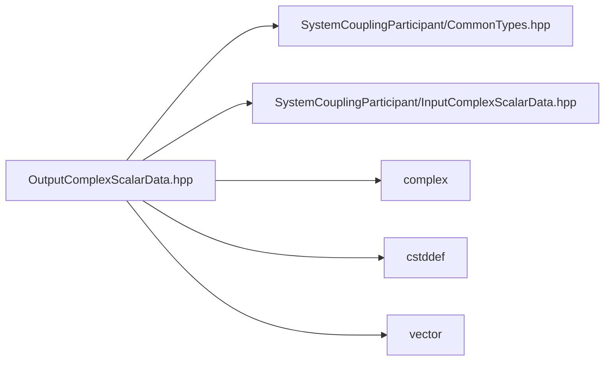

# File OutputComplexScalarData.hpp

![][C++]

**Location**: `OutputComplexScalarData.hpp`


## Classes

* [sysc::OutputComplexScalarData](structsysc_1_1OutputComplexScalarData.md#structsysc_1_1OutputComplexScalarData)

## Namespaces

* [sysc](namespacesysc.md#namespacesysc)

## Includes

* SystemCouplingParticipant/CommonTypes.hpp
* SystemCouplingParticipant/InputComplexScalarData.hpp
* <complex>
* <cstddef>
* <vector>





## Source


```cpp
/*
 * © 2025 ANSYS, Inc. Unauthorized use, distribution, or duplication is prohibited.
 */

#pragma once

#include "SystemCouplingParticipant/CommonTypes.hpp"
#include "SystemCouplingParticipant/InputComplexScalarData.hpp"

#include <complex>
#include <cstddef>
#include <vector>

namespace sysc {

struct OutputComplexScalarData {
public:
  OutputComplexScalarData(const double* dataComplex, std::size_t size) :
      m_data1(dataComplex),
      m_size(size) {}

  OutputComplexScalarData(
    const double* dataReal,
    const double* dataImaginary,
    std::size_t size) :
      m_isSplitComplex(true),
      m_data1(dataReal),
      m_data2(dataImaginary),
      m_size(size)
  {
  }

  OutputComplexScalarData(const float* dataComplex, std::size_t size) :
      m_dataType(PrimitiveType::Float),
      m_data1(dataComplex),
      m_size(size)
  {
  }

  OutputComplexScalarData(
    const float* dataReal,
    const float* dataImaginary,
    std::size_t size) :
      m_dataType(PrimitiveType::Float),
      m_isSplitComplex(true),
      m_data1(dataReal),
      m_data2(dataImaginary),
      m_size(size)
  {
  }

  OutputComplexScalarData(const std::complex<double>* dataComplex, std::size_t size) :
      OutputComplexScalarData(
        reinterpret_cast<const double* const>(
          dataComplex),
        size)
  {
  }

  OutputComplexScalarData(const std::vector<std::complex<double>>& dataComplex) :
      OutputComplexScalarData(dataComplex.data(), dataComplex.size())
  {
  }

  OutputComplexScalarData(
    const std::vector<double>& dataReal,
    const std::vector<double>& dataImaginary) :
      OutputComplexScalarData(
        dataReal.data(),
        dataImaginary.data(),
        dataReal.size())
  {
  }

  OutputComplexScalarData(const std::complex<float>* dataComplex, std::size_t size) :
      OutputComplexScalarData(
        reinterpret_cast<const float* const>(
          dataComplex),
        size)
  {
  }

  OutputComplexScalarData(const std::vector<std::complex<float>>& dataComplex) :
      OutputComplexScalarData(dataComplex.data(), dataComplex.size())
  {
  }

  OutputComplexScalarData(
    const std::vector<float>& dataReal,
    const std::vector<float>& dataImaginary) :
      OutputComplexScalarData(
        dataReal.data(),
        dataImaginary.data(),
        dataReal.size())
  {
  }

  OutputComplexScalarData() = default;

  OutputComplexScalarData(const OutputComplexScalarData&) = default;

  OutputComplexScalarData(OutputComplexScalarData&&) = default;

  OutputComplexScalarData& operator=(const OutputComplexScalarData&) = default;

  OutputComplexScalarData& operator=(OutputComplexScalarData&&) = default;

  OutputComplexScalarData(InputComplexScalarData icsd) :
      m_dataType(icsd.getDataType()),
      m_isSplitComplex(icsd.isSplitComplex()),
      m_data1(icsd.getData1()),
      m_data2(icsd.getData2()),
      m_size(icsd.size())
  {
  }

  std::size_t size() const noexcept { return m_size; }

  bool empty() const noexcept { return m_size == 0; }

  sysc::PrimitiveType getDataType() const noexcept { return m_dataType; }

  bool isSplitComplex() const noexcept { return m_isSplitComplex; }

  const void* getData1() const noexcept { return m_data1; }

  const void* getData2() const noexcept { return m_data2; }

private:
  sysc::PrimitiveType m_dataType{sysc::Double};
  bool m_isSplitComplex{false};

  const void* m_data1{nullptr};
  const void* m_data2{nullptr};

  std::size_t m_size{0};
};

}  // namespace sysc
```


[private]: https://img.shields.io/badge/-private-red (private)
[public]: https://img.shields.io/badge/-public-brightgreen (public)
[const]: https://img.shields.io/badge/-const-lightblue (const)
[C++]: https://img.shields.io/badge/language-C%2B%2B-blue (C++)