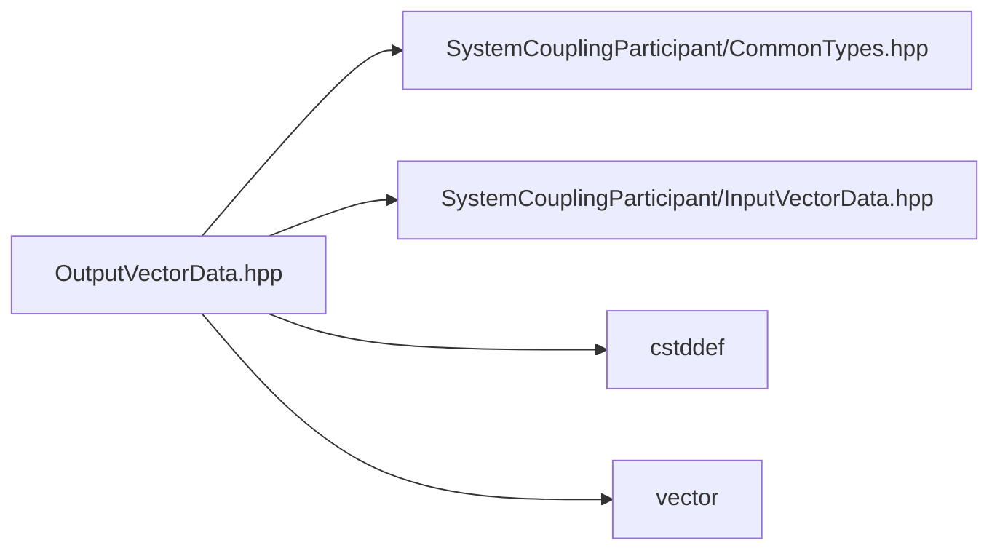

# File OutputVectorData.hpp

![][C++]

**Location**: `OutputVectorData.hpp`


## Classes

* [sysc::OutputVectorData](structsysc_1_1OutputVectorData.md#structsysc_1_1OutputVectorData)

## Namespaces

* [sysc](namespacesysc.md#namespacesysc)

## Includes

* SystemCouplingParticipant/CommonTypes.hpp
* SystemCouplingParticipant/InputVectorData.hpp
* <cstddef>
* <vector>





## Source


```cpp
/*
 * © 2025 ANSYS, Inc. Unauthorized use, distribution, or duplication is prohibited.
 */

#pragma once

#include "SystemCouplingParticipant/CommonTypes.hpp"
#include "SystemCouplingParticipant/InputVectorData.hpp"

#include <cstddef>
#include <vector>

namespace sysc {

struct OutputVectorData {
public:
  OutputVectorData(const double* data, std::size_t size, Dimension dimension) :
      m_data0(data),
      m_size(size),
      m_dimension(dimension)
  {
  }

  OutputVectorData(const double* data, std::size_t size) :
      OutputVectorData(data, size, Dimension::D3)
  {
  }

  OutputVectorData(const float* data, std::size_t size, Dimension dimension) :
      m_dataType(sysc::Float),
      m_data0(data),
      m_size(size),
      m_dimension(dimension)
  {
  }

  OutputVectorData(const float* data, std::size_t size) :
      OutputVectorData(data, size, Dimension::D3)
  {
  }

  OutputVectorData(const std::vector<double>& data, Dimension dimension) :
      OutputVectorData(data.data(), data.size() / getNumDimensions(dimension), dimension)
  {
  }

  OutputVectorData(const std::vector<double>& data) :
      OutputVectorData(data, Dimension::D3)
  {
  }

  OutputVectorData(const std::vector<float>& data, Dimension dimension) :
      OutputVectorData(data.data(), data.size() / getNumDimensions(dimension), dimension)
  {
  }

  OutputVectorData(const std::vector<float>& data) :
      OutputVectorData(data, Dimension::D3)
  {
  }

  OutputVectorData(
    const double* data0,
    const double* data1,
    const double* data2,
    std::size_t size) :
      m_isSplitVector(true),
      m_data0(data0),
      m_data1(data1),
      m_data2(data2),
      m_size(size)
  {
  }

  OutputVectorData(
    const double* data0,
    const double* data1,
    std::size_t size) :
      m_isSplitVector(true),
      m_data0(data0),
      m_data1(data1),
      m_size(size),
      m_dimension(Dimension::D2)
  {
  }

  OutputVectorData(
    const float* data0,
    const float* data1,
    const float* data2,
    std::size_t size) :
      m_dataType(PrimitiveType::Float),
      m_isSplitVector(true),
      m_data0(data0),
      m_data1(data1),
      m_data2(data2),
      m_size(size)
  {
  }

  OutputVectorData(
    const float* data0,
    const float* data1,
    std::size_t size) :
      m_dataType(PrimitiveType::Float),
      m_isSplitVector(true),
      m_data0(data0),
      m_data1(data1),
      m_size(size),
      m_dimension(Dimension::D2)
  {
  }

  OutputVectorData(
    const std::vector<double>& data0,
    const std::vector<double>& data1,
    const std::vector<double>& data2) :
      OutputVectorData(data0.data(), data1.data(), data2.data(), data0.size())
  {
    if (data0.size() != data1.size() || data0.size() != data2.size()) {
      std::string msg = "OutputVectorData constructor: ";
      msg += "not all STL vectors are of the same size.";
      throw std::runtime_error(msg);
    }
  }

  OutputVectorData(
    const std::vector<double>& data0,
    const std::vector<double>& data1) :
      OutputVectorData(data0.data(), data1.data(), data0.size())
  {
    if (data0.size() != data1.size()) {
      std::string msg = "OutputVectorData constructor: ";
      msg += "not all STL vectors are of the same size.";
      throw std::runtime_error(msg);
    }
  }

  OutputVectorData(
    const std::vector<float>& data0,
    const std::vector<float>& data1,
    const std::vector<float>& data2) :
      OutputVectorData(data0.data(), data1.data(), data2.data(), data0.size())
  {
    if (data0.size() != data1.size() || data0.size() != data2.size()) {
      std::string msg = "OutputVectorData constructor: ";
      msg += "not all STL vectors are of the same size.";
      throw std::runtime_error(msg);
    }
  }

  OutputVectorData(
    const std::vector<float>& data0,
    const std::vector<float>& data1) :
      OutputVectorData(data0.data(), data1.data(), data0.size())
  {
    if (data0.size() != data1.size()) {
      std::string msg = "OutputVectorData constructor: ";
      msg += "not all STL vectors are of the same size.";
      throw std::runtime_error(msg);
    }
  }

  OutputVectorData(InputVectorData data) :
      m_dataType(data.getDataType()),
      m_isSplitVector(data.isSplitVector()),
      m_data0(data.getData0()),
      m_data1(data.getData1()),
      m_data2(data.getData2()),
      m_size(data.size()),
      m_dimension(data.getDimension())
  {
  }

  OutputVectorData() = default;

  OutputVectorData(const OutputVectorData&) = default;

  OutputVectorData(OutputVectorData&&) = default;

  OutputVectorData& operator=(const OutputVectorData&) = default;

  OutputVectorData& operator=(OutputVectorData&&) = default;

  std::size_t size() const noexcept { return m_size; }

  bool empty() const noexcept { return m_size == 0; }

  sysc::PrimitiveType getDataType() const noexcept { return m_dataType; }

  bool isSplitVector() const noexcept { return m_isSplitVector; }

  const void* getData0() const noexcept { return m_data0; }

  const void* getData1() const noexcept { return m_data1; }

  const void* getData2() const noexcept { return m_data2; }

  Dimension getDimension() const noexcept { return m_dimension; }

private:
  sysc::PrimitiveType m_dataType{sysc::Double};
  bool m_isSplitVector{false};
  const void* m_data0{nullptr};
  const void* m_data1{nullptr};
  const void* m_data2{nullptr};
  std::size_t m_size{0};
  Dimension m_dimension{Dimension::D3};
};

}  // namespace sysc
```


[private]: https://img.shields.io/badge/-private-red (private)
[public]: https://img.shields.io/badge/-public-brightgreen (public)
[const]: https://img.shields.io/badge/-const-lightblue (const)
[C++]: https://img.shields.io/badge/language-C%2B%2B-blue (C++)