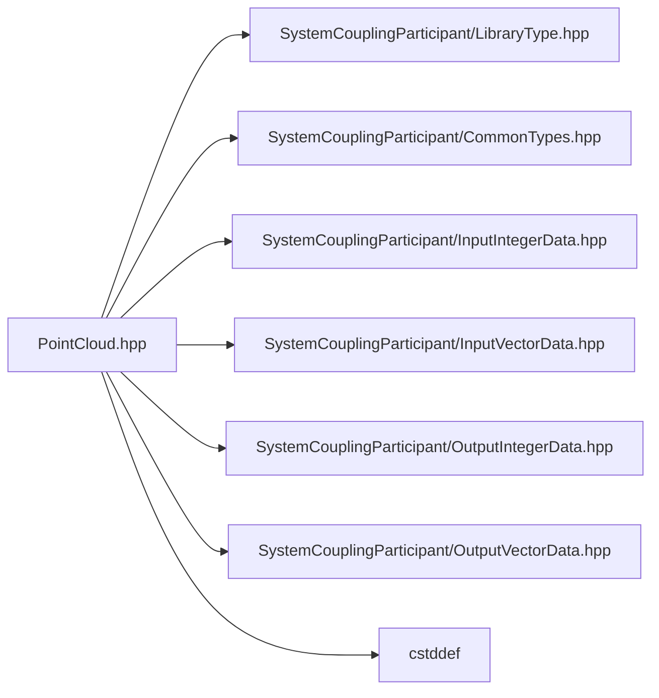

# File PointCloud.hpp

![][C++]

**Location**: `PointCloud.hpp`


## Classes

* [sysc::InputPointCloud](structsysc_1_1InputPointCloud.md#structsysc_1_1InputPointCloud)
* [sysc::PointCloud](classsysc_1_1PointCloud.md#classsysc_1_1PointCloud)

## Namespaces

* [sysc](namespacesysc.md#namespacesysc)

## Includes

* SystemCouplingParticipant/LibraryType.hpp
* SystemCouplingParticipant/CommonTypes.hpp
* SystemCouplingParticipant/InputIntegerData.hpp
* SystemCouplingParticipant/InputVectorData.hpp
* SystemCouplingParticipant/OutputIntegerData.hpp
* SystemCouplingParticipant/OutputVectorData.hpp
* <cstddef>





## Source


```cpp
/*
 * Copyright ANSYS, Inc. Unauthorized use, distribution, or duplication is prohibited.
 */

#pragma once

#include "SystemCouplingParticipant/LibraryType.hpp"

#include "SystemCouplingParticipant/CommonTypes.hpp"
#include "SystemCouplingParticipant/InputIntegerData.hpp"
#include "SystemCouplingParticipant/InputVectorData.hpp"
#include "SystemCouplingParticipant/OutputIntegerData.hpp"
#include "SystemCouplingParticipant/OutputVectorData.hpp"

#include <cstddef>

namespace sysc {

struct InputPointCloud {
public:
  InputPointCloud(
    InputIntegerData nodeIds,
    InputVectorData nodeCoords) :
      nodeIds(nodeIds),
      nodeCoords(nodeCoords) {}

  InputPointCloud() = default;

  InputPointCloud(const InputPointCloud&) = default;

  InputPointCloud(InputPointCloud&&) = default;

  InputPointCloud& operator=(const InputPointCloud&) = default;

  InputPointCloud& operator=(InputPointCloud&&) = default;

  std::size_t getNumNodes() const noexcept
  {
    return nodeCoords.size();
  }

  std::size_t size() const noexcept
  {
    return getNumNodes();
  }

  InputIntegerData nodeIds;
  InputVectorData nodeCoords;
};

class SYSTEM_COUPLING_PARTICIPANT_DLL PointCloud {
public:
  std::int64_t connectivityStamp{0};

  std::int64_t coordinatesStamp{0};

  std::int64_t partitioningStamp{0};

  PointCloud(InputPointCloud);

  PointCloud(
    OutputIntegerData nodeIds,
    OutputVectorData nodeCoords);

  PointCloud() = default;

  PointCloud(const PointCloud&) = default;

  PointCloud(PointCloud&&) = default;

  PointCloud& operator=(const PointCloud&) = default;

  PointCloud& operator=(PointCloud&&) = default;

  std::size_t getNumNodes() const noexcept;

  OutputIntegerData getNodeIds() const;

  OutputVectorData getNodeCoords() const;

  ValidityStatus checkValidity() const;

  std::size_t size() const noexcept
  {
    return getNumNodes();
  }

private:
  OutputIntegerData m_nodeIds;
  OutputVectorData m_nodeCoords;
};

}  // namespace sysc
```


[private]: https://img.shields.io/badge/-private-red (private)
[public]: https://img.shields.io/badge/-public-brightgreen (public)
[const]: https://img.shields.io/badge/-const-lightblue (const)
[C++]: https://img.shields.io/badge/language-C%2B%2B-blue (C++)
[Markdown]: https://img.shields.io/badge/language-Markdown-blue (Markdown)