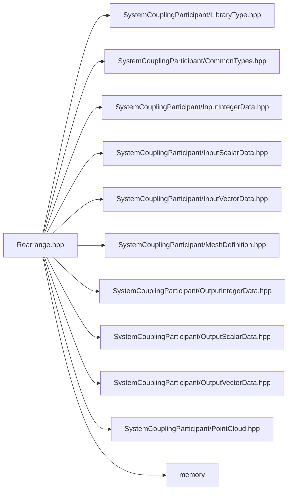

# File Rearrange.hpp

![][C++]

**Location**: `Rearrange.hpp`


## Namespaces

* [sysc](namespacesysc.md#namespacesysc)

## Includes

* SystemCouplingParticipant/LibraryType.hpp
* SystemCouplingParticipant/CommonTypes.hpp
* SystemCouplingParticipant/InputIntegerData.hpp
* SystemCouplingParticipant/InputScalarData.hpp
* SystemCouplingParticipant/InputVectorData.hpp
* SystemCouplingParticipant/MeshDefinition.hpp
* SystemCouplingParticipant/OutputIntegerData.hpp
* SystemCouplingParticipant/OutputScalarData.hpp
* SystemCouplingParticipant/OutputVectorData.hpp
* SystemCouplingParticipant/PointCloud.hpp
* <memory>





## Source


```cpp
/*
* Copyright ANSYS, Inc. Unauthorized use, distribution, or duplication is prohibited.
*/

#pragma once

#include "SystemCouplingParticipant/LibraryType.hpp"

#include "SystemCouplingParticipant/CommonTypes.hpp"
#include "SystemCouplingParticipant/InputIntegerData.hpp"
#include "SystemCouplingParticipant/InputScalarData.hpp"
#include "SystemCouplingParticipant/InputVectorData.hpp"
#include "SystemCouplingParticipant/MeshDefinition.hpp"
#include "SystemCouplingParticipant/OutputIntegerData.hpp"
#include "SystemCouplingParticipant/OutputScalarData.hpp"
#include "SystemCouplingParticipant/OutputVectorData.hpp"
#include "SystemCouplingParticipant/PointCloud.hpp"

#include <memory>

namespace sysc {

// ================================

void SYSTEM_COUPLING_PARTICIPANT_DLL rearrange(
  OutputScalarData source, InputScalarData target);

void SYSTEM_COUPLING_PARTICIPANT_DLL rearrange(
  OutputVectorData source, InputVectorData target);

void SYSTEM_COUPLING_PARTICIPANT_DLL rearrange(
  OutputIntegerData source, InputIntegerData target);

void SYSTEM_COUPLING_PARTICIPANT_DLL rearrange(NodeData source, InputNodeData target);

void SYSTEM_COUPLING_PARTICIPANT_DLL rearrange(FaceData source, InputFaceData target);

void SYSTEM_COUPLING_PARTICIPANT_DLL rearrange(CellData source, InputCellData target);

void SYSTEM_COUPLING_PARTICIPANT_DLL rearrange(PointCloud source, InputPointCloud target);

}  // namespace sysc
```


[private]: https://img.shields.io/badge/-private-red (private)
[public]: https://img.shields.io/badge/-public-brightgreen (public)
[const]: https://img.shields.io/badge/-const-lightblue (const)
[C++]: https://img.shields.io/badge/language-C%2B%2B-blue (C++)