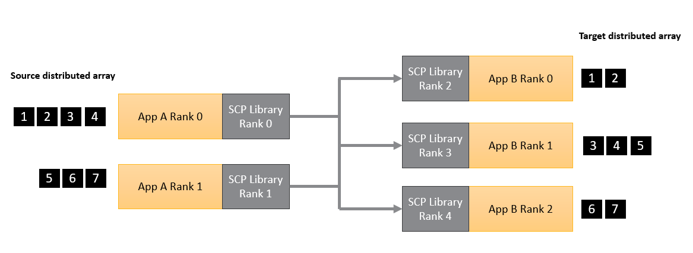

# Data transfers

## Steps to perform data transfers

This section describes how to transfer data between applications using SCP library.
It also provides simple APIs implementation examples, so it can be used to familiarize
with the basic participant library concepts.

### Step 1: Start

Start by initializing the participant library in standalone mode.

If using C++ or Python languages, this step involves instantiating
the `SystemCoupling` class (there can only be a single instance
of this class at a time) after providing the `ParticipantInfo`
structure with appropriate value set correctly.

If using C or Fortran languages, in
most cases nothing needs to be done for this step.
However, if distributed parallel capabilities of the SCP are required,
then `syscStartStandaloneParallel` function
in C or `syscStartStandaloneF` function in Fortran must be called
and appropriate arguments (for example, the MPI communicator) should be provided to those functions.

See [Execution in a parallel environment](parallel-execution.md) for more details.

#### Data transfers across multiple applications

SCP library provides the ability to perform data transfers between multiple
(possibly distributed parallel) applications. If such functionality
is required, additional steps should be performed first.

The initial handshaking between the applications must be first established to allow for the
exchange of data between multiple processes. This is done by designating
one of the processes as the global root process. The global root process
must create a remote server using `sysc::createRootServer()` function.
The remaining processes would need to connect to the global root server
using host and port information returned from that function. On non-root processes,
this information is set in the `sysc::ParticipantInfo` structure (`scHost` and `scPort`
members). On the root process, the total number of applications must be set
in the `sysc::ParticipantInfo` structure (`numApps` member).
Once the values in the ParticipantInfo structure are assigned, the
structure should be passed into the constructor of the `sysc::SystemCoupling` class.
The connections will be established automatically during the constructor.
Once this is done, Step 1 is complete.

### Step 2: Transfer the data

Currently, the data that can be transferred can be integer, scalar, or vector arrays,
as well as point clouds. The global ordering of the data cannot change, but the desired
parallel distribution between processes can be specified as needed. For example, it is
possible to transfer a distributed parallel array from one parallel application 
on N ranks, to another parallel application on M ranks (where N and M are positive integers).

In order to perform the data transfer, use `rearrange` function and provide a
heavyweight data via one of the supported heavyweight data structures, which are 
described in the following sections:

- [Access to heavyweight data](user-guide/heavyweight-data-access.md)
- [Mesh and point cloud data access](user-guide/mesh-data-access.md)

## Data transfer example

Sample code is provided, demonstrating the use of the participant
library APIs to perform data transfers.

For information on how to compile the code in this example,
see [Compiling, linking, and executing applications that use the Participant library](compiling-linking-executing.md).

### Transfer of data between two parallel applications

In this example, a distributed parallel array of integers is transferred
from an MPI application running on 2 processes to an MPI application running on 3 processes.

Figure 1 illustrates the problem setup.

  
_Figure 1: Simple data transfer example_

#### C++

```cpp
#include "SystemCouplingParticipant/SystemCoupling.hpp"
#include "mpi.h"
#include <vector>
#include <iostream>

// Main function.
int main(int argc, char* argv[])
{
  // Hard-code host and port
  std::string host = "localhost";
  unsigned short port = 55201;

  // Initialize mpi
  int myMpiRank = 0;
  int numMpiRanks = 1;
  MPI_Init(&argc, &argv);
  MPI_Comm_rank(MPI_COMM_WORLD, &myMpiRank);
  MPI_Comm_size(MPI_COMM_WORLD, &numMpiRanks);

  // assume numMpiRanks is 2 for sender and 3 for receiver
  bool iAmSender = numMpiRanks == 2;

  // create server on root rank of the sender and print host and port
  if (iAmSender && myMpiRank == 0) {
    const auto createdHostAndPort = sysc::createRootServer(host, port);
    std::cout << "Host: " << createdHostAndPort.host << std::endl;
    std::cout << "Port: " << createdHostAndPort.port << std::endl;
  }

  // Start.
  sysc::ParticipantInfo participantInfo;
  if (iAmSender) {
    participantInfo.numApps = 2;
  }
  else {
    participantInfo.scPort = port;
    participantInfo.scHost = host;
  }

  // This will establish connection between the two apps.
  const sysc::SystemCoupling sc(participantInfo, MPI_COMM_WORLD);

  const int myScpRank = sysc::getMyRank();
  if (iAmSender) {
    std::cout << "Sender. MPI rank " << myMpiRank << ", SCP rank " << myScpRank << std::endl;
  }
  else {
    std::cout << "Receiver. MPI rank " << myMpiRank << ", SCP rank " << myScpRank << std::endl;
  }

  std::vector<int> sourceArray;
  std::vector<int> targetArray;
  if (iAmSender && myMpiRank == 0) {
    sourceArray = {1, 2, 3, 4};
  }
  else if (iAmSender && myMpiRank == 1) {
    sourceArray = {5, 6, 7};
  }
  else if (!iAmSender && myMpiRank == 0) {
    targetArray.resize(2);
  }
  else if (!iAmSender && myMpiRank == 1) {
    targetArray.resize(3);
  }
  else if (!iAmSender && myMpiRank == 2) {
    targetArray.resize(2);
  }

  // Transfer the data using rearrange function
  sysc::rearrange(
    sysc::OutputIntegerData(sourceArray),
    sysc::InputIntegerData(targetArray));

  if (!iAmSender) {
    std::cout << "Target values on rank " << myMpiRank << ": ";
    for (const auto value : targetArray) {
      std::cout << value << ", ";
    }
    std::cout << std::endl;
  }

  MPI_Finalize();

  return EXIT_SUCCESS;
}
```

#### Python

In this Python example, we use 5 serial Python apps.
We use SCP ranks to determine which process is the sender (ranks 0, 1),
and which one is the receiver (ranks 2, 3, and 4).
We also need a special command line argument to mark the root rank.

```python
import ansys.systemcoupling.partlib as scp
import argparse
import numpy as np

# Hard-code host and port
host = "localhost"
port = 55201

# Root app only should have `--numapps 5` argument passed in.
parser = argparse.ArgumentParser()
parser.add_argument("--numapps", type=int, default=-1)
args = parser.parse_args()

if args.numapps == 5:
    createdHostAndPort = scp.createRootServer(host, port)
    print(f"Host: {createdHostAndPort.host}")
    print(f"Port: {createdHostAndPort.port}")

# Start.
participantInfo = scp.ParticipantInfo()
if args.numapps == 5:
    participantInfo.numApps = 5
else:
    participantInfo.scPort = port
    participantInfo.scHost = host

# This will establish connection between the two apps.
sc = scp.SystemCoupling(participantInfo)

myScpRank = scp.getMyRank()
iAmSender = myScpRank in {0, 1}
if iAmSender:
    print(f"Sender. SCP rank {myScpRank}")
else:
    print(f"Receiver. SCP rank {myScpRank}")

sourceArray = np.array([], dtype=np.int32)
targetArray = np.array([], dtype=np.int32)
if myScpRank == 0: sourceArray = np.array([1,2,3,4], dtype=np.int32)
elif myScpRank == 1: sourceArray = np.array([5,6,7], dtype=np.int32)
elif myScpRank == 2: targetArray = np.array([0,0], dtype=np.int32)
elif myScpRank == 3: targetArray = np.array([0,0,0], dtype=np.int32)
elif myScpRank == 4: targetArray = np.array([0,0], dtype=np.int32)

# Transfer the data using rearrange function.
scp.rearrange(scp.OutputIntegerData(sourceArray), scp.InputIntegerData(targetArray))

if not iAmSender:
    print(f"Target values on rank {myScpRank}: {targetArray}")

```
