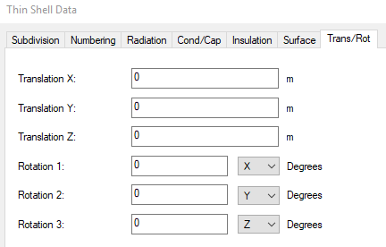

# Create and position finite-difference surfaces and solids

You can use OpenTD to create Finite Difference (FD) surfaces and solids, and other geometric entities. When working with geometric entities in OpenTD, you will use two class members to position and orient objects:

**BaseTrans**: This Matrix3d represents the position and orientation of the entity’s local coordinate system relative to the AutoCAD World Coordinate System (WCS). Modifying this member is equivalent to using AutoCAD commands such as MOVE or ROTATE3D to position and orient the entity.

**LocalTrans**: This *Transformation* represents the position and orientation of the entity relative to its local coordinate system. Modifying this member is equivalent to editing the “Trans/Rot” tab in the GUI:



 Here is a program that demonstrates creating FD entities and positioning them using BaseTrans and LocalTrans:

```c#
using OpenTD;
namespace OpenTDGettingStarted
{
    class PositionFiniteDifference
    {
        public static void Main(string[] args)
        {
            var td = new ThermalDesktop();
            td.Connect();

            // create a rectangle and position it using BaseTrans,
            // which is equivalent to moving and rotating it using
            // AutoCAD commands
            var rect = td.CreateRectangle();
            rect.TopStartSubmodel = "plate";
            rect.TopStartId = 1;
            rect.XMax = 1.1;
            rect.YMax = 2.1;
            rect.BreakdownU.Num = 10;
            rect.BreakdownV.Num = 20;
            rect.BaseTrans.SetToRotX(30);
            rect.BaseTrans.SetOrigin(new Point3d(0, 0, 1));
            rect.Update();

            // create an FD solid brick and position it using LocalTrans,
            // which is equivalent to moving and rotating it using
            // the TD Trans/Rot tab
            var fdBrick = td.CreateSolidBrick();
            fdBrick.StartSubmodel = "brick";
            fdBrick.StartId = 1;
            fdBrick.XMax = 0.19;
            fdBrick.YMax = 0.31;
            fdBrick.ZMax = 0.50;
            fdBrick.BreakdownU.Num = 2;
            fdBrick.BreakdownV.Num = 3;
            fdBrick.BreakdownW.Num = 5;
            fdBrick.LocalTrans.Tx = 0.5;
            fdBrick.LocalTrans.Ty = 1.0;
            fdBrick.LocalTrans.Tz = 0.5;
            fdBrick.LocalTrans.Axis1 = 2; // rotate about z
            fdBrick.LocalTrans.Rot1 = 30; // rotate 30 deg about z
            fdBrick.Update();

            // control view
            td.SetVisualStyle(VisualStyles.THERMAL_PP);
            td.RestoreIsoView(IsoViews.NE);
        }
    }
}
```
