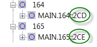

# Create nodes and a conductor

This program demonstrates how to create two nodes and connect them with a conductor. To try it, create a .NET Framework C# console application that references OpenTD, add the following code, then compile and run it.

```c#
using OpenTD;
namespace OpenTDGettingStarted
{
    class CreateNodesAndConductors
    {
        public static void Main(string[] args)
        {
            var td = new ThermalDesktop();
            td.Connect();
            var n1 = td.CreateNode();
            n1.Submodel = "bar";
            n1.Id = 100;
            n1.Update();
            var n2 = td.CreateNode();
            n2.Submodel = "bar";
            n2.Id = 110;
            n2.Origin = new Point3d(1, 1, 0);
            n2.Update();
            var c = td.CreateConductor(n1, n2);
            c.Submodel = "bar";
            c.Value = 10;
            c.Update();
        }
    }
}
```

How did this program work? After starting a new instance of TD, we created two `Node` objects, `n1` and `n2`, using the`CreateNode()` method.

When TD created each node, it set the `Node.Handle` property to a unique identifier, the same string you may have noticed in the TD Model Browser:



Since TD allows duplicate SINDA names for some entities, OpenTD uses AutoCAD *handles* to identify most entities uniquely. (See the [Work with connections, handles, markers, and domains section](./connections-handles-markers-domains.md) for a detailed discussion of handles and related concepts.)

Next, we called the `CreateConductor` method. This method accepts two `Connections` representing the nodes connected to the conductor. Each Connection consists of a handle and a `marker`. As mentioned above, a handle is a unique identifier for a TD entity. A marker is an integer that determines how something is connected such as Top or XMAX. (See the [Work with connections, handles, markers, and domains](./connections-handles-markers-domains.md) section)

When we called CreateConductor, we simply passed it our two nodes, n1 and n2. OpenTD knows how to implicitly create new Connections from Nodes by reading the `Node.Handle` property and assuming a default value for the`Connection.Marker` property, which is fine because node connections do not use markers. (See the [Execute TD COM commands](./../extras.md#execute-td-com-commands) section for a discussion of implicit casting.)
