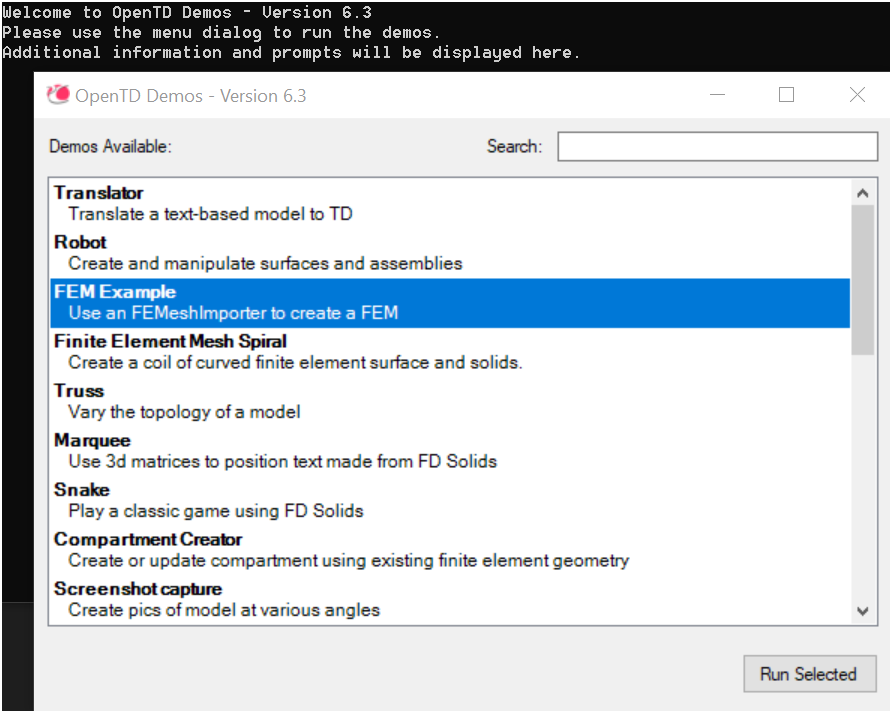

# Further reading

- The Thermal Desktop section of the Ansys Developer Portal includes the OpenTD Class Reference. This contains a complete list of all public types, members, and methods in OpenTD. 

- The TD user forum ([http://www.crtech.com/forum](http://www.crtech.com/forum)) contains more OpenTD demos, written in C#, MATLAB, and Python. Two boards are especially useful:

- Software Usage->Tutorials->OpenTD contains a post called OpenTD Demos that contains a Visual Studio project that demonstrates many more features of OpenTD:

- Software Usage->Product-specific Discussions->OpenTD is a place to ask and answer questions about OpenTD. There are dozens of discussions, covering many aspects of OpenTD usage.
