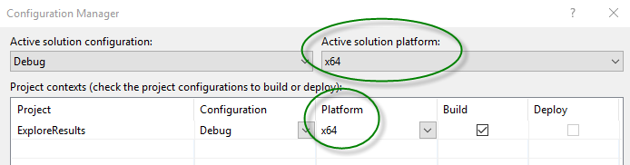
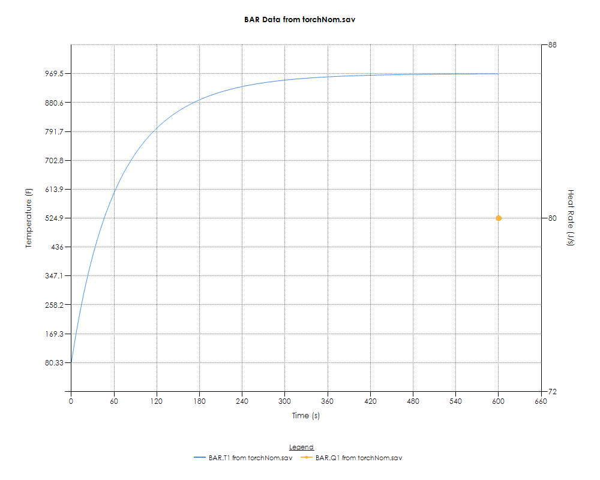

# Reading results

OpenTD offers two ways to work with solution results:

1. You can work directly with save files, CSR’s and other data files. You can create XY plots and tables, or you can simply get the data into memory for further manipulation.
2. You can create and modify contour plots and other post-processing output within a TD instance.

    The following examples will show how to use both methods.

## Work directly with results using OpenTD.Results

The classes for working directly with save files, CSR’s or other solution results are found within the *OpenTD.Results* namespace, packaged within the OpenTD.Results.dll assembly. The following section describes how to set up a .NET project to access this assembly.

### Before using OpenTD.Results

To use OpenTD to explore results directly (rather than via an instance of TD), you will need to add a reference to the OpenTD.Results.dll assembly. For .NET 4.8, you can find it in the GAC in the 64-bit directory. (Try looking under C:\\Windows\\Microsoft.ET\\assembly\\GAC_64\\OpenTD.Results.) For .NET 8, you can find it in the Thermal Desktop installation directory. You will also probably need to add a reference to OpenTD.dll, as usual. [See the Hello World](creating-td-model/hello-world.md)
Since OpenTD.Results is a 64-bit assembly, your project will also have to be 64-bit. In Visual Studio, use the Configuration manager to create a 64-bit solution and a 64-bit project. When set up correctly, your Configuration Manager dialog should look something like this:


### The basics

OpenTD offers powerful tools for manipulating solution results, but it is a lot to learn all at once. This section shows how to imply get some data out of a dataset (a save file, CSR, or CSR.saveX file).
First, reference the OpenTD.Results dll as discussed above. Next, add a using statement for convenience:

using OpenTD.Results.Dataset;

Now you can connect to a dataset:

```c#
var myData = new DatasetFactory.Load(@”path\to\dataset”);
```

To get, for example, all temperatures from a couple of nodes, pass their SINDA/FLUINT names to the *IDataset*.*GetData* method and call *GetValues(UnitsData u)* on the result:

```c#
var someNodeTs = myData.GetData(“WALL.T10”, “WALL.T11”).GetValues(Units.SI);
```

This will return a list containing two inner lists of node temperatures in SI units, one for each node. Note that if you request data for just one entity, it will still be returned as a list of lists. For example, the following returns a list containing a single list of flowrates for path “FLOW.60”:

```c#
var onePathFRs = myData.GetData(“FLOW.FR60”).GetValues(Units.SI);
```

To get the data in other units, you can pass an appropriate *UnitsData* object to GetValues, for example:

```c#
var someNodeTsEng = myData.GetData(“WALL.T10”, “WALL.T11”).GetValues(Units.Eng);
```

GetData will accept arbitrary-length lists of SINDA/FLUINT names of any type. They can even include registers:

```c#
var disparateData = myData.GetData(
“WALL.T10”, “FLOW.PL100”, “VALVE_POS”, “ROOM.T1”).GetValues(Units.SI);
```

In this case, GetData will assume that “VALVE_POS” is a dimensionless register and return the raw values from the save/CSR. This behavior can be modified, as discussed in the [Work with groups in results data](#work-with-groups-in-results-data) section.

You can construct an array of strings to pass to GetData. For example, to get temperatures for nodes “MAIN.1” through “MAIN.100”, inclusive:

```c#
string[] someNames = new string[100];
for (int i = 0; i < 100; ++i)
    someNames[i] = "MAIN.T" + (i + 1);
var someTs = myData.GetData(someNames).GetValues(Units.SI);
```

Please note that there are special classes that help to construct lists of entities representing SINDA/FLUINT and TD groups such as submodels and domains. These are introduced in the [Advanced results manipulation and XY plots](#advanced-results-manipulation-and-xy-plots) section and discussed in detail in the [Work with groups in results data](#work-with-groups-in-results-data) section.

In the examples above, we have extracted ‘T’, ‘PL’, and ‘FR’ data. Please examine the values of the StandardDataSubtypes enum to see all strings recognized by GetData. It also recognizes names that require fluid constituent letters, such as ‘GTW’. StandardDataSubtypes are discussed in Sections [Work with groups in results data](#work-with-groups-in-results-data) and [A note on DataSubtypes](#a-note-on-datasubtypes).

To get TIMEN from a dataset, use:

```c#
var times = myData.GetTimes().GetValues();
```

This returns a list of times in the current WorkingUnits.

### Advanced results manipulation and XY plots

The previous section showed how to easily get data out of save files or CSR’s. In this and the following sections we will show how to manipulate that data, work with groups and multiple datasets, combine data in arbitrarily complex ways, and create simple XY plots.

Compared to previous methods for extracting and plotting SINDA/FLUINT data, OpenTD offers several improvements:

- The *IDataset* interface and abstract *Dataset* class provide a common syntax for extracting data from save files, CSR’s, and other sources. You can use several implementations of Dataset:

  - *SaveFile*
  - *CSR*
  - *SpreadsheetDataFile*
  - *TextTransientFile*

- Data is returned from Datasets via *DataArrays*. In addition to containing the data (T’s, Q’s, and more), DataArrays know their physical dimension, their units, and contain a reference back to their source Dataset.

- If data is missing from a record, it is expressed in DataArrays as NaN. This happens, for example, when register values are only written to a transient dataset for the beginning and end records.

- *ItemIdentifiers* are used to identify items, such as “MAIN.1” or “FLOW.100”.

- *ItemIdentifierCollections* can be constructed based on submodels, domains, or arbitrary lists.

- The *DataSubtype* class describes things like T, Q, TL, GTW, etc. Standard DataSubtypes can be created using the *StandardDataSubtypes* enum or the *FullStandardDataSubtype* struct. (The FullStandardDataSubtype struct is required to describe subtypes that contain a fluid constituent, like GTW.) Custom DataSubtypes can also be created.

- *DataItemIdentifiers* combine ItemIdentifiers and DataSubtypes. They are used to identify data from items, such as “MAIN.T1”, “FLOW.TL100”, or “FLOW.GTW100”.

- *DataItemIdentifierCollections* can be constructed by combining ItemIdentifierCollections with DataSubtypes, or from arbitrary lists.

- *DerivedDatasets* are Datasets that contain references to multiple Datasets and operate on them to return data. Because DerivedDatasets are also Datasets, they can be used anywhere Datasets can be used -- even as input to other DerivedDatasets -- so you can chain them together in arbitrarily complex ways. You can extend the DerivedDataset class to create your own, or use the following pre-defined DerivedDatasets:

  - *ConcatenatedDataset* takes a list of input Datasets and stitches their data together.
  - *DatasetSlice* takes a single Dataset and only returns data between given start and end times.

- *DerivedDataArrays* are like DerivedDatasets but for DataArrays. They contain a list of input DataArrays and operate on them to return data. Just like DerivedDatasets, DerivedDataArrays can be chained together in arbitrarily complex ways, and you can create your own by extending the DerivedDataArray class or use the following pre-defined DerivedDataArrays:

  - *AverageDataArray* returns the arithmetic mean of its input arrays at each record.
  - *ForumlaDataArray* operates on each record of its input arrays using a provided formula, in the units provided.
  - *MaxDataArray* returns the maximum value of its input arrays at each record.
  - *MinDataArray* returns the minimum value of its input arrays at each record.
  - *SelectMaxDataArray* returns the input array with the maximum value.
  - *SelectMinDataArray* returns the input array with the minimum value.
  - *SumDataArray* returns the sum of its input arrays at each record.
  - *WeightedAverageDataArray* returns a weighted average of its input arrays at each record. The weighting factors can be fixed or change with each record. There are helpful constructors to make it easy to, for example, determine mCp-weighted temperatures.

- Plots are intelligent:

  - They automatically put series with different dimensions on different axes.
  - They automatically name themselves and series.
  - They automatically label axes with dimensions and units. (They default to the WorkingUnits at the time they are first created.)
  - NaN’s are displayed as a discontinuity in the series. Series with discontinuities (or steady-state series with only one record) are automatically displayed with markers and lines.
  - All the above can be customized.

In this program, we will make use of the “torchNom.sav” and “torchCold.sav” files created in the [Create and run a case](working-with-case-sets.md#create-and-run-a-case) section, so please run that program and locate the two save files.

Once Visual Studio is set up with a 64-bit solution and project ([Before using OpenTD.Results](#before-using-OpenTDresults) section), and you have added references to OpenTD.dll and OpenTD.Results.dll, you will be ready to try the following program.

```c#
using System;
using OpenTD;
using OpenTD.Results.Dataset;
using OpenTD.Results.Plot;

Namespace OpenTDGettingStarted
{
    class ExploreAndPlotResults
    {
        static void Main(string[] args)
        {
            // A Dataset is an abstract class representing solution
            // results. You can create a Dataset from a save file,
            // a CSR, a text file, or from a combination of other
            // Datasets. Let's open the torch save files created
            // in the "Create and Run a Case" example.
            // You may have to change the paths to your copies of
            // torchNom.sav and torchCold.sav.
            var torchNom = DatasetFactory.Load(@"c:\\temp\\OpenTDCreateAndRunCase\\torchNom.sav");
            var torchCold = DatasetFactory.Load(@"c:\\temp\\OpenTDCreateAndRunCase\\torchCold.sav");

            // Data is returned as DataArrays or DataArrayCollections,
            // which know their physical dimension, their source, and
            // how to return their values in any unit system.
            DataArrayCollection someTemps = torchNom.GetData("BAR.T1", "BAR.T2");

            // DataArray.GetValues returns data in current WorkingUnits
            Units.WorkingUnits.SetToSI();
            Console.WriteLine("BAR.T1 at first time in K: " + someTemps[0].GetValues()[0].ToString());

            Units.WorkingUnits.temp = UnitsData.Temp.F;
            Console.WriteLine("BAR.T1 at first time in deg F: " + someTemps[0].GetValues()[0].ToString());

            // You can plot data using a SimplePlot:
            var plotSomeTemps = new SimplePlot();
            plotSomeTemps.AddSeries(someTemps);
            plotSomeTemps.Show();
            // Note that AddSeries accepted a DataArrayCollection. Since
            // each DataArray has a reference to its Dataset, AddSeries is
            // able to go and get the time array for X data.

            // Let's make a plot with different types of data:
            var TandQ = torchNom.GetData("BAR.T1", "BAR.Q1");
            var TandQPlot = new SimplePlot();
            TandQPlot.AddSeries(TandQ);
            TandQPlot.Show();
            // Note that since we only saved Q data to the sav
            // file for the final record, it is shown as a point.

            // Let's plot temperatures for all BAR nodes from both datasets.
            // To do this, we're going to use an ItemIdentifierCollection to
            // identify all of the BAR nodes.
            var barNodes = new ItemIdentifierCollection(DataTypes.NODE, "BAR", torchNom);
            var barTsNom = torchNom.GetData(barNodes, StandardDataSubtypes.T);
            var barTsCold = torchCold.GetData(barNodes, StandardDataSubtypes.T);
            var allBarNodesPlot = new SimplePlot();
            allBarNodesPlot.AddSeries(barTsNom);
            allBarNodesPlot.AddSeries(barTsCold);
            allBarNodesPlot.Show();

            // That was a lot of series on one plot. Let's plot the average
            // bar temps from each case instead. For this we'll use an
            // AverageDataArray, which is a type of DerivedDataArray.
            // DerivedDataArrays take a collection of DataArrays and
            // operate on it to produce a single DataArray.
            var avgTNom = new AverageDataArray(barTsNom);
            var avgTCold = new AverageDataArray(barTsCold);
            var avgPlot = new SimplePlot("Average bar T's");
            avgPlot.AddSeries(avgTNom);
            avgPlot.AddSeries(avgTCold);
            avgPlot.Show();

            // There are other types of DerivedDataArrays. Here we'll use
            // a SelectMaxDataArray to find the hottest node across both
            // datasets:
            var allTs = new DataArrayCollection();
            allTs.AddRange(barTsNom);
            allTs.AddRange(barTsCold);
            var maxT = new SelectMaxDataArray(allTs);
            var maxPlot = new SimplePlot("Hottest Node");
            maxPlot.AddSeries(maxT);
            maxPlot.AutoHideLegend = false;
            maxPlot.Show();
            // We set AutoHideLegend to false because SimplePlot will
            // normally hide the legend if there's only one series,
            // and use the series name as the title. Since we customized
            // the title, that wouldn't work here.

            // What if we're only interested in the first 400 s of the
            // cold case? We can use a DatasetSlice, which is a type of
            // DerivedDataset. DerivedDatasets are to Datasets what
            // DerivedDataArrays are to DataArrays.
            Units.WorkingUnits.time = UnitsData.Time.SEC;
            var coldCaseSlice = new DatasetSlice(torchCold, 0, 400);
            var bar2TCold400 = coldCaseSlice.GetData("BAR.T2");
            var slicePlot = new SimplePlot();
            slicePlot.AddSeries(bar2TCold400);
            slicePlot.Show();
            // Note that if there isn't a record at 400 s, DatasetSlice
            // will choose the next record.
        }
    }
}
```

If it runs correctly, you should see several *SimplePlot*-generated dialogs like the following. Instead of displaying them to the screen with SimplePlot.*Show()*, we could have used .*GetAsImage* or .*GetAsTable* to return objects that could be further manipulated in our program, or .*SaveAsImage* or .*SaveAsTable* to write image or csv files containing the data.



### Work with Groups in Results Data

The previous example provided an overview of using OpenTD to read and plot SINDA/FLUINT results. In the following example we will discuss ItemIdentifiers and DataItemIdentifiers, which allow you to specify groups of items, whether by submodel, domain, or arbitrary list.

Once again, we are using the OpenTD.Results dll, so create a 64-bit project as discussed in [Work directly with results using OpenTD.Results](#work-directly-with-results-using-OpenTDresults).

```C#
using System;
using System.IO;
using System.Collections.Generic;
using OpenTD;
using OpenTD.Results.Dataset;
using OpenTD.Results.Plot;

namespace OpenTDGettingStarted
{
    class WorkingWithGroups
    {
        public static void Main(string[] args)
        {
            // Let's open one of the torch save files from the
            // "Create and Run a Case" example.
            // You may need to change the workingDir string to the
            // dir containing torchNom.sav.
            string workingDir = @"c:\\temp\\OpenTDCreateAndRunCase";
            var data = DatasetFactory.Load(Path.Combine(workingDir, "torchNom.sav"));

            #region ItemIdentifiers
            // Use ItemIdentifiers to identify SINDA/FLUINT entities
            // like WALL.100, WATER.45, or MY_REGISTER.

            // You can create a collection of ItemIdentifiers from a submodel in a
            // Dataset:
            var allbarNodeNames = new ItemIdentifierCollection(DataTypes.NODE, "BAR", data);
            Console.WriteLine("\\nItemIdentifierCollection: BAR submodel:");
            foreach (var item in allbarNodeNames)
            {
                Console.WriteLine("{0} => Submodel = '{1}', Id = {2}",
                    item, item.Submodel, item.Id);
            }

            // You can create a collection of ItemIdentifiers representing the
            // nodes in a domain, but you need to supply a ThermalDesktop instance
            // to define the domain: (this example is commented out to avoid loading
            // a TD instance.)
            // var allSomeDomainNodes
            // = new ItemIdentifierCollection("SOME_DOMAIN", aTdInstance);

            // You can create arbitrary collections of ItemIdentifiers by supplying
            // a list of SINDA names:
            var arbitraryItems = new ItemIdentifierCollection(
                "MAIN.1",
                "FLOW.10",
                "MY_REGISTER");

            Console.WriteLine("\\nItemIdentifiers: arbitrary list:");
            foreach (var item in arbitraryItems)
            {
                Console.WriteLine("{0} => Sub = '{1}', Id = {2}, RegName = '{3}'",
                    item, item.Submodel, item.Id, item.RegisterName);
            }
            #endregion

            #region DataSubtypes
            // Use DataSubtypes to identify types of SINDA/FLUINT data,
            // like T, TL, GTW, etc.

            // You can create a new DataSubtype with the StandardDataSubtypes enum:
            var SubtypeT = new DataSubtype(StandardDataSubtypes.T);

            // For multispecies data, you can provide a StandardDataSubtypes
            // and a FluidConstituents enum...
            var SubtypeGTW = new DataSubtype(
                StandardDataSubtypes.GT, FluidConstituents.W);

            // ...or you can provide a FullStandardDataSubtypes struct,
            // which just contains a StandardDataSubtypes/FluidConstituents pair:
            var SubtypeGTW_alternate = new DataSubtype(new FullStandardDataSubtype(
                StandardDataSubtypes.GT, FluidConstituents.W));

            // You can also create your own DataSubtype, maybe for custom data
            // you're reading out of a text file:
            var SubtypeBoundaryLayerThickness = new DataSubtype(
                dimension: UnitsData.UnitsType.MODEL_LENGTH,
                isDimensionalOnlyIfPositive: false,
                description: "Boundary Layer Thickness for Phase B",
                baseSindaDesignator: null,
                dataType: DataTypes.PATH);

            // Through the magic of implicit casts, you can use a
            // StandardDataSubtypes or FullStandardDataSubtype anywhere
            // a DataSubtype is expected:
            var listOfDataSubtypes = new List<DataSubtype>() {
                StandardDataSubtypes.T,
                new FullStandardDataSubtype(StandardDataSubtypes.GT, FluidConstituents.W)
            };

            Console.WriteLine("\\nDataSubtypes: implicit casts to DataSubtype:");
            foreach (var item in listOfDataSubtypes)
            {
                Console.WriteLine(item);
            }
            #endregion

            #region Get data with DataSubtypes and ItemIdentifiers
            // Datasets can return data for multiple items if provided an
            // ItemIdentifierCollection and a DataSubtype:
            var allBarNodeTs = data.GetData(allbarNodeNames, StandardDataSubtypes.T);

            Console.WriteLine("\\nGet data with DataSubtypes and ItemIdentifiers:\\n" +
                "DataArrayCollection.Name: {0}\\n.Count: {1}\\n.DataItemCount: {2}",
                allBarNodeTs.Name, allBarNodeTs.Count, allBarNodeTs.DataItemCount);
            #endregion

            #region DataItemIdentifiers
            // Use DataItemIdentifiers to identify SINDA/FLUINT entities like
            // WALL.T100, WATER.TL45, or "MY_REGISTER temperature".
            // They combine ItemIdentifiers and DataSubtypes.
            // You can create DataItemIdentifiers from ItemIdentifiers and a single
            // DataSubtype:
            var allBar_T_Names = new DataItemIdentifierCollection(
                allbarNodeNames, StandardDataSubtypes.T);

            Console.WriteLine("\\nDataItemIdentifiers: all BAR T names:");
            foreach (var item in allBar_T_Names)
            {
                Console.WriteLine(item);
            }

            // Or you can create a DataItemIdentifierCollection
            // by parsing a list of SINDA/FLUINT names:
            var parsedDataItems = new DataItemIdentifierCollection(
                "MAIN.T100",
                "FLOW.FR40",
                "FLOW.GTW11",
                "A_REGISTER");

            Console.WriteLine("\\nDataItemIdentifiers: parsed SINDA/FLUINT names:");
            foreach (var item in parsedDataItems)
            {
                Console.WriteLine(item);
            }

            // One issue with parsing SINDA/FLUINT names: it will assume any
            // registers are dimensionless, so if you'd like to assign a
            // dimension to a register, you should explicitly create the
            // DataItemIdentifier for it:
            var A_REGISTER_flowrate = new DataItemIdentifier(
                new ItemIdentifier("A_REGISTER"), StandardDataSubtypes.FR);

            // If the register stores data in a unit system other than that
            // of the Dataset, you can specify that too:
            var A_REGISTER_flowrate_Eng = new DataItemIdentifier(
                new ItemIdentifier("A_REGISTER"), StandardDataSubtypes.FR,
                Units.Eng);

            // You can combine ItemIdentifiers and a list of DataSubtypes,
            // creating all combinations of DataItemIdentifiers:
            var TandQ = new List<DataSubtype>() {
                StandardDataSubtypes.T,
                StandardDataSubtypes.Q
            };

            var allBar_TandQ_Names = new DataItemIdentifierCollection(allbarNodeNames, TandQ);

            Console.WriteLine("\\nDataItemIdentifiers: combine ItemIdentifiers and DataSubtypes:");
            foreach (var item in allBar_TandQ_Names)
            {
                Console.WriteLine(item);
            }
            #endregion

            #region Get data with DataItemIdentifiers
            // Datasets can return data for multiple items if provided a
            // DataItemIdentifierCollection:
            var allBar_TandQ = data.GetData(allBar_TandQ_Names);

            // And you can plot all the series in a DataArrayCollection
            // with a single SimplePlot.AddSeries method:
            {
                var plot = new SimplePlot();
                plot.Name = "Get data with DataItemIdentifiers: plot DataArrayCollection";
                plot.AddSeries(allBar_TandQ);
                plot.Show();
            }

            // Since the DataArrays in allBar_TandQ know their SourceDataset,
            // AddSeries uses it to get time for the x data of each series.
            // Skip some steps and let GetData parse a list of SINDA/FLUINT names.

            // One issue with this: it will assume any registers are dimensionless,
            // so if you'd like to assign a dimension to a register, you should
            // explicitly create the DataItemIdentifier for it.
            var someData = data.GetData("BAR.T1", "BAR.Q1", "BAR.T3");

            {
                var plot = new SimplePlot();
                plot.Name = "Get data with DataItemIdentifiers: parsed names";
                plot.AddSeries(someData);
                plot.Show();
            }
            #endregion
        }
    }
}
```

### A Note on DataSubtypes

As shown in the preceding sections, the DataSubtype class is used to describe types of data found in solution results such as “node temperature T” or “lump pressure PL”. There are several methods that require a DataSubtype as a parameter. When using those methods, you can create your own DataSubtype, but it is usually easier to allow OpenTD to do it for you by making use of the StandardDataSubtypes enum and/or the FullStandardDataSubtype struct.

Through the magic of implicit casting (See the [Execute TD COM commands](extras.md#execute-td-com-commands) section) any method that accepts a DataSubtype will accept either a StandardDataSubtypes or FullStandardDataSubtype instead. For example, one of the GetData overloads has the following signature:

```c#
DataArrayCollection GetData(
    ItemIdentifierCollection itemIds, DataSubtype subtype, UnitsData units = null)
```

It expects a list of entity names (the ItemIdentifierCollection), the type of data to get (the DataSubtype), and you can optionally specify the units for any registers in the ItemIdentifierCollection. To get node temperatures for all the nodes in the “PANEL” domain from TD instance “td”, you could do this:

```c#
var panelNodes = new ItemIdentifierCollection(“PANEL”, td);
var panelNodeTs = myData.GetData(panelNodes, StandardDataSubtypes.T);
```

We passed “StandardDataSubtypes.T” even though the method expected a DataSubtype. If you are using a language that does not support .NET implicit casting, you can explicitly construct the DataSubtype instead:

```c#
var panelNodes = new ItemIdentifierCollection(“PANEL”, td);
var panelNodeTs = myData.GetData(panelNodes, new DataSubtype(StandardDataSubtypes.T));
```

Implicit casting to a DataSubtype also works for FullStandardDataSubtypes, which are structs that combine StandardDataSubtypes with a fluid constituent.

### Get Model Topology from Solution Results

As demonstrated in [Modifying TD models](modifying-td-models.md), you can query a dwg file to determine the topology of a model. For example, you can use ThermalDesktop.*GetConductors()* to get all of the conductors, then for each you can use the *From* and *To* members and GetNode to find the attached nodes.

That approach is suitable when you are working with the dwg file, but if you are just using solution results it is often more convenient to read topology data directly without involving TD. Also, model topology can change during the run due to BUILD statements or other techniques, so reverse-engineering the actual topology at a given record from the dwg file is error-prone.

Fortunately, OpenTD allows you to read the actual as-solved model topology at each record using *PCS files* automatically created by SINDA/FLUINT. You may have seen these files before in your solution directory, often named “MyCase.savPCS” or similar.

The following program will read model topology from a PCS file and print out all the conductors and the nodes they connect. It uses “torchNom.sav” and “torchNom.savPCS”, created in the [Create and run a case](working-with-case-sets.md#create-and-run-a-case) section, so please run that program and locate the two files.

```c#
using System;
using System.Collections.Generic;
using System.IO;
using OpenTD.Results.Dataset;
using OpenTD.Results.Dataset.Topology;

namespace OpenTDGettingStarted
{
    class GettingModelTopology
    {
        public static void Main(string[] args)
        {
            // Let's open one of the torch save files from the
            // "Create and Run a Case" example.
            // You may need to change the workingDir string to the
            // dir containing torchNom.sav.
            string workingDir = @"c:\\temp\\OpenTDCreateAndRunCase";
            var data = DatasetFactory.Load(Path.Combine(workingDir, "torchNom.sav"));

            // Now we'll read the PCS file, which contains topology and other
            // extra information. Topology can change with each record, so we
            // have to specify which record. We'll just use the first one:
            List<long> recordNums = data.GetRecordNumbers();
            string pcsPath = Path.Combine(workingDir, "torchNom.savPCS");
            IDatasetTopology topology
            = DatasetTopology.Load(data, recordNums[0], pcsPath);

            // Find all conductors and their attached nodes:
            foreach (IConductorInfo cond in topology.Conductors)
            {
                Console.WriteLine("{0} Conductor {1}:", cond.IsRad ? "Radiation" : "Linear", cond.SindaName);
                Console.WriteLine(" From {0} Node {1}", cond.FromNode.NodeType, cond.FromNode.SindaName);
                Console.WriteLine(" To {0} Node {1}", cond.ToNode.NodeType, cond.ToNode.SindaName);
            }
        }
    }
}
```

You may notice that each of the conductors is listed twice, once from node A to B, and once from B to A. This is an indication that the conductor is a normal two-way conductor. One-way conductors will only show up once.

### Calculate Heat Rates between Groups

Model topology along with solution results can be used to determine heat rates between groups of entities. This is done using an *IBrowser*.

The following program uses the solution results from the [Create and run a case](working-with-case-sets.md#create-and-run-a-case) section. Make sure to run that program first before trying this one. As you may recall, that program creates a model of a bar heated on one end, convecting to a room along its length. We will be using results from a transient case, starting with a cold bar.

We will create two IBrowsers, one early in the solution and one at the final record, using them to find the total heat rate from the bar to the room at the two times. We will also use a SumDataArray ([Advanced results manipulation and XY plots](#advanced-results-manipulation-and-xy-plots) section) to plot the constant total external heat into the bar over the whole solution. We expect the heat rate from the bar to the room to approach the external heat rate as the system approaches steady-state.

```c#
using System;
using System.Collections.Generic;
using System.IO;
using OpenTD.Results.Dataset;
using OpenTD.Results.Dataset.Topology;
using OpenTD.Results.Plot;

namespace OpenTDGettingStarted
{
    class CalculatingHeatRates
    {
        public static void Main(string[] args)
        {
            // Open torchCold.sav and torchCold.savPCS, getting topology at
            // early record: (using torchCold because we set SaveAll = 1 to
            // make sure all data req'd for Browser available)
            string workingDir = @"c:\\temp\\OpenTDCreateAndRunCase";
            var data = DatasetFactory.Load(Path.Combine(workingDir, "torchCold.sav"));
            List<long> recordNums = data.GetRecordNumbers();
            List<double> timesSec = data.GetTimes().GetValues();
            string pcsPath = Path.Combine(workingDir, "torchCold.savPCS");
            int earlyIndex = 1;
            IDatasetTopology topologyEarly = DatasetTopology.Load(data, recordNums[earlyIndex], pcsPath);
            IDatasetTopology topologyEarly
            = DatasetTopology.Load(data, recordNums[earlyIndex], pcsPath);

            // Create Browser at early record and find heat rate from
            // submodel BAR to ROOM:
            IBrowser browserEarly
            = Browser.Create(data, topologyEarly, recordNums[earlyIndex]);
            HeatratesBetween heatratesEarly
            = browserEarly.GetHeatBetweenSubmodels("BAR", "ROOM");
            Console.WriteLine("At time {0} s, heat rate from BAR to ROOM: {1} W",
            timesSec[earlyIndex], heatratesEarly.TotalHeatrate);

            // Find heat rate between submodels at final record:
            // (Using early-record topology because we know it
            // doesn't change in this model.)
            int finalIndex = recordNums.Count - 1;
            IBrowser browserFinal
            = Browser.Create(data, topologyEarly, recordNums[finalIndex]);
            HeatratesBetween heatratesFinal
            = browserFinal.GetHeatBetweenSubmodels("BAR", "ROOM");
            Console.WriteLine("At time {0} s, heat rate from BAR to ROOM: {1} W",
            timesSec[finalIndex], heatratesFinal.TotalHeatrate);

            // Plot total external heat into bar:
            var barNodes = new ItemIdentifierCollection(DataTypes.NODE, "BAR", data);
            DataArrayCollection barQs
            = data.GetData(barNodes, StandardDataSubtypes.Q);
            var barQSum = new SumDataArray(barQs);
            var plot = new SimplePlot();
            plot.AddSeries(barQSum);
            plot.Show();
        }
    }
}
```

For this program, we only looked at heat rates between submodels, using IBrowser.*GetHeatBewteenSubmodels*. But any arbitrary group of nodes or ties can be examined using the IBrowser.*GetHeatBetween* method.

### Read Text Files

In addition to SaveFile and CSR data sources, there are other types of Dataset classes available:

SpreadsheetDataFile, for reading columns of comma-delimited data

TextTransientFile, for reading the TD-specific Text Transient Dataset file, as defined in the TD manual.

All of them implement the OpenTD.Dataset.IDataset interface, so they can be used interchangeably. The following program demonstrates treating a csv file as a Dataset using OpenTD.Results:

```c#
using System;
using System.IO;
using OpenTD;
using OpenTD.Results.Dataset;
using OpenTD.Results.Plot;

namespace OpenTDGettingStarted
{
    class ReadSpreadsheetFile
    {
        public static void Main(string[] args)
        {
            // you may wish to change the location of the working dir:
            string workingDir = @"c:\\temp\\ReadTextFiles";
            if (Directory.Exists(workingDir))
                Directory.Delete(workingDir, true);
            Directory.CreateDirectory(workingDir);

            // We'll create a spreadsheet file to read:
            var pathname = Path.Combine(workingDir, "testData.csv");
            var spreadsheetData = "TIMEN,WALL.T100,WALL.T200,INCIDENT_FLUX,COOLANT.FR10\n"
                + "hr,,,W/m^2,kg/min\n"
                + "0,70,68,100,0.5\n"
                + "1,75,69,102,0.41\n"
                + "2,77,,101,0.43\n"
                + "3,NaN,70,102,0.52\n"
                + "4,78.5,70,103,0.5";
            File.WriteAllText(pathname, spreadsheetData);
            // The file is comma-delimited. By default, it can be comma- or
            // tab-delimited. Other delimiters can be chosen by adjusting the
            // Delimiters array. Space cannot be used, because it can be used as part
            // of certain units expressions.

            // The first row holds names. SINDA/FLUINT names like MAIN.T1 or
            // FLOW.GTX10 are valid. Other strings will be assumed to be register
            // names.

            // The second row holds optional units. For blank cells,
            // SpreadsheetDataFile.Units will be assumed. All registers except TIMEN
            // will be assumed to be dimensionless, and their units will be ignored.

            // For this example, the file represents observations of a heated and
            // cooled wall, taken every hour. Time was measured in hours,
            // temperatures in deg F, heating flux in W/m^2, and coolant flowrate
            // in kg/min. The observer noted units on the second row for everything
            // except the temperatures. The observer also missed taking two of the
            // data readings, with one listed as NaN and one listed as an empty cell.

            // First, we'll create the Dataset from the spreadsheet file:
            var data = new SpreadsheetDataFile(pathname);

            // We'll set the Dataset temperature units to F since the temperature
            // units aren't listed in the file:
            data.Units.temp = UnitsData.Temp.F;

            // We can use the Dataset methods to extract data from
            // SpreadsheetDataFiles:
            Console.WriteLine("Thermal submodels:");
            foreach (string submodel in data.GetThermalSubmodels())
                Console.WriteLine(" " + submodel);
            Console.WriteLine("Paths in submodel COOLANT:");
            foreach (long id in data.GetPathIds("COOLANT"))
                Console.WriteLine(" " + id);

            // Let's get heating and cooling data:

            // Most registers are assumed dimensionless, so we'll have to tell
            // the dataset that INCIDENT_HEAT is a flux. First, let's create a
            // custom DataSubtype representing heat flux:
            var heatFlux = new DataSubtype(
                dimension: UnitsData.UnitsType.FLUX,
                description: "heat flux");

            // Now let's get the INCIDENT_HEAT data: (We'll use GetRegisterData so we
            // can assign it a DataSubtype and state what units the values are in.)
            var incident_heat = data.GetRegisterData(
                "INCIDENT_FLUX", heatFlux, Units.SI);

            // The coolant flowrate is easier, since the dataset already knows its
            // DataSubtype and units:
            var coolantFR10 = data.GetData("COOLANT.FR10");

            // Now let's create some plots, in SI units:
            Units.WorkingUnits.SetToSI();

            var inputPlot = new SimplePlot("Heating and Cooling Applied to Wall");
            inputPlot.AddSeries(incident_heat);
            inputPlot.AddSeries(coolantFR10);
            inputPlot.Show();

            var wallTempPlot = new SimplePlot();
            wallTempPlot.AddSeries(data.GetData("WALL.T100", "WALL.T200"));
            wallTempPlot.Show();
        }
    }
}
```

The following program treats a TD Text Transient Data file as a Dataset:

```c#
using System;
using System.IO;
using OpenTD;
using OpenTD.Results.Dataset;
using OpenTD.Results.Plot;

namespace OpenTDGettingStarted
{
    class ReadTextTransientFile
    {
        public static void Main(string[] args)
        {
            // you may wish to change the location of the working dir:
            string workingDir = @"c:\\temp\\ReadTextFiles";
            if (Directory.Exists(workingDir))
                Directory.Delete(workingDir, true);
            Directory.CreateDirectory(workingDir);

            // We'll create a text transient file to read:
            var pathname = Path.Combine(workingDir, "testData.txt");
            var angleData = "\# Case 0 Motor Angle\\n" +
                            "\#\\n" +
                            "\#TIME_UNITS hr\\n" +
                            "\#\\n" +
                            "Label=Angle\\n" +
                            "3\\n" +
                            "MOTOR.69\\n" +
                            "MOTOR.70\\n" +
                            "MOTOR.71\\n" +
                            "1.\\n" +
                            "53.7093946669\\n" +
                            "53.7093946669\\n" +
                            "53.2207743327\\n" +
                            "2.\\n" +
                            "60.\\n" +
                            "65.\\n" +
                            "70.";

            File.WriteAllText(pathname, angleData);

            // File specification:
            // ...
            // 1. Optional arbitrary number of comment lines beginning with \#
            // 2. Optional \#TIME_UNITS line
            // \* Must be only one space between TIME_UNITS and value
            // \* First character of value is compared against first
            // character of Time enum values SEC, MIN or HR
            // 3. Optional arbitrary number of comment lines beginning with \#
            // 4. Optional Label = line
            // \* Label= does not need to appear at start of line
            // \* Value is 2048 characters max
            // 5. Integer specifying number of items n
            // \* 2048 characters max
            // 6. n lines containing item names
            // \* Throw away spaces, \\n, and \\r
            // \* If no ‘.’, prepend ‘MAIN.’ to name
            // \* 2048 characters max
            // 7. Single line containing first time
            // \* 2048 characters max
            // 8. n lines containing data for that time
            // \* 2048 characters max

            // We'll use a custom DataSubtype to describe the motor angle data
            // stored in the text transient file. The description "motor crank
            // angle" will be overwritten by the "Label =" line in the example
            // text file.
            var motorAngle = new DataSubtype(UnitsData.UnitsType.ANGLE,
                false, "motor crank angle", null,
                DataTypes.NODE);

            // If we didn't provide a DataSubtype to the TextTransientFile
            // constructor, it would assume T (node temperature). If we didn't
            // provide units, it would assume the data was in the current
            // Units.WorkingUnits. (With the exception of time units, which can be
            // overwritten by a \#TIME_UNITS statement in the file.
            var data = new TextTransientFile(pathname, motorAngle, Units.SI);

            // You can use the Dataset methods to extract data from
            // TextTransientFiles
            Console.WriteLine("Thermal submodels:");
            foreach (string submodel in data.GetThermalSubmodels())
                Console.WriteLine(" " + submodel);
            Console.WriteLine("Nodes in submodel MOTOR:");
            foreach (long id in data.GetNodeIds("MOTOR"))
                Console.WriteLine(" " + id);

            // In addition to the Dataset methods TextTransientFiles also implement
            // the ISimpleDataset interface, which includes the GetAllData() method.
            // This returns a DataArrayCollection all of the data in the
            // SimpleDataset. It defaults to returning time as the first array, but
            // we'll override that behavior here with the includeXDataAsFirstArray
            // parameter.
            var allData = data.GetAllData(includeXDataAsFirstArray: false);

            // Find and plot max motor angle in radians
            var maxMotorAngle = new MaxDataArray(allData);

            var plot = new SimplePlot();
            plot.AddSeries(maxMotorAngle);
            plot.AutoSetAxes();
            plot.YAxes[0].Units.angle = UnitsData.Angle.RADIANS;
            plot.Show();
        }
    }
}
```

### Compare Datasets

The *Comparer* class can be used to determine if two Datasets are the same. By default, it compares the following:

- Number of records
- Max and min times
- Thermal submodel names
- Node names
- Fluid submodel names
- Lump names
- Path names
- All T data for node names that are common between datasets
- All TL data for common lumps
- All PL data for common lumps
- All FR data for common paths

Any of the above can be excluded, and the following can be added to the comparison:

- Conductor names
- Tie names
- FTie names
- IFace names
- Any of the hundreds of StandardDataSubtypes or FullStandardDataSubtypes (by adding them to the *DataToCompare* member) for the relevant common entities.

All floating point data is compared in SI units with a default tolerance of 1%. The tolerance can be adjusted by changing the *DefaultComparisonMethod.PercentTol* member. Any items that exceed tolerance will be saved in the *Exceedances* member and can be plotted using the *PlotExceedances* method.

*CompareAssertions* can be used to store a Comparer along with an assertion about whether the two Datasets should be identical.

*CompareSuites* can hold a collection of CompareAssertions, run all comparisons, and report on the success or failure of all assertions. The following program demonstrates the use of a simple CompareSuite:

```csharp
using System;
using System.IO;
using OpenTD.Results.Dataset;
namespace OpenTDGettingStarted
{
    class CompareDatasets
    {
        public static void Main(string[] args)
        {
            // you may wish to change the location of the working dir:
            string workingDir = @"c:\temp\CompareDatasets";
            if (Directory.Exists(workingDir))
                Directory.Delete(workingDir, true);
            Directory.CreateDirectory(workingDir);
   
            #region Create Files
   
            // for clarity, we'll just create a few csv files and read them
            // in as SpreadsheetFiles, but of course Comparers can be used
            // with any kind of Dataset, including sav files and CSR's
   
            // file 1: (baseline)
            string pathBaseline = Path.Combine(workingDir, "baseline.csv");
            string dataBaseline
                = "TIMEN,WALL.T100\n"
                + "min,F\n"
                + "0,70\n"
                + "1,75\n"
                + "2,77";
            File.WriteAllText(pathBaseline, dataBaseline);
   
            // file 2: (identical to baseline)
            string pathCopy = Path.Combine(workingDir, "baselineCopy.csv");
            File.Copy(pathBaseline, pathCopy);
   
            // file 3: (add extra node)
            string pathExtraNode = Path.Combine(workingDir, "extraNode.csv");
            string dataExtraNode
                = "TIMEN,WALL.T100,MAIN.T4\n"
                + "min,F,F\n"
                + "0,70,32\n"
                + "1,75,32\n"
                + "2,77,32";
            File.WriteAllText(pathExtraNode, dataExtraNode);
   
            // file 4: (same as baseline, but different time units)
            string pathDifferentUnits = Path.Combine(
                workingDir, "differentUnits.csv");
            string dataDifferentUnits
                = "TIMEN,WALL.T100\n"
                + "s,F\n"
                + "0,70\n"
                + "60,75\n"
                + "120,77";
               File.WriteAllText(pathDifferentUnits, dataDifferentUnits);
   
            // file 5: (different temperatures)
            string pathDifferentT = Path.Combine(workingDir, "differentT.csv");
            string dataDifferentT
                = "TIMEN,WALL.T100\n"
                + "min,F\n"
                + "0,50\n"
                + "1,52\n"
                + "2,53";
            File.WriteAllText(pathDifferentT, dataDifferentT);
    
            #endregion
   
            // Read all of the files as Datasets:
            var baseline = new SpreadsheetDataFile(pathBaseline);
            var copy = new SpreadsheetDataFile(pathCopy);
            var extraNode = new SpreadsheetDataFile(pathExtraNode);
            var differentUnits = new SpreadsheetDataFile(pathDifferentUnits);
            var differentT = new SpreadsheetDataFile(pathDifferentT);
   
            // Create a CompareSuite with our assertions: (we'll get one
            // wrong on purpose)
            var suite = new CompareSuite()
            {
                new CompareAssertion(baseline, copy, assertDatasetsSame: true),
                new CompareAssertion(baseline, extraNode, true), // wrong
                new CompareAssertion(baseline, differentUnits, true),
                new CompareAssertion(baseline, differentT, false),
            };
   
            Tuple&lt;int, int> SuccessAndTotal = suite.Run();
            Console.WriteLine("{0} out of {1} assertions were true.",
                SuccessAndTotal.Item1, SuccessAndTotal.Item2);
            Console.WriteLine();
            Console.WriteLine("Full log output:");
            Console.WriteLine();
            Console.Write(suite.Log);
   
            // Let's use an exceedance plot to see how different baseline
            // and differentT are:
            var compareToDifferentT = new Comparer(baseline, differentT);
            compareToDifferentT.Run();
            compareToDifferentT.PlotExceedances();
            Console.WriteLine();
            Console.WriteLine("Running baseline to differentT comparison again" +
                " and plotting exceedance plot:");
            Console.WriteLine();
            Console.WriteLine(compareToDifferentT.Message);
        }
    }
}
```

### Use different comparison algorithms

The Comparer class allows you to control how different types of data will be compared. By default, all data is compared by calculating the percent difference between dataset values for each common-named entity (MAIN.1, etc.) at each record, with a tolerance of 1%.
The default comparison algorithm is contained within the `Comparer.DeafultComparisonMethod` member, which is an object that implements the ICompareData interface.
When you create a new Comparer, DefaultComparisonMethod is set to a new PercentDifferenceCompareData, that is, an object that implements the ICompareData interface and will calculate the percent difference between record values as discussed above.
To change the comparison algorithm used for specific data types (T, PL, etc.), you can use the `Comparer.ComparisonMethods` dictionary. Its keys are StandardDataSubtypes and its values are objects that implement the ICompareData interface. For example, to change the tolerance for PL and to use a custom method to compare FR, you could do something like this:

```csharp
Var c = new Comparer(…)
c.ComparisonMethods = new Dictionary<StandardDataSubtypes, ICompareData>
{
 {
  StandardDataSubtypes.PL, new PercentDifferenceCompareData(c, c)
  {
   PercentTol = 2.5,
  }
 },
 {
  StandardDataSubtypes.FR, new CustomCompareData(c, c)
 },
}
```

We passed the Comparer object c to the PercentDifferenceCompareData constructor because it needs to know where to get input and send output. This is accomplished using the ICompareInput and ICompareOutput members of the ICompareData interface. The Comparer implements these input/output interfaces, so we can pass it to the PercentDifferenceCompareData constructor to connect it.
Details of the ICompareData, ICompareInput, and ICompareOutput interfaces can be found in the “OpenTD Class Reference” document. (See Section 10.)
The source code for the PercentDifferenceCompareData class can be found at <https://www.crtech.com/forum/topic/percentdifferencecomparedata-source-code-see-getting-started-guide-explanation> , to use as an example for creating custom ICompareData algorithms.


## Work with datasets in TD using OpenTD.PostProcessing

To work with solution results within Thermal Desktop, use the OpenTD.PostProcessing namespace, specifically the ThermalDesktop.*DatasetManager*. This gives you the same functionality as the “Postprocessing Datasets” dialog in the GUI.

### Create contour plots

The following program will create and run a simple model, use the OpenTD.Results namespace to find when the max mCp-weighted temperature of a component occurs, then use the DatasetManager to create a temperature contour at that time with TD. It will also display an XY plot of the mCp-weighted temperature, to confirm that the correct time was selected. This barely scratches the surface of what you can do with the DatasetManager!

```c#
using System.IO;
using System.Linq;
using OpenTD;
using OpenTD.Dimension;
using OpenTD.Results.Dataset;
using OpenTD.Results.Plot;
namespace OpenTDGettingStarted
{
    class CreateContourPlots
    {
        public static void Main(string[] args)
        {

            // you may wish to change the location of the working dir:

            string workingDir = @"c:\\temp\\CreateContourPlots";
            if (Directory.Exists(workingDir))
                Directory.Delete(workingDir, true);
            Directory.CreateDirectory(workingDir);

            var td = new ThermalDesktop();
            td.ConnectConfig.StartDirectory = workingDir;
            td.Connect();

            #region Create and run model

            td.CreateThermoProps("dummy");

            var disk = td.CreateDisk();
            disk.BreakdownU.Num = 10;
            disk.BreakdownV.Num = 10;
            disk.TopMaterial = "dummy";
            disk.TopStartSubmodel = "MYDISK";
            disk.Update();

            var hotNode = td.GetNode(disk.AttachedNodeHandles[50]);
            var coldNode = td.GetNode(disk.AttachedNodeHandles[75]);
            hotNode.NodeType = RcNodeData.NodeTypes.BOUNDARY;
            hotNode.UserOverride = true;
            hotNode.UseVersusTime = 1;
            hotNode.TimeArray = new DimensionalList<Time> { 0, 10, 20, 30, 40, 50 };
            hotNode.ValueArray = new DimensionalList<Temp> { 500, 480, 460, 480, 490, 480 };
            hotNode.Update();

            coldNode.NodeType = RcNodeData.NodeTypes.BOUNDARY;
            coldNode.UserOverride = true;
            coldNode.InitialTemp = 250;
            coldNode.Update();

            var caseset = td.CreateCaseSet("myCase", groupName: "", sindaFilenames: "myCase");
            caseset.SindaControl.timend = 60;
            caseset.SteadyState = 0;
            caseset.Transient = 1;
            caseset.SaveCap = 1;
            caseset.Update();
            caseset.Run();

            // TD will automatically create a contour plot. Let's hide it:
            td.ResetGraphics();

            #endregion

            // Let's find the record for which the disk's mCp-weighted average temp
            // is highest:
            var savPath = Path.Combine(workingDir, "myCase.sav");
            var data = DatasetFactory.Load(savPath);
            var nodes = new ItemIdentifierCollection(
                DataTypes.NODE, "MYDISK", data);
            var CapAvgTemp = new WeightedAverageDataArray(
                StandardDataSubtypes.T, StandardDataSubtypes.C, nodes, data);
            int maxTindex
                = CapAvgTemp.GetValues().IndexOf(CapAvgTemp.GetValues().Max());

            // XY plot the mCp-weighted average temp:
            var plot = new SimplePlot();
            plot.AddSeries(CapAvgTemp);
            plot.Show();

            // create a T contour plot at the max mCp-weighted average record:
            var tdDataset = td.DatasetManager.CreateDataset(
                "myCase Dataset",
                savPath,
                OpenTD.PostProcessing.Dataset.DataSourceTypes.SF);
            tdDataset.CurrentTimeIndex = maxTindex;
            tdDataset.ShowContourPlot();

            td.ZoomExtents();
        }
    }
}
```
