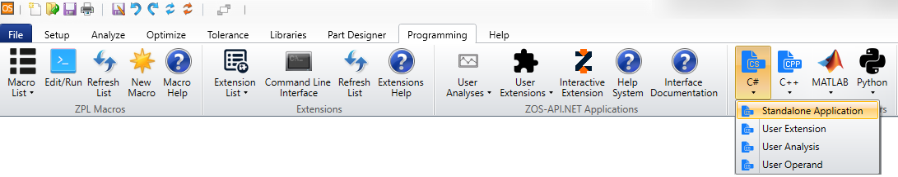

# Examples

The examples provided with OpticStudio cover a wide variety of applications, in the sequential as well as the non-sequential mode of OpticStudio. The use of all types of editors is demonstrated as well as various tools and analyses (including modifying settings and retrieving results). The applications range from optimization and tolerancing to systems with CAD objects and volume physics.

The list below shows an overview over all currently available examples. While they are in no particular order, each file has a specific application purpose which is summarized on the respective example page. Some examples are complete viable systems, others simple showcase the use of certain tools and analyses.

The first 4 examples are a great starting point to get introduced into the API as they show the most frequently used methods and keywords. Apart from Example 3 which builds on the output of Example 1, the examples are independent of each and do not require a linear working through of the files. Examples 21-25 are more complex, highlighting more infrequently used functionality.

| Example | Title | Links |
| --- | --- | --- |
| 01 | [New File and QuickFocus](example_01.md) |      |
| 02 | [NSC Ray Trace](example_02.md) |      |
| 03 | [Open File and Optimize](example_03.md) |      |
| 04 | [Retrieve Data from FFT MTF](example_04.md) |      |
| 05 | [Parsing a ZRD File](example_05.md) |      |
| 06 | [NSC Phase](example_06.md) |     |
| 07 | [Tilt and Decenter Elements](example_07.md) |     |
| 08 | [NCE Detector Data](example_08.md) |     |
| 09 | [NSC CAD](example_09.md) |     |
| 10 | [NSC ZRD Filter String](example_10.md) |     |
| 11 | [Basic Sequential](example_11.md) |     |
| 12 | [Sequential System Explorer](example_12.md) |     |
| 13 | **Tolerancing** | _Coming soon...._ |
| 14 | [Sequential Tolerance](example_14.md) |     |
| 15 | [Sequential Optimization](example_15.md) |     |
| 16 | [User-Defined Operand (UDOC)](example_16.md) |   |
| 17 | [Bulk Scatter](example_17.md) |     |
| 18 | [Multiple Configurations](example_18.md) |     |
| 19 | [Surface Properties](example_19.md) |     |
| 20 | [Exporting as CAD File](example_20.md) |     |
| 21 | [White LED Phosphor](example_21.md) |     |
| 22 | [Sequential Analysis](example_22.md) |      |
| 23 | [Ray Fan User Analysis](example_23.md) |     |
| 24 | [Non-Sequential Detector Data](example_24.md) |     |
| 25 | [Source Spectrum Diffraction Grating](example_25.md) |     |
| 26 | [Modify OpticStudio Preferences](example_26.md) |     |

All but one example are standalone, the exception being Example 16. This Example shows how to use a compiled executable for a user-defined operand, using either C# or C++.  

The Examples can be found in two ways:

1.	You can see the syntax within this documentation by clicking the desired button in the table above or navigating through the menu tree on the left.
2.	The full files are also located in the ZOS-API\\ZOS-API Sample Code folder.

If you have OpticStudio installed in the default directory via the installer (C:\\Program Files\\Zemax OpticStudio), then in order to run a Matlab file, you can simply execute the *.m  without any modification.  If you changed the default directory, you will to find the NET.addAssembly line which is hard coded to point to the ZOSAPI_NetHelper.dll and change the file path from the default (C:\\Program Files\\Zemax OpticStudio\\ZOS-API\\Libraries\\ZOSAPI_NetHelper.dll).

In order to run a Python file, you will need to have pywin32 as well as the Matplotlib module (which also installs Numpy) already downloaded and installed. Pywin32 is required for COM languages to communicate with our API.  Several Python files for both numerical analysis as well as plotting rely on these two modules.  You can find more information on our Getting Started with Python Knowledgebase Article.  To run a C# or C++ file, first go Programming tab in OpticStudio, select the desired language and click Standalone Application.  

A new solution will be created in the Zemax\\ZOS-API Projects folder.  From here, copy and paste the desired file into the new solution’s Program.cs or Program.cpp file. You can then build and run the executable.

In the example summaries, the inputs and outputs for each script are given with their respective location. When these descriptions refer to Samples\\API\\[language], this corresponds to the programming language that you are currently running. For example, for Python the path will be Samples\\API\\Python and for C# the path will be Samples\\API\\CS.

