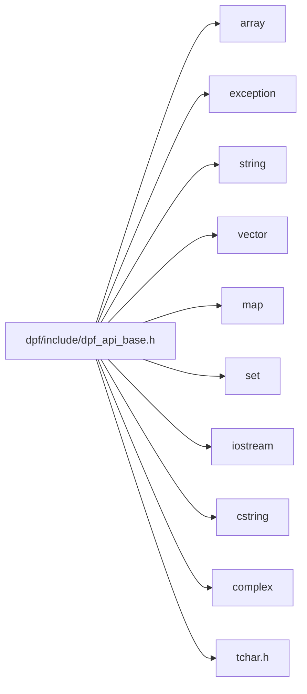

# File dpf_api_base.h

![][C++]

**Location**: `dpf/include`

## Classes

* [ansys::dpf::reflect](structansys-dpf-reflect.md#structansys-dpf-reflect)
* [ansys::dpf::param_helpers](structansys-dpf-param-helpers.md#structansys-dpf-param-helpers)
* [ansys::dpf::QuantityType](structansys-dpf-quantitytype.md#structansys-dpf-quantitytype)
* [ansys::dpf::quantity_types](structansys-dpf-quantity-types.md#structansys-dpf-quantity-types)
* [ansys::dpf::Location](structansys-dpf-location.md#structansys-dpf-location)
* [ansys::dpf::locations](structansys-dpf-locations.md#structansys-dpf-locations)
* [ansys::dpf::PropertyType](structansys-dpf-propertytype.md#structansys-dpf-propertytype)
* [ansys::dpf::property_types](structansys-dpf-property-types.md#structansys-dpf-property-types)
* [ansys::dpf::Homogeneity](classansys-dpf-homogeneity.md#classansys-dpf-homogeneity)
* [ansys::dpf::homogeneities](structansys-dpf-homogeneities.md#structansys-dpf-homogeneities)
* [ansys::dpf::UnitSystem](structansys-dpf-unitsystem.md#structansys-dpf-unitsystem)
* [ansys::dpf::unit_systems](structansys-dpf-unit-systems.md#structansys-dpf-unit-systems)
* [ansys::dpf::Label](structansys-dpf-label.md#structansys-dpf-label)
* [ansys::dpf::labels](structansys-dpf-labels.md#structansys-dpf-labels)
* [ansys::dpf::ShellDescriptor](structansys-dpf-shelldescriptor.md#structansys-dpf-shelldescriptor)
* [ansys::dpf::ElementDescriptor](structansys-dpf-elementdescriptor.md#structansys-dpf-elementdescriptor)
* [ansys::dpf::elements](structansys-dpf-elements.md#structansys-dpf-elements)
* [ansys::dpf::TypeDescriptor](structansys-dpf-typedescriptor.md#structansys-dpf-typedescriptor)
* [ansys::dpf::types](structansys-dpf-types.md#structansys-dpf-types)
* [ansys::dpf::Dimensionality](structansys-dpf-dimensionality.md#structansys-dpf-dimensionality)
* [ansys::dpf::dimensionalities](structansys-dpf-dimensionalities.md#structansys-dpf-dimensionalities)
* [ansys::dpf::spec](structansys-dpf-spec.md#structansys-dpf-spec)
* [ansys::dpf::spec::exposure](structansys-dpf-spec-exposure.md#structansys-dpf-spec-exposure)
* [ansys::dpf::spec::category](structansys-dpf-spec-category.md#structansys-dpf-spec-category)
* [ansys::dpf::spec::plugin](structansys-dpf-spec-plugin.md#structansys-dpf-spec-plugin)
* [ansys::dpf::spec::license](structansys-dpf-spec-license.md#structansys-dpf-spec-license)
* [ansys::dpf::DpfTypes](classansys-dpf-dpftypes.md#classansys-dpf-dpftypes)
* [ansys::dpf::Client](classansys-dpf-client.md#classansys-dpf-client)
* [ansys::dpf::DpfError](classansys-dpf-dpferror.md#classansys-dpf-dpferror)
* [ansys::dpf::DpfException](classansys-dpf-dpfexception.md#classansys-dpf-dpfexception)
* [ansys::dpf::DpfVectorDataHelper](structansys-dpf-dpfvectordatahelper.md#structansys-dpf-dpfvectordatahelper)
* [ansys::dpf::DpfVectorData](classansys-dpf-dpfvectordata.md#classansys-dpf-dpfvectordata)
* [ansys::dpf::DpfVector](classansys-dpf-dpfvector.md#classansys-dpf-dpfvector)
* [ansys::dpf::DpfVector::iterator](structansys-dpf-dpfvector-iterator.md#structansys-dpf-dpfvector-iterator)
* [ansys::dpf::DpfVector\< std::string \>](classansys-dpf-dpfvector-std-string.md#classansys-dpf-dpfvector-std-string-4)
* [ansys::dpf::Context](classansys-dpf-context.md#classansys-dpf-context)
* [ansys::dpf::Context::internal](structansys-dpf-context-internal.md#structansys-dpf-context-internal)
* [ansys::dpf::LibraryHandle](classansys-dpf-libraryhandle.md#classansys-dpf-libraryhandle)
* [ansys::dpf::LibraryHolder](classansys-dpf-libraryholder.md#classansys-dpf-libraryholder)
* [ansys::dpf::reflect\< std::string \>](structansys-dpf-reflect-std-string.md#structansys-dpf-reflect-std-string-4)
* [ansys::dpf::reflect\< int \>](structansys-dpf-reflect-int.md#structansys-dpf-reflect-int-4)
* [ansys::dpf::reflect\< double \>](structansys-dpf-reflect-double.md#structansys-dpf-reflect-double-4)
* [ansys::dpf::reflect\< bool \>](structansys-dpf-reflect-bool.md#structansys-dpf-reflect-bool-4)
* [ansys::dpf::reflect\< size_t \>](structansys-dpf-reflect-size-t.md#structansys-dpf-reflect-size-t-4)
* [ansys::dpf::reflect\< int64_t \>](structansys-dpf-reflect-int64-t.md#structansys-dpf-reflect-int64-t-4)
* [ansys::dpf::reflect\< char \>](structansys-dpf-reflect-char.md#structansys-dpf-reflect-char-4)
* [ansys::dpf::reflect\< wchar_t \>](structansys-dpf-reflect-wchar-t.md#structansys-dpf-reflect-wchar-t-4)
* [ansys::dpf::reflect\< float \>](structansys-dpf-reflect-float.md#structansys-dpf-reflect-float-4)
* [ansys::dpf::reflect\< unsigned int \>](structansys-dpf-reflect-unsigned-int.md#structansys-dpf-reflect-unsigned-int-4)
* [ansys::dpf::reflect\< short \>](structansys-dpf-reflect-short.md#structansys-dpf-reflect-short-4)
* [ansys::dpf::reflect\< std::vector\< int \> \>](structansys-dpf-reflect-std-vector-int-4.md#structansys-dpf-reflect-std-vector-int-4-4)
* [ansys::dpf::reflect\< std::vector\< double \> \>](structansys-dpf-reflect-std-vector-double-4.md#structansys-dpf-reflect-std-vector-double-4-4)
* [ansys::dpf::reflect\< std::vector\< std::string \> \>](structansys-dpf-reflect-std-vector-std-string-4.md#structansys-dpf-reflect-std-vector-std-string-4-4)
* [ansys::dpf::reflect\< int8_t \>](structansys-dpf-reflect-int8-t.md#structansys-dpf-reflect-int8-t-4)
* [ansys::dpf::reflect\< std::complex\< double \> \>](structansys-dpf-reflect-std-complex-double-4.md#structansys-dpf-reflect-std-complex-double-4-4)
* [std::hash\< ansys::dpf::PropertyType \>](structstd-hash-ansys-dpf-propertytype.md#structstd-hash-ansys-dpf-propertytype-4)

## Namespaces

* [dataProcessing](namespacedataprocessing.md#namespacedataprocessing)
* [ansys](namespaceansys.md#namespaceansys)
* [ansys::dpf](namespaceansys-dpf.md#namespaceansys-dpf)
* [ansys::dpf::so](namespaceansys-dpf-so.md#namespaceansys-dpf-so)
* [helper](namespacehelper.md#namespacehelper)
* [ansys::dpf::opaque](namespaceansys-dpf-opaque.md#namespaceansys-dpf-opaque)
* [std](namespacestd.md#namespacestd)

## Includes

* <array>
* <exception>
* <string>
* <vector>
* <map>
* <set>
* <iostream>
* <cstring>
* <complex>
* tchar.h

## Included by

* [dpf/include/dpf_api.h](dpf-api-h.md#dpf-api-h)

