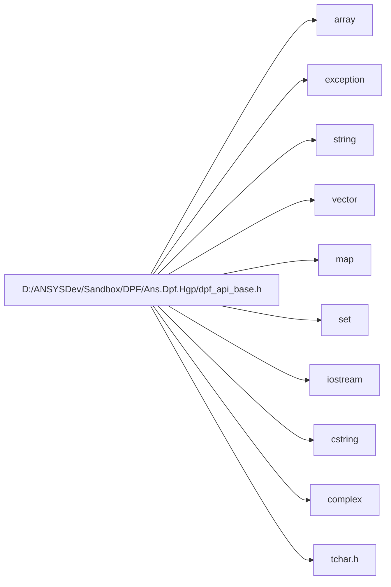

# File dpf\_api\_base.h

<a id="dpf-api-base-h"></a>

![][C++]

**Location**: `dpf/include`


## Classes

* [ansys::dpf::reflect](structansys-dpf-reflect.md#structansys-dpf-reflect)
* [ansys::dpf::param\_helpers](structansys-dpf-param-helpers.md#structansys-dpf-param-helpers)
* [ansys::dpf::QuantityType](structansys-dpf-quantitytype.md#structansys-dpf-quantitytype)
* [ansys::dpf::quantity\_types](structansys-dpf-quantity-types.md#structansys-dpf-quantity-types)
* [ansys::dpf::Location](structansys-dpf-location.md#structansys-dpf-location)
* [ansys::dpf::locations](structansys-dpf-locations.md#structansys-dpf-locations)
* [ansys::dpf::PropertyType](structansys-dpf-propertytype.md#structansys-dpf-propertytype)
* [ansys::dpf::property\_types](structansys-dpf-property-types.md#structansys-dpf-property-types)
* [ansys::dpf::Homogeneity](classansys-dpf-homogeneity.md#classansys-dpf-homogeneity)
* [ansys::dpf::homogeneities](structansys-dpf-homogeneities.md#structansys-dpf-homogeneities)
* [ansys::dpf::UnitSystem](structansys-dpf-unitsystem.md#structansys-dpf-unitsystem)
* [ansys::dpf::unit\_systems](structansys-dpf-unit-systems.md#structansys-dpf-unit-systems)
* [ansys::dpf::Label](structansys-dpf-label.md#structansys-dpf-label)
* [ansys::dpf::labels](structansys-dpf-labels.md#structansys-dpf-labels)
* [ansys::dpf::ShellDescriptor](structansys-dpf-shelldescriptor.md#structansys-dpf-shelldescriptor)
* [ansys::dpf::ElementDescriptor](structansys-dpf-elementdescriptor.md#structansys-dpf-elementdescriptor)
* [ansys::dpf::elements](structansys-dpf-elements.md#structansys-dpf-elements)
* [ansys::dpf::TypeDescriptor](structansys-dpf-typedescriptor.md#structansys-dpf-typedescriptor)
* [ansys::dpf::types](structansys-dpf-types.md#structansys-dpf-types)
* [ansys::dpf::Dimensionality](structansys-dpf-dimensionality.md#structansys-dpf-dimensionality)
* [ansys::dpf::dimensionalities](structansys-dpf-dimensionalities.md#structansys-dpf-dimensionalities)
* [ansys::dpf::spec](structansys-dpf-spec.md#structansys-dpf-spec)
* [ansys::dpf::spec::exposure](structansys-dpf-spec-exposure.md#structansys-dpf-spec-exposure)
* [ansys::dpf::spec::category](structansys-dpf-spec-category.md#structansys-dpf-spec-category)
* [ansys::dpf::spec::plugin](structansys-dpf-spec-plugin.md#structansys-dpf-spec-plugin)
* [ansys::dpf::spec::license](structansys-dpf-spec-license.md#structansys-dpf-spec-license)
* [ansys::dpf::DpfTypes](classansys-dpf-dpftypes.md#classansys-dpf-dpftypes)
* [ansys::dpf::Client](classansys-dpf-client.md#classansys-dpf-client)
* [ansys::dpf::DpfError](classansys-dpf-dpferror.md#classansys-dpf-dpferror)
* [ansys::dpf::DpfException](classansys-dpf-dpfexception.md#classansys-dpf-dpfexception)
* [ansys::dpf::DpfVectorDataHelper](structansys-dpf-dpfvectordatahelper.md#structansys-dpf-dpfvectordatahelper)
* [ansys::dpf::DpfVectorData](classansys-dpf-dpfvectordata.md#classansys-dpf-dpfvectordata)
* [ansys::dpf::DpfVector](classansys-dpf-dpfvector.md#classansys-dpf-dpfvector)
* [ansys::dpf::DpfVector::iterator](structansys-dpf-dpfvector-iterator.md#structansys-dpf-dpfvector-iterator)
* [ansys::dpf::DpfVector\< std::string \>](classansys-dpf-dpfvector-std-string.md#classansys-dpf-dpfvector-std-string-4)
* [ansys::dpf::Context](classansys-dpf-context.md#classansys-dpf-context)
* [ansys::dpf::Context::internal](structansys-dpf-context-internal.md#structansys-dpf-context-internal)
* [ansys::dpf::LibraryHandle](classansys-dpf-libraryhandle.md#classansys-dpf-libraryhandle)
* [ansys::dpf::LibraryHolder](classansys-dpf-libraryholder.md#classansys-dpf-libraryholder)
* [ansys::dpf::reflect\< std::string \>](structansys-dpf-reflect-std-string.md#structansys-dpf-reflect-std-string-4)
* [ansys::dpf::reflect\< int \>](structansys-dpf-reflect-int.md#structansys-dpf-reflect-int-4)
* [ansys::dpf::reflect\< double \>](structansys-dpf-reflect-double.md#structansys-dpf-reflect-double-4)
* [ansys::dpf::reflect\< bool \>](structansys-dpf-reflect-bool.md#structansys-dpf-reflect-bool-4)
* [ansys::dpf::reflect\< size\_t \>](structansys-dpf-reflect-size-t.md#structansys-dpf-reflect-size-t-4)
* [ansys::dpf::reflect\< int64\_t \>](structansys-dpf-reflect-int64-t.md#structansys-dpf-reflect-int64-t-4)
* [ansys::dpf::reflect\< char \>](structansys-dpf-reflect-char.md#structansys-dpf-reflect-char-4)
* [ansys::dpf::reflect\< wchar\_t \>](structansys-dpf-reflect-wchar-t.md#structansys-dpf-reflect-wchar-t-4)
* [ansys::dpf::reflect\< float \>](structansys-dpf-reflect-float.md#structansys-dpf-reflect-float-4)
* [ansys::dpf::reflect\< unsigned int \>](structansys-dpf-reflect-unsigned-int.md#structansys-dpf-reflect-unsigned-int-4)
* [ansys::dpf::reflect\< short \>](structansys-dpf-reflect-short.md#structansys-dpf-reflect-short-4)
* [ansys::dpf::reflect\< std::vector\< int \> \>](structansys-dpf-reflect-std-vector-int-4.md#structansys-dpf-reflect-std-vector-int-4-4)
* [ansys::dpf::reflect\< std::vector\< double \> \>](structansys-dpf-reflect-std-vector-double-4.md#structansys-dpf-reflect-std-vector-double-4-4)
* [ansys::dpf::reflect\< std::vector\< std::string \> \>](structansys-dpf-reflect-std-vector-std-string-4.md#structansys-dpf-reflect-std-vector-std-string-4-4)
* [ansys::dpf::reflect\< int8\_t \>](structansys-dpf-reflect-int8-t.md#structansys-dpf-reflect-int8-t-4)
* [ansys::dpf::reflect\< std::complex\< double \> \>](structansys-dpf-reflect-std-complex-double-4.md#structansys-dpf-reflect-std-complex-double-4-4)
* [std::hash\< ansys::dpf::PropertyType \>](structstd-hash-ansys-dpf-propertytype.md#structstd-hash-ansys-dpf-propertytype-4)

## Namespaces

* [dataProcessing](namespacedataprocessing.md#namespacedataprocessing)
* [ansys](namespaceansys.md#namespaceansys)
* [ansys::dpf](namespaceansys-dpf.md#namespaceansys-dpf)
* [ansys::dpf::so](namespaceansys-dpf-so.md#namespaceansys-dpf-so)
* [helper](namespacehelper.md#namespacehelper)
* [ansys::dpf::opaque](namespaceansys-dpf-opaque.md#namespaceansys-dpf-opaque)
* [std](namespacestd.md#namespacestd)

## Includes

* <array>
* <exception>
* <string>
* <vector>
* <map>
* <set>
* <iostream>
* <cstring>
* <complex>
* tchar.h





## Included by

* [dpf/include/dpf_api.h](dpf-api-h.md#dpf-api-h)

## Source


```cpp
//
// COPYRIGHT ANSYS. ALL RIGHTS RESERVED.
//
#pragma once
#include <array>
#include <exception>
#include <string>
#include <vector>
#include <map>
#include <set>
#include <iostream>
#include <cstring>
#include <complex>
#ifdef __linux__
#include <dlfcn.h>
#ifndef _TCHAR
typedef wchar_t _TCHAR;
#endif
#else
#include "tchar.h"
#endif

struct IAnsDispatch;
namespace dataProcessing {
    class InternalOperatorPolicy;
}
namespace ansys
{
    namespace dpf
    {
        namespace so
        {
            class API;
            static API* _api = nullptr;
        }
    }
}

namespace helper
{

    template <typename FunctionT, typename ...ArgsT>
    static inline void call_function(FunctionT f, ansys::dpf::so::API const* api, ArgsT... args);

    void throw_dpf_exception_if_necessary(std::string const& origin, int error_size, _TCHAR* text, const ansys::dpf::so::API* api);
}
namespace ansys
{
    namespace dpf
    {
        typedef int dp_int;
        typedef int dp_id;
        typedef int dp_index;
        typedef double dp_double;


        template <typename DpfTypeT>
        struct reflect
        {
            static std::string type_name() { return "unknown"; }
        };

        class DataTree;
        class Client;
        struct param_helpers
        {
            static DataTree createParamTree(Client const* const client = nullptr);
        };

        struct QuantityType
        {
        private:
            std::string _value;

        public:
            explicit QuantityType(std::string const& name = "" 
            );
            QuantityType(QuantityType const&) = default;
            bool operator==(QuantityType const&) const;
            bool operator<(QuantityType const&) const;
            bool operator<=(QuantityType const&) const;
            bool operator!=(QuantityType const&) const;
            operator std::string() const;
            bool empty() const;
            const char* c_str() const;
        };

        struct quantity_types
        {
        private:
            static std::vector<QuantityType> _existing_quantity_types;

        public:
            static std::vector<QuantityType> const& all();
            static void add_custom(QuantityType const& 
            );
            static const QuantityType discret;
            static const QuantityType continuous;
            static const QuantityType integrated;
            static const QuantityType position;
            static const QuantityType increment;
            static const QuantityType time;
            static const QuantityType frequency;
            static const QuantityType mode;

            static const QuantityType unknown;
        };


        struct Location
        {
        private:
            std::string _value;

        public:
            explicit Location(std::string const& name = "" 
            );
            Location(Location const&) = default;
            bool operator==(Location const&) const;
            bool operator<(Location const&) const;
            bool operator<=(Location const&) const;
            bool operator!=(Location const&) const;
            operator std::string() const;
            bool empty() const;
            const char* c_str() const;
        };

        struct locations
        {
        private:
            static std::vector<Location> _existing_locations;

        public:
            static std::vector<Location> const& all();
            static void add_custom(Location const& 
            );
            static const Location nodal;
            static const Location elemental;
            static const Location elemental_nodal;
            static const Location elemental_nodal_centroid;
            static const Location overall;
            static const Location nodal_elemental;
            static const Location faces;
            static const Location elemental_and_faces;
            static const Location body;
            static const Location contact;
            static const Location joint;
            static const Location topology;
            static const Location udf_criteria;
            static const Location time_step;
            static const Location time_set;
            static const Location harmonic_index;
            static const Location phase;
            static const Location species;
            static const Location zone;
            static const Location band;
            static const Location unknown;
        };

        struct PropertyType
        {
        private:
            std::string _value;

        public:
            explicit PropertyType(std::string const& name 
            );
            PropertyType(PropertyType const&) = default;
            PropertyType() = default;
            bool operator==(PropertyType const&) const;
            bool operator<(PropertyType const&) const;
            bool operator<=(PropertyType const&) const;
            bool operator!=(PropertyType const&) const;
            operator std::string() const;
            const char* c_str() const;
        };

        struct property_types
        {
        private:
            static std::vector<PropertyType> _existing_props;

        public:
            static std::vector<PropertyType> const& all();
            static void add_custom(PropertyType const& rhs 
            );
            static const PropertyType material;
            static const PropertyType element_shape;
            static const PropertyType element_type;
            static const PropertyType element_properties;
            static const PropertyType connectivity;
            static const PropertyType apdl_element_type;
            static const PropertyType faces_nodes_connectivity;
            static const PropertyType elements_faces_connectivity;
            static const PropertyType elements_faces_reversed;
            static const PropertyType coordinates;
            static const PropertyType faces_type;
            static const PropertyType time_freqs;
            static const PropertyType imaginary_freqs;
            static const PropertyType rpms;
            static const PropertyType harmonic_indices;
            static const PropertyType time_freqs_substep_ids;
            static const PropertyType time_freqs_cumulative_ids;
            static const PropertyType imaginary_freqs_substep_ids;
            static const PropertyType imaginary_freqs_cumulative_ids;
            static const PropertyType names;
            static const PropertyType cell_zone_id;
            static const PropertyType face_zone_id;
            static const PropertyType part_id;
            static const PropertyType section;

        };

        class Homogeneity
        {
        private:
            std::string _name;

        public:
            Homogeneity(std::string const& name = "Unknown" 
            );
            Homogeneity(Homogeneity const&) = default;
            Homogeneity(Homogeneity&&) = default;
            Homogeneity& operator=(Homogeneity const&);
            bool operator==(Homogeneity const& rhs) const;
            bool operator!=(Homogeneity const& rhs) const;
            operator std::string() const;
            const char* c_str() const;
        };

        struct homogeneities
        {
            static const Homogeneity length;
            static const Homogeneity mass;
            static const Homogeneity time;
            static const Homogeneity angle;
            static const Homogeneity temperature;
            static const Homogeneity electric_charge;
            static const Homogeneity surface;
            static const Homogeneity volume;
            static const Homogeneity force;
            static const Homogeneity moment;
            static const Homogeneity pressure;
            static const Homogeneity velocity;
            static const Homogeneity acceleration;
            static const Homogeneity density;
            static const Homogeneity power;
            static const Homogeneity energy;
            static const Homogeneity frequency;
            static const Homogeneity heat_flux;
            static const Homogeneity angular_velocity;
            static const Homogeneity capacitance;
            static const Homogeneity electric_charge_density;
            static const Homogeneity current;
            static const Homogeneity current_density;
            static const Homogeneity electric_conductivity;
            static const Homogeneity electric_field;
            static const Homogeneity electric_flux_density;
            static const Homogeneity resistance;
            static const Homogeneity resistivity;
            static const Homogeneity force_intensity;
            static const Homogeneity moment_inertia;
            static const Homogeneity stiffness;
            static const Homogeneity voltage;
            static const Homogeneity stress_intensity_factor;
            static const Homogeneity thermal_gradient;
            static const Homogeneity viscosity;
            static const Homogeneity angular_acceleration;
            static const Homogeneity specific_energy;
            static const Homogeneity epsilon;
            static const Homogeneity mass_flow;
            static const Homogeneity volume_flow;
            static const Homogeneity specific_heat;
            static const Homogeneity thermal_conductivity;
            static const Homogeneity specific_entropy;
            static const Homogeneity force_density;
            static const Homogeneity temperature_difference;
            static const Homogeneity magnetic_potential;
            static const Homogeneity film_coefficient;
            static const Homogeneity dimension_less;
            static const Homogeneity unknown;
        };

        struct UnitSystem
        {
        private:
            std::string _name;
            int _ansys_id;
            std::string _unit_names;

        public:
            explicit UnitSystem(std::string const& name, 
                int id 
            );
            explicit UnitSystem(std::string const& name, 
                std::string const& unit_names 
            );
            operator std::string() const;
            const char* c_str() const;
            dp_id getId() const;
            std::string getUnitNames() const;
            bool operator==(UnitSystem const& rhs) const;
        };

        typedef UnitSystem UnitSytem;
        struct unit_systems
        {
            static const UnitSystem SI;
            static const UnitSystem ansys_cgs;
            static const UnitSystem ansys_nmm;
            static const UnitSystem ansys_bin;
            static const UnitSystem ansys_umks;
            static const UnitSystem ansys_cust;
            static const UnitSystem ansys_nmm_ton;
            static const UnitSystem ansys_nmm_dat;
            static const UnitSystem ansys_knms;
            static const UnitSystem solver_mks;
            static const UnitSystem solver_cgs;
            static const UnitSystem solver_bft;
            static const UnitSystem solver_nmm;
            static const UnitSystem solver_bin;
            static const UnitSystem solver_umks;
            static const UnitSystem solver_knms;
            static const UnitSystem undefined;
            static const std::vector<UnitSystem> all;
            static UnitSystem const& from_ansys_id(dp_id id 
            );
        };

        struct Label
        {
        private:
            std::string _value;

        public:
            explicit Label(std::string const& name 
            );
            Label(Label const&) = default;
            bool operator==(Label const&) const;
            bool operator<(Label const&) const;
            bool operator<=(Label const&) const;
            bool operator!=(Label const&) const;
            operator std::string() const;
            const char* c_str() const;
        };

        struct labels
        {
            static const Label time;
            static const Label dofs;
            static const Label domain;
            static const Label complex;
            static const Label body;
            static const Label panel;
            static const Label derivative_order;
            static const Label phase;
            static const Label zone;
            static const Label species;
            static const Label partition;
            static const Label ghost;
        };

        typedef enum {
            eTop = 0,
            eBottom = 1,
            eTopBottom = 2,
            eMid = 3,
            eTopBottomMid = 4,
            eNoneLayer = 5,
            eLayerIndependent = 6
        } eshellLayers;

        struct ShellDescriptor
        {
            static dp_int numShellLayers(eshellLayers eshell_layer 
            );
        };

        struct ElementDescriptor
        {
            int id;
            std::string name;
            std::string short_name;
            dp_int number_of_corner_nodes;
            dp_int number_of_mid_nodes;
            dp_int number_of_nodes;
            bool solid;
            bool shell;
            bool beam;
            bool quadratic;

            ElementDescriptor(dp_int id, 
                std::string const& name, 
                std::string const& short_name, 
                dp_int corner, 
                dp_int mid, 
                dp_int all, 
                bool is_solid, 
                bool is_shell, 
                bool is_beam 
            );
            inline bool operator==(ElementDescriptor const& rhs) const { return id == rhs.id; }
            bool unknownNumNodes()const;
        };

        struct elements
        {
        private:
            static const std::vector<ElementDescriptor> dpf_index_to_descriptor;

        public:
            typedef enum EElementType
            {
                kAnsGeneral = -2,
                kAnsAll = -1,
                kAnsTet10 = 0,
                kAnsHex20 = 1,
                kAnsWedge15 = 2,
                kAnsPyramid13 = 3,
                kAnsTri6 = 4,
                kAnsTriShell6 = 5,
                kAnsQuad8 = 6,
                kAnsQuadShell8 = 7,
                kAnsLine3 = 8,
                kAnsPoint1 = 9,
                kAnsTet4 = 10,
                kAnsHex8 = 11,
                kAnsWedge6 = 12,
                kAnsPyramid5 = 13,
                kAnsTri3 = 14,
                kAnsTriShell3 = 15,
                kAnsQuad4 = 16,
                kAnsQuadShell4 = 17,
                kAnsLine2 = 18,
                kAnsNumElementTypes = 19,
                kAnsUnknown = 20,
                kAnsEMagLine = 21,
                kAnsEMagArc = 22,
                kAnsEMagCircle = 23,
                kAnsSurface3 = 24,
                kAnsSurface4 = 25,
                kAnsSurface6 = 26,
                kAnsSurface8 = 27,
                kAnsEdge2 = 28,
                kAnsEdge3 = 29,
                kAnsBeam3 = 30,
                kAnsBeam4 = 31,
                kAnsGeneralPlaceholder = 32,
                kAnsPolygon = 33,
                kAnsPolyhedron = 34,
                kAnsActualNumElementTypes = 35
            } EElementType;
            typedef enum { eShell = 0, eSolid = 1, eBeam = 2, eUnknownShape = 3 } EShape;

            static const ElementDescriptor tet4;
            static const ElementDescriptor tet10;
            static const ElementDescriptor tri3;
            static const ElementDescriptor triShell3;
            static const ElementDescriptor tri6;
            static const ElementDescriptor triShell6;
            static const ElementDescriptor quad4;
            static const ElementDescriptor quadShell4;
            static const ElementDescriptor quad8;
            static const ElementDescriptor quadShell8;
            static const ElementDescriptor pyramid5;
            static const ElementDescriptor pyramid13;
            static const ElementDescriptor wedge6;
            static const ElementDescriptor wedge15;
            static const ElementDescriptor hex8;
            static const ElementDescriptor hex20;
            static const ElementDescriptor line2;
            static const ElementDescriptor line3;
            static const ElementDescriptor beam3;
            static const ElementDescriptor beam4;
            static const ElementDescriptor point1;
            static const ElementDescriptor polygon;
            static const ElementDescriptor polyhedron;
            static const ElementDescriptor unknown;
            static const std::vector<ElementDescriptor> linears;
            static const std::vector<ElementDescriptor> quadratics;
            static const std::vector<ElementDescriptor> solid_elements;
            static inline ElementDescriptor const& descriptor(dp_index element_index) { return dpf_index_to_descriptor[element_index]; }
        };

        struct types;

        struct TypeDescriptor
        {
            friend struct types;
            friend class OperatorSpecification;
        private:
            std::string _name;

        public:
            TypeDescriptor(std::string const& name);
            TypeDescriptor(TypeDescriptor const&) = default;
            TypeDescriptor(TypeDescriptor&&) = default;
            TypeDescriptor& operator=(TypeDescriptor const&) = default;
            TypeDescriptor& operator=(TypeDescriptor&&) = default;
            bool operator==(TypeDescriptor const&) const;
            bool operator<(TypeDescriptor const&) const;
            bool operator<=(TypeDescriptor const&) const;
            bool operator!=(TypeDescriptor const&) const;
            operator std::string() const;
            const char* c_str() const;
        };

        struct types
        {
            static const TypeDescriptor field;
            static const TypeDescriptor fields_container;
            static const TypeDescriptor scoping;
            static const TypeDescriptor scopings_container;
            static const TypeDescriptor meshed_region;
            static const TypeDescriptor meshes_container;
            static const TypeDescriptor property_field;
            static const TypeDescriptor data_sources;
            static const TypeDescriptor streams;
            static const TypeDescriptor data_tree;
            static const TypeDescriptor support;
            static const TypeDescriptor workflow;
            static const TypeDescriptor operators;
            static const TypeDescriptor result_info;
            static const TypeDescriptor time_freq_support;
            static const TypeDescriptor label_space;
            static const TypeDescriptor string_field;
            static const TypeDescriptor custom_type_field;
            static const TypeDescriptor custom_type_fields_container;
            static const TypeDescriptor any;
            static const TypeDescriptor string;
            static const TypeDescriptor integer;
            static const TypeDescriptor doubleValue;
            static const TypeDescriptor complexValue;
            static const TypeDescriptor boolean;
            static const TypeDescriptor intVector;
            static const TypeDescriptor doubleVector;
            static const TypeDescriptor complexVector;
            static const TypeDescriptor stringVector;
            static const TypeDescriptor unit_system;
            static const TypeDescriptor mesh_info;
            static const TypeDescriptor generic_data_container;
            static const TypeDescriptor any_collection;
        };

        struct Dimensionality
        {
            typedef enum { eScalar = 0, eVector = 1, eMatrix = 2, eThirdOrderTensor = 3, eFourthOrderTensor = 4, eSymmetricalMatrix = 5, eDiagonalMatrix = 6, eSymetricVoigtMatrix = 7, eIdentityMatrix = 8, eFourthOrderIdentityTensor = 9 } ENature;

            std::vector<int> components;
            ENature nature;

            Dimensionality() = delete;
            Dimensionality(ENature innature, 
                std::vector<int> const& incomponents); 
            dp_int numberOfComponents()const;
        };

        struct dimensionalities
        {
            static const Dimensionality scalar;
            static const Dimensionality vector3D;
            static const Dimensionality symmetrical3x3Matrix;
        };
        struct spec
        {
        public:
            static std::string sUserName;
            static std::string sScriptingName;

            struct exposure
            {
                static std::string sExposure;
                static std::string sPublic;
                static std::string sHidden;
                static std::string sPrivate;
            };

            struct category
            {
                static std::string sCategory;
                static std::string sResult;
                static std::string sMath;
                static std::string sMesh;
                static std::string sScoping;
                static std::string sMapping;
                static std::string sMinMax;
                static std::string sGeo;
                static std::string sFilter;
                static std::string sUtility;
                static std::string sAveraging;
                static std::string sSerialization;
                static std::string sInvariant;
                static std::string sLogic;
                static std::string sMetadata;
                static std::string sServer;
                static std::string sCompression;
                static std::string sInfo;
            };

            struct plugin
            {
                static std::string sPlugin;
            };

            struct license
            {
                static std::string sLicense;
                static std::string sDpf;
            };

        };

        class LibraryHandle;
        class DpfError;
        class Client;
        class CollectionBase;

        namespace opaque
        {
            class DpfObject;
            class DpfExternal;
            class DpfOperatorData;
            class DpfOperatorDerivData;
            class DpfVariant;
            class DpfError;
            class DpfVector;
            class DpfString;
            class FbsChannel;
            class FbsSlice;
            typedef void DpfCustomType;


            class DpfInternalSharedObject;
        }

        class DpfTypes
        {
        private:
            friend class LibraryHandle;
            friend class Workflow;
            friend class core;
            friend struct ConstructHelpers;
            friend class CollectionBase;
            friend class GenericDataContainer;
            template <typename T> friend class DpfVector;
            opaque::DpfInternalSharedObject* _main_dpf_object;
            mutable enum class EHasClient { eNotInitialized, eHasNoClient, eHasClient } _has_client = EHasClient::eNotInitialized; // keep in cache if client exists to improve perf
        protected:
            opaque::DpfObject* const internalObj() const;
            void setInternalObj(opaque::DpfObject*);
            void setMainAPI(so::API const* api);

            template <typename ReturnT, typename FunctionT, typename ...ArgsT>
            inline ReturnT self_call(FunctionT f, ArgsT... args) const;

            template <typename ReturnT, typename FunctionT>
            inline ReturnT self_call(FunctionT f) const;

            template <typename FunctionT, typename ...ArgsT>
            inline opaque::DpfInternalSharedObject* dpf_type_return_self_call(FunctionT f, ArgsT... args) const;

            template <typename FunctionT>
            inline opaque::DpfInternalSharedObject* dpf_type_return_self_call(FunctionT f) const;

            template <typename FunctionT, typename ...ArgsT>
            inline void void_return_self_call(FunctionT f, ArgsT... args) const;

            template <typename ReturnT, typename FunctionT, typename ...ArgsT>
            inline ReturnT call(FunctionT f, ArgsT... args) const;

            template <typename ReturnT, typename FunctionT, typename ...ArgsT>
            inline ReturnT safe_call(DpfError& error, FunctionT f, ArgsT... args) const;

            template <typename ReturnT, typename FunctionT>
            inline ReturnT call(FunctionT f) const;

            template <typename FunctionT, typename ...ArgsT>
            inline void void_return_call(FunctionT f, ArgsT... args) const;

            template <typename ReturnT, typename FunctionT, typename ...ArgsT>
            inline ReturnT safe_self_call(DpfError& error, FunctionT f, ArgsT... args) const;

            template <typename FunctionT, typename ...ArgsT>
            inline opaque::DpfInternalSharedObject* dpf_type_return_safe_self_call(DpfError& error, FunctionT f, ArgsT... args) const;

            template <typename FunctionT>
            inline void void_return_safe_self_call(DpfError& error, FunctionT f) const;

            template <typename FunctionT, typename ...ArgsT>
            inline void void_return_safe_self_call(DpfError& error, FunctionT f, ArgsT... args) const;

            void operatorEq(DpfTypes const&);
            void operatorEq(DpfTypes&&) noexcept;

            DpfTypes();
            DpfTypes(const LibraryHandle& library_handle);
            DpfTypes(opaque::DpfObject* obj, so::API const* api);
            DpfTypes(opaque::DpfInternalSharedObject* obj);
            DpfTypes(so::API const* api);

            opaque::DpfObject* const& getMainInternalObject()const;
            inline so::API const* const getMainAPI()const;

            opaque::DpfInternalSharedObject* deep_copy(ansys::dpf::Client const* client) const;

        private:
            inline void throw_dpf_exception_if_necessary(std::string const& origin, int error_size, _TCHAR* text)const;
            inline ::ansys::dpf::DpfError create_dpf_error(std::string const& origin, int error_size, _TCHAR* text)const;
        public:
            virtual ~DpfTypes();
            virtual bool empty() const;
            virtual bool hasInternalObject() const;
            virtual std::string describe() const;
            so::API const* callAPI()const;
            bool isOnCommonAPI()const;
            bool getClient(Client& client) const;
            bool hasBeenMovedLocally()const;
            bool isSameObject(DpfTypes const& rhs) const;
        };

        enum class OperatorState
        {
            eNotUptodate,
            eUpToDate,
            eFailed,
            eRunning
        };

        class Streams;
        class Operator;

        class Client : public DpfTypes
        {
        private:
            friend class Workflow;
            friend class RemoteWorkflow;
            friend class LabelSpace;
            friend class core;
            friend class DpfTypes;

            Client(opaque::DpfInternalSharedObject* obj);
            Client(std::string const& address, so::API const* library_handle);
        public:
            Client(std::string const& ip, 
                std::string const& port 
            );
            Client(std::string const& ip, 
                std::string const& port, 
                LibraryHandle const& library_handle 
            );
            Client(std::string const& address 
            );
            Client(std::string const& address, 
                LibraryHandle const& library_handle 
            );
            Client(Client const&);
            Client(Client&&) noexcept;
            Client& operator=(Client const&);
            Client& operator=(Client&&) noexcept;
            virtual ~Client() = default;
            opaque::DpfObject* const internalObj() const;
            std::string getChannelAddress()const;
            std::string getProtocolName()const;

            bool getOrStartLocalServer(ansys::dpf::Streams& streams 
                , ansys::dpf::Operator& stream_provider 
                , int output_pin = 0 
            ) const;

            inline so::API const* callAPI() const { return DpfTypes::callAPI(); }

            static Client emptyClient();
        };

        class DpfError
        {
        public:
            enum ErrorNature
            {
                eUnknown,
                eOk,
                eComponentLoading,
                eFileNotFound,
                eRuntimeError,
                eWrongOutputType,
                eFailure,
                eUnexpectedVoidReturn,
                eUnexpectedVoidEntity,
                eUnimplemented,
                eUserInterrupted,
                eLicensingFailure,
                eUnimplementedAPI,
            };

            DpfError(ErrorNature nature, 
                std::string const& origin, 
                std::string const& message 
            );
            DpfError();
            virtual ~DpfError();
            virtual const char* what() const noexcept;
            const char* message() const noexcept;
            const char* origin() const noexcept;
            ErrorNature nature() const noexcept;
            bool isOk() const noexcept;
            void clear() noexcept;

        private:
            std::string _message;
            std::string _origin;
            ErrorNature _nature;
            std::string _what_message;
        };

        class DpfException : public std::exception
        {
        private:
            DpfError _error;

        public:
            DpfException(DpfError::ErrorNature nature, 
                std::string const& origin, 
                std::string const& message 
            );
            DpfException(DpfError const& error
            );

        public:
            virtual ~DpfException();
            virtual const char* what() const noexcept;
            const char* message() const noexcept;
            const char* origin() const noexcept;
            DpfError::ErrorNature nature() const noexcept;
            DpfError error() const noexcept;
        };

        struct DpfVectorDataHelper
        {
            static opaque::DpfVector* initDpfVector(opaque::DpfObject const* object = nullptr);
            static opaque::DpfVector* duplicateDpfVector(opaque::DpfVector*);
            static void deleteDpfVector(opaque::DpfVector* vector);
            static void releaseCharVector(opaque::DpfVector* vector, char* data, dp_int size, bool modified);
            static void commitCharVector(opaque::DpfVector* vector, char* data, dp_int size, bool modified);
            static void setAsSubVecCharVector(opaque::DpfVector* vector, char* data, dp_int size, opaque::DpfVector* vector_out, dp_int starting_index, dp_int size_out, char** dataout);
        };
        template <typename T>
        class DpfVectorData
        {
        public:
            dp_int _size;
            bool _modified;
            bool _handle_as_char;
            opaque::DpfVector* _vector;
            size_t* _sizes = nullptr;
            T* _data;
        public:
            DpfVectorData(opaque::DpfObject const* object, bool handle_as_char = false) :
                _size(0), _modified(false), _handle_as_char(handle_as_char), _vector(nullptr), _data(nullptr)
            {
                _vector = DpfVectorDataHelper::initDpfVector(object);
            }
            DpfVectorData() :
                _size(0), _modified(false), _handle_as_char(false), _vector(nullptr), _data(nullptr)
            {
                _vector = DpfVectorDataHelper::initDpfVector();
            }
            DpfVectorData(DpfVectorData const& rhs) :
                _size(rhs._size), _modified(rhs._modified), _handle_as_char(rhs._handle_as_char), _vector(nullptr), _data(rhs._data)
            {
                _vector = DpfVectorDataHelper::duplicateDpfVector(rhs._vector);
            }
            ~DpfVectorData();
            void release(bool will_be_reused = false);
            inline void commit();
            inline T operator[](dp_index i) const { return _data[i]; }
            inline T& operator[](dp_index i) { return _data[i]; }
            inline T const* const data() const { return _data; }
            inline T* const data() { return _data; }
            static DpfVectorData* createOnAPI(DpfVectorData const* object, bool handle_as_char = false) {
                return new DpfVectorData((opaque::DpfObject const*)object->_vector, handle_as_char);
            }
            /*
            * @brief Creates new DpfVector with access to a sub range in the initial data (between index and index + size).
            * @details The newly created vector manages memory and commits as the initial vector does.
            */
            void setAsSubVec(DpfVectorData<T>* data_in, dp_int index, dp_int size);

        private:
            inline void releaseAsChar();
            inline void commitAsChar();
            inline void setAsSubVecAsChar(DpfVectorData<T>* data_in, dp_int index, dp_int size);

        };
        template <typename T>
        DpfVectorData<T>::~DpfVectorData()
        {
            release();
            DpfVectorDataHelper::deleteDpfVector(_vector);
        }
        template <typename T>
        inline void DpfVectorData<T>::releaseAsChar()
        {
            auto real_size = sizeof(T) * _size;
            DpfVectorDataHelper::releaseCharVector(_vector, (char*)_data, (dp_int)real_size, _modified);
        }
        template <typename T>
        inline void DpfVectorData<T>::commitAsChar()
        {
            if (_modified) {
                auto real_size = sizeof(T) * _size;
                DpfVectorDataHelper::commitCharVector(_vector, (char*)_data, (dp_int)real_size, _modified);
                _modified = false;
            }
        }
        template<typename T>
        inline void DpfVectorData<T>::setAsSubVecAsChar(DpfVectorData<T>* data_in, dp_int index, dp_int size)
        {
            DpfVectorDataHelper::setAsSubVecCharVector(data_in->_vector, (char*)data_in->_data, (dp_int)data_in->_size * sizeof(T), this->_vector, index * sizeof(T), size * sizeof(T), (char**)&_data);
        }
        template <typename T>
        void DpfVectorData<T>::release(bool /*will_be_reused*/)
        {
            releaseAsChar();
        }
        template <>
        void DpfVectorData<int>::release(bool will_be_reused);
        template <>
        void DpfVectorData<double>::release(bool will_be_reused);
        template <typename T>
        void DpfVectorData<T>::setAsSubVec(DpfVectorData<T>* data_in, dp_int index, dp_int size)
        {
            setAsSubVecAsChar(data_in, index, size);
            _size = size;
            _handle_as_char = data_in->_handle_as_char;
            _modified = false;
        }
        template <>
        inline void DpfVectorData<char*>::release(bool will_be_reused);

        template <>
        void DpfVectorData<int>::setAsSubVec(DpfVectorData<int>* data_in, dp_int index, dp_int size);
        template <>
        void DpfVectorData<char>::setAsSubVec(DpfVectorData<char>* data_in, dp_int index, dp_int size);
        template <>
        void DpfVectorData<double>::setAsSubVec(DpfVectorData<double>* data_in, dp_int index, dp_int size);
        template <typename T>
        void DpfVectorData<T>::commit()
        {
            commitAsChar();
        }
        template <>
        void DpfVectorData<int>::commit();
        template <>
        void DpfVectorData<double>::commit();
        template <>
        void DpfVectorData<char*>::commit();

        template <typename T>
        class DpfVector
        {
        public:
            class iterator;
        private:
            friend class Field;
            friend class PropertyField;
            friend class CustomTypeField;
            friend class StringField;
            friend class Scoping;
            friend class Operator;
            friend class Workflow;
            friend class Any;

            DpfVectorData<T>* _data = nullptr;

            typedef void (*fillFuncByInt)(opaque::DpfObject const* const obj, opaque::DpfVector*, T**, int*, int, int&, _TCHAR*&);
            typedef void (*fillFunc)(opaque::DpfObject const* const obj, opaque::DpfVector*, T**, int*, int&, _TCHAR*&);
            typedef void (*fillVoidDataFuncByInt)(opaque::DpfObject const* const obj, opaque::DpfVector*, void**, int*, int, int&, _TCHAR*&);
            typedef void (*fillVoidDataFunc)(opaque::DpfObject const* const obj, opaque::DpfVector*, void**, int*, int&, _TCHAR*&);

            DpfVector(fillFunc const& constructor, opaque::DpfObject* const obj);
            DpfVector(fillFuncByInt const& constructor, int id_index, opaque::DpfObject* const obj);
            DpfVector(fillVoidDataFunc const& constructor, opaque::DpfObject* const obj);
            DpfVector(fillVoidDataFuncByInt const& constructor, int id_index, opaque::DpfObject* const obj);

            void fill(fillFunc const& fill, opaque::DpfObject* const obj);
            void fill(fillFuncByInt const& fill, int id_index, opaque::DpfObject* const obj);
            void fill(fillVoidDataFunc const& fill, opaque::DpfObject* const obj);
            void fill(fillVoidDataFuncByInt const& fill, int id_index, opaque::DpfObject* const obj);
        public:
            DpfVector();
            DpfVector(Client const* const for_object);
            DpfVector(Client const& for_object);
            DpfVector(iterator const& begin, iterator const& end);
            ~DpfVector();
            DpfVector(DpfVector const&);
            DpfVector(DpfVector&&) noexcept;
            DpfVector& operator=(DpfVector const&);
            DpfVector& operator=(DpfVector&&) noexcept;
            T& operator[](dp_index idx);
            T operator[](dp_index idx) const;
            inline T const* const data() const {
                return _data ? _data->data() : nullptr;
            }
            inline T* const data() {
                return _data ? _data->data() : nullptr;
            }
            inline dp_int size() const {
                return _data ? _data->_size : 0;
            }
            inline bool defined() const { return _data; }
            void commit()const;

            void copy(std::vector<T>& to_fill)const;
            std::vector<T> copy()const;


            struct iterator {
                friend class DpfVector;
            public:
                using index_type = size_t;

                using difference_type = std::ptrdiff_t;
                using pointer = T*;
                using reference = T&;
                using value_type = T;
                using iterator_category = std::bidirectional_iterator_tag;
            private:
                DpfVectorData<T>* _data = nullptr;
                index_type _index = 0;
            public:

                iterator() : _data(nullptr), _index(0) {}
                iterator(index_type index, DpfVectorData<T>* data) : _data(data), _index(index) {}

                reference operator*() const { return _data->operator[](static_cast<dp_int>(_index)); }
                pointer operator->() { return _data->data() + static_cast<dp_int>(_index); }
                iterator& operator++() { _index++; return *this; }
                iterator operator++(int) { iterator tmp = *this; ++(*this); return tmp; }
                iterator& operator--() { _index--; return *this; }
                iterator operator--(int) { iterator tmp = *this; --(*this); return tmp; }
                iterator& operator+=(difference_type n) {
                    _index += n;
                    return *this;
                }
                iterator& operator-=(difference_type n) {
                    _index -= n;
                    return *this;
                }
                friend bool operator== (const iterator& a, const iterator& b) { return a._index == b._index && a._data == b._data; };
                friend bool operator!= (const iterator& a, const iterator& b) { return !(a == b); };

                friend iterator operator+(const iterator& it, difference_type n) {
                    iterator temp = it;
                    temp += n;
                    return temp;
                }
                friend iterator operator-(const iterator& it, difference_type n) {
                    iterator temp = it;
                    temp -= n;
                    return temp;
                }
                friend difference_type operator-(const iterator& lhs, const iterator& rhs) {
                    return lhs._index - rhs._index;
                }
            private:
                index_type index() const { return _index; }
            };

            iterator begin() const { return iterator(0, _data); }
            iterator end() const { return iterator(static_cast<typename iterator::index_type>(size()), _data); }


            inline void reset(iterator const& begin, iterator const& end);
        };


        template <typename T>
        DpfVector<T>::DpfVector(fillFunc const& constructor, opaque::DpfObject* obj)
        {
            _data = new DpfVectorData<T>(obj);
            helper::call_function(constructor, so::_api, obj, _data->_vector, &_data->_data, &_data->_size);
        }

        template <typename T>
        DpfVector<T>::DpfVector(fillFuncByInt const& constructor, int id_index, opaque::DpfObject* obj)
        {
            _data = new DpfVectorData<T>(obj);
            helper::call_function(constructor, so::_api, obj, _data->_vector, &_data->_data, &_data->_size, id_index);
        }

        template <typename T>
        DpfVector<T>::DpfVector(fillVoidDataFunc const& constructor, opaque::DpfObject* obj)
        {
            typedef void (*typedFillFunc)(opaque::DpfObject const* const obj, opaque::DpfVector*, T**, int*, int&, _TCHAR*&);

            _data = new DpfVectorData<T>(obj, true);
            helper::call_function((typedFillFunc)constructor, so::_api, obj, _data->_vector, &_data->_data, &_data->_size);
        }
        template <typename T>
        DpfVector<T>::DpfVector(fillVoidDataFuncByInt const& constructor, int id_index, opaque::DpfObject* obj)
        {
            typedef void (*typedFillFuncByInt)(opaque::DpfObject const* const obj, opaque::DpfVector*, T**, int*, int, int&, _TCHAR*&);

            _data = new DpfVectorData<T>(obj, true);
            helper::call_function((typedFillFuncByInt)constructor, so::_api, obj, _data->_vector, &_data->_data, &_data->_size, id_index);
        }
        template <typename T>
        void DpfVector<T>::fill(fillFuncByInt const& fill, int id_index, opaque::DpfObject* const obj)
        {
            if (!_data)
                _data = new DpfVectorData<T>(obj);
            _data->commit(); _data->_handle_as_char = false;
            helper::call_function(fill, so::_api, obj, _data->_vector, &_data->_data, &_data->_size, id_index);
        }
        template <typename T>
        void DpfVector<T>::fill(fillVoidDataFunc const& fill, opaque::DpfObject* const obj)
        {
            if (!_data)
                _data = new DpfVectorData<T>(obj);
            _data->commit();
            _data->_handle_as_char = true;
            typedef void (*typedFillFunc)(opaque::DpfObject const* const obj, opaque::DpfVector*, T**, int*, int&, _TCHAR*&);

            helper::call_function((typedFillFunc)fill, so::_api, obj, _data->_vector, &_data->_data, &_data->_size);
        }
        template <typename T>
        void DpfVector<T>::fill(fillVoidDataFuncByInt const& fill, int id_index, opaque::DpfObject* const obj)
        {
            if (!_data)
                _data = new DpfVectorData<T>(obj);
            _data->commit();
            typedef void (*typedFillFuncByInt)(opaque::DpfObject const* const obj, opaque::DpfVector*, T**, int*, int, int&, _TCHAR*&);
            _data->_handle_as_char = true;
            helper::call_function((typedFillFuncByInt)fill, so::_api, obj, _data->_vector, &_data->_data, &_data->_size, id_index);
        }
        template <typename T>
        void DpfVector<T>::fill(fillFunc const& fill, opaque::DpfObject* const obj)
        {
            if (!_data)
                _data = new DpfVectorData<T>(obj);
            _data->commit(); _data->_handle_as_char = false;
            helper::call_function(fill, so::_api, obj, _data->_vector, &_data->_data, &_data->_size);
        }

        template <typename T>
        DpfVector<T>::DpfVector()
        {
        }
        template <typename T>
        DpfVector<T>::DpfVector(Client const* const /*for_object*/)
        {
        }
        template <typename T>
        DpfVector<T>::DpfVector(Client const& /*for_object*/)
        {
        }
        template<typename T>
        DpfVector<T>::DpfVector(iterator const& begin, iterator const& end) : DpfVector()
        {
            reset(begin, end);
        }
        template<typename T>
        inline void DpfVector<T>::reset(iterator const& begin, iterator const& end) {
            if (!_data)
                _data = DpfVectorData<T>::createOnAPI(begin._data);
            else
                _data->commit();
            _data->setAsSubVec(begin._data, static_cast<dp_int>(begin.index()), static_cast<dp_int>(end - begin));
        }
        template <typename T>
        DpfVector<T>::~DpfVector()
        {
            if (_data)
                delete _data;
        }
        template <typename T>
        DpfVector<T>::DpfVector(DpfVector&& rhs) noexcept
        {
            std::swap(_data, rhs._data);
        }
        template <typename T>
        DpfVector<T>::DpfVector(DpfVector const& rhs)
        {
            if (rhs._data)
                _data = new DpfVectorData<T>(*rhs._data);
        }
        template <typename T>
        DpfVector<T>& DpfVector<T>::operator=(DpfVector&& rhs) noexcept
        {
            std::swap(_data, rhs._data);
            return *this;
        }
        template <typename T>
        DpfVector<T>& DpfVector<T>::operator=(DpfVector const& rhs)
        {
            if (rhs._data != _data) {
                if (_data)
                    delete _data;
                _data = (rhs._data) ? new DpfVectorData<T>(*rhs._data) : nullptr;
            }
            return *this;
        }
        template <typename T>
        T& DpfVector<T>::operator[](dp_index i)
        {
            _data->_modified = true;
            return _data->operator[](i);
        }
        template <typename T>
        T DpfVector<T>::operator[](dp_index i) const
        {
            return _data->operator[](i);
        }
        template <typename T>
        void DpfVector<T>::copy(std::vector<T>& to_fill)const
        {
            to_fill.resize(size());
            T* idsptr = to_fill.data();
            memcpy(idsptr, data(), size() * sizeof(T));
        }
        template <typename T>
        std::vector<T> DpfVector<T>::copy()const
        {
            std::vector<T> out(size());
            T* idsptr = out.data();
            memcpy(idsptr, data(), size() * sizeof(T));
            return out;
        }
        template <typename T>
        void DpfVector<T>::commit()const
        {
            if (_data)
                return _data->commit();
        }


        template <>
        class DpfVector<std::string>
        {
        private:
            friend class StringField;

            DpfVectorData<char*>* _data;
            typedef void (*fillFuncByIntChar)(opaque::DpfObject const* const obj, opaque::DpfVector*, char***, int*, int, int&, _TCHAR*&);
            typedef void (*fillFuncChar)(opaque::DpfObject const* const obj, opaque::DpfVector*, char***, int*, int&, _TCHAR*&);
            typedef void (*fillFuncByIntCharWithSize)(opaque::DpfObject const* const obj, opaque::DpfVector*, char***, size_t**, int*, int, int&, _TCHAR*&);
            typedef void (*fillFuncCharWithSize)(opaque::DpfObject const* const obj, opaque::DpfVector*, char***, size_t**, int*, int&, _TCHAR*&);

            DpfVector(fillFuncCharWithSize const& new_constructor, fillFuncChar const& constructor, opaque::DpfObject* const obj);

            void fill(fillFuncByIntCharWithSize const& new_fill, fillFuncByIntChar const& fill, int id_index, opaque::DpfObject* const obj);
        public:
            DpfVector();
            DpfVector(DpfTypes const& for_object);
            ~DpfVector();
            DpfVector(DpfVector const&) = delete;
            DpfVector(DpfVector&&);
            DpfVector& operator=(DpfVector const&) = delete;
            DpfVector& operator=(DpfVector&&) = delete;
            std::string operator[](dp_index idx) const;
            char** const data() const;

            inline dp_int size() const {
                return _data ? _data->_size : 0;
            }
            inline bool defined() const {
                return _data;
            }
            void copy(std::vector<std::string>& to_fill)const;
            std::vector<std::string> copy()const;
        };


        enum class ApiType
        {
            local,
            remote
        };

        enum class LoadType
        {
            assert_load,
            try_load
        };

        enum class EDpfContext
        {
            eDefault = 0,               // Load DPF in default mode. The built-in DataProcessingCore.xml located in the same folder as DataProcessingCore.[dll|so] will be loaded (default).
            eStandalone = 1,            // Load DPF in standalone mode. The built-in $(ANSYS_ROOT_FOLDER)/utilities/DpfCoreStandalone.xml file will be loaded.
            eUserDefined = 2,           // Load DPF in user-defined mode. The XML file to be loaded is specified by the user.
            eCustomDefinedLocation = 3, // Load DPF using the XML file in  $(ANSYS_ROOT_FOLDER)/utilities/DpfCustomDefined.xml (deprecated in V2 Context API)
            eEntry = 4                  // minimum number of plugins loaded for a basic usage (deprecated in V2 Context API)
        };

        class Context
        {
        public:
            enum class EDpfLicenseContext
            {
                eNone = 0,       // This will be set for when no V2 methods in the Context are used.
                eEntryLevel = 1, // This allow a minimum number of plugins loaded for a basic usage of DPF (default).
                ePremium = 2     // Allows using all the operators available in DPF.
            };

            enum class PluginLoadErrorMode
            {
                eSilent = 0,      // No errors are reported. DPF ignores any failure during plugin loading (default).
                eReportFirst = 1, // Only the first error when loading plugins is reported.
                eReportAll = 2    // All plugins are
            };

        private:
            /* API V1*/
            EDpfContext _context = EDpfContext::eDefault;
            std::string _setup_file_path = "";

            /* API V2*/
            PluginLoadErrorMode _error_on_plugin_load = PluginLoadErrorMode::eSilent;
            EDpfLicenseContext _license_context = EDpfLicenseContext::eNone;
            int _api_version = 1; // By default no API V2 methods have been used, hence we are in V1.

        public:
            /* API V1 - to be deprecated*/
            Context(EDpfContext context = EDpfContext::eDefault, 
                std::string const& setup_file_path = ""      
            );
            static Context entryContext();
            static Context premiumContext();

            /* API V2*/

            // Getters

            EDpfContext getContext() const;

            std::string const& getSetupFilePath() const;

            EDpfLicenseContext getLicenseContext() const;

            PluginLoadErrorMode errorOnPluginLoad() const;

            // Setters

            Context& withErrorOnPluginLoad(PluginLoadErrorMode error_mode);

            Context& withPremiumLicense();

            Context& withEntryLevelLicense();

            // Static API to create Contexts

            static Context defaultContext();

            static Context standaloneContext();

            static Context userDefinedContext(std::string const& setup_file = "DpfCustomDefined.xml");

            // Internal methods. Not to be used by HGP users.
            struct internal
            {
                static int getAPIVersion(Context const& context);
                static DataTree contextToDataTree(Context const& context, Client const* const client = nullptr);
            };

            friend struct internal;

        private:
            Context& setApiV2();
        };

        class LibraryHandle
        {
        private:
            so::API* _api = nullptr;
            std::string _key;
            ansys::dpf::DpfError _error;
        public:

            LibraryHandle(std::string const& key = "common", 
                std::string const& shared_object_root_name = "DataProcessingCore",  
                LoadType load_type = LoadType::try_load, 
                std::string const& dpf_client_api = "DPFClientAPI"
            );

            LibraryHandle(Context const& context, 
                std::string const& key = "common", 
                std::string const& shared_object_root_name = "DataProcessingCore", 
                LoadType load_type = LoadType::try_load, 
                std::string const& dpf_client_api = "DPFClientAPI"
            );
            LibraryHandle(std::string const& path_to_shared_object, 
                Context const& context, 
                std::string const& key = "common", 
                std::string const& shared_object_root_name = "DataProcessingCore", 
                LoadType load_type = LoadType::try_load, 
                std::string const& path_to_dpf_client_api = "", 
                std::string const& dpf_client_api = "DPFClientAPI"
            );

            LibraryHandle(std::string const& key, std::string const& shared_object_root_name, ApiType api_type, LoadType load_type = LoadType::try_load, std::string const& dpf_client_api = "DPFClientAPI");

            LibraryHandle(so::API* api) :_api(api) {}
            LibraryHandle(const LibraryHandle&) = delete;
            LibraryHandle(LibraryHandle&&) = delete;
            ~LibraryHandle();

            LibraryHandle& operator=(const LibraryHandle&) = delete;
            LibraryHandle& operator=(LibraryHandle&&) = delete;

            inline so::API const* callAPI()const;

            ansys::dpf::DpfError const& error()const;

            std::string libraryDir() const;
        };

        template <typename T>
        class LibraryHolder : public T
        {
        private:
            LibraryHandle _handle;

        public:
            LibraryHolder() {}
            virtual ~LibraryHolder() {}
        };

        template <> struct reflect<std::string>
        {
            static std::string type_name() { return "string"; }
        };
        template <> struct reflect<int>
        {
            static std::string type_name() { return "int32"; }
        };
        template <> struct reflect<double>
        {
            static std::string type_name() { return "double"; }
        };
        template <> struct reflect<bool>
        {
            static std::string type_name() { return "bool"; }
        };
        template <> struct reflect<size_t>
        {
            static std::string type_name() { return "uint64"; }
        };
        template <> struct reflect<int64_t>
        {
            static std::string type_name() { return "int64"; }
        };
        template <> struct reflect<char>
        {
            static std::string type_name() { return "char"; }
        };
        template <> struct reflect<wchar_t>
        {
            static std::string type_name() { return "wchar"; }
        };
        template <> struct reflect<float>
        {
            static std::string type_name() { return "float"; }
        };
        template<>
        struct reflect<unsigned int>
        {
            static std::string type_name() { return "uint32"; }
        };

        template <> struct reflect<short>
        {
            static std::string type_name() { return "int16"; }
        };
        template <> struct reflect<std::vector<int>>
        {
            static std::string type_name() { return "vector<int32>"; }
        };
        template <> struct reflect<std::vector<double>>
        {
            static std::string type_name() { return "vector<double>"; }
        };
        template <> struct reflect<std::vector<std::string>>
        {
            static std::string type_name() { return "vector<string>"; }
        };
        template <> struct reflect<int8_t>
        {
            static std::string type_name() { return "int8"; }
        };
        template <> struct reflect<std::complex<double>>
        {
            static std::string type_name() { return "complex<double>"; }
        };
    } // end of namespace dpf
} // end of namepsace ansys


namespace helper
{
    template <typename FunctionT, typename ...ArgsT>
    static inline void call_function(FunctionT f, ansys::dpf::so::API const* api, ArgsT... args)
    {
        int error_size = 0;
        _TCHAR* text = nullptr;
        f(args..., error_size, text);
        static std::string error = "dpf core function call";
        throw_dpf_exception_if_necessary(error, error_size, text, api);
    }
}
namespace std {
    template <> struct hash<ansys::dpf::PropertyType>
    {
        size_t operator()(const ansys::dpf::PropertyType& x) const
        {
            return std::hash<std::string>()(x.c_str());
        }
    };
}

```


[C++]: https://img.shields.io/badge/language-C%2B%2B-blue (C++)
[public]: https://img.shields.io/badge/-public-brightgreen (public)
[const]: https://img.shields.io/badge/-const-lightblue (const)
[static]: https://img.shields.io/badge/-static-lightgrey (static)
[private]: https://img.shields.io/badge/-private-red (private)