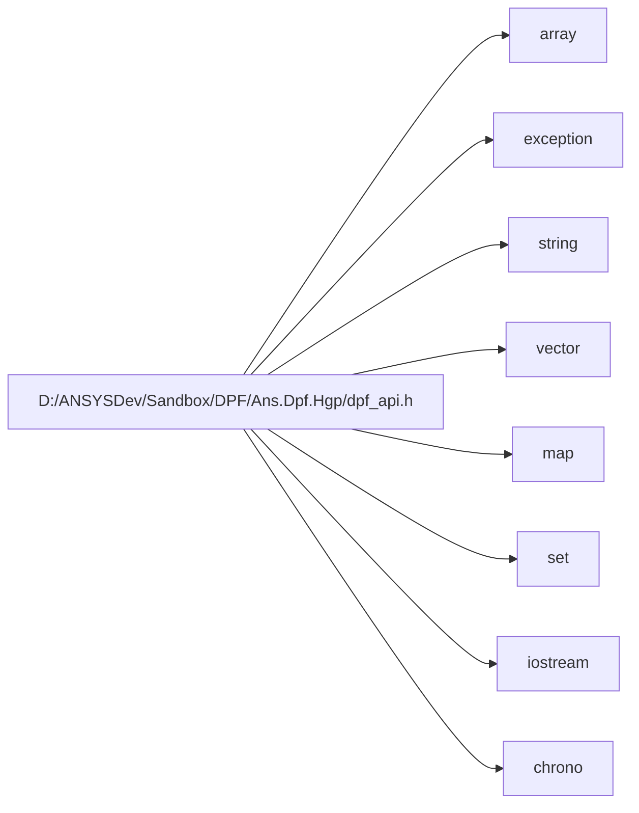

# File dpf\_api.h

<a id="dpf-api-h"></a>

![][C++]

**Location**: `dpf/include`


## Classes

* [ansys::dpf::ExternalData](classansys-dpf-externaldata.md#classansys-dpf-externaldata)
* [ansys::dpf::ExternalDataT](classansys-dpf-externaldatat.md#classansys-dpf-externaldatat)
* [ansys::dpf::array\_to\_pointer\_decay](structansys-dpf-array-to-pointer-decay.md#structansys-dpf-array-to-pointer-decay)
* [ansys::dpf::array\_to\_pointer\_decay\< T[N]\>](structansys-dpf-array-to-pointer-decay-t-fn-e.md#structansys-dpf-array-to-pointer-decay-t-fn-e-4)
* [ansys::dpf::ConstructHelpers](structansys-dpf-constructhelpers.md#structansys-dpf-constructhelpers)
* [ansys::dpf::ConstructHelpers::construct\_trait](structansys-dpf-constructhelpers-construct-trait.md#structansys-dpf-constructhelpers-construct-trait)
* [ansys::dpf::SemanticVersion](classansys-dpf-semanticversion.md#classansys-dpf-semanticversion)
* [ansys::dpf::Any](classansys-dpf-any.md#classansys-dpf-any)
* [ansys::dpf::Unit](classansys-dpf-unit.md#classansys-dpf-unit)
* [ansys::dpf::ResultInfo](classansys-dpf-resultinfo.md#classansys-dpf-resultinfo)
* [ansys::dpf::ResultInfo::Result](classansys-dpf-resultinfo-result.md#classansys-dpf-resultinfo-result)
* [ansys::dpf::ResultInfo::subresult](structansys-dpf-resultinfo-subresult.md#structansys-dpf-resultinfo-subresult)
* [ansys::dpf::FieldDefinition](classansys-dpf-fielddefinition.md#classansys-dpf-fielddefinition)
* [ansys::dpf::LabelSpace](classansys-dpf-labelspace.md#classansys-dpf-labelspace)
* [ansys::dpf::Scoping](classansys-dpf-scoping.md#classansys-dpf-scoping)
* [ansys::dpf::ElementCursor](classansys-dpf-elementcursor.md#classansys-dpf-elementcursor)
* [ansys::dpf::Support](classansys-dpf-support.md#classansys-dpf-support)
* [ansys::dpf::MeshedRegion](classansys-dpf-meshedregion.md#classansys-dpf-meshedregion)
* [ansys::dpf::TimeFreqSupport](classansys-dpf-timefreqsupport.md#classansys-dpf-timefreqsupport)
* [ansys::dpf::CyclicSupport](classansys-dpf-cyclicsupport.md#classansys-dpf-cyclicsupport)
* [ansys::dpf::GenericSupport](classansys-dpf-genericsupport.md#classansys-dpf-genericsupport)
* [ansys::dpf::DataTree](classansys-dpf-datatree.md#classansys-dpf-datatree)
* [ansys::dpf::CustomTypeField](classansys-dpf-customtypefield.md#classansys-dpf-customtypefield)
* [ansys::dpf::FieldCursor](classansys-dpf-fieldcursor.md#classansys-dpf-fieldcursor)
* [ansys::dpf::Field](classansys-dpf-field.md#classansys-dpf-field)
* [ansys::dpf::PropFieldCursor](classansys-dpf-propfieldcursor.md#classansys-dpf-propfieldcursor)
* [ansys::dpf::PropertyField](classansys-dpf-propertyfield.md#classansys-dpf-propertyfield)
* [ansys::dpf::StringField](classansys-dpf-stringfield.md#classansys-dpf-stringfield)
* [ansys::dpf::internal::set\_prop](structansys-dpf-internal-set-prop.md#structansys-dpf-internal-set-prop)
* [ansys::dpf::CollectionBase](classansys-dpf-collectionbase.md#classansys-dpf-collectionbase)
* [ansys::dpf::FieldsContainer](classansys-dpf-fieldscontainer.md#classansys-dpf-fieldscontainer)
* [ansys::dpf::ScopingsContainer](classansys-dpf-scopingscontainer.md#classansys-dpf-scopingscontainer)
* [ansys::dpf::MeshesContainer](classansys-dpf-meshescontainer.md#classansys-dpf-meshescontainer)
* [ansys::dpf::CustomTypeFieldsContainer](classansys-dpf-customtypefieldscontainer.md#classansys-dpf-customtypefieldscontainer)
* [ansys::dpf::Collection](classansys-dpf-collection.md#classansys-dpf-collection)
* [ansys::dpf::DataSources](classansys-dpf-datasources.md#classansys-dpf-datasources)
* [ansys::dpf::ExternalStream](classansys-dpf-externalstream.md#classansys-dpf-externalstream)
* [ansys::dpf::Streams](classansys-dpf-streams.md#classansys-dpf-streams)
* [ansys::dpf::GenericDataContainer](classansys-dpf-genericdatacontainer.md#classansys-dpf-genericdatacontainer)
* [ansys::dpf::Operator](classansys-dpf-operator.md#classansys-dpf-operator)
* [ansys::dpf::CacheInformation](classansys-dpf-cacheinformation.md#classansys-dpf-cacheinformation)
* [ansys::dpf::CacheInformation::LevelAndDestination](classansys-dpf-cacheinformation-levelanddestination.md#classansys-dpf-cacheinformation-levelanddestination)
* [ansys::dpf::Workflow](classansys-dpf-workflow.md#classansys-dpf-workflow)
* [ansys::dpf::OperatorConfig](classansys-dpf-operatorconfig.md#classansys-dpf-operatorconfig)
* [ansys::dpf::OperatorConfig::options](structansys-dpf-operatorconfig-options.md#structansys-dpf-operatorconfig-options)
* [ansys::dpf::CustomContainerBase](classansys-dpf-customcontainerbase.md#classansys-dpf-customcontainerbase)
* [ansys::dpf::MeshInfo](classansys-dpf-meshinfo.md#classansys-dpf-meshinfo)
* [ansys::dpf::Mapping](classansys-dpf-mapping.md#classansys-dpf-mapping)
* [ansys::dpf::Interface](classansys-dpf-interface.md#classansys-dpf-interface)
* [ansys::dpf::WorkflowStep](classansys-dpf-workflowstep.md#classansys-dpf-workflowstep)
* [ansys::dpf::OperatorMain](classansys-dpf-operatormain.md#classansys-dpf-operatormain)
* [ansys::dpf::OperatorDerivativeMain](classansys-dpf-operatorderivativemain.md#classansys-dpf-operatorderivativemain)
* [ansys::dpf::PinDefinition](structansys-dpf-pindefinition.md#structansys-dpf-pindefinition)
* [ansys::dpf::ConfigOptionSpecification](structansys-dpf-configoptionspecification.md#structansys-dpf-configoptionspecification)
* [ansys::dpf::OperatorSpecification](classansys-dpf-operatorspecification.md#classansys-dpf-operatorspecification)
* [ansys::dpf::RemoteOperator](classansys-dpf-remoteoperator.md#classansys-dpf-remoteoperator)
* [ansys::dpf::RemoteWorkflow](classansys-dpf-remoteworkflow.md#classansys-dpf-remoteworkflow)
* [ansys::dpf::EventHandler](classansys-dpf-eventhandler.md#classansys-dpf-eventhandler)
* [ansys::dpf::Session](classansys-dpf-session.md#classansys-dpf-session)
* [ansys::dpf::RuntimeConfig](classansys-dpf-runtimeconfig.md#classansys-dpf-runtimeconfig)
* [ansys::dpf::RuntimeCoreConfig](classansys-dpf-runtimecoreconfig.md#classansys-dpf-runtimecoreconfig)
* [ansys::dpf::RuntimeClientConfig](classansys-dpf-runtimeclientconfig.md#classansys-dpf-runtimeclientconfig)
* [ansys::dpf::Changelog](classansys-dpf-changelog.md#classansys-dpf-changelog)
* [ansys::dpf::core](classansys-dpf-core.md#classansys-dpf-core)
* [ansys::dpf::core::FbsServerData](structansys-dpf-core-fbsserverdata.md#structansys-dpf-core-fbsserverdata)
* [ansys::dpf::core::trace](structansys-dpf-core-trace.md#structansys-dpf-core-trace)
* [ansys::dpf::core::path\_utilities](structansys-dpf-core-path-utilities.md#structansys-dpf-core-path-utilities)
* [ansys::dpf::core::logging](structansys-dpf-core-logging.md#structansys-dpf-core-logging)
* [ansys::dpf::core::logging::LoggerConfig](classansys-dpf-core-logging-loggerconfig.md#classansys-dpf-core-logging-loggerconfig)
* [ansys::dpf::core::logging::internal](structansys-dpf-core-logging-internal.md#structansys-dpf-core-logging-internal)
* [ansys::dpf::core::logging::Logger](classansys-dpf-core-logging-logger.md#classansys-dpf-core-logging-logger)
* [ansys::dpf::reflect\< Field \>](structansys-dpf-reflect-field.md#structansys-dpf-reflect-field-4)
* [ansys::dpf::reflect\< FieldsContainer \>](structansys-dpf-reflect-fieldscontainer.md#structansys-dpf-reflect-fieldscontainer-4)
* [ansys::dpf::reflect\< MeshedRegion \>](structansys-dpf-reflect-meshedregion.md#structansys-dpf-reflect-meshedregion-4)
* [ansys::dpf::reflect\< DataSources \>](structansys-dpf-reflect-datasources.md#structansys-dpf-reflect-datasources-4)
* [ansys::dpf::reflect\< Streams \>](structansys-dpf-reflect-streams.md#structansys-dpf-reflect-streams-4)
* [ansys::dpf::reflect\< Scoping \>](structansys-dpf-reflect-scoping.md#structansys-dpf-reflect-scoping-4)
* [ansys::dpf::reflect\< ScopingsContainer \>](structansys-dpf-reflect-scopingscontainer.md#structansys-dpf-reflect-scopingscontainer-4)
* [ansys::dpf::reflect\< MeshesContainer \>](structansys-dpf-reflect-meshescontainer.md#structansys-dpf-reflect-meshescontainer-4)
* [ansys::dpf::reflect\< PropertyField \>](structansys-dpf-reflect-propertyfield.md#structansys-dpf-reflect-propertyfield-4)
* [ansys::dpf::reflect\< ResultInfo \>](structansys-dpf-reflect-resultinfo.md#structansys-dpf-reflect-resultinfo-4)
* [ansys::dpf::reflect\< TimeFreqSupport \>](structansys-dpf-reflect-timefreqsupport.md#structansys-dpf-reflect-timefreqsupport-4)
* [ansys::dpf::reflect\< DataTree \>](structansys-dpf-reflect-datatree.md#structansys-dpf-reflect-datatree-4)
* [ansys::dpf::reflect\< Workflow \>](structansys-dpf-reflect-workflow.md#structansys-dpf-reflect-workflow-4)
* [ansys::dpf::reflect\< Operator \>](structansys-dpf-reflect-operator.md#structansys-dpf-reflect-operator-4)
* [ansys::dpf::reflect\< RemoteOperator \>](structansys-dpf-reflect-remoteoperator.md#structansys-dpf-reflect-remoteoperator-4)
* [ansys::dpf::reflect\< RemoteWorkflow \>](structansys-dpf-reflect-remoteworkflow.md#structansys-dpf-reflect-remoteworkflow-4)
* [ansys::dpf::reflect\< StringField \>](structansys-dpf-reflect-stringfield.md#structansys-dpf-reflect-stringfield-4)
* [ansys::dpf::reflect\< CustomTypeField \>](structansys-dpf-reflect-customtypefield.md#structansys-dpf-reflect-customtypefield-4)
* [ansys::dpf::reflect\< LabelSpace \>](structansys-dpf-reflect-labelspace.md#structansys-dpf-reflect-labelspace-4)
* [ansys::dpf::reflect\< GenericDataContainer \>](structansys-dpf-reflect-genericdatacontainer.md#structansys-dpf-reflect-genericdatacontainer-4)
* [ansys::dpf::reflect\< CustomTypeFieldsContainer \>](structansys-dpf-reflect-customtypefieldscontainer.md#structansys-dpf-reflect-customtypefieldscontainer-4)
* [ansys::dpf::ConstructHelpers::construct\_trait\< DataT, std::false\_type \>](structansys-dpf-constructhelpers-construct-trait-datat-std-false-type.md#structansys-dpf-constructhelpers-construct-trait-datat-std-false-type-4)
* [ansys::dpf::ConstructHelpers::construct\_trait\< DataT, std::true\_type \>](structansys-dpf-constructhelpers-construct-trait-datat-std-true-type.md#structansys-dpf-constructhelpers-construct-trait-datat-std-true-type-4)
* [ansys::dpf::ConstructHelpers::construct\_trait\< Collection\< DataT \>, std::false\_type \>](structansys-dpf-constructhelpers-construct-trait-collection-datat-4-std-false-type.md#structansys-dpf-constructhelpers-construct-trait-collection-datat-4-std-false-type-4)
* [ansys::dpf::ConstructHelpers::construct\_trait\< Any, std::true\_type \>](structansys-dpf-constructhelpers-construct-trait-any-std-true-type.md#structansys-dpf-constructhelpers-construct-trait-any-std-true-type-4)
* [ansys::dpf::LicenseContextManager](classansys-dpf-licensecontextmanager.md#classansys-dpf-licensecontextmanager)
* [ansys::dpf::internal::set\_prop\< T, std::true\_type, std::false\_type \>](structansys-dpf-internal-set-prop-t-std-true-type-std-false-type.md#structansys-dpf-internal-set-prop-t-std-true-type-std-false-type-4)
* [ansys::dpf::internal::set\_prop\< T, std::false\_type, std::true\_type \>](structansys-dpf-internal-set-prop-t-std-false-type-std-true-type.md#structansys-dpf-internal-set-prop-t-std-false-type-std-true-type-4)

## Namespaces

* [ansys](namespaceansys.md#namespaceansys)
* [ansys::dpf](namespaceansys-dpf.md#namespaceansys-dpf)
* [ansys::dpf::internal](namespaceansys-dpf-internal.md#namespaceansys-dpf-internal)

## Includes

* <array>
* <exception>
* <string>
* <vector>
* <map>
* <set>
* <iostream>
* <chrono>
* [dpf_api_base.h](dpf-api-base-h.md#dpf-api-base-h)





## Included by

* [dpf/include/helpers/dpf_meshQuery.h](dpf-meshquery-h.md#dpf-meshquery-h)
* [dpf/include/helpers/dpf_model.h](dpf-model-h.md#dpf-model-h)
* [dpf/include/helpers/dpf_result.h](dpf-result-h.md#dpf-result-h)

## Macros

<a id="dpf-api-h-1aa7b82ff30bf3b55d7bb8052674f98d16"></a>
### Macro CALL\_CONVENTION

![][public]


```cpp
#define CALL_CONVENTION __stdcall
```


## Source


```cpp
//
//
// COPYRIGHT ANSYS. ALL RIGHTS RESERVED.
//
#pragma once

#include <array>
#include <exception>
#include <string>
#include <vector>
#include <map>
#include <set>
#include <iostream>
#include <chrono>

#include "dpf_api_base.h"

struct IAnsDispatch;

namespace ansys
{
namespace dpf
{
    
    class OperatorSpecification;
    class AbstractCore;
    class ExternalData;   

#ifdef __linux__
#define CALL_CONVENTION
    typedef void(*OperatorCallBack)(void*, opaque::DpfOperatorData*);
    typedef void(*OperatorDerivCallBack)(void*, opaque::DpfOperatorDerivData*);
    typedef void(*EventReception)(void*, int, const char*);
    typedef void(*ExternalDataDeleter)(ExternalData*);
#else
#define CALL_CONVENTION __stdcall
    typedef void(__stdcall* OperatorCallBack)(void*, opaque::DpfOperatorData*);
    typedef void(__stdcall* OperatorDerivCallBack)(void*, opaque::DpfOperatorDerivData*);
    typedef void(__stdcall* EventReception)(void*, int, const char*);
    typedef void(__stdcall* ExternalDataDeleter)(ExternalData*);
#endif


    class core;
    class Operator;
    class Scoping;
    class OperatorConfig;
    class MeshedRegion;
    class Field;
    class DataSources;
    class Workflow;
    class FieldsContainer;
    class ScopingsContainer;
    class MeshesContainer;
    class TimeFreqSupport;
    class PropertyField;
    class EventHandler;
    class Mapping;
    class Unit;
    class OperatorMain;
    class OperatorDerivativeMain;
    class Support;
    class DataTree;
    class CyclicSupport;
    class RemoteWorkflow; 
    class RemoteOperator;
    class Streams;
    class ResultInfo;
    class LabelSpace;
    class StringField;
    class GenericDataContainer;
    class CustomContainerBase;
    class MeshInfo;
    class CustomTypeField;
    class CustomTypeFieldsContainer;
    class Any;
    template<typename DataT>
    class Collection;
    typedef void(*OperatorMainFunction)(OperatorMain&);
    typedef void(*OperatorDerivateFunction)(OperatorDerivativeMain&);

    using FbsClient = Any;

    class ExternalData
    {
    public:
        virtual ~ExternalData() {}
    };

    template <typename DataT>
    class ExternalDataT : public ExternalData
    {
    private:
        DataT _data;

    public:
        ExternalDataT(DataT const& d 
        ): _data(d){}
        virtual ~ExternalDataT() {}
        DataT& get() { return _data; }
        DataT const& get() const { return _data; }

    };

    template<class T>
    struct array_to_pointer_decay
    {
        typedef T type;
    };

    template<class T, std::size_t N>
    struct array_to_pointer_decay<T[N]>
    {
        typedef const T* type;
    };
    template <class T>
    using HasGenericDataContainerConstructor = std::is_constructible<T, ansys::dpf::GenericDataContainer const&>;

    struct ConstructHelpers {
    public:
        template <typename DataT, typename IsGDC = typename HasGenericDataContainerConstructor<DataT>::type>
        struct construct_trait
        {
        };
    };

    class SemanticVersion {
        uint16_t _major;
        uint16_t _minor;
        uint16_t _patch;
        friend OperatorSpecification;
        friend class Changelog;
            SemanticVersion(const std::string version_str);
        public:
            SemanticVersion(uint16_t major, uint16_t minor, uint16_t patch);
            virtual ~SemanticVersion();

            uint16_t getMajor() const;
            uint16_t getMinor() const;
            uint16_t getPatch() const;

            std::string toString() const;

            bool operator==(const SemanticVersion& other) const;
            bool operator!=(const SemanticVersion& other) const;
    };

    class Any : public DpfTypes {
        friend class OperatorMain;
        friend class Operator;
        friend class Workflow;
        friend class GenericDataContainer;
        friend class CollectionBase;
        friend class core;

        template <typename DataT, typename IsGDC>
        friend struct ConstructHelpers::construct_trait;

    private:
        Any(opaque::DpfInternalSharedObject*);
        bool objectIsOfType(std::string const& type_name) const;

        template <typename DataT>
        void specializedConstructor(const DataT& value, Client const* const client)
        {
            ConstructHelpers::construct_trait<DataT>::createAny(*this, value, client);
        }
        template <typename DataT>
        void internalSpecializedConstructor(const DataT& value, Client const* const client);
        template <typename DataT>
        void internalCollectionSpecializedConstructor(const Collection<DataT>& value, Client const* const /*client*/) {
            this->setInternalObj(opaqueNewFromCollection(value.internalObj()));
        }

    public:
        virtual ~Any() {
        }
        template <typename DataT>
        explicit Any(const DataT& value, Client const* const client = nullptr) {
            typedef typename array_to_pointer_decay<DataT>::type src;

            this->specializedConstructor<src>(value, client);
        }

        Any(Any const&);
        Any(Any&&) noexcept;
        // @brief Internal function allowing to create a DPF Object from a Fbs Reference content
        // @deprecated Will be removed in future versions, use createFromFbsReference instead
        static Any createFromFbsReference(const opaque::FbsChannel* channel, std::string const& address, const opaque::FbsSlice* req_slice, size_t req_offset, const ansys::dpf::Client* client = nullptr);
        static Any createFromFbsReference(FbsClient const& fbs_client, const opaque::FbsSlice* req_slice, const ansys::dpf::Client* client=nullptr);
        Any& operator=(Any const&);
        Any& operator=(Any&&) noexcept;
        static Any retrieveFromServer(int id 
            , Client const* const client
        );
        std::string wrappedType();

        template <typename DataT>
        bool testType() const{
            return objectIsOfType(reflect<DataT>::type_name());
        }

        template <typename DataT>
        DataT get() const
        {
            return ConstructHelpers::construct_trait<DataT>::getFromAny(*this);
        }
        dp_int getAsInt() const;
        std::string getAsString() const;
        double getAsDouble() const;
        DpfVector<int> getAsIntVector() const;
        Field getAsField() const;
        PropertyField getAsPropertyField() const;
        Scoping getAsScoping() const;
        FieldsContainer getAsFieldsContainer() const;
        ScopingsContainer getAsScopingsContainer() const;
        MeshesContainer getAsMeshesContainer() const;
        TimeFreqSupport getAsTimeFreqSupport() const;
        MeshedRegion getAsMeshedRegion() const;
        Streams getAsStreams() const;
        ResultInfo getAsResultInfo() const;
        DataTree getAsDataTree() const;
        Workflow getAsWorkflow() const;
        Operator getAsOperator() const;
        CyclicSupport getAsCyclicSupport() const;
        DataSources getAsDataSources() const;
        StringField getAsStringField() const;
        GenericDataContainer getAsGenericDataContainer() const;
        CustomTypeFieldsContainer getAsCustomTypeFieldsContainer() const;
        CustomTypeField getAsCustomTypeField() const;
        LabelSpace getAsLabelSpace() const;
        template<typename DataT>
        Collection<DataT> getAsCollection() const { return Collection<DataT>(opaqueGetAsCollection()); }
        
        // @brief Internal method allowing to Fbs Reference content from a shared object.
        void getAsFbsReference(opaque::FbsChannel*& client, std::string& address, opaque::FbsSlice*& req_slice, size_t& req_offset) const;

        Any deep_copy(ansys::dpf::Client const* const client = nullptr 
        ) const;

        static Any emptyAny();

    private:

        template <typename DataT>
        DataT internalGet() const;
        template <typename DataT>
        Collection<DataT> internalGetCollection() const {
            return this->getAsCollection<DataT>();
        }
        opaque::DpfInternalSharedObject* opaqueGetAsCollection() const;
        opaque::DpfObject* opaqueNewFromCollection(opaque::DpfObject* value);
    };


    class Unit
    {
    private:
        Homogeneity _homo;
        std::string _symbol;
    public:
        Unit();
        explicit Unit(std::string const& symbol 
        );
        explicit Unit(Homogeneity const& homogeneity, 
            UnitSystem const& unit_system 
        );

        explicit Unit(Homogeneity const& homogeneity, 
            std::string const& symbol 
        );
        bool operator==(Unit const& unit)const;
        double conversionFactorTo(Unit const& rhs 
        ) const;
        double shiftTo(Unit const& rhs 
        ) const;
        bool isHomogeneousTo(Unit const&) const;
        ansys::dpf::Homogeneity const& homogeneity() const;
        std::string const& toString() const;
        const char* c_str() const;
        Unit multiplyWith(Unit const& rhs) const;
        Unit divideBy(Unit const& rhs) const;
        Unit invert() const;
        Unit pow(double power) const;
        static Homogeneity HomogeneityIdToHomogeneity(int id);
    };

    typedef std::vector<LabelSpace> LabelSpacesVector;

    class ResultInfo : public DpfTypes
    {
        friend class Operator;
        friend class OperatorMain;
        friend class Workflow;
        friend class Any;
        friend class GenericDataContainer;
        friend class core;

        struct subresult;

    public:
        class Result
        {
            friend class ResultInfo;
        private:
            std::string _name; 
            std::string _opname; 
            ansys::dpf::Homogeneity _homogeneity;
            ansys::dpf::Unit _unit; 
            std::string _description;
            ansys::dpf::Location _location; 
            std::string _scriptingName; 
            std::map<std::string, subresult> _subResults;
            ansys::dpf::Dimensionality _dimensionality; 
            LabelSpacesVector _qualifiers;
        public:
            Result() : 
                _name(),
                _opname(),
                _homogeneity(),
                _unit(),
                _description(),
                _location(ansys::dpf::Location("")),
                _scriptingName(),
                _subResults(),
                _dimensionality(ansys::dpf::dimensionalities::scalar),
                _qualifiers()
                {}

            Result(std::string const& operator_name 
                , std::string const& scripting_name 
                , ansys::dpf::Dimensionality dimensionality 
                , ansys::dpf::Location const& location 
                , ansys::dpf::Homogeneity const& homogeneity 
                , std::string const& description = "" 
            );

            void addAvailableQualifiers(LabelSpacesVector const& available_qualifiers);

            std::string const& resultName()const;
            std::string const& operatorName() const;
            std::string const& scriptingName() const;
            ansys::dpf::Homogeneity const& homogeneity() const;

            std::string const& description() const;
            ansys::dpf::Location const& location() const;
            ansys::dpf::Dimensionality const& dimensionality() const;
        };

    private:
        struct subresult
        {
            std::string name;
            std::string opname;
            std::string description;

            subresult() {}
        };
        ResultInfo(opaque::DpfInternalSharedObject*);
        mutable std::map<std::string, Result> _results;
        mutable bool _resultsUpToDate;

        void fillResults() const;
        void getResult(dp_int idx, ResultInfo::Result & res)const;
        std::map<std::string, subresult> getSubResults(dp_int idx) const;
        std::string name(dp_index result_index) const;
        std::string opname(dp_index result_index) const;
        std::string scriptingName(dp_index result_index) const;
        ansys::dpf::Location location(dp_index result_index) const;
        std::string description(dp_index result_index) const;
        ansys::dpf::Unit unit(dp_index result_index) const;
        dp_int numberOfSubResults(dp_index result_index) const;
        ansys::dpf::Dimensionality dimensionality(dp_index result_index) const;
        LabelSpacesVector qualifiers(dp_index result_index) const;
        std::string subName(dp_index result_index, dp_index sub_result_index) const;
        std::string subOpName(dp_index result_index, dp_index sub_result_index) const;
        std::string subDescription(dp_index result_index, dp_index sub_result_index) const;
        const Result &getResult(std::string const& res_name)const;
        void unvalidateResults();

    public:
        enum analysis_type { 
            eStatic = 0,
            eBukling = 1, 
            eModal = 2, 
            eHarmonic = 3, 
            eCMS = 4, 
            eTransient = 5, 
            eMSUP = 6, 
            eSubStruct = 7, 
            eSpectrum = 8, 
            eUnknownAnalysis = 9,
            ePSD = 10
        };
        enum physics_type {
            eMecanic = 0, 
            eThermal = 1, 
            eMagnetic = 2, 
            eElectric = 3,
            eFluid = 5,
            eUnknownPhysics = 4
        };

        ResultInfo(analysis_type const& analysis_type = analysis_type::eUnknownAnalysis, physics_type const& physics_type = physics_type::eUnknownPhysics);
        virtual ~ResultInfo();
        ResultInfo(ResultInfo const&);
        ResultInfo(ResultInfo&&) noexcept;
        ResultInfo& operator=(ResultInfo const&);
        ResultInfo& operator=(ResultInfo&&) noexcept;

        analysis_type analysisType() const;
        physics_type physicsType() const;
        UnitSystem unitSystem() const;
        std::string analysisTypeName() const;
        std::string physicsTypeName() const;
        std::string unitSystemName() const;
        dp_int numberOfResults() const;
        std::set<std::string> availableResults() const;
        std::string resultNameByOperatorName(std::string const& op_name 
        )const;
        std::string operatorName(std::string const& res_name 
        ) const;
        std::string scriptingName(std::string const& res_name 
        ) const;
        ansys::dpf::Unit unit(std::string const& res_name 
        ) const;
        dp_int numberOfComponents(std::string const& res_name 
        ) const;
        std::string description(std::string const& res_name 
        ) const;
        ansys::dpf::Location location(std::string const& res_name 
        ) const;
        Dimensionality::ENature nature(std::string const& res_name 
        ) const;

        LabelSpacesVector qualifiers(std::string const& res_name 
        ) const;

        dp_int numberOfSubResults(std::string const& res_name 
        ) const;
        std::set<std::string> availableSubResults(std::string const& res_name 
        ) const;
        std::string subResultOperatorName(std::string const& res_name, 
            std::string const& subres_name 
        ) const;
        std::string subResultDescription(std::string const& res_name, 
            std::string const& subres_name 
        ) const;
        bool operatorNameIsAvailable(std::string const& op_name 
        )const;
        void solver_version(int &major_version, 
            int &minor_version 
        ) const;
        void solve_date_time(int &solve_date, 
            int &solve_time 
        ) const;
        std::string user_name() const;
        std::string job_name() const;
        std::string product_name() const;
        std::string main_title() const;
        CyclicSupport getCyclicSupport()const;

        bool hasCyclicSymmetry(std::string &cyc_symmetry_type
        )const;
        bool hasCyclicSymmetry()const;
        
        std::string getStringProperty(std::string const& property_name)const;
        int getIntProperty(std::string const& property_name)const;

        std::vector<std::string> availableQualifierLabels() const;

        ansys::dpf::Support qualifierTypeSupport(ansys::dpf::Label const& qualifier 
        )const;

        //setters
        void setUnitSystem(UnitSystem const& unit_system);
        void addResult(std::string const& operator_name 
            , std::string const& scripting_name 
            , ansys::dpf::Dimensionality dimensionality 
            , ansys::dpf::Location const& location 
            , ansys::dpf::Homogeneity const& homogeneity 
            , std::string const& description = "" 
        );
        void addResult(Result const& res);

        void addProperties(std::vector<std::pair<std::string, std::string>>const& properties 
        );
        void addProperties(std::vector<std::pair<std::string, int>>const& properties 
        );

        void addAvailableQualifiersForAllResults(LabelSpacesVector const& available_qualifiers);

        void setQualifierLabelSupport(ansys::dpf::Label const& qualifier 
            , ansys::dpf::Support const& support 
        );

        static ResultInfo emptyResultInfo();

    private:
        opaque::DpfInternalSharedObject* instantiateLabelSpacesVector(LabelSpacesVector const& available_qualifiers);
    };

    class FieldDefinition : public DpfTypes
    {
        friend class Field;
        friend class CustomTypeField;
        friend class GenericDataContainer;
        friend class PropertyField;
        friend class core;

    private:
        FieldDefinition(opaque::DpfInternalSharedObject*);
        void copyAttributes(FieldDefinition const&);
    public:
        FieldDefinition(); 
        FieldDefinition(Client const* const client 
        );
        virtual ~FieldDefinition();
        FieldDefinition(FieldDefinition const&);
        FieldDefinition(FieldDefinition &&) noexcept;
        FieldDefinition(const ansys::dpf::Location &loc, 
            const std::vector<dp_int> &dimensions 
        );
        FieldDefinition(const ansys::dpf::Location &loc, 
            const std::vector<dp_int> &dimensions, 
            const Unit & unit 
        );
        FieldDefinition(Client const* const client, 
            const ansys::dpf::Location& loc, 
            const std::vector<dp_int>& dimensions 
        );
        FieldDefinition(Client const* const client, 
            const ansys::dpf::Location& loc, 
            const std::vector<dp_int>& dimensions, 
            const Unit& unit 
        );
        FieldDefinition& operator=(FieldDefinition const&);
        FieldDefinition& operator=(FieldDefinition &&) noexcept;

        ansys::dpf::Unit unit() const;
        std::vector<dp_int> dimensions() const;
        ansys::dpf::Location location() const;

        std::string name() const;

        eshellLayers shellLayers() const;

        void setName(std::string const& rhs );

        void setLocation(ansys::dpf::Location const& rhs 
        );
        void setUnit(ansys::dpf::Unit const& rhs 
        );
        void setDimensions(std::vector<dp_int> const& rhs, 
            int effective_size 
        );
        void setDimensions(std::vector<dp_int> const& rhs 
        );
        void setShellLayers(ansys::dpf::eshellLayers layers 
        );

        FieldDefinition deep_copy(ansys::dpf::Client const* const client = nullptr 
        )const;
        bool isOfQuantityType(QuantityType const &quantitytype) const;

        void setQuantityType(QuantityType const& quantitytype);

        int numberOfQuantityTypes() const;

        std::string quantity_type(int i) const;

        static FieldDefinition emptyFieldDefinition();
    };

    class LabelSpace : public DpfTypes
    {
        friend class CollectionBase;
        friend class DataSources;
        friend class Streams;
        friend class ResultInfo;
        friend class Operator;
        friend class Workflow;
        friend class OperatorMain;
        friend class GenericDataContainer;
        friend class core;
        friend class Any;

    private:
        LabelSpace(opaque::DpfInternalSharedObject*);

    public:
        LabelSpace();
        LabelSpace(Client const* const client 
        );
        LabelSpace(std::map<Label, dp_int> const& rhs, 
            Client const* const client 
        );
        LabelSpace(std::initializer_list<std::pair<const Label, int>> init, 
            Client const* const client 
        );
        LabelSpace(std::map<Label, dp_int> const& rhs 
        );
        LabelSpace(std::initializer_list<std::pair<const Label, int>> init 
        );
        virtual ~LabelSpace();
        LabelSpace(LabelSpace const&);
        LabelSpace(LabelSpace &&) noexcept;
        LabelSpace& operator=(LabelSpace const&);
        LabelSpace& operator=(LabelSpace &&) noexcept;

        void add(Label const& label, 
            dp_int value 
        );
        void set(Label const& label, 
            dp_int value 
        );
        void erase(Label const& label 
        );

        dp_int size() const;
        bool has(Label const& label 
        ) const;
        dp_int at(Label const& label 
        ) const;
        std::string labelsName(dp_index index 
        ) const;

        LabelSpace& setTime(dp_index i 
        );
        LabelSpace& setDomain(dp_index i 
        );
        LabelSpace& setComplex(dp_index i 
        );
        LabelSpace& addAnyTime();
        LabelSpace& addAnyDomain();

        LabelSpace deep_copy(ansys::dpf::Client const* const client = nullptr 
        )const;

        void mergeWith(ansys::dpf::LabelSpace const other);

        static LabelSpace emptyLabelSpace();
    };

    class Scoping : public DpfTypes
    {
        friend class Field;
        friend class CustomTypeField;
        friend class Workflow;
        friend class Operator;
        friend class MeshedRegion;
        friend class PropertyField;
        friend class StringField;
        friend class CyclicSupport; 
        friend class CollectionBase;
        friend class OperatorMain;
        friend class TimeFreqSupport;
        friend class GenericDataContainer;
        friend class Any;
        friend class core;

    private:
        Scoping(opaque::DpfInternalSharedObject*);

    public:
        Scoping();
        Scoping(std::vector<dp_id> const& ids, 
            ansys::dpf::Location location 
        );
        Scoping(std::vector<dp_id> const& ids, 
            ansys::dpf::Location location 
            , Client const* const client 
        );
        Scoping(Client const* const client 
        );
        Scoping(int id 
            , Client const* const client
        );
        virtual ~Scoping();
        Scoping(Scoping const&);
        Scoping(Scoping &&) noexcept;
        Scoping& operator=(Scoping const&);
        Scoping& operator=(Scoping &&) noexcept;

        ansys::dpf::Location location() const;
        void setLocation(ansys::dpf::Location location 
        );

        void setIds(std::vector<dp_id> const& ids 
        );
        void setIds(dp_id* ids, 
            dp_int size 
        );

        bool identicalPointers(Scoping const& f 
        ) const;

        dp_int size() const;
        dp_id idByIndex(dp_int index 
        ) const;
        dp_index indexById(dp_int id 
        ) const;
        dp_id at(dp_int index) const;

        const dp_id* ids(dp_int& size 
        ) const;

        DpfVector<int> ids() const;

        void getIds(std::vector<dp_id>& ids_to_fill 
        ) const;

        void emplace(dp_index index, 
            dp_id id 
        );

        std::string hashIds()const;

        void reserve(dp_int size);
        void resize(dp_int size);
        static Scoping emptyScoping();

        std::string getHashableKey() const;
        void setHashableKey(const std::string& unique_identifier) const;

        size_t getHash() const;

        Scoping deep_copy(ansys::dpf::Client const* const client = nullptr, 
            const bool b_copy_ids = true 
        )const;
    };


    class ElementCursor
    {
    public:
        friend class MeshedRegion;

    private:
        const ElementDescriptor* _descriptor;
        const dp_int* _connectivity;
        dp_int _effective_size;
        dp_id _id;
        bool _is_defined;

    public:
        ElementCursor() :
            _descriptor(nullptr),
            _connectivity(nullptr),
            _effective_size(0),
            _id(0),
            _is_defined(false)
        {}
        ElementCursor(ElementCursor const&) = delete;
        ElementCursor(ElementCursor&&) = delete;

        inline ElementDescriptor const& descriptor() const { return *_descriptor; }
        inline dp_int numberOfNodes() const { return _descriptor->number_of_nodes; }
        inline dp_int numberOfCornerNodes() const { return _descriptor->number_of_corner_nodes; }
        inline dp_int numberOfMidNodes() const { return _descriptor->number_of_mid_nodes; }
        inline dp_int effectiveSize() const { return _effective_size; }
        inline bool defined() const { return _is_defined; }
        inline dp_id id() const { return _id; }
        inline dp_index operator[](dp_index i 
            ) const {
            return _connectivity[i];
        }
    };

    class Support : public DpfTypes
    {
    public:
        friend class Field;
        friend class CustomTypeField;
        friend class PropertyField;
        friend class CollectionBase;
        friend class Operator;
        friend class Workflow;
        friend class OperatorMain;
        friend class ResultInfo;
        friend class Any;
        friend class GenericDataContainer;
        friend class core;

    protected:
        Support(opaque::DpfInternalSharedObject*);

    public:
        virtual ~Support();
        Support(Support const&);
        Support(Support&&) noexcept;
        Support& operator=(Support const&);
        Support& operator=(Support&&) noexcept;

        bool isMeshedDomain() const;
        MeshedRegion getAsDomainMesh() const;
        CyclicSupport getAsCyclicSupport() const;
        TimeFreqSupport getAsTimeFreqSupport() const;

        Field getFieldSupportByProperty(PropertyType const& property_name)const;
        PropertyField getPropertyFieldSupportByProperty(PropertyType const& property_name)const;
        StringField getStringFieldSupportByProperty(PropertyType const& property_name)const;
        std::vector<std::string> getAvailablePropertyNamesForFields()const;
        std::vector<std::string> getAvailablePropertyNamesForPropertyFields()const;
        std::vector<std::string> getAvailablePropertyNamesForStringFields()const;

        Support deep_copy(ansys::dpf::Client const* const client = nullptr 
        )const;

        static Support emptySupport();
    };

    class MeshedRegion : public DpfTypes
    {
        friend class Operator;
        friend class Workflow;
        friend class CollectionBase;
        friend class Support;
        friend class Field;
        friend class PropertyField;
        friend class CustomTypeField;
        friend class OperatorMain;
        friend class Any;
        friend class GenericDataContainer;
        friend class core;

    private:
        MeshedRegion(opaque::DpfInternalSharedObject*);

    public:
        MeshedRegion();
        MeshedRegion(Client const* const client 
        );
        MeshedRegion(int id 
            , Client const* const client
        );

        static MeshedRegion emptyMeshedRegion();

        virtual ~MeshedRegion();
        MeshedRegion(MeshedRegion const&);
        MeshedRegion(MeshedRegion&&) noexcept;
        MeshedRegion& operator=(MeshedRegion const&);
        MeshedRegion& operator=(MeshedRegion&&) noexcept;

        dp_int numberOfNodes() const;
        dp_int numberOfElements() const;
        dp_int numberOfFaces() const;

        Unit lengthUnit() const;
        Field nodesCoordinates()const;
        PropertyField propField(PropertyType const& prop 
        ) const;
        bool hasPropField(PropertyType const& prop 
        ) const;
        std::vector<std::string> availablePropertyFields() const;
        PropertyField elementTypes()const;
        PropertyField connectivity()const;
        Scoping nodeScoping()const;
        Scoping elementScoping()const;
        Scoping faceScoping()const;
        std::vector<std::string> availableNamedSelections() const;
        Scoping namedSelection(std::string const& name 
        )const;

        void fillCursor(dp_index element_index, 
            ElementCursor& cursor 
        ) const;

        void prepareConstruction(dp_int n_nodes, 
            dp_int n_elements 
        );
        void addNode(dp_id node_id, 
            std::array<dp_double, 3> const& data 
        );
        void addNode(dp_id node_id, 
            dp_double* const data 
        );
        void addElement(ElementDescriptor const& descriptor, 
            dp_id elem_id, 
            std::vector<dp_index> const& node_indices 
        );
        void addElement(ansys::dpf::elements::EShape shape, 
            dp_id elem_id, 
            std::vector<dp_index> const& node_indices 
        );
        void setLengthUnit(Unit const& unit 
        );
        void setNamedSelectionScoping(std::string const& name, 
            Scoping scoping 
        );
        void setPropertyField(std::string const& name, 
            PropertyField property_field 
        );
        void setConnectivity(
            PropertyField connectivity 
        );
        void setElementTypes(
            PropertyField element_types 
        );
        void setNodesCoordinates(
            Field coordinates 
        );

        bool hasBeam() const;
        bool hasOnlyBeam() const;
        bool hasShell() const;
        bool hasOnlyShell() const;
        bool hasPoint() const;
        bool hasOnlyPoint() const;
        bool hasSolid() const;
        bool hasOnlySolid() const;
        bool hasSkin() const;
        bool hasOnlySkin() const;
        bool hasPolygons() const;
        bool hasPolyhedrons() const;

        ansys::dpf::ElementDescriptor elementDescriptorByElementId(dp_id element_id) const;
        ansys::dpf::elements::EShape elementShape(dp_id element_id) const;
        int numNodesOfElement(dp_index element_index) const;

        std::string name() const;

        void setName(std::string const& rhs);

        MeshedRegion deep_copy(ansys::dpf::Client const* const client = nullptr 
        )const;

    };

    class TimeFreqSupport : public DpfTypes
    {
        friend class Operator;
        friend class Workflow;
        friend class Support;
        friend class CollectionBase;
        friend class Field;
        friend class PropertyField;
        friend class CustomTypeField;
        friend class OperatorMain;
        friend class Any;
        friend class GenericDataContainer;
        friend class core;
    private:
        TimeFreqSupport(opaque::DpfInternalSharedObject*);

    public:
        TimeFreqSupport();
        TimeFreqSupport(Client const* const client 
        );
        TimeFreqSupport(int id 
            , Client const* const client
        );

        static TimeFreqSupport emptyTimeFreqSupport();
        virtual ~TimeFreqSupport();
        TimeFreqSupport(TimeFreqSupport const&);
        TimeFreqSupport(TimeFreqSupport&&) noexcept;
        TimeFreqSupport& operator=(TimeFreqSupport const&);
        TimeFreqSupport& operator=(TimeFreqSupport&&) noexcept;

        dp_int numberOfSets() const;

        dp_int numberOfSteps() const;

        dp_int numberOfSubStepsByStepIndex(dp_int stepIndex) const;

        dp_int numberOfSubStepsByStepId(dp_int stepId) const;

        dp_int getSetIndexByStepIndexAndSubStep(dp_int step, dp_int sub_step) const;

        dp_double getImaginaryFreqByStep(dp_index step, 
            dp_index sub_step 
        ) const;

        dp_double getTimeFreqByStep(dp_index step, 
            dp_index sub_step 
        ) const;

        dp_int getImaginaryFreqSetIndexByValue(dp_double frequency) const;

        dp_int getSetIndexByTimeFreq(dp_double frequency) const;

        std::pair<dp_id, dp_index> getStepAndSubStep(int cumulative_index) const;

        Field frequencies() const;
        Field imaginaryFrequencies() const;
        Field rpms() const;
        Field harmonicIndeces(dp_int stage = 0) const;
        PropertyField timeFrequenciesSubstepIds() const;
        Scoping harmonicIndicesScoping() const;
        dp_int numberOfSingularSets()const;

        void setTimeFrequencies(Field field 
        );
        void setImaginaryFrequencies(Field field 
        );
        void setRpms(Field field 
        );
        void setHarmonicIndices(Field field, 
            dp_int stage = 0 
        );

        std::pair<dp_int, dp_int> boundingCumulativeIndecesOfTimeFreq(double time_freq, 
            int loadstep = 0 
        ) const;
        dp_double timeFreq(dp_int cumul_index, 
            dp_int complex_id = 0 
        )const;

        TimeFreqSupport deep_copy(ansys::dpf::Client const* const client = nullptr 
        )const;
    };

    class CyclicSupport : public DpfTypes
    {
        friend Support;
        friend ResultInfo;
        friend Operator;
        friend Workflow;
        friend Any;
        friend Field;
        friend PropertyField;
        friend class core;

    private:
        CyclicSupport(opaque::DpfInternalSharedObject*);

    public:
        virtual ~CyclicSupport();
        CyclicSupport(CyclicSupport const&);
        CyclicSupport(CyclicSupport&&) noexcept;
        CyclicSupport& operator=(CyclicSupport const&);
        CyclicSupport& operator=(CyclicSupport&&) noexcept;

        dp_int numberOfSectors(dp_int istage = 0 
        ) const;
        dp_double cyclicPhase() const;
        dp_int numberOfStages() const;
        Scoping sectorsScoping(dp_int istage = 0 
        ) const;
        Scoping baseNodesScoping(dp_int istage = 0 
        ) const;
        Scoping baseElementsScoping(dp_int istage = 0 
        ) const;
        Scoping expandNodeIds(dp_int nodeId 
            , Scoping sectors_scoping 
            , dp_int istage = 0 
        ) const;
        Scoping expandElementIds(dp_int elementId 
            , Scoping sectors_scoping 
            , dp_int istage = 0 
        ) const;
        Scoping expandNodeIds(dp_int nodeId 
            , dp_int istage = 0 
        ) const;
        Scoping expandElementIds(dp_int elementId 
            , dp_int istage = 0 
        ) const;
        Field getCS() const;
        PropertyField getLowHighMap(dp_int istage = 0 
        ) const;
        PropertyField getHighLowMap(dp_int istage = 0 
        ) const;
    };

    class GenericSupport : public Support
    {
        friend class core;
    private:
        GenericSupport(opaque::DpfInternalSharedObject*);

    public:
        ~GenericSupport();
        GenericSupport(Location const& location);
        GenericSupport(Location const& location,
            Client const* const client 
        );
        GenericSupport(GenericSupport const&);
        GenericSupport(GenericSupport&&) noexcept;
        GenericSupport& operator=(GenericSupport const&);
        GenericSupport& operator=(GenericSupport&&) noexcept;

        void setSupportOfProperty(PropertyType const& property_name, Field const& field)const;
        void setSupportOfProperty(PropertyType const& property_name, PropertyField const& field)const;
        void setSupportOfProperty(PropertyType const& property_name, StringField const& field)const;

        static GenericSupport emptyGenericSupport();
    };

    class DataTree : public DpfTypes
    {
        friend class Operator;
        friend class CustomTypeField; // For the property_data_tree attribute of CustomTypeField
        friend class Field; // For the property_data_tree attribute of Field
        friend class Workflow;
        friend class OperatorMain;
        friend class Any;
        friend class GenericDataContainer;
        friend class CustomContainerBase; // friendliness used to improve performance
        friend class core;
        friend struct param_helpers; // To be able to pass a dpf::Context through the C-Layer as a DataTree.

    private:
        DataTree(opaque::DpfInternalSharedObject*);

    public:
        DataTree();
        DataTree(Client const* const client 
        );
        ~DataTree();
        DataTree(DataTree const&);
        DataTree(DataTree&&) noexcept;
        DataTree& operator=(DataTree const&);
        DataTree& operator=(DataTree&&) noexcept;

        void fillFromJson(std::istream const& stream) const;
        void fillFromTxt(std::istream const& stream) const;
        void writeToTxt(std::ostream& stream) const;
        void writeToJson(std::ostream& stream) const;

        std::vector<std::string> getAvailableAttributeNames() const;
        std::vector<std::string> getAvailableSubTreeNames() const;

        const DataTree getSubByName(std::string const& name) const;

        int getIntAttribute(std::string const& name, int default_value = 0) const;

        bool tryGetIntAttribute(std::string const& name, int& value) const;

        bool getBoolAttribute(std::string const& name, bool default_value = false) const;

        bool tryGetBoolAttribute(std::string const& name, bool& value) const;

        unsigned int getUnsignedIntAttribute(std::string const& name, unsigned int default_value = 0) const;

        bool tryGetUnsignedIntAttribute(std::string const& name, unsigned int& value) const;

        double getDoubleAttribute(std::string const& name, double default_value = 0.0) const;

        bool tryGetDoubleAttribute(std::string const& name, double& value) const;

        std::string getStringAttribute(std::string const& name, std::string = "") const;

        bool tryGetStringAttribute(std::string const& name, std::string& value) const;

        std::vector<int> getVectIntAttribute(std::string const& name, std::vector<int> default_value = {}) const;

        bool tryGetVectIntAttribute(std::string const& name, std::vector<int>& value) const;

        std::vector<double> getVectDoubleAttribute(std::string const& name, std::vector<double> default_value = {}) const;

        bool tryGetVectDoubleAttribute(std::string const& name, std::vector<double>& value) const;

        std::vector<std::string> getVectStringAttribute(std::string const& name, std::vector<std::string> default_value = {}) const;

        bool tryGetVectStringAttribute(std::string const& name, std::vector<std::string>& value) const;

        void makeIntAttribute(std::string const& name, int value);
        void makeBoolAttribute(std::string const& name, bool value);
        void makeUnsignedIntAttribute(std::string const& name, unsigned int value);
        void makeDoubleAttribute(std::string const& name, double value);
        void makeStringAttribute(std::string const& name, std::string const& value);
        void makeVectIntAttribute(std::string const& name, std::vector<int> const& value);
        void makeVectDoubleAttribute(std::string const& name, std::vector<double> const& value);
        void makeVectStringAttribute(std::string const& name, std::vector<std::string> const& value);
        DataTree makeSub(std::string const& name);
        void makeSubTreeAttribute(std::string const& name, DataTree const* const sub_tree);

        bool hasAttribute(std::string const& attribute_name) const;
        bool hasSub(std::string const& attribute_name) const;

        static DataTree emptyDataTree();

        DataTree deep_copy(ansys::dpf::Client const* const client = nullptr 
        ) const;
    };

    class CustomTypeField : public DpfTypes
    {
        friend class Operator;
        friend class Workflow;
        friend class MeshedRegion;
        friend class OperatorMain;
        friend class Any;
        friend class Support;
        friend class GenericSupport;
        friend class CollectionBase;
        friend class CustomTypeFieldsContainer;
        friend class GenericDataContainer;
        friend class core;
        friend class DataTree;

    private:
        CustomTypeField(opaque::DpfInternalSharedObject*);
        CustomTypeField(opaque::DpfObject*, so::API const* api);

    public:
        static CustomTypeField emptyCustomTypeField();

        virtual ~CustomTypeField();
        template<typename UnitaryDataType>
        CustomTypeField(Client const* const client, 
            UnitaryDataType*,
            dp_int reserved_number_of_entities = 0, 
            dp_int reserved_num_unitary_data = 0 
        );
        template<typename UnitaryDataType>
        CustomTypeField(UnitaryDataType*,  
            dp_int reserved_number_of_entities = 0, 
            dp_int reserved_num_unitary_data = 0 
        );

        CustomTypeField(Client const* const client, 
            dp_int unitary_data_num_bytes, 
            dp_int reserved_number_of_entities = 0, 
            dp_int reserved_num_unitary_data = 0 
        );
        CustomTypeField(
            dp_int unitary_data_num_bytes, 
            dp_int reserved_number_of_entities = 0, 
            dp_int reserved_num_unitary_data = 0 
        );

        CustomTypeField(int id 
            , Client const* const client
        );
        CustomTypeField(CustomTypeField const&);
        CustomTypeField(CustomTypeField&&) noexcept;
        CustomTypeField& operator=(CustomTypeField const&);
        CustomTypeField& operator=(CustomTypeField&&) noexcept;

        bool identicalPointers(CustomTypeField const& f 
        ) const;

        std::string name()const;
        void setName(const std::string& name 
        );

        Scoping scoping() const;
        dp_int dataSize() const;
        dp_int numberOfComponents() const;
        dp_int numberOfEntities() const;
        dp_int numberOfElementaryData() const;

        template<typename UnitaryDataType>
        void push_back(dp_id entity_id, 
            std::vector<UnitaryDataType> const& values 
        );
        template<typename UnitaryDataType>
        void push_back(dp_id entity_id, 
            const UnitaryDataType* values, 
            dp_int size 
        );
        template<typename UnitaryDataType>
        void setData(std::vector<UnitaryDataType> const& data 
        );
        template<typename UnitaryDataType>
        void setData(UnitaryDataType const* const data, 
            int size 
        );
        void setDataPointer(std::vector<dp_int> const& data 
        );
        void setDataPointer(dp_int const* const data, 
            int size 
        );
        void setScoping(ansys::dpf::Scoping const& s);

        void addStringProperty(const char* key, const char* sProp) const;
        bool getStringProperty(const char* key, std::string& sProp) const;

        template<typename UnitaryDataType>
        void getData(std::vector<UnitaryDataType>& values_to_fill 
        ) const;
        template<typename UnitaryDataType>
        DpfVector<UnitaryDataType> data() const;
        DpfVector<int> dataPointer() const;
        template<typename UnitaryDataType>
        void entityData(dp_index entity_index 
            , DpfVector<UnitaryDataType>& data 
        ) const;
        template<typename UnitaryDataType>
        void entityDataById(dp_id entity_id 
            , DpfVector<UnitaryDataType>& data 
        ) const;
        void reserve(dp_int number_of_entities, 
            dp_int overall_size = 0 
        );
        void resize(dp_int number_of_entities, 
            dp_int overall_size 
        );

        void resizeDataPointer(dp_int number_of_entities); 

        FieldDefinition fieldDefinition() const;
        Support support() const;
        void setSupport(ansys::dpf::Support& s 
        );
        void setSupport(ansys::dpf::TimeFreqSupport& s 
        );
        void setSupport(ansys::dpf::MeshedRegion& s 
        );

        void setFieldDefinition(FieldDefinition const& f);

        template<typename UnitaryDataType>
        bool isOfUnitaryType() const;

        template<typename UnitaryDataType>
        CustomTypeField cloneToCustomTypeField(ansys::dpf::Client const* const client = nullptr, 
            bool const copy_ids = true, 
            bool const copy_data_ptr = true, 
            bool const copy_support = true 
        ) const;

        Field cloneToField(ansys::dpf::Client const* const client = nullptr, 
            bool const copy_ids = true, 
            bool const copy_data_ptr = true, 
            bool const copy_support = true 
        ) const;

        PropertyField cloneToPropertyField(ansys::dpf::Client const* const client = nullptr, 
            bool const copy_ids = true, 
            bool const copy_data_ptr = true, 
            bool const copy_support = true 
        ) const;


        DataTree getHeaderAsDataTree() const;

        void setHeaderAsDataTree(const DataTree& datatree);

        CustomTypeField deep_copy(ansys::dpf::Client const* const client = nullptr 
        )const;

    private:
        void init(Client const* const client, std::string const& type, dp_int unitary_data_num_bytes, 
            dp_int reserved_number_of_entities, 
            dp_int reserved_num_unitary_data 
        );

        std::string typeName()const;
        
        dp_int unitarySize()const;

        typedef void (*fillFuncByInt)(opaque::DpfObject const* const obj, opaque::DpfVector*, void**, int*, int, int&, _TCHAR*&);
        typedef void (*fillFunc)(opaque::DpfObject const* const obj, opaque::DpfVector*, void**, int*, int&, _TCHAR*&);
        fillFunc customtypefield_get_data_for_dpfVector()const;
        fillFuncByInt customtypefield_get_entity_data_for_dpfVector()const;
        fillFuncByInt customtypefield_get_entity_data_by_id_for_dpfVector()const;
        void push_back(dp_id entity_id, void* values, dp_int size);
        void setData(void* values, dp_int size);

        template<typename TField>
        void copy_to_Tfield(TField& out, 
            ansys::dpf::Client const* const client, 
            bool const copy_ids = true, 
            bool const copy_data_ptr = true, 
            bool const copy_support = true 
        )const;
    };
    template <typename T> T* UseType()
    {
        return static_cast<T*>(nullptr);
    }
    template<typename UnitaryDataType>
    CustomTypeField::CustomTypeField(Client const* const client, UnitaryDataType*, dp_int number_of_entities, dp_int data_size) : DpfTypes()
    {
        auto unitary_size = sizeof(UnitaryDataType);
        std::string type_name = reflect<UnitaryDataType>::type_name();
        init(client, type_name, (dp_int)unitary_size, number_of_entities, data_size);
    }
    template<typename UnitaryDataType>
    CustomTypeField::CustomTypeField(UnitaryDataType*, dp_int number_of_entities, dp_int data_size) : DpfTypes()
    {
        auto unitary_size = sizeof(UnitaryDataType);
        std::string type_name = reflect<UnitaryDataType>::type_name();
        init(nullptr, type_name, (dp_int)unitary_size, number_of_entities, data_size);
    }
    template<typename UnitaryDataType>
    DpfVector<UnitaryDataType> CustomTypeField::data() const
    {
        return DpfVector<UnitaryDataType>(customtypefield_get_data_for_dpfVector(), this->internalObj());
    }
    template<typename UnitaryDataType>
    void CustomTypeField::getData(std::vector<UnitaryDataType>& values_to_fill 
    ) const
    {
        DpfVector<UnitaryDataType> values = data<UnitaryDataType>();
        values.copy(values_to_fill);
    }
    template<typename UnitaryDataType>
    void CustomTypeField::setData(std::vector<UnitaryDataType> const& data 
    )
    {
        setData((void*)data.data(), (dp_int)data.size());
    }
    template<typename UnitaryDataType>
    void CustomTypeField::setData(UnitaryDataType const* const data, 
        int size 
    )
    {
        setData((void*)data, size);
    }
    template<typename UnitaryDataType>
    void CustomTypeField::push_back(dp_id entity_id, 
        std::vector<UnitaryDataType> const& values 
    )
    {
        const UnitaryDataType* d = values.data();
        dp_int s = (dp_int)values.size();
        push_back(entity_id, (void*)d, s);
    }
    template<typename UnitaryDataType>
    void CustomTypeField::push_back(dp_id entity_id, 
        const UnitaryDataType* values, 
        dp_int size 
    )
    {
        push_back(entity_id, (void*)values, size);
    }
    template<typename UnitaryDataType>
    void CustomTypeField::entityData(dp_index entity_index 
        , DpfVector<UnitaryDataType>& data 
    ) const
    {
        data.fill(customtypefield_get_entity_data_for_dpfVector(), entity_index, this->internalObj());
    }
    template<typename UnitaryDataType>
    void CustomTypeField::entityDataById(dp_id entity_id 
        , DpfVector<UnitaryDataType>& data 
    ) const
    {
        return data.fill(customtypefield_get_entity_data_by_id_for_dpfVector(), entity_id, this->internalObj());
    }
    template<typename UnitaryDataType>
    bool CustomTypeField::isOfUnitaryType() const
    {
        return reflect<UnitaryDataType>::type_name() == typeName();
    }

    template<typename TField>
    void CustomTypeField::copy_to_Tfield(TField& out, ansys::dpf::Client const* const client, bool const copy_ids, bool const copy_data_ptr, bool const copy_support) const
    {
        auto scoping = this->scoping();
        auto remote_scoping = scoping.deep_copy(client, copy_ids);
        out.setScoping(remote_scoping);

        DataTree dt = getHeaderAsDataTree();
        DataTree out_dt = dt.deep_copy(client);
        out.setHeaderAsDataTree(out_dt);

        if (copy_data_ptr)
        {
            ansys::dpf::DpfVector<int> dataPtr = this->dataPointer();
            if (dataPtr.size())
                out.setDataPointer(dataPtr.data(), dataPtr.size());
        }

        auto fieldDef = this->fieldDefinition();
        auto outDef = fieldDef.deep_copy(client);
        out.setFieldDefinition(outDef);

        auto support = this->support();
        if (copy_support && !support.empty())
            out.setSupport(support);
    }

    template<typename UnitaryDataType>
    CustomTypeField CustomTypeField::cloneToCustomTypeField(ansys::dpf::Client const* const client, bool const copy_ids, bool const copy_data_ptr, bool const copy_support) const
    {
        ansys::dpf::CustomTypeField out = ansys::dpf::CustomTypeField::emptyCustomTypeField();
        if (client)
            out = ansys::dpf::CustomTypeField(client, ansys::dpf::UseType<UnitaryDataType>());
        else
            out = ansys::dpf::CustomTypeField(ansys::dpf::UseType<UnitaryDataType>());
        copy_to_Tfield<ansys::dpf::CustomTypeField>(out, client, copy_ids, copy_data_ptr, copy_support);
        return out;
    }

    class FieldCursor
    {
    public:
        friend class Field;

    private:
        dp_double* _data;
        dp_int _size;
        dp_id _id;
        dp_int _n_component;
        dp_int _n_elementary_data;
        dp_int _data_first_index;
        bool _defined;

    public:
        inline dp_double* data() const { return _data; }
        inline dp_double& operator[](dp_int index 
            ) const { return _data[index]; }
        inline dp_int size() const { return _size; }
        inline dp_id id() const { return _id; }
        inline dp_int n_component() const { return _n_component; }
        inline dp_int n_elementary_data() const { return _n_elementary_data; }
        inline dp_int data_first_index() const { return _data_first_index; }
        inline bool defined() const { return _defined; }
    };

    class Field : public DpfTypes
    {
        friend class Operator;
        friend class Workflow;
        friend class CollectionBase;
        friend class MeshedRegion;
        friend class TimeFreqSupport;
        friend class OperatorMain;
        friend class Mapping;
        friend class Any;
        friend class Support;
        friend class GenericSupport;
        friend class CyclicSupport;
        friend class GenericDataContainer;
        friend class core;
        friend class DataTree;

    private:
        Field(opaque::DpfInternalSharedObject*);
        
    public:
        Field(int reserved_number_of_entity = 0, 
            const std::vector<int> &dimensions = { 1 }, 
            const Location &loc = locations::nodal 
        );
        Field(Client const* const client, 
            int reserved_number_of_entity = 0, 
            const std::vector<int>& dimensions = { 1 }, 
            const Location& loc = locations::nodal 
        );
        Field(int id 
            , Client const* const client
        );
        virtual ~Field();
        Field(Field const&);
        Field(Field &&) noexcept;
        Field& operator=(Field const&);
        Field& operator=(Field &&) noexcept;
        
        bool identicalPointers(Field const& f 
        ) const;

        dp_int numberOfComponents() const;
        dp_int numberOfEntities() const;
        dp_int numberOfElementaryData() const;
        dp_int numberOfElementaryDataByEntityIndex(dp_int entityIndex) const;
        dp_int numberOfElementaryDataByEntityId(dp_int entityId) const;
        dp_int dataSize() const;

        std::string name()const;
        void setName(const std::string &name 
        );

        void addStringProperty(const char* key, const char* sProp) const;
        bool getStringProperty(const char* key, std::string &sProp) const;

        dp_double*const data(int & size 
        )const;
        DpfVector<double> data() const;
        DpfVector<int> dataPointer() const;
        void getData(std::vector<dp_double>& data_to_fill 
        ) const;

        dp_double*const entityData(dp_index entity_index, 
            dp_int& size 
        ) const;
        void entityData(dp_index entity_index 
            , DpfVector<double>& data 
        ) const;
        dp_double*const entityDataById(dp_id entity_id, 
            dp_int& size 
        ) const;
        void entityDataById(dp_id entity_id 
            , DpfVector<double> &data 
        ) const;

        dp_id entityId(dp_index entity_index 
        ) const;
        Scoping scoping() const;
        FieldDefinition fieldDefinition() const;
        Support support() const;
        void setFieldDefinition(FieldDefinition const& f);
        void setScoping(ansys::dpf::Scoping const& s);
        void setData(std::vector<double> const& data 
        );
        void setData(double const* const data, 
            int size 
        );
        void setDataPointer(std::vector<int>& data 
        ) const;
        void setDataPointer(int const*const data, 
            int size 
        ) const;
        void setSupport(ansys::dpf::Support const& s 
        );
        void setSupport(ansys::dpf::TimeFreqSupport const& s 
        );
        void setSupport(ansys::dpf::MeshedRegion const& s 
        );
        void reserve(dp_int number_of_entities, 
            dp_int overall_size = 0 
        );
        void resize(dp_int number_of_entities, 
            dp_int overall_size 
        );

        void resizeDataPointer(dp_int number_of_entities ); 

        void fillCursor(dp_index index, 
            FieldCursor& f 
        ) const;

        void push_back(dp_id entity_id, 
            std::vector<dp_double> const& values 
        );

        void push_back(dp_id entity_id, 
            const dp_double * values, 
            int size 
        );
        void push_back(dp_id entity_id, 
            dp_double* values, 
            int size 
        );

        static Field emptyField();

        Field deep_copy(ansys::dpf::Client const* const client = nullptr 
        )const;

        template<typename UnitaryDataType>
        CustomTypeField cloneToCustomTypeField(ansys::dpf::Client const* const client = nullptr, 
            bool const copy_ids = true, 
            bool const copy_data_ptr = true, 
            bool const copy_support = true 
        ) const
        {
            ansys::dpf::CustomTypeField out = ansys::dpf::CustomTypeField::emptyCustomTypeField();
            if (client)
                out = ansys::dpf::CustomTypeField(client, ansys::dpf::UseType<UnitaryDataType>());
            else
                out = ansys::dpf::CustomTypeField(ansys::dpf::UseType<UnitaryDataType>());
            copy_to_Tfield<ansys::dpf::CustomTypeField>(out, client, copy_ids, copy_data_ptr, copy_support);
            return out;
        }

        Field cloneToField(ansys::dpf::Client const* const client = nullptr, 
            bool const copy_ids = true, 
            bool const copy_data_ptr = true, 
            bool const copy_support = true 
        ) const;

        PropertyField cloneToPropertyField(ansys::dpf::Client const* const client = nullptr, 
            bool const copy_ids = true, 
            bool const copy_data_ptr = true, 
            bool const copy_support = true 
        ) const;


        static Field createFieldWithTransformation(Workflow transformation_wf, 
            int reserved_number_of_entity = 0, 
            const std::vector<int>& dimensions = { 1 }, 
            const Location& loc = locations::nodal,
            std::string const& input_name_to_connect = "input_field", 
            std::string const& output_name_to_eval = "transformed_field"
            );


        DataTree getHeaderAsDataTree() const;

        void setHeaderAsDataTree(const DataTree& datatree);

    private:
        template<typename TField>
        void copy_to_Tfield(TField& out, 
            ansys::dpf::Client const* const client, 
            bool const copy_ids = true, 
            bool const copy_data_ptr = true, 
            bool const copy_support = true 
        )const
        {
            auto scoping = this->scoping();
            auto remote_scoping = scoping.deep_copy(client, copy_ids);
            out.setScoping(remote_scoping);

            DataTree dt = getHeaderAsDataTree();
            DataTree out_dt = dt.deep_copy(client);
            out.setHeaderAsDataTree(out_dt);

            if (copy_data_ptr)
            {
                ansys::dpf::DpfVector<int> dataPtr = this->dataPointer();
                if (dataPtr.size())
                    out.setDataPointer(dataPtr.data(), dataPtr.size());
            }

            auto fieldDef = this->fieldDefinition();
            auto outDef = fieldDef.deep_copy(client);
            out.setFieldDefinition(outDef);

            auto support = this->support();
            if (copy_support && !support.empty())
                out.setSupport(support);
        }

    };

    class PropFieldCursor
    {
    public:
        friend class PropertyField;

    private:
        dp_int* _data;
        dp_int _size;
        dp_id _id;
        dp_int _n_component;
        dp_int _n_elementary_data;
        bool _defined;

    public:
        inline dp_int* data() const { return _data; }
        inline dp_int& operator[](dp_int index  
            ) const { return _data[index]; }
        inline dp_int size() const { return _size; }
        inline dp_id id() const { return _id; }
        inline dp_int numberOfComponents() const { return _n_component; }
        inline dp_int numberOfElementaryData() const { return _n_elementary_data; }
        inline bool defined() const { return _defined; }
    };

    class PropertyField : public DpfTypes
    {
        friend class Operator;
        friend class Workflow;
        friend class MeshedRegion;
        friend class TimeFreqSupport;
        friend class OperatorMain;
        friend class Any;
        friend class Support;
        friend class GenericSupport;
        friend class CyclicSupport;
        friend class GenericDataContainer;
        friend class core;
        friend class DataTree;

    private:
        PropertyField(opaque::DpfInternalSharedObject*);
        PropertyField(opaque::DpfObject*, so::API const* api);

    public:
        static PropertyField emptyPropertyField();

        virtual ~PropertyField();
        PropertyField(Client const* const client, 
            dp_int number_of_entities = 0, 
            dp_int data_size = 0, 
            const Location& loc = Location() 
        );
        PropertyField(dp_int number_of_entities = 0, 
            dp_int data_size = 0 
        );
        PropertyField(int id 
            , Client const* const client
        );
        PropertyField(PropertyField const&);
        PropertyField(PropertyField &&) noexcept;
        PropertyField& operator=(PropertyField const&);
        PropertyField& operator=(PropertyField &&) noexcept;

        FieldDefinition fieldDefinition() const;
        void setFieldDefinition(FieldDefinition const& f);

        Support support() const;
        void setSupport(ansys::dpf::Support const& s 
        );
        void setSupport(ansys::dpf::TimeFreqSupport const& s 
        );
        void setSupport(ansys::dpf::MeshedRegion const& s 
        );


        std::string name()const;
        void setName(const std::string& name 
        );
        Location location() const;
        Scoping scoping() const;
        dp_int dataSize() const;
        dp_int numberOfComponents() const;

        dp_int numberOfElementaryData() const;

        void push_back(dp_id entity_id, 
            std::vector<int> const& values 
        );
        void push_back(dp_id entity_id, 
            const int* values, 
            int size 
        );
        void push_back(dp_id entity_id, 
            int* values, 
            int size 
        );
        void setData(std::vector<int> const& data 
        );
        void setData(int const* const data, 
            int size 
        );
        void setDataPointer(std::vector<int> const& data 
        );
        void setDataPointer(int* const data, 
            int size 
        );
        void setScoping(ansys::dpf::Scoping const& s);

        const dp_int* dataByIndex(dp_index entity_index, 
            int& size 
        ) const;
        const dp_int* dataById(dp_id entity_id, 
            int& size 
        ) const;
        void fillCursor(dp_index index, 
            PropFieldCursor& cursor 
        ) const;

        void getIds(std::vector<dp_id>& ids_to_fill 
        ) const;
        void getData(std::vector<dp_int>& values_to_fill 
        ) const;
        DpfVector<int> data() const;
        DpfVector<int> dataPointer() const;
        void entityData(dp_index entity_index 
            , DpfVector<int>& data 
        ) const;
        void entityDataById(dp_id entity_id 
            , DpfVector<int>& data 
        ) const;
        void reserve(dp_int number_of_entities, 
            dp_int overall_size = 0 
        );
        void resize(dp_int number_of_entities, 
            dp_int overall_size 
        );

        PropertyField deep_copy(ansys::dpf::Client const* const client = nullptr 
        )const;

        template<typename UnitaryDataType>
        CustomTypeField cloneToCustomTypeField(ansys::dpf::Client const* const client = nullptr, 
            bool const copy_ids = true, 
            bool const copy_data_ptr = true, 
            bool const copy_support = true 
        ) const
        {
            ansys::dpf::CustomTypeField out = ansys::dpf::CustomTypeField::emptyCustomTypeField();
            if (client)
                out = ansys::dpf::CustomTypeField(client, ansys::dpf::UseType<UnitaryDataType>());
            else
                out = ansys::dpf::CustomTypeField(ansys::dpf::UseType<UnitaryDataType>());
            copy_to_Tfield<ansys::dpf::CustomTypeField>(out, client, copy_ids, copy_data_ptr, copy_support);
            return out;
        }

        Field cloneToField(ansys::dpf::Client const* const client = nullptr, 
            bool const copy_ids = true, 
            bool const copy_data_ptr = true, 
            bool const copy_support = true 
        ) const;

        PropertyField cloneToPropertyField(ansys::dpf::Client const* const client = nullptr, 
            bool const copy_ids = true, 
            bool const copy_data_ptr = true, 
            bool const copy_support = true 
        ) const;


        static PropertyField createPropertyFieldWithTransformation(Workflow transformation_wf, 
            int reserved_number_of_entity=0,
            int reserved_data_size=0,
            std::string const& input_name_to_connect = "input_field", 
            std::string const& output_name_to_eval = "transformed_field" 
            );


        DataTree getHeaderAsDataTree() const;

        void setHeaderAsDataTree(const DataTree& datatree);

        private:
            template<typename TField>
            void copy_to_Tfield(TField& out, 
                ansys::dpf::Client const* const client, 
                bool const copy_ids = true, 
                bool const copy_data_ptr = true, 
                bool const copy_support = true 
            )const
            {
                auto scoping = this->scoping();
                auto remote_scoping = scoping.deep_copy(client, copy_ids);
                out.setScoping(remote_scoping);

                auto dt = getHeaderAsDataTree();
                out.setHeaderAsDataTree(dt);

                if (copy_data_ptr)
                {
                    ansys::dpf::DpfVector<int> dataPtr = this->dataPointer();
                    if (dataPtr.size())
                        out.setDataPointer(dataPtr.data(), dataPtr.size());
                }

                auto fieldDef = this->fieldDefinition();
                auto outDef = fieldDef.deep_copy(client);
                out.setFieldDefinition(outDef);

                auto support = this->support();
                if (copy_support && !support.empty())
                    out.setSupport(support);
            }

    };

    class StringField : public DpfTypes
    {
        friend class Operator;
        friend class Workflow;
        friend class Any;
        friend class Support;
        friend class GenericSupport;
        friend class OperatorMain;
        friend class GenericDataContainer;
        friend class core;
        friend class DataTree;

    private:
        StringField(opaque::DpfInternalSharedObject*);
        StringField(opaque::DpfObject*, so::API const* api);
        std::vector<const char*> _push_back_buffer; //used in push back to prevent memory allocations
        std::vector<size_t> _push_back_size_buffer; //used in push back to prevent memory allocations

    public:
        static StringField emptyStringField();

        virtual ~StringField();

        StringField(Client const* const client, 
            dp_int number_of_entities = 0, 
            dp_int data_size = 0 
        );      
        StringField(int id 
            , Client const* const client
        );
        StringField(dp_int number_of_entities = 0, 
            dp_int data_size = 0 
        );
        StringField(StringField const&);
        StringField(StringField&&) noexcept;
        StringField& operator=(StringField const&);
        StringField& operator=(StringField&&) noexcept;

        Location location() const;
        Scoping scoping() const;
        dp_int dataSize() const;

        void push_back(dp_id entity_id, 
            std::vector<std::string> const& values 
        );
        void push_back(dp_id entity_id, 
            const std::string * values 
            , dp_index size 
        );
        void setData(std::vector<std::string> const& data 
        );
        void setScoping(ansys::dpf::Scoping& s);
    
        DpfVector<std::string> data() const;
        void getData(std::vector<std::string>& values_to_fill 
        ) const;
        void entityData(dp_index entity_index 
            , DpfVector<std::string>& data 
        ) const;
        void entityDataById(dp_id entity_id 
            , DpfVector<std::string>& data 
        ) const;
        void reserve(dp_int number_of_entities, 
            dp_int overall_size = 0 
        );
        void resize(dp_int number_of_entities, 
            dp_int overall_size 
        );
    };


    namespace internal {


        template <typename T, typename isBaseOfDpfTypes = typename std::is_base_of<DpfTypes, T>::type, typename isBaseOfCustomContainerBase = typename std::is_base_of<CustomContainerBase, T>::type>
        struct set_prop
        {
            static void internalSetProperty(GenericDataContainer& gdc, const std::string& property_name,
                const T& property);
            static void internalAddEntry(Collection<T>& collection, LabelSpace const& labels, T const& f, bool can_replace);
        };

    }
    class CollectionBase : public DpfTypes
    {
        template <typename T, typename isBaseOfDpfTypes, typename isBaseOfCustomContainerBase>
        friend struct internal::set_prop;
    protected:
        CollectionBase(opaque::DpfInternalSharedObject*);
        CollectionBase();
        CollectionBase(so::API const* api);

    public:
        virtual ~CollectionBase() = default;
        
        dp_int size() const;
        void reserve(dp_int size 
        );
        void resize(dp_int size 
        );
        void addLabel(std::string const& label 
        );
        void addLabel(std::string const& label, 
            dp_id default_value 
        );
        void addLabels(std::vector<std::string> const& labels 
        ); 
        dp_int getSizeFor(LabelSpace const& lab_space 
        ) const;
        std::vector<std::string> labels() const;
        LabelSpace getLabelSpace(dp_index index 
        )const;
        Scoping labelScoping(std::string const& label 
        ) const;
        bool hasLabel(std::string const& label 
        )const;

        Support support(std::string const& label = labels::time 
        ) const;
        void setSupport(ansys::dpf::Support const& support, 
            std::string const& label = labels::time 
        );
        void setSupport(ansys::dpf::TimeFreqSupport const& support, 
            std::string const& label = labels::time 
        );
        std::string name()const;
        void setName(std::string const& name 
        );
        dp_id id() const;
        void setId(dp_id id 
        );
    protected:
        std::vector<dp_index> internalGetEntriesIndices(LabelSpace const& lab_space 
        ) const;
        template<typename EntryT>
        std::vector<EntryT> internalGetEntries(LabelSpace const& lab_space 
        ) const {
            auto tmp = opaqueGetEntries(lab_space);
            std::vector<EntryT> out; 
            out.reserve(tmp.size());
            for (auto iter = tmp.begin(); iter != tmp.end(); ++iter) {
                out.push_back(EntryT(*iter));
            }
            return out;
        }

        template<typename EntryT>
        EntryT internalGetEntry(LabelSpace const& lab_space 
        ) const
        {
            auto fields = internalGetEntries<EntryT>(lab_space);
            if (fields.size() != 1)
                throw DpfException(DpfError::eUnexpectedVoidReturn, "CollectionBase::getEntry", "the query cannot return 1 entry, it has " + std::to_string(fields.size()) + " entry(ies)");
            return fields[0];
        }

        template<typename EntryT>
        EntryT internalOperatorSubscript(dp_int index 
        ) {
            return EntryT(opaqueOperatorSubscript(index));
        }
        template<typename EntryT>
        EntryT internalAt(dp_index index 
        ){
            return EntryT(opaqueAt(index));
        }
        template<typename EntryT>
        const EntryT internalAt(dp_index index 
        )const {
            return EntryT(opaqueAt(index));
        }
        template<typename EntryT>
        void internalUpdate(EntryT const& f, 
            dp_index index 
        ) {
            opaqueUpdate(f.internalObj(), index);
        }

        template<typename EntryT>
        void internalAdd(LabelSpace const& lab_space, 
            EntryT const& f, 
            bool can_replace=true 
        ) {
            opaqueAdd(lab_space, f.internalObj(), can_replace);
        }
        void setLabels(const std::vector<std::string>&);

        template<typename ClassT >
        ClassT createSubCollection(LabelSpace const& lab_space 
        ) const {
            return ClassT(opaqueCreateSubCollection(lab_space));
        }

        Any callInternalGetMatchingOperator(std::string const& operator_name, Client const& client, LabelSpace const& lab_space, Any& object) const;

        template<typename ObjectT, typename EntryT>
        EntryT internalGetMatchingEntity(ObjectT const& object, LabelSpace const& lab_space) const {
            ansys::dpf::Client this_client = ansys::dpf::Client::emptyClient();
            this->getClient(this_client);

            ansys::dpf::Any any_object = Any::emptyAny();
            if (!this_client.empty())
                any_object = Any(object, &this_client);
            else
                any_object = Any(object);

            std::string operator_name = "collection::get_matching_collection_entity";
            return callInternalGetMatchingOperator(operator_name, this_client, lab_space, any_object).get<EntryT>();
        }

        template<typename ObjectT>
        DpfVector<int> internalGetMatchingEntitiesIndices(ObjectT const& object, LabelSpace const& lab_space) const {
            ansys::dpf::Client this_client = ansys::dpf::Client::emptyClient();
            this->getClient(this_client);

            ansys::dpf::Any any_object = Any::emptyAny();
            if (!this_client.empty())
                any_object = Any(object, &this_client);
            else
                any_object = Any(object);

            std::string operator_name = "collection::get_matching_collection_entity_indices";
            return callInternalGetMatchingOperator(operator_name, this_client, lab_space, any_object).getAsIntVector();
        }

        opaque::DpfObject* createAnyCollection(Client const* const client=nullptr);
        opaque::DpfObject* createAnyCollectionByCopy(int id, Client const* const client);
    
    private:
        opaque::DpfInternalSharedObject* opaqueCreateSubCollection(LabelSpace const& lab_space)const; 
        void opaqueAdd(LabelSpace const& lab_space, opaque::DpfObject* const f, bool can_replace);
        std::vector<opaque::DpfInternalSharedObject*> opaqueGetEntries(LabelSpace const& lab_space) const;
        opaque::DpfInternalSharedObject* opaqueOperatorSubscript(dp_int index);
        opaque::DpfInternalSharedObject* opaqueAt(dp_index index) const;
        void opaqueUpdate(opaque::DpfObject* const f, dp_index index);
        

    };
    class FieldsContainer : public CollectionBase
    {
        friend class Operator;
        friend class Workflow;
        friend class OperatorMain;
        friend class Any;
        friend class CollectionBase;
        friend class GenericDataContainer;
        friend class core;

    private:
        FieldsContainer(opaque::DpfInternalSharedObject*);

    public:
        FieldsContainer();
        FieldsContainer(Client const* const client 
        );
        FieldsContainer(Client const* const client, 
            std::vector<std::string> const& labels 
        );
        FieldsContainer(int id 
            , Client const* const client
        );
        FieldsContainer(const std::vector<std::string>& labels 
        );
        virtual ~FieldsContainer();
        FieldsContainer(FieldsContainer const&);
        FieldsContainer(FieldsContainer &&) noexcept;
        FieldsContainer& operator=(FieldsContainer const&);
        FieldsContainer& operator=(FieldsContainer &&) noexcept;

        Field operator[](dp_int index 
        );
        Field at(dp_index index 
        );
        const Field at(dp_index index 
        )const;
        void update(Field& f, 
            dp_index index 
        );
        void add(LabelSpace const& lab_space, 
            Field const& f, 
            bool can_replace = true 
        );
       
        std::vector<Field> getFields(LabelSpace const& lab_space 
        ) const;
        Field getField(LabelSpace const& lab_space 
        ) const;
        std::vector<int> getFieldsIndeces(LabelSpace const& lab_space 
        ) const;
        Field getMatchingField(LabelSpace const& label_space 
        ) const;
        DpfVector<dp_index> getMatchingFieldIndices(LabelSpace const& label_space 
        ) const;
        std::vector<Field> getFieldsForTimeId(dp_int time_id, 
            dp_int complex_id = 0 
        )const;
        FieldsContainer createSubFieldsContainer(LabelSpace const& lab_space 
        )const;

        static FieldsContainer emptyFieldsContainer();

        FieldsContainer deep_copy(ansys::dpf::Client const* const client = nullptr 
        )const;

    };

    class ScopingsContainer : public CollectionBase
    {
        friend class Operator;
        friend class Workflow;
        friend class OperatorMain;
        friend class Any;
        friend class CollectionBase;
        friend class GenericDataContainer;
        friend class core;

    private:
        ScopingsContainer(opaque::DpfInternalSharedObject*);

    public:
        ScopingsContainer();
        virtual ~ScopingsContainer();
        ScopingsContainer(ScopingsContainer const&);
        ScopingsContainer(ScopingsContainer &&) noexcept;
        ScopingsContainer(Client const* const client 
        );
        ScopingsContainer(Client const* const client, 
            std::vector<std::string> const& labels 
        );
        ScopingsContainer(int id 
            , Client const* const client
        );
        ScopingsContainer(std::vector<std::string> const& labels 
        );
        ScopingsContainer& operator=(ScopingsContainer const&);
        ScopingsContainer& operator=(ScopingsContainer &&) noexcept;
        Scoping operator[](dp_int index 
            );
        Scoping at(dp_index index 
        );
        const Scoping at(dp_index index 
        )const;
        void update(Scoping& f, 
            dp_index index 
        );
        void add(LabelSpace const& labels, 
            Scoping const& f, 
            bool can_replace = true 
        );
        std::vector<Scoping> getScopings(LabelSpace const& labels 
        ) const;
        
        std::vector<dp_index> getScopingsIndices(LabelSpace const& lab_space 
        ) const;
        Scoping getScoping(LabelSpace const& labels 
        ) const;
        Scoping getMatchingScoping(LabelSpace const& label_space 
        ) const;
        DpfVector<dp_index> getMatchingScopingIndices(LabelSpace const& label_space 
        ) const;
        ScopingsContainer createSubScopingsContainer(LabelSpace const& lab_space 
        )const;
        static ScopingsContainer emptyScopingsContainer();

        ScopingsContainer deep_copy(ansys::dpf::Client const* const client = nullptr 
        )const;

        std::string getHashableKey() const;
        void setHashableKey(const std::string& unique_identifier) const;

        size_t getHash() const;
    };

    class MeshesContainer : public CollectionBase
    {
        friend class Operator;
        friend class Workflow;
        friend class OperatorMain;
        friend class Any;
        friend class CollectionBase;
        friend class GenericDataContainer;
        friend class core;
    private:
        MeshesContainer(opaque::DpfInternalSharedObject*);

    public:
        MeshesContainer();
        virtual ~MeshesContainer();
        MeshesContainer(MeshesContainer const&);
        MeshesContainer(MeshesContainer &&) noexcept;
        MeshesContainer(Client const* const client 
        );
        MeshesContainer(Client const* const client, 
            std::vector<std::string> const& labels 
        );
        MeshesContainer(int id 
            , Client const* const client
        );
        MeshesContainer(std::vector<std::string> const& labels 
        );
        MeshesContainer& operator=(MeshesContainer const&);
        MeshesContainer& operator=(MeshesContainer &&) noexcept;

        MeshedRegion operator[](dp_int index 
        );
        MeshedRegion at(dp_index index 
        );
        const MeshedRegion at(dp_index index 
        )const;
        void update(MeshedRegion& f, 
            dp_index index 
        );
        void add(LabelSpace const& labels, 
            MeshedRegion const& f, 
            bool can_replace = true 
        );
        std::vector<MeshedRegion> getMeshes(LabelSpace const& label_space 
        ) const;
        MeshedRegion getMesh(LabelSpace const& label_space 
        ) const; 
        std::vector<int> getMeshesIndices(LabelSpace const& lab_space) const;
        MeshedRegion getMatchingMesh(LabelSpace const& label_space 
        ) const;
        DpfVector<dp_index> getMatchingMeshIndices(LabelSpace const& label_space 
        ) const;
        MeshesContainer createSubMeshesContainer(LabelSpace const& lab_space)const;
        static MeshesContainer emptyMeshesContainer();


        MeshesContainer deep_copy(ansys::dpf::Client const* const client = nullptr 
        )const;
    };
    

    class CustomTypeFieldsContainer : public CollectionBase
    {
        friend class Operator;
        friend class Workflow;
        friend class OperatorMain;
        friend class Any;
        friend class CollectionBase;
        friend class GenericDataContainer;
        friend class core;
    private:
        CustomTypeFieldsContainer(opaque::DpfInternalSharedObject*);

    public:
        CustomTypeFieldsContainer();
        virtual ~CustomTypeFieldsContainer();
        CustomTypeFieldsContainer(CustomTypeFieldsContainer const&);
        CustomTypeFieldsContainer(CustomTypeFieldsContainer&&) noexcept;
        CustomTypeFieldsContainer(std::vector<std::string> const& labels 
        );
        CustomTypeFieldsContainer& operator=(CustomTypeFieldsContainer const&);
        CustomTypeFieldsContainer& operator=(CustomTypeFieldsContainer &&) noexcept;

        CustomTypeField operator[](dp_int index 
        );
        CustomTypeField at(dp_index index 
        );
        const CustomTypeField at(dp_index index 
        )const;
        void update(CustomTypeField& f, 
            dp_index index 
        );
        void add(LabelSpace const& labels, 
            CustomTypeField const& f, 
            bool can_replace = true 
        );
        dp_int getSizeFor(LabelSpace const& label_space 
        ) const;
        std::vector<CustomTypeField> getCustomTypeFields(LabelSpace const& label_space 
        ) const;
        CustomTypeField getCustomTypeField(LabelSpace const& label_space 
        ) const; 
        std::vector<int> getCustomTypeFieldsIndices(LabelSpace const& lab_space) const;
        CustomTypeField getMatchingCustomTypeField(LabelSpace const& label_space 
        ) const;
        DpfVector<dp_index> getMatchingCustomTypeFieldIndices(LabelSpace const& label_space 
        ) const;
        CustomTypeFieldsContainer createSubCustomTypeFieldsContainer(LabelSpace const& lab_space)const;
        
        static CustomTypeFieldsContainer emptyCustomTypeFieldsContainer();

    };

    template<typename DataT>
    class Collection : public CollectionBase
    {
        friend class Operator;
        friend class Workflow;
        friend class OperatorMain;
        friend class Any;
        friend class CollectionBase;
        friend class GenericDataContainer;
        friend class core;

    private:
        Collection(opaque::DpfInternalSharedObject* obj) : CollectionBase(obj) {}

    public:
        Collection();
        virtual ~Collection() = default;
        Collection(Collection<DataT> const&);
        Collection(Collection<DataT>&&) noexcept;
        Collection(std::vector<std::string> const& labels 
        );
        Collection(Client const* const client 
        );
        Collection(Client const* const client, 
            std::vector<std::string> const& labels 
        );
        Collection(int id 
            , Client const* const client
        );
        Collection& operator=(Collection<DataT> const&);
        Collection& operator=(Collection<DataT>&&) noexcept;

        DataT operator[](dp_int index 
        );
        DataT at(dp_index index 
        );
        const DataT at(dp_index index 
        ) const;
        void update(DataT& f, 
            dp_index index 
        );
        void add(LabelSpace const& labels, 
            DataT const& f, 
            bool can_replace=true 
        );
        std::vector<DataT> getEntries(LabelSpace const& label_space 
        ) const;
        DataT getEntry(LabelSpace const& label_space 
        ) const;
        std::vector<dp_index> getEntriesIndices(LabelSpace const& lab_space) const;
        DpfVector<dp_index> getMatchingEntitiesIndices(LabelSpace const& label_space 
        ) const;
        DataT getMatchingEntity(LabelSpace const& label_space 
        ) const;
        Collection<DataT> createSubCollection(LabelSpace const& lab_space)const;

        static Collection<DataT> emptyCollection();
    };

    template<typename DataT>
    Collection<DataT>::Collection()
    {
        setInternalObj(CollectionBase::createAnyCollection());
    }
    template<typename DataT>
    Collection<DataT>::Collection(Client const* const client)
    {
        setInternalObj(CollectionBase::createAnyCollection(client));
    }
    template<typename DataT>
    Collection<DataT>::Collection(int id, Client const* const client)
    {
        setInternalObj(CollectionBase::createAnyCollectionByCopy(id, client));
    }
    template<typename DataT>
    Collection<DataT>::Collection(Client const* const client, std::vector<std::string> const& labels):Collection(client)
    {
        addLabels(labels);
    }
    template<typename DataT>
    Collection<DataT>::Collection(Collection<DataT> const& rhs) : CollectionBase()
    {
        DpfTypes::operatorEq(rhs);
    }
    template<typename DataT>
    Collection<DataT>::Collection(Collection<DataT>&& rhs) noexcept
    {
        DpfTypes::operatorEq(std::move(rhs));
    }
    template<typename DataT>
    Collection<DataT>::Collection(std::vector<std::string> const& labels) : Collection()
    {
        addLabels(labels);
    }
    template<typename DataT>
    Collection<DataT>& Collection<DataT>::operator=(Collection<DataT> const& rhs)
    {
        DpfTypes::operatorEq(rhs);
        return *this;
    }
    template<typename DataT>
    Collection<DataT>& Collection<DataT>::operator=(Collection<DataT>&& rhs) noexcept
    {
        DpfTypes::operatorEq(std::move(rhs));
        return *this;
    }
    template<typename DataT>
    DataT Collection<DataT>::operator[](dp_int index)
    {
        return internalOperatorSubscript<Any>(index).get<DataT>();
    }
    template<typename DataT>
    DataT Collection<DataT>::at(dp_index index)
    {
        return internalAt<Any>(index).get<DataT>();
    }
    template<typename DataT>
    const DataT Collection<DataT>::at(dp_index index)const
    {
        return internalAt<Any>(index).get<DataT>();
    }
    template<typename DataT>
    void Collection<DataT>::update(DataT& f, dp_index index)
    {
        internalUpdate(Any(f), index);
    }
    template<typename DataT>
    void Collection<DataT>::add(LabelSpace const& labels, DataT const& f, bool can_replace)
    {  
        internal::set_prop<DataT>::internalAddEntry(*this, labels, f, can_replace);
    }
    template<typename DataT>
    std::vector<DataT> Collection<DataT>::getEntries(LabelSpace const& lab_space) const
    {
        auto tmp = internalGetEntries<Any>(lab_space);
        std::vector<DataT> out;
        out.reserve(tmp.size());
        for (auto iter = tmp.begin(); iter != tmp.end(); ++iter) {
            out.push_back(iter->get<DataT>());
        }
        return out;
    }
    template<typename DataT>
    DataT Collection<DataT>::getEntry(LabelSpace const& lab_space) const
    {
        return internalGetEntry<Any>(lab_space).get<DataT>();
    }
    template<typename DataT>
    std::vector<dp_index> Collection<DataT>::getEntriesIndices(LabelSpace const& lab_space) const
    {
        return internalGetEntriesIndices(lab_space);
    }
    template<typename DataT>
    DataT Collection<DataT>::getMatchingEntity(LabelSpace const& lab_space) const
    {
        return internalGetMatchingEntity<Collection<DataT>, DataT>(*this, lab_space);
    }

    template<typename DataT>
    DpfVector<int> Collection<DataT>::getMatchingEntitiesIndices(LabelSpace const& lab_space) const
    {
        return internalGetMatchingEntitiesIndices(*this, lab_space);
    }
    template<typename DataT>
    inline Collection<DataT> Collection<DataT>::createSubCollection(LabelSpace const& lab_space)const
    {
        return CollectionBase::createSubCollection<Collection<DataT>>(lab_space);
    }
    template<typename DataT>
    Collection<DataT> Collection<DataT>::emptyCollection()
    {
        return Collection<DataT>((opaque::DpfInternalSharedObject*)nullptr);
    }
    class DataSources : public DpfTypes
    {
        friend class Operator;
        friend class Workflow;
        friend class OperatorMain;
        friend class Streams;
        friend class Any;
        friend class GenericDataContainer;
        friend class core;

    private :
        DataSources(opaque::DpfInternalSharedObject*);

    public:
        DataSources();
        DataSources(Client const* const client 
            );
        virtual ~DataSources();
        DataSources(DataSources const&);
        DataSources(DataSources &&) noexcept;
        DataSources(std::string const& result_file_path, 
            std::string const& key 
        );
        DataSources(std::string const& result_file_path, 
            std::string const& key 
            , Client const* const client 
        );
        DataSources(std::string const& result_file_path 
        );
        DataSources(std::string const& result_file_path 
            , Client const* const client);

        DataSources(int id 
            , Client const* const client
        );

        DataSources& operator=(DataSources const&);
        DataSources& operator=(DataSources &&) noexcept;

        void addResultFile(std::string const& file_path, 
            std::string const& key 
        );
        void addResultFileWString(std::wstring const& file_path 
        );
        void addResultFile(std::string const& file_path 
        );
        void addDomainResultFile(std::string const& file_path, 
            std::string const& key, 
            dp_int domain_id 
        );
        void addFile(std::string const& file_path, 
            std::string const& key 
        );
        void addFile(std::string const& file_path 
        );
        void addFile(std::string const& file_path, 
            std::string const& key, 
            std::string const& result_key 
        );
        void addDomainFile(std::string const& file_path,  
            std::string const& key, 
            dp_int domain_id 
        );
        void addUpStream(DataSources& ds 
        );
        void addUpStream(DataSources& ds, 
            std::string const& result_key 
        );
        std::string resultKey() const;
        std::string resultNamespaceForKey(std::string const& key) const;
        std::vector<std::string> filePaths(std::string const& key 
        ) const;
        std::vector<std::string> resultFilePaths() const;
        std::vector<std::string> keys() const;
        int numPaths()const;
        std::string pathAtKeyByIndex(std::string const& key, dp_index index) const;
        std::pair<std::string, std::string> pathAndKeyByIndex(int index) const;
        LabelSpace identifierbyIndex(int index) const;
        DataSources deep_copy(ansys::dpf::Client const* const client = nullptr 
        )const;

        static DataSources emptyDataSources();

        std::string getHashableKey() const;
        void setHashableKey(const std::string& unique_identifier) const;

        size_t getHash() const;

        void registerNamespace(std::string const& result_key, std::string const& namspace);

    };

    class ExternalStream
    {
        friend class Streams;
    public:
        virtual ~ExternalStream();
        virtual void release() = 0;
        virtual std::string streamTypeName() const = 0;
        virtual std::string fileName()const = 0;
    };

    class Streams : public DpfTypes
    {
        friend class Operator;
        friend class Workflow;
        friend class OperatorMain;
        friend class RemoteWorkflow;
        friend class Any;
        friend class LabelSpace;
        friend class RemoteOperator;
        friend class GenericDataContainer;
        friend class Client;

    private:
        Streams(opaque::DpfInternalSharedObject*);

        void* const getExternalStreamWrap(std::string const& key) const;
        void* const getExternalStreamLabelWrap(LabelSpace const& identifier) const;
    public:
        virtual ~Streams();
        Streams(DataSources const& dataSources, 
            bool open_files = false 
        );
        Streams(Streams const&);
        Streams(Streams &&) noexcept;

        Streams(int id 
            , Client const* const client 
        );
        Streams& operator=(Streams const&);
        Streams& operator=(Streams &&) noexcept;

        void releaseFiles();

        void addStream(ExternalStream * stream 
        );

        void addStream(ExternalStream* stream 
            , LabelSpace const& identifier 
        );

        template<typename ExternalStreamType>
        ExternalStreamType* const getExternalStream(std::string const& key)const
        {
            void* const out = this->getExternalStreamWrap(key);
            ExternalStreamType* const external = static_cast<ExternalStreamType * const>(out);
            return external;
        }
        template<typename ExternalStreamType>
        ExternalStreamType* const getExternalStream(LabelSpace const& identifier)const
        {
            void* const out = getExternalStreamLabelWrap(identifier);
            ExternalStreamType* const external = static_cast<ExternalStreamType * const>(out);
            return external;
        }

        DataSources dataSources() const;

        static Streams emptyStreams();

    };


    typedef enum { 
        eTimeScopPin = 0,
        eMeshScopPin = 1,
        eFieldsContainerPin = 2,
        eStreamPin = 3,
        eDataSourcesPin = 4, 
        eRotToGlobalPin = 5,
        eParameter1Pin = 6,
        eMeshRegionPin = 7,
        eTimeFreqSupportPin = 8,
        eLocationPin = 9, 
        eSecondFieldsContainerPin = 10,
        ePhysicalMeshScopPin = 11,
        eElementToNodalAverage = 12,
        ePropertyPin = 13,
        eReadCyclicPin = 14,
        eExpandedMeshRegionPin = 15,
        eCyclicSupportPin = 16,
        eDomainIdPin = 17,
        eSectorsScopPin = 18,
        eCyclicPhasePin = 19,
        eFilterResultsPin = 20,
        eFilterDegeneratedElPin = eFilterResultsPin,
        eHarmonicData = 21,
        eReadBeams = 22,
        eReorderENFPin = 23,
        eMetaDataPin = 24,
        ePartIdPin = 25,
        eMergeShellsPin = 26,
        eSplitShellsPin = 26,
        eShellLayerPin = 27,
        eUnitSystemPin = 50,
        eIdentifierPin = 60,
        eCacheHandlerPin = 61,
        eSourceOperatorPin = 62,
        eResultOperatorPin = 63,
        eDownStreamInfoPin = 100,
        eDownStreamResultPin = 101,
        eTuningPin=200
    } pin;

    class GenericDataContainer : public DpfTypes {
    private:
        friend class Operator;
        friend class OperatorMain;
        friend class Any;
        friend class Workflow;
        friend class Changelog;
        friend class OperatorSpecification;
        friend class CustomContainerBase;
        friend class CollectionBase;
        template <typename T, typename isBaseOfDpfTypes, typename isBaseOfCustomContainerBase>
        friend struct internal::set_prop;
        friend class core;

        GenericDataContainer(opaque::DpfInternalSharedObject*);

    public:
        virtual ~GenericDataContainer() = default;
        GenericDataContainer();
        GenericDataContainer(int id 
            , Client const* const client
        );
        GenericDataContainer(Client const* const client 
        );
        GenericDataContainer(GenericDataContainer const&);
        GenericDataContainer(GenericDataContainer&&) noexcept;
        GenericDataContainer& operator=(GenericDataContainer const&);
        GenericDataContainer& operator=(GenericDataContainer&&) noexcept;

        std::vector<std::string> getPropertyNames() const;

        template <typename T>
        T getProperty(const std::string& property_name) const;

        template <typename CustomContainerT>
        CustomContainerT getCustomContainerProperty(const std::string& property_name) const
        {
            return CustomContainerT(getProperty<GenericDataContainer>(property_name));
        }

        GenericDataContainer const& container() const { return *this; }

        template <typename T>
        void setProperty(const std::string& property_name, const T& property) { internal::set_prop<T>::internalSetProperty(*this, property_name, property); }

        static GenericDataContainer emptyGenericDataContainer();

        Any getPropertyAny(const std::string& property_name) const;
        void setPropertyAny(const std::string& property_name, const Any& property);

    private:
        void opaqueSetProperty(const std::string& property_name, opaque::DpfObject* property, DpfError& error);

        template <typename T>
        void setPropertyIntegral(const std::string& property_name, const T& property);
        template <typename T>
        inline Any makeAny(const T& property)
        {
            Client client = Client::emptyClient();
            if (this->getClient(client))
                return Any(property, &client);
            else
                return Any(property);
        }

        template <typename T>
        void internalSetProperty(const std::string& property_name,
            const T& property) {
            DpfError error;
            opaqueSetProperty(property_name, property.internalObj(), error);
            if (error.nature() == DpfError::eUnimplementedAPI) {
                this->setPropertyAny(property_name, makeAny(property));
            }
            else if (!error.isOk())
                throw DpfException(error);
        }

    };

    template <typename T>
    T GenericDataContainer::getProperty(const std::string& property_name) const {
        return this->getPropertyAny(property_name).get<T>();
    }
    template<typename T>
    inline void GenericDataContainer::setPropertyIntegral(const std::string& property_name, const T& property)
    {
        this->setPropertyAny(property_name, makeAny(property));
    }

    class Changelog;
    class Operator : public DpfTypes
    {
        friend class Workflow;
        friend class OperatorMain;
        friend class OperatorDerivativeMain;
        friend class RemoteOperator;
        friend class core;
        friend class Any;
        friend class MeshInfo;
        friend class GenericDataContainer;
        
        template <typename DataT, typename IsGDC>
        friend struct ConstructHelpers::construct_trait;

    protected:
        Operator(opaque::DpfInternalSharedObject*);
        void connect(dp_index, ExternalData* d);
        ExternalData* getExternalOut(dp_index);
        
    public:
        Operator();
        Operator(std::string const& identifier 
        );
        Operator(std::string const& identifier, 
            OperatorConfig const& config 
        );
        Operator(std::string const& identifier, 
            OperatorConfig const& config, 
            Client const* const client 
        );

        Operator(std::string const& identifier 
            , Client const* const client 
        );

        Operator(int id 
            , Client const* const client 
        );

        Operator(Operator &&) noexcept;
        Operator(Operator const&); 
        Operator& operator=(Operator const&);
        Operator& operator=(Operator &&) noexcept;
        virtual ~Operator();

        void run();
        void invalidate();
        Operator derivate();

        OperatorState status()const;

        int getId() const;

        std::string name() const;

        Changelog getChangelog() const;

        void connect(dp_index input_pin, 
            Operator const& op, 
            dp_index output_pin 
        );
        void connect(Operator const& op 
        );
        void connect(dp_index input_pin, 
            Field const& data 
        );
        void connect(dp_index input_pin, 
            FieldsContainer const& data 
        );
        void connect(dp_index input_pin, 
            ScopingsContainer const& data 
        );
        void connect(dp_index input_pin, 
            MeshesContainer const& data 
        );
        void connect(dp_index input_pin, 
            DataSources const& data 
        );
        void connect(dp_index input_pin, 
            MeshedRegion const& data 
        );
        void connect(dp_index input_pin, 
            Scoping const& data 
        );
        void connect(dp_index input_pin, 
            Streams const& data 
        );
        void connect(dp_index input_pin, 
            PropertyField const& data 
        );
        void connect(dp_index input_pin, 
            Support const& data 
        );
        void connect(dp_index input_pin, 
            CyclicSupport const& data 
        );
        void connect(dp_index input_pin, 
            TimeFreqSupport const& data 
        );
        void connect(dp_index input_pin, 
            StringField const& data 
        );
        void connect(dp_index input_pin, 
            CustomTypeField const& data 
        );
        void connect(dp_index input_pin, 
            LabelSpace const& data 
        );
        void connect(dp_index input_pin, 
            GenericDataContainer const& data 
        );
        void connect(dp_index input_pin, 
            CustomContainerBase const& data 
        );
        void connect(dp_index input_pin, 
            Workflow const& data 
        );
        void connect(dp_index input_pin, 
            RemoteWorkflow const& data 
        );
        void connect(dp_index input_pin, 
            ResultInfo const& data 
        );
        void connect(dp_index input_pin, 
            CustomTypeFieldsContainer const& data 
        );
        void
        connect(dp_index input_pin, 
                Location const& data 
        );
        void
        connect(dp_index input_pin, 
                PropertyType const& data 
        );
        void
        connect(dp_index input_pin, 
                Label const& data   
        );
        void connect(dp_index input_pin, 
            dp_int data 
        );
        void connect(dp_index input_pin, 
            bool data 
        );
        void connect(dp_index input_pin, 
            dp_double data 
        );
        void connect(dp_index input_pin, 
            std::string const& data 
        );
        void connect(dp_index input_pin, 
            std::vector<dp_int> const& data 
        );
        void connect(dp_index input_pin, 
            std::vector<dp_double> const& data 
        );
        void connect(dp_index input_pin, 
            std::vector<std::string> const& data 
        );
        void connect(dp_index input_pin, 
            IAnsDispatch* data 
        );
        void connect(dp_index input_pin, 
            Any const&data 
        );
        void connect(dp_index input_pin, 
            DataTree const& data 
        );
        void connect(dp_index input_pin, 
            UnitSystem const& data 
        ); 
        template<typename DataT>
        void connect(dp_index input_pin, 
            Collection<DataT> const& data) {

            DpfError error;
            opaqueCommonConnect(input_pin, data.internalObj(), error);
            if (!error.isOk())
                throw DpfException(error);
        }

        void connectOperatorAsInput(dp_index input_pin, 
            Operator const& data 
        );
        template <typename DataT>
        void connectCustom(dp_index input_pin, DataT const& d)
        {
            ExternalData* tmp = new ExternalDataT<DataT>(d);
            connect(input_pin, tmp);
        }

        void connect(dp_index input_pin, 
            Operator const& op, 
            dp_index output_pin, 
            DpfError & error 
        );
        void connect(dp_index input_pin, 
            Field const& data, 
            DpfError & error 
        );
        void connect(dp_index input_pin, 
            FieldsContainer const& data, 
            DpfError & error 
        );
        void connect(dp_index input_pin, 
            ScopingsContainer const& data, 
            DpfError & error 
        );
        void connect(dp_index input_pin, 
            MeshesContainer const& data, 
            DpfError & error 
        );
        void connect(dp_index input_pin, 
            DataSources const& data, 
            DpfError & error 
        );
        void connect(dp_index input_pin, 
            MeshedRegion const& data, 
            DpfError & error 
        );
        void connect(dp_index input_pin, 
            Streams const& data, 
            DpfError & error 
        );
        void connect(dp_index input_pin, 
            Scoping const& data, 
            DpfError & error 
        );
        void connect(dp_index input_pin, 
            PropertyField const& data, 
            DpfError & error 
        );
        void connect(dp_index input_pin, 
            Support const& data, 
            DpfError & error 
        );
        void connect(dp_index input_pin, 
            CyclicSupport const& data, 
            DpfError & error 
        );
        void connect(dp_index input_pin, 
            TimeFreqSupport const& data, 
            DpfError & error 
        );
        void connect(dp_index input_pin, 
            StringField const& data, 
            DpfError& error 
        );  
        void connect(dp_index input_pin, 
            CustomTypeField const& data, 
            DpfError& error 
        );
        void connect(dp_index input_pin, 
            LabelSpace const& data, 
            DpfError& error 
        );
        void connect(dp_index input_pin, 
            Workflow const& data, 
            DpfError & error 
        );
        void connect(dp_index input_pin, 
            RemoteWorkflow const& data, 
            DpfError& error 
        );
        void connect(dp_index input_pin, 
            CustomTypeFieldsContainer const& data, 
            DpfError& error 
        );
        void connect(dp_index input_pin, 
            bool data, 
            DpfError & error 
        );
        void connect(dp_index input_pin, 
            dp_int data, 
            DpfError & error 
        );
        void connect(dp_index input_pin, 
            dp_double data, 
            DpfError & error 
        );
        void connect(dp_index input_pin, 
            std::string const& data, 
            DpfError & error 
        );
        void connect(dp_index input_pin, 
            std::vector<dp_int> const& data, 
            DpfError & error 
        );
        void connect(dp_index input_pin, 
            std::vector<dp_double> const& data, 
            DpfError & error 
        );
        void connect(dp_index input_pin, 
            std::vector<std::string> const& data, 
            DpfError & error 
        );
        void connect(dp_index input_pin, 
            IAnsDispatch* data, 
            DpfError & error 
        );
        void connect(dp_index input_pin, 
            Any const& data, 
            DpfError & error 
        );

        void connect(dp_index input_pin, 
            DataTree const& data, 
            DpfError & error 
        );

        void connect(dp_index input_pin, 
            GenericDataContainer const& data, 
            DpfError & error 
        );

        void connect(dp_index input_pin, 
            CustomContainerBase const& data, 
            DpfError & error 
        );      
        template<typename DataT>
        void connect(dp_index input_pin, 
            DataT const& data, 
            DpfError& error 
        ) {
            opaqueCommonConnect(input_pin, data.internalObj(), error);
        }

        Field getOutputField(dp_index pin_index 
        );
        PropertyField getOutputPropertyField(dp_index pin_index 
        );
        Scoping getOutputScoping(dp_index pin_index 
        );
        FieldsContainer getOutputFieldsContainer(dp_index pin_index 
        );
        ScopingsContainer getOutputScopingsContainer(dp_index pin_index 
        );
        MeshesContainer getOutputMeshesContainer(dp_index pin_index 
        );
        TimeFreqSupport getOutputTimeFreqSupport(dp_index pin_index 
        );
        MeshedRegion getOutputMeshedRegion(dp_index pin_index 
        );
        Streams getOutputStreams(dp_index pin_index 
        );
        ResultInfo getOutputResultInfo(dp_index pin_index 
        );
        Mapping getOutputMapping(dp_index pin_index 
        );
        DataTree getOutputDataTree(dp_index pin_index 
        );
        Workflow getOutputWorkflow(dp_index pin_index 
        );
        Operator getOutputOperator(dp_index pin_index 
        );
        Support getOutputSupport(dp_index pin_index 
        );
        CyclicSupport getOutputCyclicSupport(dp_index pin_index 
        );
        DataSources getOutputDataSources(dp_index pin_index 
        );
        StringField getOutputStringField(dp_index pin_index 
        );
        CustomTypeField getOutputCustomTypeField(dp_index pin_index 
        );      
        MeshInfo getOutputMeshInfo(dp_index pin_index 
        );
        GenericDataContainer getOutputGenericDataContainer(dp_index pin_index 
        );
        CustomTypeFieldsContainer getOutputCustomTypeFieldsContainer(dp_index pin_index 
        );
        template<typename CustomContainerT>
        CustomContainerT getOutputCustomContainer(dp_index pin_index 
        );
        std::string getOutputString(dp_index pin_index 
        );
        dp_double getOutputDouble(dp_index pin_index 
        );
        dp_int getOutputInt(dp_index pin_index 
        );        
        bool getOutputBool(dp_index pin_index 
        );
        DpfVector<int> getOutputIntVector(dp_index pin_index 
        );
        DpfVector<double> getOutputDoubleVector(dp_index pin_index 
        );
        Any getOutputAsAny(dp_index pin_index 
        );
        template <typename DataT>
        DataT getCustomOutput(dp_int index 
        )
        {
            ExternalData* d= getExternalOut(index);
            if (!d)
                throw DpfException(DpfError::ErrorNature::eUnexpectedVoidEntity, "getCustomOutput", "not able to fetch external data");
            ExternalDataT<DataT>* casted = dynamic_cast<ExternalDataT<DataT>*>(d);
            if (!casted)
                throw DpfException(DpfError::ErrorNature::eRuntimeError, "getCustomOutput", "request external data has wrong type !");
            return casted->get();
        }

        template<typename DataT>
        DataT getOutput(dp_index pin_index 
        )
        {
            return ConstructHelpers::construct_trait<DataT>::getOutputFromOperator(*this, pin_index);
        }
        Field getOutputField(dp_index pin_index, 
            DpfError & error 
        );
        PropertyField getOutputPropertyField(dp_index pin_index, 
            DpfError& error 
        );
        Scoping getOutputScoping(dp_index pin_index, 
            DpfError & error 
        );
        FieldsContainer getOutputFieldsContainer(dp_index pin_index, 
            DpfError & error 
        );
        ScopingsContainer getOutputScopingsContainer(dp_index pin_index, 
            DpfError & error 
        );
        MeshesContainer getOutputMeshesContainer(dp_index pin_index, 
            DpfError & error 
        );
        TimeFreqSupport getOutputTimeFreqSupport(dp_index pin_index, 
            DpfError & error 
        );
        MeshedRegion getOutputMeshedRegion(dp_index pin_index, 
            DpfError & error 
        );
        Streams getOutputStreams(dp_index pin_index, 
            DpfError & error 
        );
        ResultInfo getOutputResultInfo(dp_index pin_index, 
            DpfError & error 
        );
        Mapping getOutputMapping(dp_index pin_index, 
            DpfError & error 
        );
        DataTree getOutputDataTree(dp_index pin_index, 
            DpfError & error 
        );
        Workflow getOutputWorkflow(dp_index pin_index, 
            DpfError & error 
        );
        Support getOutputSupport(dp_index pin_index, 
            DpfError & error 
        );
        CyclicSupport getOutputCyclicSupport(dp_index pin_index, 
            DpfError & error 
        );
        DataSources getOutputDataSources(dp_index pin_index, 
            DpfError & error 
        );
        StringField getOutputStringField(dp_index pin_index, 
            DpfError& error 
        );
        CustomTypeField getOutputCustomTypeField(dp_index pin_index, 
            DpfError& error 
        );      
        MeshInfo getOutputMeshInfo(dp_index pin_index, 
            DpfError& error 
        );
        GenericDataContainer getOutputGenericDataContainer(dp_index pin_index, 
            DpfError& error 
        );
        CustomTypeFieldsContainer getOutputCustomTypeFieldsContainer(dp_index pin_index, 
            DpfError& error 
        );
        std::string getOutputString(dp_index pin_index, 
            DpfError & error 
        );
        dp_double getOutputDouble(dp_index pin_index, 
            DpfError & error 
        );
        bool getOutputBool(dp_index pin_index, 
            DpfError & error 
        );
        int getOutputInt(dp_index pin_index, 
            DpfError & error 
        );
        DpfVector<int> getOutputIntVector(dp_index pin_index, 
            DpfError& error 
        );
        DpfVector<double> getOutputDoubleVector(dp_index pin_index, 
            DpfError& error 
        );

        void disconnect(dp_index pin_index 
        );
        bool hasOutputWhenEvaluated(dp_index pin_index 
        );
        OperatorConfig config()const;

        dp_id getRemoteId()const;

        static Operator emptyOperator();

    private :
        template <typename DataT> void safeConnect(DpfError & error, int input, DataT data);
        template <typename DataT> void safeConnectDpfType(DpfError & error, int input, DataT data);
        template<typename DataT>
        DataT internalGetOutput(dp_index pin_index); 

        void opaqueCommonConnect(dp_index input_pin,
            opaque::DpfObject* data,
            DpfError& error);
    };
    template<typename CustomContainerT>
    CustomContainerT Operator::getOutputCustomContainer(dp_index pin_index)
    {
        GenericDataContainer cont = getOutputGenericDataContainer(pin_index);
        return CustomContainerT(cont);
    }


    class Interface;
    class WorkflowStep;

    class CacheInformation
    {
    public:
        class LevelAndDestination
        {
        public:
            enum class Level
            {
                MIN_LEVEL = 0,
                LEVEL_ONE = 1,
                LEVEL_TWO = 2,
                LEVEL_THREE = 3,
                MAX_LEVEL = 4
            };

            enum class Destination
            {
                RAM,
                DISK
            };

            LevelAndDestination(const Level level = Level::MIN_LEVEL, const Destination& destination = Destination::RAM)
            {
                _data.makeIntAttribute(_level_property, static_cast<int>(level));
                _data.makeIntAttribute(_destination_property, static_cast<int>(destination));
            }

            int getLevel() const { return _data.getIntAttribute(_level_property); }
            int getDestination() const { return _data.getIntAttribute(_destination_property); }

            const DataTree& get() const { return _data; }

        private:
            DataTree _data;
        public:
            static const std::string _level_property;
            static const std::string _destination_property;
        };

    public:
        void add(const std::string& pinName, const LevelAndDestination& levelAndDestination)
        {
            _data.makeSubTreeAttribute(pinName, &levelAndDestination.get());
        }

        const DataTree& get() const noexcept { return _data; }

    private:
        DataTree _data;
    };

    class Workflow : public DpfTypes
    {
    public:
        friend class Session;
        friend class core;
        friend class Operator;
        friend class OperatorMain; 
        friend class RemoteWorkflow;
        friend class Any;
        friend class Field;
        friend class PropertyField;
        friend class GenericDataContainer;
        template <typename DataT, typename IsGDC>
        friend struct ConstructHelpers::construct_trait;

    private:
        Workflow(opaque::DpfInternalSharedObject*);
        void connect(std::string const&, ExternalData* d);
        ExternalData* getExternalOut(std::string const&);
    public:
        Workflow(bool useCache = false);

        Workflow(std::string const& workflow_string 
        );
        
        Workflow(Client const* const client);
        
        Workflow(std::string const& workflow_string 
        , Client const* const client);
        
        Workflow(dp_id id, Client const* const client);
        virtual ~Workflow();

        Workflow(Workflow const&);
        Workflow(Workflow &&) noexcept;
        Workflow& operator=(Workflow const&);
        Workflow& operator=(Workflow &&) noexcept;

        Workflow getCopy()const;

        void add(Operator& op 
        );

        void connectWith(Workflow& left_workflow
        );
        void connectWith(Workflow& left_workflow
            , std::map<std::string, std::string> const& connections
        );

        bool hasInputPin(std::string const& pin_name 
        ) const;
        bool hasOutputPin(std::string const& pin_name 
        ) const;

        std::vector<std::string> listInputPins() const;
        std::vector<std::string> listOutputPins() const;


        void nameInputPin(std::string const& pin_name, 
            int operator_input_pin, 
            Operator& op 
        );
        void nameOutputPin(Operator& op, 
            int operator_output_pin, 
            std::string const& pin_name 
        );
        void eraseInputPin(std::string const& pin_name 
        );
        void eraseOutputPin(std::string const& pin_name 
        );

        void writeToSwf(std::string const& file_path 
        ) const;
        
        void writeToGraphViz(std::string const& file_path 
        ) const;

        void
        writeToJson(std::string& jsonString) const;

        void
        readFromJson(const std::string& jsonString);

        std::string writeToString() const;

        void chainWith(const Workflow& wf 
        );
        void chainWith(const Workflow& wf, 
            const std::pair<std::string, std::string>& in_out_names 
        );
        
        void renameInputPin(std::string const& old_pin_name, 
            std::string const& new_pin_name 
        );
        void renameOutputPin(std::string const& old_pin_name, 
            std::string const& new_pin_name 
        );
        void loadFromSwf(std::string const& file_path 
        );
        void generateDerivativeFor(std::string const& output_name, std::string const& symbol_name);
        bool hasOutputWhenEvaluated(std::string const& pin_name 
        );

        dp_int numberOfOperators() const;
        std::string operatorNameByIndex(dp_int index) const;

        Operator firstOperator() const;
        Operator lastOperator() const;

        std::vector<Operator> getOperators() const;

        Field getOutputField(std::string const& pin_name 
        );
        FieldsContainer getOutputFieldsContainer(std::string const& pin_name 
        );
        Scoping getOutputScoping(std::string const& pin_name 
        );
        ScopingsContainer getOutputScopingsContainer(std::string const& pin_name 
        );
        MeshesContainer getOutputMeshesContainer(std::string const& pin_name 
        );
        TimeFreqSupport getOutputTimeFreqSupport(std::string const& pin_name 
        );
        MeshedRegion getOutputMeshedRegion(std::string const& pin_name 
        );
        ResultInfo getOutputResultInfo(std::string const& pin_name 
        );
        Support getOutputSupport(std::string const& pin_name 
        );
        CyclicSupport getOutputCyclicSupport(std::string const& pin_name 
        );
        DataSources getOutputDataSources(std::string const& pin_name 
        );
        Streams getOutputStreams(std::string const& pin_name 
        );
        PropertyField getOutputPropertyField(std::string const& pin_namepin_name 
        );
        Unit getOutputUnit(std::string const& pin_name 
        );
        Workflow getOutputWorkflow(std::string const& pin_name 
        );
        DataTree getOutputDataTree(std::string const& pin_name 
        );
        StringField getOutputStringField(std::string const& pin_name 
        );  
        CustomTypeField getOutputCustomTypeField(std::string const& pin_name 
        );
        GenericDataContainer getOutputGenericDataContainer(std::string const& pin_name 
        );
        CustomTypeFieldsContainer getOutputCustomTypeFieldsContainer(std::string const& pin_name 
        );
        dp_int getOutputInt(std::string const& pin_name 
        );
        dp_double getOutputDouble(std::string const& pin_name 
        );
        bool getOutputBool(std::string const& pin_name 
        );
        std::string getOutputString(std::string const& pin_index 
        );
        Any getOutputAsAny(std::string const& pin_name 
        );
        DpfVector<int> getOutputIntVector(std::string const& pin_name 
        );
        DpfVector<double> getOutputDoubleVector(std::string const& pin_name 
        );

        template <typename DataT>
        DataT getCustomOutput(std::string const& pin_name 
        )
        {
            ExternalData* d = getExternalOut(pin_name);
            if (!d)
                throw DpfException(DpfError::ErrorNature::eUnexpectedVoidEntity, "getCustomOutput", "not able to fetch external data");
            ExternalDataT<DataT>* casted = dynamic_cast<ExternalDataT<DataT>*>(d);
            if (!casted)
                throw DpfException(DpfError::ErrorNature::eRuntimeError, "getCustomOutput", "request external data has wrong type !");
            return casted->get();
        }

        template<typename DataT>
        DataT getOutput(std::string const& pin_name 
        ) {
            return ConstructHelpers::construct_trait<DataT>::getOutputFromWorkflow(*this, pin_name);
        }

        //non throwing versions

        Field getOutputField(std::string const& pin_name, 
            DpfError & error 
        );
        FieldsContainer getOutputFieldsContainer(std::string const& pin_name, 
            DpfError & error 
        );
        Scoping getOutputScoping(std::string const& pin_name, 
            DpfError & error 
        );
        ScopingsContainer getOutputScopingsContainer(std::string const& pin_name, 
            DpfError & error 
        );
        MeshesContainer getOutputMeshesContainer(std::string const& pin_name, 
            DpfError & error 
        );
        TimeFreqSupport getOutputTimeFreqSupport(std::string const& pin_name, 
            DpfError & error 
        );
        MeshedRegion getOutputMeshedRegion(std::string const& pin_name, 
            DpfError & error 
        );
        ResultInfo getOutputResultInfo(std::string const& pin_name, 
            DpfError & error 
        );
        Support getOutputSupport(std::string const& pin_name, 
            DpfError & error 
        );
        CyclicSupport getOutputCyclicSupport(std::string const& pin_name, 
            DpfError & error 
        );
        DataSources getOutputDataSources(std::string const& pin_name, 
            DpfError & error 
        );
        Streams getOutputStreams(std::string const& pin_name, 
            DpfError & error 
        );
        PropertyField getOutputPropertyField(std::string const& pin_name, 
            DpfError & error 
        );
        StringField getOutputStringField(std::string const& pin_name, 
            DpfError& error 
        );
        CustomTypeField getOutputCustomTypeField(std::string const& pin_name, 
            DpfError& error 
        );
        GenericDataContainer getOutputGenericDataContainer(std::string const& pin_name, 
            DpfError& error 
        );
        CustomTypeFieldsContainer getOutputCustomTypeFieldsContainer(std::string const& pin_name, 
            DpfError& error 
        );
        Unit getOutputUnit(std::string const& pin_name, 
            DpfError & error 
        );
        Workflow getOutputWorkflow(std::string const& pin_name, 
            DpfError& error 
        );
        dp_int getOutputInt(std::string const& pin_name, 
            DpfError & error 
        );
        dp_double getOutputDouble(std::string const& pin_name, 
            DpfError & error 
        );
        bool getOutputBool(std::string const& pin_name, 
            DpfError & error 
        );
        std::string getOutputString(std::string const& pin_name, 
            DpfError& error 
        );
        DpfVector<int> getOutputIntVector(std::string const& pin_name, 
            DpfError& error 
        );
        DpfVector<double> getOutputDoubleVector(std::string const& pin_name, 
            DpfError& error 
        );

        void connect(std::string const& pin_name, 
            std::string const& f 
        );
        void connect(std::string const& pin_name, 
            dp_int f 
        );
        void connect(std::string const& pin_name, 
            bool f 
        );
        void connect(std::string const& pin_name, 
            dp_double f 
        );      
        void connect(std::string const& pin_name, 
            std::vector<int> const& f 
        );
        void connect(std::string const& pin_name, 
            std::vector<dp_double> const& f 
        );
        void connect(std::string const& pin_name, 
            std::vector<std::string> const& f 
        );
        void connect(std::string const& pin_name, 
            Scoping const& data 
        );
        void connect(std::string const& pin_name, 
            Field const& f 
        );
        void connect(std::string const& pin_name, 
            FieldsContainer const& f 
        );
        void connect(std::string const& pin_name, 
            ScopingsContainer const& f 
        );
        void connect(std::string const& pin_name, 
            MeshesContainer const& f 
        );
        void connect(std::string const& pin_name, 
            MeshedRegion const& f 
        );
        
        void connect(std::string const& pin_name, 
            PropertyField const& f 
        );
        void connect(std::string const& pin_name, 
            Support const& f 
        );
        void connect(std::string const& pin_name, 
            TimeFreqSupport const& f 
        );
        void connect(std::string const& pin_name, 
            CyclicSupport const& f 
        );

        void connect(std::string const& pin_name, 
            Workflow const& f 
        );
        void connect(std::string const& pin_name, 
            DataSources const& f 
        );
        void connect(std::string const& pin_name, 
            Streams const& f 
        );
        void connect(std::string const& pin_name, 
            DataTree const& f 
        );
        void connect(std::string const& pin_name, 
            StringField const& f 
        ); 
        void connect(std::string const& pin_name, 
            CustomTypeField const& f 
        ); 
        void connect(std::string const& pin_name, 
            GenericDataContainer const& f 
        ); 
        void connect(std::string const& pin_name, 
            CustomTypeFieldsContainer const& f 
        ); 
        void connect(std::string const& pin_name, 
            LabelSpace const& f 
        );
        void connect(std::string const& pin_name, 
            CustomContainerBase const& f 
        );
        template <typename DataT>
        void connect(std::string const& pin_name, 
            Collection<DataT> const& f) 
        {
            DpfError error;
            opaqueCommonConnect(pin_name, f.internalObj(), error);
            if (!error.isOk())
                throw DpfException(error);
        }
        void connect(std::string const& pin_name, 
            Any const& f 
        );
        void connect(std::string const& pin_name, 
            Operator const& f, 
            dp_index output_pin 
        ); 
        template <typename DataT>
        void connectCustom(std::string const& input_pin, 
            DataT const& d 
        )
        {
            ExternalData* tmp = new ExternalDataT<DataT>(d);
            connect(input_pin, tmp);
        }
        void connect(std::string const& pin_name, 
            dp_int f, 
            DpfError & error 
        );
        void connect(std::string const& pin_name, 
            bool f, 
            DpfError & error 
        );
        void connect(std::string const& pin_name, 
            dp_double f, 
            DpfError & error 
        );

        void connect(std::string const& pin_name, 
            std::string const& f, 
            DpfError& error 
        );
        void connect(std::string const& pin_name, 
            std::vector<int> const& f, 
            DpfError & error 
        );
        void connect(std::string const& pin_name, 
            std::vector<dp_double> const& f, 
            DpfError & error 
        );
        void connect(std::string const& pin_name, 
            std::vector<std::string> const& f, 
            DpfError& error 
        );
        void connect(std::string const& pin_name, 
            Scoping const& f, 
            DpfError & error 
        );
        void connect(std::string const& pin_name, 
            Field const& f, 
            DpfError & error 
        );
        void connect(std::string const& pin_name, 
            FieldsContainer const& f, 
            DpfError & error 
        );
        void connect(std::string const& pin_name, 
            ScopingsContainer const& f, 
            DpfError & error 
        );
        void connect(std::string const& pin_name, 
            MeshesContainer const& f, 
            DpfError & error 
        );
        void connect(std::string const& pin_name, 
            MeshedRegion const& f, 
            DpfError & error 
        );
        void connect(std::string const& pin_name, 
            DataSources const& f, 
            DpfError & error 
        );
        void connect(std::string const& pin_name, 
            Streams const& f, 
            DpfError & error 
        );
        void connect(std::string const& pin_name, 
            PropertyField const& f, 
            DpfError & error 
        );
        void connect(std::string const& pin_name, 
            Support const& f, 
            DpfError & error 
        );
        void connect(std::string const& pin_name, 
            CyclicSupport const& f, 
            DpfError & error 
        );
        void connect(std::string const& pin_name, 
            TimeFreqSupport const& f, 
            DpfError & error 
        );
        void connect(std::string const& pin_name, 
            Workflow const& f, 
            DpfError& error 
        );
        void connect(std::string const& pin_name, 
            DataTree const& f, 
            DpfError& error 
        );
        void connect(std::string const& pin_name, 
            StringField const& f, 
            DpfError& error 
        );
        void connect(std::string const& pin_name, 
            CustomTypeField const& f, 
            DpfError& error 
        );
        void connect(std::string const& pin_name, 
            GenericDataContainer const& f, 
            DpfError& error 
        );
        void connect(std::string const& pin_name, 
            CustomTypeFieldsContainer const& f, 
            DpfError& error 
        );
        void connect(std::string const& pin_name, 
            LabelSpace const& f, 
            DpfError& error 
        );
        void connect(std::string const& pin_name, 
            Any const& f, 
            DpfError& error 
        );
        void connect(std::string const& pin_name, 
            Operator const& f, 
            dp_index output_pin, 
            DpfError & error 
        );
        void discoverAllOperators();

        static Workflow emptyWorkflow();

        int record(std::string const& name, bool transfer_ownership
            , DpfError & error); 
        int record(std::string const& name, bool transfer_ownership); 
        bool tryReplaceWorkflowInRegistry(int id, std::string const& name, bool transfer_ownership);
        bool eraseWorkflowFromRegistry();

        Workflow instantiateOnRemote(ansys::dpf::Client const* const client 
        )const;

        Workflow instantiateOnRemote(std::string const& address 
            , std::string const& protocol 
        )const;

        Workflow instantiateOnRemote(std::string const& ip 
            , int port 
            , std::string const& protocol 
        )const;

        dp_id getRemoteId()const;

        std::vector<std::pair<int, ansys::dpf::Operator>> operatorsForInput(std::string const& input_name 
        ) const;

        std::pair<int, ansys::dpf::Operator> operatorForOutput(std::string const& output_name 
        ) const;

        void enableCache(bool b);

        std::string getHashableKey() const;
        void setHashableKey(const std::string& unique_identifier) const;
        
        size_t getHash() const;

        void addStep(const std::string& name, const WorkflowStep& step);
        std::map<std::string, WorkflowStep> getSteps();

    private:
        template <typename DataT> void safeConnect(DpfError & error, std::string const& pin_name, DataT data);
        template <typename DataT> void safeConnectDpfType(DpfError & error, std::string const& pin_name, DataT data);
        Workflow pvinstantiateOnRemote(std::string const& address, std::string const& protocol)const;
        void opaqueCommonConnect(std::string const& pin_name, 
            opaque::DpfObject* f, DpfError& error
        );
        template<typename DataT>
        DataT internalGetOutput(std::string const& pin_name);
    };

    class OperatorConfig : public DpfTypes
    {
        friend class Operator;
        friend class OperatorMain;
        friend class core;
    private:
        OperatorConfig(opaque::DpfInternalSharedObject*);

    public:
        OperatorConfig();
        explicit OperatorConfig(Client const* const client 
        );
        OperatorConfig(OperatorConfig &&) noexcept;
        OperatorConfig(OperatorConfig const&);
        OperatorConfig& operator=(OperatorConfig const&);
        OperatorConfig& operator=(OperatorConfig &&) noexcept;

        int numOptions()const;
        std::vector<std::string> options();
        std::map<std::string, std::string> optionsAndValues();

        void set(std::string const& option, 
            dp_int value 
        );
        void set(std::string const& option,  
            dp_double value 
        );
        void set(std::string const& option,  
            bool value 
        );

        int getIntValue(std::string const& option  
        )const;
        double getDoubleValue(std::string const& option  
        )const;
        bool getBoolValue(std::string const& option  
        )const;
        bool hasOption(std::string const& option  
        )const;

        struct options
        {
            static std::string runInParallel;
            static std::string numThreads;
            static std::string inplace;
            static std::string incremental;
            static std::string useCache;
            static std::string mutex;
            static std::string binaryOperation;
            static std::string workByIndex;
            static std::string permissive;
            static std::string readInputsInParallel;
            static std::string allowReverseGrpcConnection;
        };
    };

    class CustomContainerBase
    {
        friend class GenericDataContainer;
        friend class Operator;
        friend class Workflow;
        friend class CollectionBase;
        friend class core;
    private:
        GenericDataContainer _container;
    
    protected:
        void setContainer(GenericDataContainer const& container);
        void swap(CustomContainerBase&& rhs) noexcept;
        opaque::DpfObject* const internalObj() const;

    public: 
        CustomContainerBase(std::string const& class_name 
        );
        CustomContainerBase(std::string const& class_name 
            , Client const* const client 
        );
        CustomContainerBase(std::string const& class_name 
            , GenericDataContainer const& container 
        );
        virtual ~CustomContainerBase();
        GenericDataContainer& container();
        virtual GenericDataContainer const& container() const;
        std::string describe() const;

        std::vector<std::string> getAttributeNames()const;
        
        bool getClient(Client& client)const;
    };


    class MeshInfo {        
    private:
        GenericDataContainer _genericData;

    public:
        MeshInfo();
        MeshInfo(const GenericDataContainer& _genericData);
        MeshInfo(MeshInfo const&);
        MeshInfo& operator=(MeshInfo const&);

        GenericDataContainer const& getGenericDataContainer() const{
            return _genericData;
        }

        //Generic use of the MeshInfo by forwarding the GenericDataContainer getter and setter
        template <typename T>
        T getProperty(const std::string& property_name) const
        {
            return _genericData.getProperty<T>(property_name);
        }

        template <typename T>
        void setProperty(const std::string& property_name, const T& property)
        {
            _genericData.setProperty<T>(property_name, property);
        }

        //Give access to the client of common properties in order to customize his mesh info

        void setnumberOfNodes(int numNodes 
        ) 
        {
            _genericData.setProperty("num_nodes", numNodes);
        }
        
        void setnumberOfElements(int numElements 
        ) 
        {
            _genericData.setProperty("num_elements", numElements);
        }

        void setSplittableBy(dpf::StringField splittableByScoping 
        ) 
        {
            _genericData.setProperty("splittable_by", splittableByScoping);
        }

        void setAvailableElementType(dpf::Scoping availableElementTypes 
        ) 
        {
            _genericData.setProperty("available_element_type", availableElementTypes);
        }

        int numberOfNodes()
        {
            return _genericData.getProperty<int>("num_nodes");
        }

        int numberOfElements()
        {
            return _genericData.getProperty<int>("num_elements");
        }

        dpf::Scoping getAvailableElementTypes() 
        {
            return _genericData.getProperty<Scoping>("available_element_type");
        }

        dpf::StringField getSplittableBy() 
        {
            return _genericData.getProperty<StringField>("splittable_by");
        }

    };

    class Mapping : public DpfTypes
    {
        friend class Operator;
        friend class Workflow;
        friend class core;

    private:
        Mapping(opaque::DpfObject*);

    public:
        ~Mapping();
        Mapping(Mapping const&);
        Mapping(Mapping &&) noexcept;
        Mapping& operator=(Mapping const&);
        Mapping& operator=(Mapping &&) = delete;

        Field map(Field& in 
        );
    };

    class Interface
    {
    public:
        Interface() = default;
        Interface(const std::string& name, const std::vector<std::string>& exposedInputs, const std::vector<std::string>& exposedOutputs, const CacheInformation& cacheInformation = CacheInformation(), bool isOptional = false);
        Interface(const DataTree& dt);

        std::string getName() const noexcept { return _data.getStringAttribute(Interface::_name_property); }
        DataTree get() const { return _data; }

        std::vector<std::string> getExposedInputs() const noexcept { return _data.getVectStringAttribute(Interface::_exposedInputs_property); }
        std::vector<std::string> getExposedOutputs() const noexcept { return _data.getVectStringAttribute(Interface::_exposedOutputs_property); }
        
        std::map<std::string, CacheInformation::LevelAndDestination> getCacheInformation() const;

        bool isToCache(const std::string& pinName) const noexcept { return _data.getSubByName(Interface::_cache_property).hasAttribute(pinName); }
        bool isOptional() const noexcept { return _data.getBoolAttribute(Interface::_optional_property); }

    private:
        DataTree _data;

    private:
        static const std::string _name_property;
        static const std::string _exposedInputs_property;
        static const std::string _exposedOutputs_property;
        static const std::string _optional_property;
        static const std::string _cache_property;
    };

    class WorkflowStep
    {
    public:
        WorkflowStep() = default;
        WorkflowStep(const std::vector<int>& ids);

        std::size_t size() const;
        std::vector<int> getOperatorIds() const;
        const DataTree& get() const { return _data; }

    private:
        DataTree _data;
    };

    class OperatorMain
    {
        template <typename DataT, typename IsGDC>
        friend struct ConstructHelpers::construct_trait;

    private:
        opaque::DpfOperatorData* _operator_data;
        so::API const* _api;

        ExternalData* getExternalInput(dp_index);

        void setExternalOutput(dp_int, ExternalData*);
        bool pinIsOfType(dp_int pin_index, std::string const& type_name);
        so::API const* callAPI()const;

    public:
        OperatorMain(opaque::DpfOperatorData*);
        ~OperatorMain();
        OperatorMain(OperatorMain const&) = delete;
        OperatorMain(OperatorMain &&) = delete;
        OperatorMain& operator=(OperatorMain const&) = delete;
        OperatorMain& operator=(OperatorMain &&) = delete;

        
        Operator instantiateInternalOperator(const std::string&) const;
        
        Operator assertInstantiateInternalOperator(const std::string&) const;

        void setSuccessed();
        void setFailed();

        dp_int getNumInputs();


        template<typename DataT>
        DataT getInput(dp_index pin_index 
        )
        {
            return ConstructHelpers::construct_trait<DataT>::getOperatorInput(*this, pin_index);
        }

        Field getInputField(dp_index pin_index  
        );
        void setOutput(dp_index pin_index, 
            Field& f 
        );
        DataSources getInputDataSources(dp_index pin_index  
        );
        void setOutput(dp_index pin_index, 
            DataSources const& f 
        );
        FieldsContainer getInputFieldsContainer(dp_index pin_index  
        );
        void setOutput(dp_index pin_index, 
            FieldsContainer const& f 
        );
        Scoping getInputScoping(dp_index pin_index 
        );
        void setOutput(dp_index pin_index, 
            Scoping const& f 
        );
        ScopingsContainer getInputScopingsContainer(dp_index pin_index 
        );
        void setOutput(dp_index pin_index, 
            ScopingsContainer const& f 
        );
        MeshedRegion getInputMeshedRegion(dp_index pin_index 
        );
        void setOutput(dp_index pin_index, 
            MeshedRegion const& f 
        );
        TimeFreqSupport getInputTimeFreqSupport(dp_index pin_index 
        );
        void setOutput(dp_index pin_index, 
            TimeFreqSupport const& f 
        );
        MeshesContainer getInputMeshesContainer(dp_index pin_index 
        );
        void setOutput(dp_index pin_index, 
            MeshesContainer const& f 
        );
        Support getInputSupport(dp_index pin_index 
        );
        void setOutput(dp_index pin_index, 
            Support const& f 
        );
        StringField getInputStringField(dp_index pin_index 
        );
        void setOutput(dp_index pin_index, 
            StringField const& f 
        );
        CustomTypeField getInputCustomTypeField(dp_index pin_index 
        );
        void setOutput(dp_index pin_index, 
            CustomTypeField const& f 
        );
        CustomTypeFieldsContainer getInputCustomTypeFieldsContainer(dp_index pin_index 
        );
        void setOutput(dp_index pin_index, 
            CustomTypeFieldsContainer const& f 
        );
        Any getInputAsAny(dp_index pin_index 
        );
        void setOutput(dp_index pin_index, 
            Any const& f 
        );
        Streams getInputStreams(dp_index pin_index 
        );
        Workflow getInputWorkflow(dp_index pin_index 
        );
        Operator getInputOperator(dp_index pin_index
        );
        RemoteWorkflow getInputRemoteWorkflow(dp_index pin_index 
        );
        RemoteOperator getInputRemoteOperator(dp_index pin_index
        );
        void setOutput(dp_index pin_index, 
            Streams const& f 
        );
        LabelSpace getInputLabelSpace(dp_index pin_index 
        );
        PropertyField getInputPropertyField(dp_index pin_index 
        );
        GenericDataContainer getInputGenericDataContainer(dp_index pin_index 
        );
        template<typename CustomContainerT>
        CustomContainerT getInputCustomContainer(dp_index pin_index 
        ) {
            return CustomContainerT(getInputGenericDataContainer(pin_index));
        }
        void setOutput(dp_index pin_index, 
            GenericDataContainer const& f 
        );
        template<typename DataT>
        Collection<DataT> getInputCollection(dp_index pin_index 
        ) {
            return getInputAsAny(pin_index).get<Collection<DataT>>();
        }
        template<typename DataT>
        void setOutput(dp_index pin_index, 
            Collection<DataT> const& f 
        ) {
            Any any(f);
            setOutput(pin_index, any);
        }
        void setOutput(dp_index pin_index, 
            PropertyField const& f 
        );
        void setOutput(dp_index pin_index, 
            Workflow const& f 
        );
        void setOutput(dp_index pin_index, 
            MeshInfo const& f 
        );
        void setOutput(dp_index pin_index, 
            ResultInfo const& f 
        );
        DataTree getInputDataTree(dp_index pin_index 
        );
        void setOutput(dp_index pin_index, 
            DataTree const& f 
        );
        std::string getInputString(dp_index pin_index 
        );
        void setOutput(dp_index pin_index, 
            std::string const& f 
        );
        dp_int getInputInteger(dp_index pin_index 
        );
        void setOutput(dp_index pin_index, 
            dp_int f 
        );
        dp_double getInputDouble(dp_index pin_index 
        );
        void setOutput(dp_index pin_index, 
            dp_double f 
        );
        long long int getInputLongLong(dp_index pin_index 
        );
        void setOutput(dp_index pin_index, 
            long long int f 
        );
        std::vector<int> getInputVecInt(dp_index pin_index 
        );
        std::vector<double> getInputVecDouble(dp_index pin_index 
        );
        std::vector<std::string> getInputVecString(dp_index pin_index 
        );
        void setOutput(dp_index pin_index, 
            std::vector<int> const& out 
        );      
        void setOutput(dp_index pin_index, 
            std::vector<double> const& out 
        );
        void setOutput(dp_index pin_index, 
            std::vector<std::string> const& out 
        );
        bool getInputBool(dp_index pin_index 
        );
        void setOutput(dp_index pin_index, 
            bool f 
        );
        void setOutput(dp_index pin_index, 
            RemoteWorkflow const& f 
        );
        void setOutput(dp_index pin_index, 
            RemoteOperator const& f
        );
        void setOutput(dp_index pin_index, 
            Operator  const&f 
        );
        void setOutput(dp_index pin_index, 
            CustomContainerBase const& f 
        );
        void delegateRun(Operator op
            , bool forwardInputs =true
        );
        template <typename DataT>
        DataT getInputCustom(dp_index pin_index 
        )
        {
            ExternalData* d = getExternalInput(pin_index);
            if (!d)
                throw DpfException(DpfError::ErrorNature::eUnexpectedVoidEntity, "getInputCustom", "not able to fetch external data");
            ExternalDataT<DataT>* casted = dynamic_cast<ExternalDataT<DataT>*>(d);
            if (!casted)
                throw DpfException(DpfError::ErrorNature::eRuntimeError, "getInputCustom", "request external data has wrong type !");
            return casted->get();
        }
        template <typename DataT>
        void setOutputCustom(dp_index pin_index, 
            DataT const& d 
        )
        {
            ExternalData* tmp = new ExternalDataT<DataT>(d);
            setExternalOutput(pin_index, tmp);
        }
        template <typename DataT>
        bool testInput(dp_int pin_index 
        )
        {
            return pinIsOfType(pin_index, reflect<DataT>::type_name());
        }

        bool hasInput(dp_int pin_index 
        );

        void connectAllInputs(ansys::dpf::Operator& op 
        );

        std::string operatorName() const;

        OperatorConfig config() const;

        int getNumThreads() const;

        private:
            
        template<typename DataT>
        DataT internalGetInput(dp_index pin_index);
    };

    class OperatorDerivativeMain
    {
    private:
        opaque::DpfOperatorDerivData* _data;
        so::API const* _api;

        so::API const* callAPI() const;

    public:
        OperatorDerivativeMain(opaque::DpfOperatorDerivData* data);
        Operator getDerivativeOfInput(int pin_index);
        void mapBaseInputToInput(int base_pin_idx, int op_pin_idx, Operator& op);
        void mapBaseOutputToInput(int base_pin_idx, int op_pin_idx, Operator& op);
        void setDerivative(Operator& out);
        Operator instanciate(std::string const& operator_name);
        void mapDownStreamDerivativeTo(int input_pin, Operator& op);
        void connectUpStreamDerivativeTo(Operator& op, int out_pin, int ancestor_pin);
    };

    struct PinDefinition
    {
        std::string name;
        int position;
        std::string documentation;
        bool is_optional;
        bool is_ellipsis;
        bool is_inplace;
        std::string derived_type_name;
        std::vector<TypeDescriptor> accepted_types;
        std::vector<std::string> aliases;
        PinDefinition():name("unnamed"),position(0), is_optional(false), is_ellipsis(false), is_inplace(false)
        {}
        PinDefinition(int pin_position 
        ): PinDefinition()
        {position = pin_position;}
        PinDefinition& setName(std::string const& n 
        ) { name = n; return *this; }

        PinDefinition& setDerivedTypeName(std::string const& n 
        ) {
            derived_type_name = n; return *this;
        }
        PinDefinition& setPosition(int n 
        ) { position = n; return *this; }
        PinDefinition& setDoc(std::string const& n 
        ) { documentation = n; return *this; }
        PinDefinition& setOptional(bool n 
        ) { is_optional = n; return *this; }
        PinDefinition& setEllipsis(bool n) { is_ellipsis = n; return *this; }
        PinDefinition& setAcceptedTypes(std::vector<TypeDescriptor> const& n) { accepted_types = n; return *this; }
        PinDefinition& setAliases(std::vector<std::string> const& n) { aliases = n; return *this; }
        PinDefinition& addAlias(std::string const& alias) { aliases.push_back(alias); return *this; }
    };

    struct ConfigOptionSpecification
    {
    private: 
        std::string _description;
        std::string _name;
        std::vector<std::string> _type_names;
        std::string _default_value;

    public: 
        ConfigOptionSpecification(
            std::string const& description,
            std::string const& name,
            std::vector<std::string> type_names,
            std::string const& default_value) : _description(description), _name(name), _type_names(type_names), _default_value(default_value)
        {} 
        std::string getDescription() const
        {
            return _description;
        }
        std::string getName() const
        {
            return _name;
        }
        std::vector<std::string> getTypeNames() const
        {
            return _type_names;
        }
        std::string getDefaultValue() const
        {
            return _default_value;
        }
    };
    namespace internal { struct core; }

    class OperatorSpecification : public DpfTypes
    {
        friend class Operator;
        friend class core;
        friend struct internal::core;

    private:
        OperatorSpecification(opaque::DpfInternalSharedObject*);
        std::vector<PinDefinition> getPins(bool binput) const;

    public:
        OperatorSpecification();
        virtual ~OperatorSpecification();
        OperatorSpecification(OperatorSpecification const&);
        OperatorSpecification(OperatorSpecification &&) noexcept;
        OperatorSpecification& operator=(OperatorSpecification const&);
        OperatorSpecification& operator=(OperatorSpecification &&) noexcept;

        std::vector<PinDefinition> inputPins() const;
        std::vector<PinDefinition> outputPins() const;

        void setInputPins(std::vector<PinDefinition> const& pins 
        );
        void setOutputPins(std::vector<PinDefinition> const& pins 
        );
        std::string getDocumentation() const;
        void setDocumentation(std::string const& text 
        );
        std::string getProperty(std::string const& key 
        ) const;
        void setProperty(std::string const& key, 
            std::string const& value 
        );

        std::vector<ConfigOptionSpecification> configOptions() const;

        void addSupportedConfigOption(std::string const& option_name, 
            bool default_value, 
            std::string const& documentation = "" 
        );
        void addSupportedConfigOption(std::string const& option_name, 
            int default_value, 
            std::string const& documentation = "" 
        );
        void addSupportedConfigOption(std::string const& option_name, 
            double default_value, 
            std::string const& documentation = "" 
        );

        void setVersion(const SemanticVersion& semver);
        SemanticVersion getVersion() const;

        void setChangelog(const Changelog& changelog);
    };
    class RemoteOperator : public Operator
    {
        friend class OperatorMain;
    private:
        RemoteOperator(opaque::DpfObject*);
    public:
        RemoteOperator(Streams& streams, ansys::dpf::Operator const& remote_operator);
        virtual ~RemoteOperator();
        Streams getStreams() const;
        dp_id getRemoteOperatorId() const;

        void registerStreamsHolderWorkflow(int workflow_id_in_remote_registry);
    };
    class RemoteWorkflow : public Workflow
    {
        friend class OperatorMain;
        friend class Workflow;

    private:
        ansys::dpf::Workflow* _remote_workflow = nullptr;
        RemoteWorkflow(opaque::DpfObject*);
    public:
        RemoteWorkflow(Streams& streams, ansys::dpf::Workflow const& remote_workflow);
        virtual ~RemoteWorkflow();
        RemoteWorkflow(RemoteWorkflow const&);
        RemoteWorkflow(Workflow const&);
        RemoteWorkflow(RemoteWorkflow&&) noexcept;
        RemoteWorkflow& operator=(RemoteWorkflow const&);
        RemoteWorkflow& operator=(RemoteWorkflow&&) noexcept;

        dp_id getRemoteWorkflowId() const;
        Streams getStreams() const;

        static RemoteWorkflow emptyRemoteWorkflow();

    private:
        ansys::dpf::Workflow & getRemoteInstance(DpfTypes const* const other);
    };

    class EventHandler
    {
    public:
        friend class Session;
        enum EventNature
        {
            eOperatorStarted,
            eOperatorFinished,
            eOperatorSentException,
            eOperatorError,
            eOperatorMakeSomeProgress,
            eOperatorWarning,
            eOperatorAddedInWorkflow,
            eOperatorDelegatedRun,
            eSessionWorkflowAdded,
            eWorkflowEvaluationStarted,
            eWorkflowEvaluationFinished
        };
        virtual ~EventHandler();
        virtual void onEvent(EventNature nature, const char* args) = 0;
    };

    class Session : public DpfTypes
    {
    public:
        Session();
        ~Session();
        Session(Client const* const client 
        );
        Session(Session const&);
        Session(Session &&) = delete;
        Session& operator=(Session const&);
        Session& operator=(Session &&) = delete;

        std::string id() const;
        void add(Workflow& wf, 
            std::string const& identifier 
        );
        std::string add(Workflow& wf 
        );
        Workflow getWorkflow(std::string const& identifier 
        );
        Workflow getWorkflowByIndex(dp_index index 
        );
        dp_int numberOfWorkflow() const;
        void flushWorkflows();
        void addEventHandler(EventHandler& event_handler 
        );
    };

    class RuntimeConfig
    {
    private:
        friend class core;
        DataTree _data_tree;
    protected:
        RuntimeConfig(DataTree &data_tree);
        DataTree getSubOption(std::string const& sub_name 
        )const;

    public:
        RuntimeConfig(RuntimeConfig const& rhs);
        RuntimeConfig(RuntimeConfig&& rhs) noexcept;
        std::vector<std::string> getAvailableOptions() const;

        int getIntValue(std::string const& option  
        )const;
        double getDoubleValue(std::string const& option  
        )const;
        bool getBoolValue(std::string const& option  
        )const;
        std::string getStringValue(std::string const& option  
        )const;
    
        void set(std::string const& option, 
            dp_int value 
        );
        void set(std::string const& option,  
            dp_double value 
        );
        void set(std::string const& option,  
            bool value 
        );
        void set(std::string const& option,  
            std::string value 
        );
        void setSubOption(std::string const& sub_name, 
            DataTree const& 
        );
    };

    class RuntimeCoreConfig : public RuntimeConfig
    {
    private:
        friend class core;
        RuntimeCoreConfig(DataTree & data_tree) : RuntimeConfig(data_tree) {}
    public:
        RuntimeCoreConfig(RuntimeCoreConfig const& rhs);
        RuntimeCoreConfig(RuntimeCoreConfig&& rhs) noexcept;
        void setNumberOfThreadsToUse(int num_threads);
        int getNumberOfThreadsToUse() const;
    };

    class RuntimeClientConfig : public RuntimeConfig
    {
    private:
        friend class core;
        RuntimeClientConfig(DataTree & data_tree) : RuntimeConfig(data_tree) {}
    public:
        RuntimeClientConfig(RuntimeClientConfig const& rhs);
        RuntimeClientConfig(RuntimeClientConfig && rhs) noexcept;
        void enableCache(bool use_cache);
        bool isCacheEnabled() const;

        void setStreamingBufferSize(int size);
        int getStreamingBufferSize() const;

        void setStreamFloatsInsteadOfDoubles(bool use_float);
        bool streamingFloatsInsteadOfDouble()const;

        void setMetadata(std::map<std::string, std::string> const& metadata);
        std::map<std::string, std::string> getMetadata() const;

        void setSecureConnection(bool secure);
        bool isConnectionSecure() const;
    };

    class Changelog : public CustomContainerBase {
        friend class OperatorSpecification;
    private:
        void append(const SemanticVersion& version, const std::string changes);
    public:
        Changelog();
        Changelog(const GenericDataContainer gdc);
        virtual ~Changelog();

        Changelog& patchBump(const std::string changes);
        Changelog& minorBump(const std::string changes);
        Changelog& majorBump(const std::string changes);

        Changelog& expectVersion(const SemanticVersion& version);

        SemanticVersion getLastVersion() const;

        std::vector<SemanticVersion> getVersions() const;
        std::vector<std::string> getVersionsAsStrings() const;

        std::string getChangesForVersion(const SemanticVersion& version) const;
        std::string getChangesForVersion(const std::string& version) const;

        std::map<std::string, std::string> toMap() const;
    };

    typedef std::string databaseIdentifier;
    typedef int dataIdentifierInDatabase;

    class core
    {
        template<typename DataT>
        friend class Collection;
    private :
        static bool ensureCopyToCompatibility();
    public :
        core() = delete;

        static DpfError applyContext(Context const& context);

        static DpfError releaseDpf();

        static DpfError releaseDpf(Client const* const client 
        );

        static DpfError applyContext(Context const& context,
            Client const* const client 
        );
        
        static DpfError loadDpfPlugin(std::string const& plugin_path, 
            std::string const& plugin_name, 
            std::string const& symbol="LoadOperators" 
        );
        static DpfError loadDpfPlugin(std::string const& plugin_path, 
            std::string const& plugin_name, 
            Client const* const client 
        );

        static DpfError loadDpfPlugin(std::string const& plugin_path, 
            std::string const& plugin_name, 
            std::string const& symbol, 
            Client const* const client 
        );
        static Operator assertInstantiate(std::string const& identifier 
        );
        static Operator assertInstantiate(std::string const& identifier 
            , Client const* const client 
        );
        static Operator assertInstantiate(std::string const& identifier 
            , OperatorConfig const& config  
            , Client const* const client 
        );
        static Operator assertInstantiate(std::string const& identifier 
            , OperatorConfig const& config  
        );
        static OperatorConfig defaultOperatorConfig(std::string const& op_identifier, 
            Client const* const client = nullptr 
        );
        static OperatorSpecification getOperatorSpecification(std::string const& identifier, 
            Client const* const client = nullptr 
        );
        static void recordOperator(OperatorMainFunction f, 
            std::string const& operator_identifier,
            AbstractCore* core = nullptr);

        static void recordOperator(OperatorMainFunction f,
            std::string const& operator_identifier, 
            OperatorSpecification const& spec, 
            AbstractCore* = nullptr);   
        static void recordOperator(OperatorMainFunction f,
            OperatorDerivateFunction deriv, 
            std::string const& operator_identifier, 
            OperatorSpecification const& spec, 
            AbstractCore* = nullptr);
        template <typename StructureT>
        static void recordOperator() 
        {
            recordOperator(StructureT::run, StructureT::name(), StructureT::specification());
        }
        template <typename StructureT>
        static void recordOperatorWithDerivative()
        {
            recordOperator(StructureT::run, StructureT::derivate, StructureT::name(), StructureT::specification());
        }
        template <typename StructureT>
        static void recordOperatorAtCore(AbstractCore* core)
        {
            recordOperator(StructureT::run, StructureT::name(), StructureT::specification(), core);
        }
        template <typename StructureT>
        static void recordOperatorAtCoreWithDerivative(AbstractCore* core)
        {
            recordOperator(StructureT::run, StructureT::derivate, StructureT::name(), StructureT::specification(), core);
        }
        static void recordOperatorWithNewName(std::string const& exising_identifier, 
            std::string const& new_identifier, 
            AbstractCore* = nullptr);

        static Workflow workflowById(int id 
        );
        static Workflow workflowById(int id 
            , Client const* const client 
        );
        static Operator operatorById(int id 
        );
        static Workflow workflowFromTemplate(std::string const& template_identifier 
        );
        static bool workflowTemplateExists(std::string const& template_identifier 
        );
        static void prepareServerShutdown(Client* const client 
        );  
        static void releaseServer(Client* const client 
        );
        static std::vector<std::string> availableOperators();

        static std::vector<std::string> availableOperators(Client* const client 
        );

        static dataIdentifierInDatabase recordInDatabase(databaseIdentifier const& key, DpfTypes& data);
        
        static dataIdentifierInDatabase recordInDatabase(DpfTypes& data 
        );
        
        static void releaseFromDatabase(dp_id id 
            , Client const* const client 
            , bool async = false
        );
        static ansys::dpf::Any getAndReleaseFromDatabase(dp_id id 
            , databaseIdentifier db_id
        );
        static RuntimeCoreConfig getRuntimeCoreConfig();

        static RuntimeCoreConfig getRuntimeCoreConfig(Client* const client 
        );

        static RuntimeClientConfig getRuntimeClientConfig();

        struct FbsServerData { FbsClient server_holder; std::string address; };
        static FbsServerData startFbsServer(std::string const& ip = "", int port = 0, const Client * client=nullptr);
        static FbsServerData getOrStartFbsServer(std::string const& ip = "", int port = 0, const Client * client=nullptr);
        static FbsClient connectToFbsServer(std::string const& address, const Client * client=nullptr);
        static FbsClient connectToFbsServer(const opaque::FbsChannel * channel);

        static void getServerVersion(int& major_version, 
            int& minor_version 
        );

        template<class DpfType,
            typename std::enable_if<std::is_base_of<DpfTypes, DpfType>::value>::type* = nullptr>
        static DpfType copyTo(DpfType const& to_copy, const Client* client 
        ) {
            if (ensureCopyToCompatibility())
            {
                return DpfType(opaqueCopyTo(to_copy.internalObj(), client));
            }
            else
            {
                ansys::dpf::Operator serializer("serializer_to_string");
                serializer.connect(-1, 1); // binary
                serializer.connect(1, to_copy);
                std::string out = serializer.getOutputString(0);
                ansys::dpf::Operator deserializer("string_deserializer", client);
                deserializer.connect(-1, 1); // binary
                deserializer.connect(0, out);
                auto remote_any = deserializer.getOutputAsAny(1);
                return remote_any.get<DpfType>();
            }
        }

        struct trace
        {
            static void activate(std::string const& path_to_trace = "./");
            static void deactivate();
            static void make_section(std::string const& section_name);
        };

        struct path_utilities
        {
            static std::string uploadFile(Client const* const client, std::string const& file_path, std::string const& to_server_file_path = "", bool inTmp = true);
        };

        struct logging
        {
            enum class eLogLevel
            {
                Unknown = -1,
                Trace = 0,
                Debug = 1,
                Info = 2,
                Warn = 3,
                Error = 4,
                Critical = 5,
            };

            enum class eLoggerSink
            {
                Unknown = -1,
                Stdout = 0,
                File = 1,
            };

            class LoggerConfig
            {
            private:
                eLogLevel _log_level;
                std::set<eLoggerSink> _sinks;

            public:
                LoggerConfig();

                // Getters
                eLogLevel getLogLevel() const;

                std::set<eLoggerSink> const &getSinks() const;

                // Setters

                LoggerConfig &withLogLevel(eLogLevel log_level);

                LoggerConfig &withSinks(eLoggerSink sink);

                LoggerConfig &withSinks(std::set<eLoggerSink> const &sinks);

                static LoggerConfig defaultConfig();
            };

            // Internal methods. Not to be used by HGP users.
            struct internal
            {
                // Params in a DataTree for registerLogger function.
                static DataTree createRegisterLoggerParams(std::string const &logger_name, LoggerConfig const &config, Client const *const client = nullptr);
                // Params in a DataTree for getLogger function.
                static DataTree createGetLoggerParams(std::string const &logger_name, Client const *const client = nullptr);
            };

            
            static void flushAllLoggers();

            class Logger
            {
            private:
                std::string _logger_name;
                void *_logger_impl; // Pointer to implementation.

                // Loggers are created through registerLogger and getLogger API.
                Logger(std::string logger_name, void *logger_impl);
                Logger() = default;

            public:
                bool valid() const;

                std::string name() const;

                void flush();

                template <typename T>
                void trace(T const &message)
                {
                    _logMsg(_toCharPtr(message), eLogLevel::Trace);
                }

                template <typename T>
                void debug(T const &message)
                {
                    _logMsg(_toCharPtr(message), eLogLevel::Debug);
                }

                template <typename T>
                void info(T const &message)
                {
                    _logMsg(_toCharPtr(message), eLogLevel::Info);
                }

                template <typename T>
                void warning(T const &message)
                {
                    _logMsg(_toCharPtr(message), eLogLevel::Warn);
                }

                template <typename T>
                void error(T const &message)
                {
                    _logMsg(_toCharPtr(message), eLogLevel::Error);
                }

                template <typename T>
                void critical(T const &message)
                {
                    _logMsg(_toCharPtr(message), eLogLevel::Critical);
                }

                template <typename T>
                void log(T const &message, eLogLevel loglevel)
                {
                    _logMsg(_toCharPtr(message), loglevel);
                }

                // Friends to access private constructors.
                friend ansys::dpf::core::logging;

            private:
                static inline const char *_toCharPtr(std::string const &str) { return str.c_str(); }
                void _logMsg(const char *message, eLogLevel loglevel);
            };

            static Logger registerLogger(std::string const &logger_name);

            static Logger getLogger(std::string const &logger_name);

        };

    private:
        static opaque::DpfInternalSharedObject* opaqueCopyTo(const opaque::DpfObject* to_copy, const Client* client); 
        static FbsServerData startFbsServer(bool get_existing, std::string const& ip = "", int port = 0, const Client * client = nullptr);
    }; 

    template <> struct reflect<Field>
    {
        static std::string type_name() { return "field"; }
    };
    template <> struct reflect<FieldsContainer>
    {
        static std::string type_name() { return "fields_container"; }
    };
    template <> struct reflect<MeshedRegion>
    {
        static std::string type_name() { return "abstract_meshed_region"; }
    };
    template <> struct reflect<DataSources>
    {
        static std::string type_name() { return "data_sources"; }
    };
    template <> struct reflect<Streams>
    {
        static std::string type_name() { return "streams_container"; }
    };
    template <> struct reflect<Scoping>
    {
        static std::string type_name() { return "scoping"; }
    };
    template <> struct reflect<ScopingsContainer>
    {
        static std::string type_name() { return "scopings_container"; }
    };
    template <> struct reflect<MeshesContainer>
    {
        static std::string type_name() { return "meshes_container"; }
    };
    template <> struct reflect<PropertyField>
    {
        static std::string type_name() { return "property_field"; }
    };
    template <> struct reflect<ResultInfo>
    {
        static std::string type_name() { return "result_info"; }
    };
    template <> struct reflect<TimeFreqSupport>
    {
        static std::string type_name() { return "time_freq_support"; }
    };
    template <> struct reflect<DataTree>
    {
        static std::string type_name() { return "abstract_data_tree"; }
    };
    template <> struct reflect<Workflow>
    {
        static std::string type_name() { return "workflow"; }
    };
    template <> struct reflect<Operator>
    {
        static std::string type_name() { return "operator"; }
    };
    template <> struct reflect<RemoteOperator>
    {
        static std::string type_name() { return "remote_operator"; }
    };
    template <> struct reflect<RemoteWorkflow>
    {
        static std::string type_name() { return "remote_workflow"; }
    };
    template <> struct reflect<StringField>
    {
        static std::string type_name() { return "string_field"; }
    };
    template <> struct reflect<CustomTypeField>
    {
        static std::string type_name() { return "custom_type_field"; }
    };
    template <> struct reflect<LabelSpace>
    {
        static std::string type_name() { return "label_space"; }
    };
    template <> struct reflect<GenericDataContainer>
    {
        static std::string type_name() { return "generic_data_container"; }
    };
    template <> struct reflect<CustomTypeFieldsContainer>
    {
        static std::string type_name() { return "custom_type_fields_container"; }
    };
    template <typename DataT>
    struct ConstructHelpers::construct_trait<DataT, std::false_type>
    {
        static DataT getFromAny(Any const& any) { return any.internalGet< DataT>(); };
        static void createAny(Any& any, DataT const& obj, Client const* const client) { return any.internalSpecializedConstructor< DataT>(obj, client); };
        static DataT getOutputFromOperator(Operator& op, dp_index pin_index)
        {
            return op.internalGetOutput<DataT>(pin_index);
        }   
        static DataT getOutputFromWorkflow(Workflow& wf, std::string const& pin_index)
        {
            return wf.internalGetOutput<DataT>(pin_index);
        }
        static DataT getOperatorInput(OperatorMain& op, dp_index pin_index)
        {
            return op.internalGetInput<DataT>(pin_index);
        }
    };

    template <typename DataT>
    struct ConstructHelpers::construct_trait<DataT, std::true_type>
    {
        static DataT getFromAny(Any const& any) { return DataT(any.getAsGenericDataContainer()); };
        static void createAny(Any& any, DataT const& obj, Client const* const client) { return any.internalSpecializedConstructor<GenericDataContainer>(obj.container(), client); };
        static DataT getOutputFromOperator(Operator& op, dp_index pin_index)
        {
            return op.getOutputCustomContainer<DataT>(pin_index);
        }
        static DataT getOutputFromWorkflow(Workflow& wf, std::string const& pin_index)
        {
            return DataT(wf.getOutputGenericDataContainer(pin_index));
        }
        static DataT getOperatorInput(OperatorMain& op, dp_index pin_index)
        {
            return DataT(op.getInputGenericDataContainer(pin_index));
        }
    };

    template <typename DataT>
    struct ConstructHelpers::construct_trait<Collection<DataT>, std::false_type>
    {
        static Collection<DataT> getFromAny(Any const& any) { return Collection<DataT>(any.internalGetCollection<DataT>()); };
        static void createAny(Any& any, Collection<DataT> const& obj, Client const* const client) { return any.internalCollectionSpecializedConstructor<DataT>(obj, client); };
        static Collection<DataT> getOutputFromOperator(Operator& op, dp_index pin_index) { return op.getOutputAsAny(pin_index).get< Collection<DataT>>(); }
        static Collection<DataT> getOutputFromWorkflow(Workflow& wf, std::string const& pin_index) { return wf.getOutputAsAny(pin_index).get< Collection<DataT>>(); }
        static Collection<DataT> getOperatorInput(OperatorMain& op, dp_index pin_index) { return op.getInputAsAny(pin_index).get< Collection<DataT>>(); }
    };

    template <>
    struct ConstructHelpers::construct_trait<Any, std::true_type>
    {
        static Any getFromAny(Any const& any) { return any; };
        static void createAny(Any& any, Any const& obj, Client const* const /*client*/) { any.operatorEq(obj); };
    };
    class LicenseContextManager {
    public:
        LicenseContextManager(const std::string& increment_name = "", const double& license_timeout_in_seconds = -1);
        LicenseContextManager(const std::vector<std::string>& vincrement_name, int delay_checkout = 1, const double& license_timeout_in_seconds = -1);
        LicenseContextManager(const double& license_timeout_in_seconds);
        std::string getStatus();
    private:
        Operator _licensing_operator;
    };

    namespace internal {

        template<typename T, typename isBaseOfDpfTypes, typename isBaseOfCustomContainerBase>
        inline void set_prop<T, isBaseOfDpfTypes, isBaseOfCustomContainerBase>::internalSetProperty(GenericDataContainer& gdc, const std::string& property_name, const T& property) {
            gdc.setPropertyIntegral(property_name, property);
        }
        template<typename T, typename isBaseOfDpfTypes, typename isBaseOfCustomContainerBase>
        inline void set_prop<T, isBaseOfDpfTypes, isBaseOfCustomContainerBase>::internalAddEntry(Collection<T>& collection, LabelSpace const& labels, T const& f, bool can_replace) {
            collection.internalAdd(labels, Any(f), can_replace);
        }

        template <typename T>
        struct set_prop<T, std::true_type, std::false_type>
        {
            static void internalSetProperty(GenericDataContainer& gdc, const std::string& property_name,
                const T& property)
            {
                gdc.internalSetProperty(property_name, property);
            }
            static void internalAddEntry(Collection<T>& collection, LabelSpace const& labels, T const& f, bool can_replace) {

                try {
                    collection.internalAdd(labels, f, can_replace);
                }
                catch (...) { // can fail if the server or client is of an old version
                    collection.internalAdd(labels, Any(f), can_replace);
                }
            }
        };
        template <typename T>
        struct set_prop<T, std::false_type, std::true_type>
        {
            static void internalSetProperty(GenericDataContainer& gdc, const std::string& property_name,
                const T& property)
            {
                gdc.internalSetProperty(property_name, property);
            }
            static void internalAddEntry(Collection<T>& collection, LabelSpace const& labels, T const& f, bool can_replace) {

                try {
                    collection.internalAdd(labels, f, can_replace);
                }
                catch (...) { // can fail if the server or client is of an old version
                    collection.internalAdd(labels, Any(f), can_replace);
                }
            }
        };
    }

} // end of namespace dpf
} // end of namepsace ansys
```


[C++]: https://img.shields.io/badge/language-C%2B%2B-blue (C++)
[const]: https://img.shields.io/badge/-const-lightblue (const)
[public]: https://img.shields.io/badge/-public-brightgreen (public)
[static]: https://img.shields.io/badge/-static-lightgrey (static)