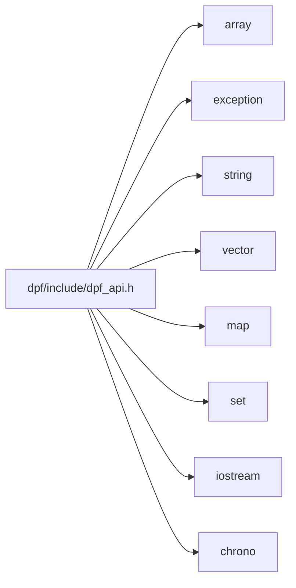

# File dpf_api.h

<a id="dpf-api-h"></a>

![][C++]

**Location**: `dpf/include`

## Classes

* [ansys::dpf::ExternalData](classansys-dpf-externaldata.md#classansys-dpf-externaldata)
* [ansys::dpf::ExternalDataT](classansys-dpf-externaldatat.md#classansys-dpf-externaldatat)
* [ansys::dpf::array_to_pointer_decay](structansys-dpf-array-to-pointer-decay.md#structansys-dpf-array-to-pointer-decay)
* [ansys::dpf::array_to_pointer_decay\< T[N]\>](structansys-dpf-array-to-pointer-decay-t-fn-e.md#structansys-dpf-array-to-pointer-decay-t-fn-e-4)
* [ansys::dpf::ConstructHelpers](structansys-dpf-constructhelpers.md#structansys-dpf-constructhelpers)
* [ansys::dpf::ConstructHelpers::construct_trait](structansys-dpf-constructhelpers-construct-trait.md#structansys-dpf-constructhelpers-construct-trait)
* [ansys::dpf::SemanticVersion](classansys-dpf-semanticversion.md#classansys-dpf-semanticversion)
* [ansys::dpf::Any](classansys-dpf-any.md#classansys-dpf-any)
* [ansys::dpf::Unit](classansys-dpf-unit.md#classansys-dpf-unit)
* [ansys::dpf::ResultInfo](classansys-dpf-resultinfo.md#classansys-dpf-resultinfo)
* [ansys::dpf::ResultInfo::Result](classansys-dpf-resultinfo-result.md#classansys-dpf-resultinfo-result)
* [ansys::dpf::ResultInfo::subresult](structansys-dpf-resultinfo-subresult.md#structansys-dpf-resultinfo-subresult)
* [ansys::dpf::FieldDefinition](classansys-dpf-fielddefinition.md#classansys-dpf-fielddefinition)
* [ansys::dpf::LabelSpace](classansys-dpf-labelspace.md#classansys-dpf-labelspace)
* [ansys::dpf::Scoping](classansys-dpf-scoping.md#classansys-dpf-scoping)
* [ansys::dpf::ElementCursor](classansys-dpf-elementcursor.md#classansys-dpf-elementcursor)
* [ansys::dpf::Support](classansys-dpf-support.md#classansys-dpf-support)
* [ansys::dpf::MeshedRegion](classansys-dpf-meshedregion.md#classansys-dpf-meshedregion)
* [ansys::dpf::TimeFreqSupport](classansys-dpf-timefreqsupport.md#classansys-dpf-timefreqsupport)
* [ansys::dpf::CyclicSupport](classansys-dpf-cyclicsupport.md#classansys-dpf-cyclicsupport)
* [ansys::dpf::GenericSupport](classansys-dpf-genericsupport.md#classansys-dpf-genericsupport)
* [ansys::dpf::DataTree](classansys-dpf-datatree.md#classansys-dpf-datatree)
* [ansys::dpf::CustomTypeField](classansys-dpf-customtypefield.md#classansys-dpf-customtypefield)
* [ansys::dpf::FieldCursor](classansys-dpf-fieldcursor.md#classansys-dpf-fieldcursor)
* [ansys::dpf::Field](classansys-dpf-field.md#classansys-dpf-field)
* [ansys::dpf::PropFieldCursor](classansys-dpf-propfieldcursor.md#classansys-dpf-propfieldcursor)
* [ansys::dpf::PropertyField](classansys-dpf-propertyfield.md#classansys-dpf-propertyfield)
* [ansys::dpf::StringField](classansys-dpf-stringfield.md#classansys-dpf-stringfield)
* [ansys::dpf::CollectionBase](classansys-dpf-collectionbase.md#classansys-dpf-collectionbase)
* [ansys::dpf::FieldsContainer](classansys-dpf-fieldscontainer.md#classansys-dpf-fieldscontainer)
* [ansys::dpf::ScopingsContainer](classansys-dpf-scopingscontainer.md#classansys-dpf-scopingscontainer)
* [ansys::dpf::MeshesContainer](classansys-dpf-meshescontainer.md#classansys-dpf-meshescontainer)
* [ansys::dpf::CustomTypeFieldsContainer](classansys-dpf-customtypefieldscontainer.md#classansys-dpf-customtypefieldscontainer)
* [ansys::dpf::Collection](classansys-dpf-collection.md#classansys-dpf-collection)
* [ansys::dpf::DataSources](classansys-dpf-datasources.md#classansys-dpf-datasources)
* [ansys::dpf::ExternalStream](classansys-dpf-externalstream.md#classansys-dpf-externalstream)
* [ansys::dpf::Streams](classansys-dpf-streams.md#classansys-dpf-streams)
* [ansys::dpf::GenericDataContainer](classansys-dpf-genericdatacontainer.md#classansys-dpf-genericdatacontainer)
* [ansys::dpf::Operator](classansys-dpf-operator.md#classansys-dpf-operator)
* [ansys::dpf::CacheInformation](classansys-dpf-cacheinformation.md#classansys-dpf-cacheinformation)
* [ansys::dpf::CacheInformation::LevelAndDestination](classansys-dpf-cacheinformation-levelanddestination.md#classansys-dpf-cacheinformation-levelanddestination)
* [ansys::dpf::Workflow](classansys-dpf-workflow.md#classansys-dpf-workflow)
* [ansys::dpf::OperatorConfig](classansys-dpf-operatorconfig.md#classansys-dpf-operatorconfig)
* [ansys::dpf::OperatorConfig::options](structansys-dpf-operatorconfig-options.md#structansys-dpf-operatorconfig-options)
* [ansys::dpf::CustomContainerBase](classansys-dpf-customcontainerbase.md#classansys-dpf-customcontainerbase)
* [ansys::dpf::MeshInfo](classansys-dpf-meshinfo.md#classansys-dpf-meshinfo)
* [ansys::dpf::Mapping](classansys-dpf-mapping.md#classansys-dpf-mapping)
* [ansys::dpf::Interface](classansys-dpf-interface.md#classansys-dpf-interface)
* [ansys::dpf::WorkflowStep](classansys-dpf-workflowstep.md#classansys-dpf-workflowstep)
* [ansys::dpf::OperatorMain](classansys-dpf-operatormain.md#classansys-dpf-operatormain)
* [ansys::dpf::OperatorDerivativeMain](classansys-dpf-operatorderivativemain.md#classansys-dpf-operatorderivativemain)
* [ansys::dpf::PinDefinition](structansys-dpf-pindefinition.md#structansys-dpf-pindefinition)
* [ansys::dpf::ConfigOptionSpecification](structansys-dpf-configoptionspecification.md#structansys-dpf-configoptionspecification)
* [ansys::dpf::OperatorSpecification](classansys-dpf-operatorspecification.md#classansys-dpf-operatorspecification)
* [ansys::dpf::RemoteOperator](classansys-dpf-remoteoperator.md#classansys-dpf-remoteoperator)
* [ansys::dpf::RemoteWorkflow](classansys-dpf-remoteworkflow.md#classansys-dpf-remoteworkflow)
* [ansys::dpf::EventHandler](classansys-dpf-eventhandler.md#classansys-dpf-eventhandler)
* [ansys::dpf::Session](classansys-dpf-session.md#classansys-dpf-session)
* [ansys::dpf::RuntimeConfig](classansys-dpf-runtimeconfig.md#classansys-dpf-runtimeconfig)
* [ansys::dpf::RuntimeCoreConfig](classansys-dpf-runtimecoreconfig.md#classansys-dpf-runtimecoreconfig)
* [ansys::dpf::RuntimeClientConfig](classansys-dpf-runtimeclientconfig.md#classansys-dpf-runtimeclientconfig)
* [ansys::dpf::Changelog](classansys-dpf-changelog.md#classansys-dpf-changelog)
* [ansys::dpf::core](classansys-dpf-core.md#classansys-dpf-core)
* [ansys::dpf::core::FbsServerData](structansys-dpf-core-fbsserverdata.md#structansys-dpf-core-fbsserverdata)
* [ansys::dpf::core::trace](structansys-dpf-core-trace.md#structansys-dpf-core-trace)
* [ansys::dpf::core::path_utilities](structansys-dpf-core-path-utilities.md#structansys-dpf-core-path-utilities)
* [ansys::dpf::core::logging](structansys-dpf-core-logging.md#structansys-dpf-core-logging)
* [ansys::dpf::core::logging::LoggerConfig](classansys-dpf-core-logging-loggerconfig.md#classansys-dpf-core-logging-loggerconfig)
* [ansys::dpf::core::logging::internal](structansys-dpf-core-logging-internal.md#structansys-dpf-core-logging-internal)
* [ansys::dpf::core::logging::Logger](classansys-dpf-core-logging-logger.md#classansys-dpf-core-logging-logger)
* [ansys::dpf::reflect\< Field \>](structansys-dpf-reflect-field.md#structansys-dpf-reflect-field-4)
* [ansys::dpf::reflect\< FieldsContainer \>](structansys-dpf-reflect-fieldscontainer.md#structansys-dpf-reflect-fieldscontainer-4)
* [ansys::dpf::reflect\< MeshedRegion \>](structansys-dpf-reflect-meshedregion.md#structansys-dpf-reflect-meshedregion-4)
* [ansys::dpf::reflect\< DataSources \>](structansys-dpf-reflect-datasources.md#structansys-dpf-reflect-datasources-4)
* [ansys::dpf::reflect\< Streams \>](structansys-dpf-reflect-streams.md#structansys-dpf-reflect-streams-4)
* [ansys::dpf::reflect\< Scoping \>](structansys-dpf-reflect-scoping.md#structansys-dpf-reflect-scoping-4)
* [ansys::dpf::reflect\< ScopingsContainer \>](structansys-dpf-reflect-scopingscontainer.md#structansys-dpf-reflect-scopingscontainer-4)
* [ansys::dpf::reflect\< MeshesContainer \>](structansys-dpf-reflect-meshescontainer.md#structansys-dpf-reflect-meshescontainer-4)
* [ansys::dpf::reflect\< PropertyField \>](structansys-dpf-reflect-propertyfield.md#structansys-dpf-reflect-propertyfield-4)
* [ansys::dpf::reflect\< ResultInfo \>](structansys-dpf-reflect-resultinfo.md#structansys-dpf-reflect-resultinfo-4)
* [ansys::dpf::reflect\< TimeFreqSupport \>](structansys-dpf-reflect-timefreqsupport.md#structansys-dpf-reflect-timefreqsupport-4)
* [ansys::dpf::reflect\< DataTree \>](structansys-dpf-reflect-datatree.md#structansys-dpf-reflect-datatree-4)
* [ansys::dpf::reflect\< Workflow \>](structansys-dpf-reflect-workflow.md#structansys-dpf-reflect-workflow-4)
* [ansys::dpf::reflect\< Operator \>](structansys-dpf-reflect-operator.md#structansys-dpf-reflect-operator-4)
* [ansys::dpf::reflect\< RemoteOperator \>](structansys-dpf-reflect-remoteoperator.md#structansys-dpf-reflect-remoteoperator-4)
* [ansys::dpf::reflect\< RemoteWorkflow \>](structansys-dpf-reflect-remoteworkflow.md#structansys-dpf-reflect-remoteworkflow-4)
* [ansys::dpf::reflect\< StringField \>](structansys-dpf-reflect-stringfield.md#structansys-dpf-reflect-stringfield-4)
* [ansys::dpf::reflect\< CustomTypeField \>](structansys-dpf-reflect-customtypefield.md#structansys-dpf-reflect-customtypefield-4)
* [ansys::dpf::reflect\< LabelSpace \>](structansys-dpf-reflect-labelspace.md#structansys-dpf-reflect-labelspace-4)
* [ansys::dpf::reflect\< GenericDataContainer \>](structansys-dpf-reflect-genericdatacontainer.md#structansys-dpf-reflect-genericdatacontainer-4)
* [ansys::dpf::reflect\< CustomTypeFieldsContainer \>](structansys-dpf-reflect-customtypefieldscontainer.md#structansys-dpf-reflect-customtypefieldscontainer-4)
* [ansys::dpf::LicenseContextManager](classansys-dpf-licensecontextmanager.md#classansys-dpf-licensecontextmanager)

## Namespaces

* [ansys](namespaceansys.md#namespaceansys)
* [ansys::dpf](namespaceansys-dpf.md#namespaceansys-dpf)

## Includes

* <array>
* <exception>
* <string>
* <vector>
* <map>
* <set>
* <iostream>
* <chrono>
* [dpf_api_base.h](dpf-api-base-h.md#dpf-api-base-h)



## Included by

* [dpf/include/helpers/dpf_meshQuery.h](dpf-meshquery-h.md#dpf-meshquery-h)
* [dpf/include/helpers/dpf_model.h](dpf-model-h.md#dpf-model-h)
* [dpf/include/helpers/dpf_result.h](dpf-result-h.md#dpf-result-h)

## Macros

<a id="dpf-api-h-1aa7b82ff30bf3b55d7bb8052674f98d16"></a>
### Macro CALL_CONVENTION

![][public]

```cpp
#define CALL_CONVENTION __stdcall
```

[C++]: https://img.shields.io/badge/language-C%2B%2B-blue (C++)
[const]: https://img.shields.io/badge/-const-lightblue (const)
[public]: https://img.shields.io/badge/-public-brightgreen (public)
[static]: https://img.shields.io/badge/-static-lightgrey (static)
