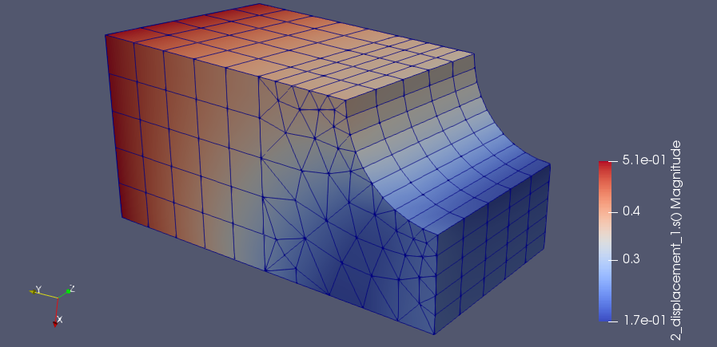

# Getting started

The Data Processing Framework (DPF) provides numerical simulation users and engineers with a toolbox for accessing and transforming simulation data. DPF can access data from Ansys solver result (for example, RST) files as well as from several neutral file formats, including CSV, HDF5, and VTK. This workflow-based framework allows you to perform complex preprocessing and postprocessing operations on large amounts of simulation data.

> [!NOTE]
> This documentation focuses on the C++ API for DPF.
>
> Check the [DPF Framework documentation](https://developer.ansys.com/docs/dpf-framework-2027-r1/index.md) to learn more about DPF and its capabilities.
>
> Check the [DPF page](https://developer.ansys.com/docs/dpf) on the Developer Portal to review all available developer documentation.

## Integrate DPF in a C++ project

To use DPF in a C++ project, you must have access to the following files of the **AWP_ROOT@doc_ansys_ver/dpf/include** folder
(**AWP_ROOT@doc_ansys_ver** being an environment variable defining the root of the Ansys Inc or [DPF Server](https://dpf.docs.pyansys.com/version/stable/getting_started/dpf_server.html) product).

The following lines must be added on top of the C++ file to add DPF capabilities in:

```cpp
// DPF include files to access capabilities without linking step
#include "dpf_api.h"
#include "dpf_api_i.cpp"

// initialization of DPF capabilities
struct staticData {
    static ansys::dpf::LibraryHandle* _dpfLibraryHandle;
};
ansys::dpf::LibraryHandle* staticData::_dpfLibraryHandle = new ansys::dpf::LibraryHandle(ansys::dpf::Context::premiumContext());
```

**Important:** You must append the **AWP_ROOT@doc_ansys_ver/aisol/bin/winx64** folder path to PATH variable on Windows, or append the **AWP_ROOT@doc_ansys_ver/aisol/dll/linx64** folder path to LD_LIBRARY_PATH variable on Linux.

To learn more about integrating DPF capabilities into an already existing project, refer to section [Using DPF capabilities in an existing project](user-guide/use-dpf-in-existing.md).

## Instantiate a DataSources

DataSources provide information regarding the files in which analysis results can be found.
To instantiate DataSources from RST file path, use the following code, for example in the ``main`` method:

```cpp
// instantiate DataSources containing information about result file
std::string fileName("mapdl_files/wedge.rst");
ansys::dpf::DataSources dataSources;
dataSources.addResultFile(fileName);
```

This is an hypothetical file path. Some RST files examples can be found under the **dpf/testfiles** folder of the Ansys Inc product.

**The "dataSources" instance is used in the next sections.**

## Read a displacement field with DPF

To read a displacement result field, use the following code, for example in the ``main`` method:

```cpp
// Instantiate result operator ("U" reads the displacement)
ansys::dpf::Operator resultOperator = ansys::dpf::Operator("U");
resultOperator.connect(ansys::dpf::eDataSourcesPin, dataSources);

// Get the result Field (displacement)
ansys::dpf::Field resultsField = resultOperator.getOutputFieldsContainer(0).at(0);
```

## Read a mesh with DPF

To read a mesh, use the following code, for example in the ``main`` method:

```cpp
// Instantiate mesh reader operator
ansys::dpf::Operator meshProvider = ansys::dpf::Operator("MeshProvider");
meshProvider.connect(ansys::dpf::eDataSourcesPin, dataSources);

// Get the mesh
ansys::dpf::MeshedRegion meshedRegion = meshProvider.getOutputMeshedRegion(0);
int numNode = meshedRegion.numberOfNodes();
int numElements = meshedRegion.numberOfElements();
```

## Display displacement result

To display the **resultsField** values previsouly computed on the computed **meshedRegion**, use the following code:

```cpp
ansys::dpf::Operator vtuExport("vtu_export");
vtuExport.connect(0, std::string("D:/temp/wedge")); // this folder must exist
vtuExport.connect(2, meshedRegion);
vtuExport.connect(3, resultsField);
vtuExport.run();
```

This uses the VTU format. It can be displayed using **Paraview**.

**Display using Paraview:**


