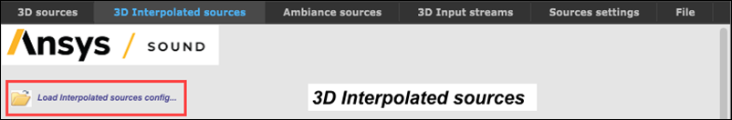
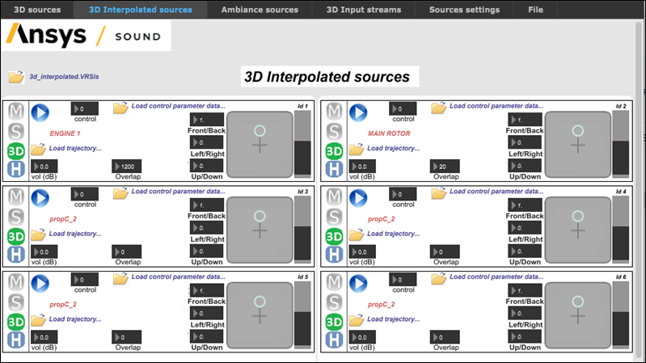
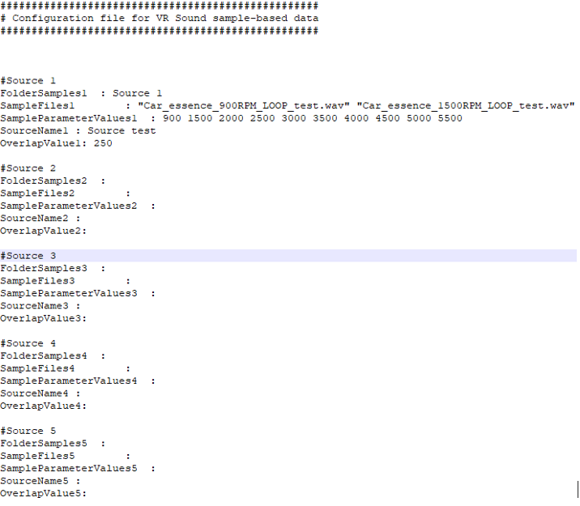
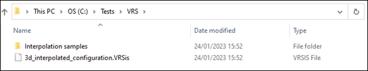
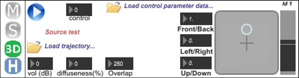
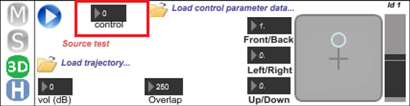
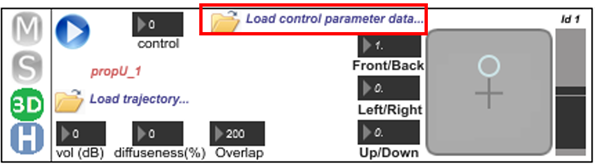
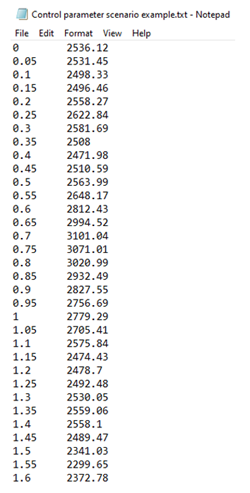
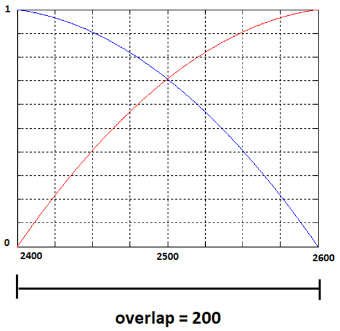

# 3D Interpolated Sources {#vrs_3d_interpolated_sources}

The user-interface for **3D Interpolated sources** is mostly similar to that for [3D Sources](VRS_vr_sound_controller_source_con.md). See that section for a summary of common controls.

## Configuration Files {#section_xws_mbz_gwb .section}

When you open the **3D Interpolated sources** tab in **VR Sound Controller**, you must select the required configuration file, containing the information about the sources.

This is done by clicking the **Load interpolated sources config** button \(see above\) and using the dialog to select the required file.

The sources are then configured as specified \(see below\).

**Note:**

The 3D Interpolated sources configuration can be changed at any time by clicking the same button and selecting a different configuration file.

3D interpolated sources have their own .VRSis configuration files, with the following format:

**Note:**

VR Sound supports configuration files with both the .VRSis and .cfg extensions.

Each 3D interpolated source needs five fields to be filled:

-   **FolderSample** - the name of the subfolder containing the samples for this source. This must be located inside the Interpolation samples folder shown below.
-   **SampleFiles** - the list of the filenames of the samples. Names must be written between quotes, and parameter control values must be listed from lowest to the highest. For example, for a car engine sound, if 5 samples are available, recorded at 1000, 2000, 3000, 4000, and 5000 RPM, the corresponding filenames should be specified in that order.
-   **SampleParameterValues** - a list of values corresponding to the values of the control parameter for the samples. For example, for a car engine sound, if 5 samples recorded at 1000, 2000, 3000, 4000, and 5000 RPM are available, the list will be: 1000 2000 3000 4000 5000. The values must be separated by a space character.
-   **SourceName** - the name of the source, as it will be displayed in the corresponding slot on the interface.
-   **OverlapValue** - the value for the **Overlap** parameter as described above.

It is possible to have up to ten 3D interpolated sources, each source having a maximum of ten samples.

**Note:**

Samples must be stored on the filesystem in a folder named Interpolation samples in the same location as the .VRSis configuration file \(see below\).

**Note:**

[Saving a project](VRS_vr_sound_controller_file.md) in  will also save the selected configuration for 3D interpolated sources. Only one configuration file for 3D interpolated sources is allowed for each project.

## Control Parameters {#section_lnk_4bz_gwb .section}

3D interpolated sources are sound sources based on samples, whose pitch vary depending on the value of their **control** parameter.

For example, consider an engine sound. If you have previously-recorded samples at fixed RPM values, such as 1000 RPM, 2000 RPM, 3000 RPM up to 6000 RPM, you can render an evolving engine sound across the RPM range by interpolating in real-time between two fixed-RPM samples, the two chosen samples depending on the current RPM value. In this case, RPM would be the control parameter of the interpolated source \(see below\).

 also offers the possibility for 3D interpolated sources to load scenarios for the evolution of the control parameter over time. This is done by clicking the **Load control parameter data** icon \(see below\).

A browser then opens and asks you to select the required scenario file. These scenarios must be text files formatted as follows:

The data is made up of 2 vectors:

-   1 vector for the time \(in seconds\)
-   1 vector for the corresponding control parameter value

Once a control parameter scenario is loaded, its reading starts and stops along with the **Play** button .jpg) in the top left corner of the window. A scenario file can be removed by double-clicking the file name. If an interpolated source is loaded and has an associated trajectory scenario and control parameter scenario, VR Sound then allows complete autonomy for the 3D-rendering of the sound source over time.

An **Overlap** parameter is also accessible from the interface for 3D interpolated sources.

If you want to render an engine sound at 2500 RPM, and the adjacent samples are recordings made at 2000 RPM and 3000 RPM, the final interpolated sound will be a mix of the 3000 RPM sample pitched down and the 2000 RPM sample pitched up.

The overlap parameter will define the quantity in the mix, as shown in the figure below:

In this example, an overlap of 200 RPM has been chosen. This means that the sample at 2000 RPM and the sample at 3000 RPM will overlap in the range 2400 to 2600 RPM.

The blue curve is the gain of the 2000 RPM sample \(gain = 1 before 2400 RPM, gain fades between 2400 and 2600 RPM, and gain = 0 at 2600 RPM\).

The red curve is the gain of the 3000 RPM sample \(gain = 0 before 2400 RPM, gain increases between 2400 and 2600 RPM, and gain = 1 after 2600 RPM\).

The accurate value for the overlap parameter depends on the application and the type of sound. Best practice for setting the overlap is to try different values and keep the one that sounds the best.

