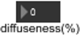
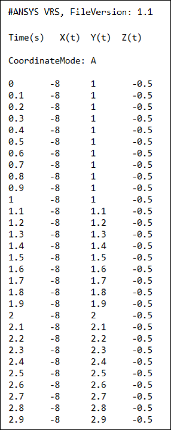

# 3D Sources {#topicID53D}

This interface is composed of up to twenty 3D source control elements:

.png)

These elements allow you to control each 3D source via the following buttons:

-   .png): load a sound or trajectory file \(see Trajectories below\).
-   .jpg)/ .jpg): play / stop
-   .jpg) / .jpg)/ .png): disable/enable the loop playback, an infinite number of times or a specified number of times.
-   .png): set the sound source level.
-    \(VBAP mode only\): 0% means the source is not spread, 100% means the source is totally surrounding and diffused over all speakers.
-   .png): set the playback speed for the sound sample. This also affects the pitch of the sample \(the faster the playback, the higher the pitch\) .
-   .jpg) / .jpg) mute off/on: Mute the source.
-   .jpg) / .jpg) solo off/on: Solo mode.
-   .png) / .png)3D off/on: disable/enable the spatialization for 3D sources \(binaural rendering only\)
-   .png) / .png) Head-tracking off/on: disable/enable the head-tracking information \(binaural rendering only\)

The source position in space can be modified by displacing the small circle with the mouse in the horizontal \(X/Y\) square panel, and by adjusting the Z slider on its right. The gray cross in the center of the square panel represents the reference position.

.png)

The source coordinates are displayed to the left of this panel.

## Trajectories {#section_prd_jcg_ftb .section}

It is possible to load a trajectory associated with the sound. If you load a trajectory and then click play, the sound will play and its position will evolve in real-time according to the defined trajectory. Trajectories are .txt files that are formatted as follows:

The first line is the file header and defines the version number.

The second line defines the columns: Time\(s\), and the three coordinate columns dependent on the selected mode, as described below.

The third line specifies the coordinate mode in which the trajectory is defined:

-   A = Virtools/unity mode, in which:
    -   X is the left/right direction \(positive to the right side\)
    -   Y is the up/down direction \(positive is up\)
    -   Z is the front/back direction \(positive to the front\)
-   B = Polhemus mode, in which:
    -   X is the front/back direction \(positive to the front\)
    -   Y is the left/right direction \(positive to the right side\)
    -   Z is the up/down direction \(positive is down\)
-   C = Angular mode \(available for trajectories only\), in which:
    -   A \(Azimuth\) is the left/right angle in degrees \(positive to the right side\)
    -   E \(Elevation\) is the up/down angle in degrees \(positive is up\)
    -   D \(Distance\) is an adimensional distance measurement \(this can be specified in any unit, but must be consistent with other distances used in the application and with the sound damping law\)

A trajectory defined in a certain coordinate mode is still compatible if VR Sound is running in the other coordinate mode \(the data is adapted\).

The other lines are the sequence of **Time X Y Z** or **Time A E D** information.

**Note:** Each trajectory file must comply with the format described above. The time step for the data should ideally be in the range 10 to 30 ms, although the application will always interpolate the data to a 20 ms timestep to ensure smooth spatialization and optimization of CPU load.

