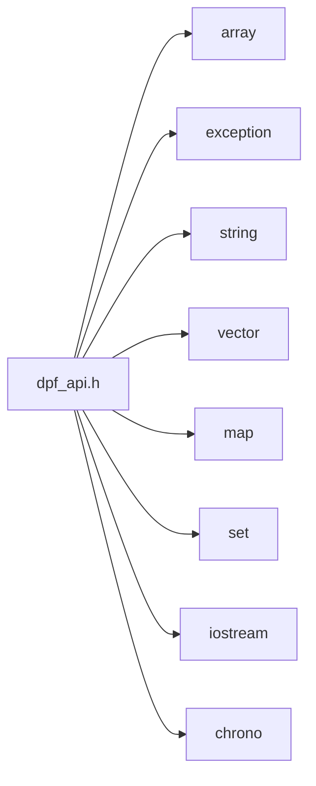

<a id="dpf__api_8h"></a>
# File dpf\_api.h

![][C++]

**Location**: `dpf\_api.h`


### Test Changes 5.

## Classes

* [ansys::dpf::ExternalData](classansys_1_1dpf_1_1ExternalData.md#classansys_1_1dpf_1_1ExternalData)
* [ansys::dpf::ExternalDataT](classansys_1_1dpf_1_1ExternalDataT.md#classansys_1_1dpf_1_1ExternalDataT)
* [ansys::dpf::array\_to\_pointer\_decay](structansys_1_1dpf_1_1array__to__pointer__decay.md#structansys_1_1dpf_1_1array__to__pointer__decay)
* [ansys::dpf::array\_to\_pointer\_decay\< T[N]\>](structansys_1_1dpf_1_1array__to__pointer__decay_3_01T_0fN_0e_4.md#structansys_1_1dpf_1_1array__to__pointer__decay_3_01T_0fN_0e_4)
* [ansys::dpf::Any](classansys_1_1dpf_1_1Any.md#classansys_1_1dpf_1_1Any)
* [ansys::dpf::Unit](classansys_1_1dpf_1_1Unit.md#classansys_1_1dpf_1_1Unit)
* [ansys::dpf::ResultInfo](classansys_1_1dpf_1_1ResultInfo.md#classansys_1_1dpf_1_1ResultInfo)
* [ansys::dpf::ResultInfo::Result](classansys_1_1dpf_1_1ResultInfo_1_1Result.md#classansys_1_1dpf_1_1ResultInfo_1_1Result)
* [ansys::dpf::ResultInfo::subresult](structansys_1_1dpf_1_1ResultInfo_1_1subresult.md#structansys_1_1dpf_1_1ResultInfo_1_1subresult)
* [ansys::dpf::FieldDefinition](classansys_1_1dpf_1_1FieldDefinition.md#classansys_1_1dpf_1_1FieldDefinition)
* [ansys::dpf::LabelSpace](classansys_1_1dpf_1_1LabelSpace.md#classansys_1_1dpf_1_1LabelSpace)
* [ansys::dpf::Scoping](classansys_1_1dpf_1_1Scoping.md#classansys_1_1dpf_1_1Scoping)
* [ansys::dpf::FieldCursor](classansys_1_1dpf_1_1FieldCursor.md#classansys_1_1dpf_1_1FieldCursor)
* [ansys::dpf::Field](classansys_1_1dpf_1_1Field.md#classansys_1_1dpf_1_1Field)
* [ansys::dpf::PropFieldCursor](classansys_1_1dpf_1_1PropFieldCursor.md#classansys_1_1dpf_1_1PropFieldCursor)
* [ansys::dpf::PropertyField](classansys_1_1dpf_1_1PropertyField.md#classansys_1_1dpf_1_1PropertyField)
* [ansys::dpf::StringField](classansys_1_1dpf_1_1StringField.md#classansys_1_1dpf_1_1StringField)
* [ansys::dpf::CustomTypeField](classansys_1_1dpf_1_1CustomTypeField.md#classansys_1_1dpf_1_1CustomTypeField)
* [ansys::dpf::FieldsContainer](classansys_1_1dpf_1_1FieldsContainer.md#classansys_1_1dpf_1_1FieldsContainer)
* [ansys::dpf::ScopingsContainer](classansys_1_1dpf_1_1ScopingsContainer.md#classansys_1_1dpf_1_1ScopingsContainer)
* [ansys::dpf::MeshesContainer](classansys_1_1dpf_1_1MeshesContainer.md#classansys_1_1dpf_1_1MeshesContainer)
* [ansys::dpf::DataSources](classansys_1_1dpf_1_1DataSources.md#classansys_1_1dpf_1_1DataSources)
* [ansys::dpf::ExternalStream](classansys_1_1dpf_1_1ExternalStream.md#classansys_1_1dpf_1_1ExternalStream)
* [ansys::dpf::Streams](classansys_1_1dpf_1_1Streams.md#classansys_1_1dpf_1_1Streams)
* [ansys::dpf::Operator](classansys_1_1dpf_1_1Operator.md#classansys_1_1dpf_1_1Operator)
* [ansys::dpf::Workflow](classansys_1_1dpf_1_1Workflow.md#classansys_1_1dpf_1_1Workflow)
* [ansys::dpf::OperatorConfig](classansys_1_1dpf_1_1OperatorConfig.md#classansys_1_1dpf_1_1OperatorConfig)
* [ansys::dpf::OperatorConfig::options](structansys_1_1dpf_1_1OperatorConfig_1_1options.md#structansys_1_1dpf_1_1OperatorConfig_1_1options)
* [ansys::dpf::ElementCursor](classansys_1_1dpf_1_1ElementCursor.md#classansys_1_1dpf_1_1ElementCursor)
* [ansys::dpf::MeshedRegion](classansys_1_1dpf_1_1MeshedRegion.md#classansys_1_1dpf_1_1MeshedRegion)
* [ansys::dpf::TimeFreqSupport](classansys_1_1dpf_1_1TimeFreqSupport.md#classansys_1_1dpf_1_1TimeFreqSupport)
* [ansys::dpf::CyclicSupport](classansys_1_1dpf_1_1CyclicSupport.md#classansys_1_1dpf_1_1CyclicSupport)
* [ansys::dpf::Support](classansys_1_1dpf_1_1Support.md#classansys_1_1dpf_1_1Support)
* [ansys::dpf::GenericSupport](classansys_1_1dpf_1_1GenericSupport.md#classansys_1_1dpf_1_1GenericSupport)
* [ansys::dpf::GenericDataContainer](classansys_1_1dpf_1_1GenericDataContainer.md#classansys_1_1dpf_1_1GenericDataContainer)
* [ansys::dpf::MeshInfo](classansys_1_1dpf_1_1MeshInfo.md#classansys_1_1dpf_1_1MeshInfo)
* [ansys::dpf::Mapping](classansys_1_1dpf_1_1Mapping.md#classansys_1_1dpf_1_1Mapping)
* [ansys::dpf::DataTree](classansys_1_1dpf_1_1DataTree.md#classansys_1_1dpf_1_1DataTree)
* [ansys::dpf::OperatorMain](classansys_1_1dpf_1_1OperatorMain.md#classansys_1_1dpf_1_1OperatorMain)
* [ansys::dpf::PinDefinition](structansys_1_1dpf_1_1PinDefinition.md#structansys_1_1dpf_1_1PinDefinition)
* [ansys::dpf::ConfigOptionSpecification](structansys_1_1dpf_1_1ConfigOptionSpecification.md#structansys_1_1dpf_1_1ConfigOptionSpecification)
* [ansys::dpf::OperatorSpecification](classansys_1_1dpf_1_1OperatorSpecification.md#classansys_1_1dpf_1_1OperatorSpecification)
* [ansys::dpf::RemoteOperator](classansys_1_1dpf_1_1RemoteOperator.md#classansys_1_1dpf_1_1RemoteOperator)
* [ansys::dpf::RemoteWorkflow](classansys_1_1dpf_1_1RemoteWorkflow.md#classansys_1_1dpf_1_1RemoteWorkflow)
* [ansys::dpf::EventHandler](classansys_1_1dpf_1_1EventHandler.md#classansys_1_1dpf_1_1EventHandler)
* [ansys::dpf::Session](classansys_1_1dpf_1_1Session.md#classansys_1_1dpf_1_1Session)
* [ansys::dpf::RuntimeConfig](classansys_1_1dpf_1_1RuntimeConfig.md#classansys_1_1dpf_1_1RuntimeConfig)
* [ansys::dpf::RuntimeCoreConfig](classansys_1_1dpf_1_1RuntimeCoreConfig.md#classansys_1_1dpf_1_1RuntimeCoreConfig)
* [ansys::dpf::RuntimeClientConfig](classansys_1_1dpf_1_1RuntimeClientConfig.md#classansys_1_1dpf_1_1RuntimeClientConfig)
* [ansys::dpf::core](classansys_1_1dpf_1_1core.md#classansys_1_1dpf_1_1core)
* [ansys::dpf::core::trace](structansys_1_1dpf_1_1core_1_1trace.md#structansys_1_1dpf_1_1core_1_1trace)
* [ansys::dpf::core::path\_utilities](structansys_1_1dpf_1_1core_1_1path__utilities.md#structansys_1_1dpf_1_1core_1_1path__utilities)
* [ansys::dpf::reflect\< Field \>](structansys_1_1dpf_1_1reflect_3_01Field_01_4.md#structansys_1_1dpf_1_1reflect_3_01Field_01_4)
* [ansys::dpf::reflect\< FieldsContainer \>](structansys_1_1dpf_1_1reflect_3_01FieldsContainer_01_4.md#structansys_1_1dpf_1_1reflect_3_01FieldsContainer_01_4)
* [ansys::dpf::reflect\< MeshedRegion \>](structansys_1_1dpf_1_1reflect_3_01MeshedRegion_01_4.md#structansys_1_1dpf_1_1reflect_3_01MeshedRegion_01_4)
* [ansys::dpf::reflect\< DataSources \>](structansys_1_1dpf_1_1reflect_3_01DataSources_01_4.md#structansys_1_1dpf_1_1reflect_3_01DataSources_01_4)
* [ansys::dpf::reflect\< Streams \>](structansys_1_1dpf_1_1reflect_3_01Streams_01_4.md#structansys_1_1dpf_1_1reflect_3_01Streams_01_4)
* [ansys::dpf::reflect\< Scoping \>](structansys_1_1dpf_1_1reflect_3_01Scoping_01_4.md#structansys_1_1dpf_1_1reflect_3_01Scoping_01_4)
* [ansys::dpf::reflect\< ScopingsContainer \>](structansys_1_1dpf_1_1reflect_3_01ScopingsContainer_01_4.md#structansys_1_1dpf_1_1reflect_3_01ScopingsContainer_01_4)
* [ansys::dpf::reflect\< MeshesContainer \>](structansys_1_1dpf_1_1reflect_3_01MeshesContainer_01_4.md#structansys_1_1dpf_1_1reflect_3_01MeshesContainer_01_4)
* [ansys::dpf::reflect\< PropertyField \>](structansys_1_1dpf_1_1reflect_3_01PropertyField_01_4.md#structansys_1_1dpf_1_1reflect_3_01PropertyField_01_4)
* [ansys::dpf::reflect\< ResultInfo \>](structansys_1_1dpf_1_1reflect_3_01ResultInfo_01_4.md#structansys_1_1dpf_1_1reflect_3_01ResultInfo_01_4)
* [ansys::dpf::reflect\< TimeFreqSupport \>](structansys_1_1dpf_1_1reflect_3_01TimeFreqSupport_01_4.md#structansys_1_1dpf_1_1reflect_3_01TimeFreqSupport_01_4)
* [ansys::dpf::reflect\< DataTree \>](structansys_1_1dpf_1_1reflect_3_01DataTree_01_4.md#structansys_1_1dpf_1_1reflect_3_01DataTree_01_4)
* [ansys::dpf::reflect\< Workflow \>](structansys_1_1dpf_1_1reflect_3_01Workflow_01_4.md#structansys_1_1dpf_1_1reflect_3_01Workflow_01_4)
* [ansys::dpf::reflect\< Operator \>](structansys_1_1dpf_1_1reflect_3_01Operator_01_4.md#structansys_1_1dpf_1_1reflect_3_01Operator_01_4)
* [ansys::dpf::reflect\< RemoteOperator \>](structansys_1_1dpf_1_1reflect_3_01RemoteOperator_01_4.md#structansys_1_1dpf_1_1reflect_3_01RemoteOperator_01_4)
* [ansys::dpf::reflect\< RemoteWorkflow \>](structansys_1_1dpf_1_1reflect_3_01RemoteWorkflow_01_4.md#structansys_1_1dpf_1_1reflect_3_01RemoteWorkflow_01_4)
* [ansys::dpf::reflect\< StringField \>](structansys_1_1dpf_1_1reflect_3_01StringField_01_4.md#structansys_1_1dpf_1_1reflect_3_01StringField_01_4)
* [ansys::dpf::reflect\< CustomTypeField \>](structansys_1_1dpf_1_1reflect_3_01CustomTypeField_01_4.md#structansys_1_1dpf_1_1reflect_3_01CustomTypeField_01_4)
* [ansys::dpf::reflect\< LabelSpace \>](structansys_1_1dpf_1_1reflect_3_01LabelSpace_01_4.md#structansys_1_1dpf_1_1reflect_3_01LabelSpace_01_4)
* [ansys::dpf::LicenseContextManager](classansys_1_1dpf_1_1LicenseContextManager.md#classansys_1_1dpf_1_1LicenseContextManager)

## Namespaces

* [ansys](namespaceansys.md#namespaceansys)
* [ansys::dpf](namespaceansys_1_1dpf.md#namespaceansys_1_1dpf)

## Includes

* <array>
* <exception>
* <string>
* <vector>
* <map>
* <set>
* <iostream>
* <chrono>
* [dpf_api_base.h](dpf__api__base_8h.md#dpf__api__base_8h)



## Included by

* [helpers/dpf_model.h](dpf__model_8h.md#dpf__model_8h)
* [helpers/dpf_result.h](dpf__result_8h.md#dpf__result_8h)
* [helpers/dpf_meshQuery.h](dpf__meshQuery_8h.md#dpf__meshQuery_8h)

## Macros

<a id="dpf__api_8h_1aa7b82ff30bf3b55d7bb8052674f98d16"></a>
### Macro CALL\_CONVENTION

![][public]

```cpp
#define CALL_CONVENTION __stdcall
```


## Source

```cpp
//
// COPYRIGHT ANSYS. ALL RIGHTS RESERVED.
//
#pragma once

#include <array>
#include <exception>
#include <string>
#include <vector>
#include <map>
#include <set>
#include <iostream>
#include <chrono>

#include "dpf_api_base.h"

struct IAnsDispatch;

namespace ansys
{
namespace dpf
{
    
    class OperatorSpecification;
    class AbstractCore;
    class ExternalData;   

#ifdef LINUX 
#define CALL_CONVENTION
    typedef void(*OperatorCallBack)(void*, opaque::DpfOperatorData*);
    typedef void(*EventReception)(void*, int, const char*);
    typedef void(*ExternalDataDeleter)(ExternalData*);
#else
#define CALL_CONVENTION __stdcall
    typedef void(__stdcall* OperatorCallBack)(void*, opaque::DpfOperatorData*);
    typedef void(__stdcall* EventReception)(void*, int, const char*);
    typedef void(__stdcall* ExternalDataDeleter)(ExternalData*);
#endif


    class core;
    class Operator;
    class Scoping;
    class OperatorConfig;
    class MeshedRegion;
    class Field;
    class DataSources;
    class Workflow;
    class FieldsContainer;
    class ScopingsContainer;
    class MeshesContainer;
    class TimeFreqSupport;
    class PropertyField;
    class EventHandler;
    class Mapping;
    class Unit;
    class OperatorMain;
    class Support;
    class DataTree;
    class CyclicSupport;
    class RemoteWorkflow; 
    class RemoteOperator;
    class Streams;
    class ResultInfo;
    class LabelSpace;
    class StringField;
    typedef void(*OperatorMainFunction)(OperatorMain&);

    class ExternalData
    {
    public:
        virtual ~ExternalData() {}
    };

    template <typename DataT>
    class ExternalDataT : public ExternalData
    {
    private:
        DataT _data;

    public:
        ExternalDataT(DataT const& d 
        ): _data(d){}
        virtual ~ExternalDataT() {}
        DataT& get() { return _data; }
        DataT const& get() const { return _data; }

    };

    template<class T>
    struct array_to_pointer_decay
    {
        typedef T type;
    };

    template<class T, std::size_t N>
    struct array_to_pointer_decay<T[N]>
    {
        typedef const T* type;
    };

    class Any : public DpfTypes {
        friend class OperatorMain;
        friend class Operator;
        friend class Workflow;
        friend class GenericDataContainer;

    private:
        Any(opaque::DpfInternalSharedObject*);
        bool objectIsOfType(std::string const& type_name);
        template <typename DataT>
        void specializedConstructor(const DataT& value);
    public:
        virtual ~Any() {}
        template <typename DataT>
        explicit Any(const DataT& value) {
            this->specializedConstructor<DataT>(value);
        };
        
        Any(Any const&);
        Any(Any&&);
        Any& operator=(Any const&);
        Any& operator=(Any&&);
        std::string wrappedType();

        template <typename DataT>
        bool testType()
        {
            return objectIsOfType(reflect<DataT>::type_name());
        }

        template <typename DataT>
        DataT get();

        dp_int getAsInt();
        std::string getAsString();
        double getAsDouble();
        Field getAsField();
        PropertyField getAsPropertyField();
        Scoping getAsScoping();
        FieldsContainer getAsFieldsContainer();
        ScopingsContainer getAsScopingsContainer();
        MeshesContainer getAsMeshesContainer();
        TimeFreqSupport getAsTimeFreqSupport();
        MeshedRegion getAsMeshedRegion();
        Streams getAsStreams();
        ResultInfo getAsResultInfo();
        DataTree getAsDataTree();
        Workflow getAsWorkflow();
        Operator getAsOperator();
        CyclicSupport getAsCyclicSupport();
        DataSources getAsDataSources();
        StringField getAsStringField();
        GenericDataContainer getAsGenericDataContainer();

        Any deep_copy(ansys::dpf::Client const* const client 
        )const;

        Any deep_copy()const;


        static Any emptyAny();
    };

    class Unit
    {
    private:
        Homogeneity _homo;
        std::string _symbol;
    public:
        Unit();
        explicit Unit(std::string const& symbol 
        );
        explicit Unit(Homogeneity const& homogeneity, 
            UnitSystem const& unit_system 
        );
        bool operator==(Unit const& unit)const;
        double conversionFactorTo(Unit const& rhs 
        ) const;
        double shiftTo(Unit const& rhs 
        ) const;
        bool isHomogeneousTo(Unit const&) const;
        ansys::dpf::Homogeneity const& homogeneity() const;
        std::string const& toString() const;
        const char* c_str() const;
    };

    typedef std::vector<LabelSpace> LabelSpacesVector;

    class ResultInfo : public DpfTypes
    {
        friend class Operator;
        friend class OperatorMain;
        friend class Workflow;
        friend class Any;

        struct subresult;

    public:
        class Result
        {
            friend class ResultInfo;
        private:
            std::string _name; 
            std::string _opname; 
            ansys::dpf::Homogeneity _homogeneity;
            ansys::dpf::Unit _unit; 
            std::string _description;
            ansys::dpf::Location _location; 
            std::string _scriptingName; 
            std::map<std::string, subresult> _subResults;
            ansys::dpf::Dimensionality _dimensionality; 
            LabelSpacesVector _qualifiers;
        public:
            Result() : _location(ansys::dpf::Location("")), _dimensionality(ansys::dpf::dimensionalities::scalar) {}

            Result(std::string const& operator_name 
                , std::string const& scripting_name 
                , ansys::dpf::Dimensionality dimensionality 
                , ansys::dpf::Location const& location 
                , ansys::dpf::Homogeneity const& homogeneity 
                , std::string const& description = "" 
            );

            void addAvailableQualifiers(LabelSpacesVector const& available_qualifiers);

            std::string const& resultName()const;
            std::string const& operatorName() const;
            std::string const& scriptingName() const;
            ansys::dpf::Homogeneity const& homogeneity() const;

            std::string const& description() const;
            ansys::dpf::Location const& location() const;
            ansys::dpf::Dimensionality const& dimensionality() const;
        };

    private:
        struct subresult
        {
            std::string name;
            std::string opname;
            std::string description;

            subresult() {}
        };
        ResultInfo(opaque::DpfInternalSharedObject*);
        mutable std::map<std::string, Result> _results;
        mutable bool _resultsUpToDate;

        void fillResults() const;
        void getResult(dp_int idx, ResultInfo::Result & res)const;
        std::map<std::string, subresult> getSubResults(dp_int idx) const;
        std::string name(dp_index result_index) const;
        std::string opname(dp_index result_index) const;
        std::string scriptingName(dp_index result_index) const;
        ansys::dpf::Location location(dp_index result_index) const;
        std::string description(dp_index result_index) const;
        ansys::dpf::Unit unit(dp_index result_index) const;
        dp_int numberOfSubResults(dp_index result_index) const;
        ansys::dpf::Dimensionality dimensionality(dp_index result_index) const;
        LabelSpacesVector qualifiers(dp_index result_index) const;
        std::string subName(dp_index result_index, dp_index sub_result_index) const;
        std::string subOpName(dp_index result_index, dp_index sub_result_index) const;
        std::string subDescription(dp_index result_index, dp_index sub_result_index) const;
        const Result &getResult(std::string const& res_name)const;
        void unvalidateResults();

    public:
        enum analysis_type { 
            eStatic = 0,
            eBukling = 1, 
            eModal = 2, 
            eHarmonic = 3, 
            eCMS = 4, 
            eTransient = 5, 
            eMSUP = 6, 
            eSubStruct = 7, 
            eSpectrum = 8, 
            eUnknownAnalysis = 9
        };
        enum physics_type {
            eMecanic = 0, 
            eThermal = 1, 
            eMagnetic = 2, 
            eElectric = 3,
            eFluid = 5,
            eUnknownPhysics = 4
        };

        ResultInfo(analysis_type const& analysis_type = analysis_type::eUnknownAnalysis, physics_type const& physics_type = physics_type::eUnknownPhysics);
        virtual ~ResultInfo();
        ResultInfo(ResultInfo const&);
        ResultInfo(ResultInfo &&) ;
        ResultInfo& operator=(ResultInfo const&);
        ResultInfo& operator=(ResultInfo &&);

        analysis_type analysisType() const;
        physics_type physicsType() const;
        UnitSystem unitSystem() const;
        std::string analysisTypeName() const;
        std::string physicsTypeName() const;
        std::string unitSystemName() const;
        dp_int numberOfResults() const;
        std::set<std::string> availableResults() const;
        std::string resultNameByOperatorName(std::string const& op_name 
        )const;
        std::string operatorName(std::string const& res_name 
        ) const;
        std::string scriptingName(std::string const& res_name 
        ) const;
        ansys::dpf::Unit unit(std::string const& res_name 
        ) const;
        dp_int numberOfComponents(std::string const& res_name 
        ) const;
        std::string description(std::string const& res_name 
        ) const;
        ansys::dpf::Location location(std::string const& res_name 
        ) const;
        Dimensionality::ENature nature(std::string const& res_name 
        ) const;

        LabelSpacesVector qualifiers(std::string const& res_name 
        ) const;

        dp_int numberOfSubResults(std::string const& res_name 
        ) const;
        std::set<std::string> availableSubResults(std::string const& res_name 
        ) const;
        std::string subResultOperatorName(std::string const& res_name, 
            std::string const& subres_name 
        ) const;
        std::string subResultDescription(std::string const& res_name, 
            std::string const& subres_name 
        ) const;
        bool operatorNameIsAvailable(std::string const& op_name 
        )const;
        void solver_version(int &major_version, 
            int &minor_version 
        ) const;
        void solve_date_time(int &solve_date, 
            int &solve_time 
        ) const;
        std::string user_name() const;
        std::string job_name() const;
        std::string product_name() const;
        std::string main_title() const;
        CyclicSupport getCyclicSupport()const;

        bool hasCyclicSymmetry(std::string &cyc_symmetry_type
        )const;
        bool hasCyclicSymmetry()const;
        
        std::string getStringProperty(std::string const& property_name)const;
        int getIntProperty(std::string const& property_name)const;

        std::vector<std::string> availableQualifierLabels() const;

        ansys::dpf::Support qualifierTypeSupport(ansys::dpf::Label const& qualifier 
        )const;

        //setters
        void setUnitSystem(UnitSystem const& unit_system);
        void addResult(std::string const& operator_name 
            , std::string const& scripting_name 
            , ansys::dpf::Dimensionality dimensionality 
            , ansys::dpf::Location const& location 
            , ansys::dpf::Homogeneity const& homogeneity 
            , std::string const& description = "" 
        );
        void addResult(Result const& res);

        void addProperties(std::vector<std::pair<std::string, std::string>>const& properties 
        );
        void addProperties(std::vector<std::pair<std::string, int>>const& properties 
        );

        void addAvailableQualifiersForAllResults(LabelSpacesVector const& available_qualifiers);

        void setQualifierLabelSupport(ansys::dpf::Label const& qualifier 
            , ansys::dpf::Support const& support 
        );

        static ResultInfo emptyResultInfo();

    private:
        opaque::DpfInternalSharedObject* instantiateLabelSpacesVector(LabelSpacesVector const& available_qualifiers);
    };

    class FieldDefinition : public DpfTypes
    {
        friend class Field;
        friend class CustomTypeField;

    private:
        FieldDefinition(opaque::DpfInternalSharedObject*);
        void copyAttributes(FieldDefinition const&);
    public:
        FieldDefinition(); 
        FieldDefinition(Client const* const client 
        );
        virtual ~FieldDefinition();
        FieldDefinition(FieldDefinition const&);
        FieldDefinition(FieldDefinition &&);
        FieldDefinition(const ansys::dpf::Location &loc, 
            const std::vector<dp_int> &dimensions 
        );
        FieldDefinition(const ansys::dpf::Location &loc, 
            const std::vector<dp_int> &dimensions, 
            const Unit & unit 
        );
        FieldDefinition(Client const* const client, 
            const ansys::dpf::Location& loc, 
            const std::vector<dp_int>& dimensions 
        );
        FieldDefinition(Client const* const client, 
            const ansys::dpf::Location& loc, 
            const std::vector<dp_int>& dimensions, 
            const Unit& unit 
        );
        FieldDefinition& operator=(FieldDefinition const&);
        FieldDefinition& operator=(FieldDefinition &&);

        ansys::dpf::Unit unit() const;
        std::vector<dp_int> dimensions() const;
        ansys::dpf::Location location() const;

        std::string name() const;

        eshellLayers shellLayers() const;

        void setName(std::string const& rhs );

        void setLocation(ansys::dpf::Location const& rhs 
        );
        void setUnit(ansys::dpf::Unit const& rhs 
        );
        void setDimensions(std::vector<dp_int> const& rhs, 
            int effective_size 
        );
        void setDimensions(std::vector<dp_int> const& rhs 
        );
        void setShellLayers(ansys::dpf::eshellLayers layers 
        );

        FieldDefinition deep_copy(ansys::dpf::Client const* const client 
        )const;
        bool isOfQuantityType(QuantityType const &quantitytype) const;

        void setQuantityType(QuantityType const& quantitytype);

        int numberOfQuantityTypes() const;

        std::string quantity_type(int i) const;

        FieldDefinition deep_copy()const;

        static FieldDefinition emptyFieldDefinition();
    };

    class LabelSpace : public DpfTypes
    {
        friend class FieldsContainer;
        friend class ScopingsContainer;
        friend class MeshesContainer;
        friend class DataSources;
        friend class Streams;
        friend class ResultInfo;
        friend class Operator;
        friend class Workflow;
        friend class OperatorMain;

    private:
        LabelSpace(opaque::DpfInternalSharedObject*);

    public:
        LabelSpace();
        LabelSpace(Client const* const client 
        );
        LabelSpace(std::map<Label, dp_int> const& rhs, 
            Client const* const client 
        );
        LabelSpace(std::initializer_list<std::pair<const Label, int>> init, 
            Client const* const client 
        );
        LabelSpace(std::map<Label, dp_int> const& rhs 
        );
        LabelSpace(std::initializer_list<std::pair<const Label, int>> init 
        );
        virtual ~LabelSpace();
        LabelSpace(LabelSpace const&);
        LabelSpace(LabelSpace &&);
        LabelSpace& operator=(LabelSpace const&);
        LabelSpace& operator=(LabelSpace &&);

        void add(Label const& label, 
            dp_int value 
        );
        void set(Label const& label, 
            dp_int value 
        );
        void erase(Label const& label 
        );

        dp_int size() const;
        bool has(Label const& label 
        ) const;
        dp_int at(Label const& label 
        ) const;
        std::string labelsName(dp_index index 
        ) const;

        LabelSpace& setTime(dp_index i 
        );
        LabelSpace& setDomain(dp_index i 
        );
        LabelSpace& setComplex(dp_index i 
        );
        LabelSpace& addAnyTime();
        LabelSpace& addAnyDomain();

        LabelSpace deep_copy(ansys::dpf::Client const* const client = nullptr 
        )const;

        void mergeWith(ansys::dpf::LabelSpace const other);

        static LabelSpace emptyLabelSpace();
    };

    class Scoping : public DpfTypes
    {
        friend class Field;
        friend class CustomTypeField;
        friend class Workflow;
        friend class Operator;
        friend class MeshedRegion;
        friend class PropertyField;
        friend class StringField;
        friend class ScopingsContainer;
        friend class CyclicSupport;
        friend class FieldsContainer;
        friend class MeshesContainer;
        friend class OperatorMain;
        friend class TimeFreqSupport;
        friend class Any;

    private:
        Scoping(opaque::DpfInternalSharedObject*);

    public:
        Scoping();
        Scoping(std::vector<dp_id> const& ids, 
            ansys::dpf::Location location 
        );
        Scoping(std::vector<dp_id> const& ids, 
            ansys::dpf::Location location 
            , Client const* const client 
        );
        Scoping(Client const* const client 
        );
        Scoping(int id 
            , Client const* const client
        );
        virtual ~Scoping();
        Scoping(Scoping const&);
        Scoping(Scoping &&);
        Scoping& operator=(Scoping const&);
        Scoping& operator=(Scoping &&);

        ansys::dpf::Location location() const;
        void setLocation(ansys::dpf::Location location 
        );

        void setIds(std::vector<dp_id> const& ids 
        );
        void setIds(dp_id* ids, 
            dp_int size 
        );

        bool identicalPointers(Scoping const& f 
        ) const;

        dp_int size() const;
        dp_id idByIndex(dp_int index 
        ) const;
        dp_index indexById(dp_int id 
        ) const;
        dp_id at(dp_int index) const;

        const dp_id* ids(dp_int& size 
        ) const;

        DpfVector<int> ids() const;

        void getIds(std::vector<dp_id>& ids_to_fill 
        ) const;

        void emplace(dp_index index, 
            dp_id id 
        );

        std::string hashIds()const;

        void reserve(dp_int size);
        void resize(dp_int size);

        static Scoping emptyScoping();

        Scoping deep_copy(ansys::dpf::Client const* const client = nullptr 
        )const;
    };

    class FieldCursor
    {
    public:
        friend class Field;

    private:
        dp_double* _data;
        dp_int _size;
        dp_id _id;
        dp_int _n_component;
        dp_int _n_elementary_data;
        dp_int _data_first_index;
        bool _defined;

    public:
        inline dp_double* data() const { return _data; }
        inline dp_double& operator[](dp_int index 
            ) const { return _data[index]; }
        inline dp_int size() const { return _size; }
        inline dp_id id() const { return _id; }
        inline dp_int n_component() const { return _n_component; }
        inline dp_int n_elementary_data() const { return _n_elementary_data; }
        inline dp_int data_first_index() const { return _data_first_index; }
        inline bool defined() const { return _defined; }
    };

    class Field : public DpfTypes
    {
        friend class Operator;
        friend class Workflow;
        friend class FieldsContainer;
        friend class MeshedRegion;
        friend class TimeFreqSupport;
        friend class OperatorMain;
        friend class Mapping;
        friend class Any;
        friend class Support;
        friend class GenericSupport;
        friend class CyclicSupport;

    private:
        Field(opaque::DpfInternalSharedObject*);
        
    public:
        Field(int reserved_number_of_entity = 0, 
            const std::vector<int> &dimensions = { 1 }, 
            const Location &loc = locations::nodal 
        );
        Field(Client const* const client, 
            int reserved_number_of_entity = 0, 
            const std::vector<int>& dimensions = { 1 }, 
            const Location& loc = locations::nodal 
        );
        Field(int id 
            , Client const* const client
        );
        virtual ~Field();
        Field(Field const&);
        Field(Field &&);
        Field& operator=(Field const&);
        Field& operator=(Field &&);
        
        bool identicalPointers(Field const& f 
        ) const;

        dp_int numberOfComponents() const;
        dp_int numberOfEntities() const;
        dp_int numberOfElementaryData() const;
        dp_int numberOfElementaryDataByEntityIndex(dp_int entityIndex) const;
        dp_int numberOfElementaryDataByEntityId(dp_int entityId) const;
        dp_int dataSize() const;

        std::string name()const;
        void setName(const std::string &name 
        );

        dp_double*const data(int & size 
        )const;
        DpfVector<double> data() const;
        DpfVector<int> dataPointer() const;
        void getData(std::vector<dp_double>& data_to_fill 
        ) const;

        dp_double*const entityData(dp_index entity_index, 
            dp_int& size 
        ) const;
        void entityData(dp_index entity_index 
            , DpfVector<double>& data 
        ) const;
        dp_double*const entityDataById(dp_id entity_id, 
            dp_int& size 
        ) const;
        void entityDataById(dp_id entity_id 
            , DpfVector<double> &data 
        ) const;

        dp_id entityId(dp_index entity_index 
        ) const;
        Scoping scoping() const;
        FieldDefinition fieldDefinition() const;
        Support support() const;
        void setFieldDefinition(FieldDefinition const& f);
        void setScoping(ansys::dpf::Scoping const& s);
        void setData(std::vector<double> const& data 
        );
        void setData(double const* const data, 
            int size 
        );
        void setDataPointer(std::vector<int>& data 
        ) const;
        void setDataPointer(int const*const data, 
            int size 
        ) const;
        void setSupport(ansys::dpf::Support const& s 
        );
        void setSupport(ansys::dpf::TimeFreqSupport const& s 
        );
        void setSupport(ansys::dpf::MeshedRegion const& s 
        );
        void reserve(dp_int number_of_entities, 
            dp_int overall_size = 0 
        );
        void resize(dp_int number_of_entities, 
            dp_int overall_size 
        );

        void fillCursor(dp_index index, 
            FieldCursor& f 
        ) const;

        void push_back(dp_id entity_id, 
            std::vector<dp_double> const& values 
        );

        void push_back(dp_id entity_id, 
            const dp_double * values, 
            int size 
        );
        void push_back(dp_id entity_id, 
            dp_double* values, 
            int size 
        );

        static Field emptyField();

        Field deep_copy(ansys::dpf::Client const* const client 
        )const;

        Field deep_copy()const;
    };

    class PropFieldCursor
    {
    public:
        friend class PropertyField;

    private:
        dp_int* _data;
        dp_int _size;
        dp_id _id;
        dp_int _n_component;
        dp_int _n_elementary_data;
        bool _defined;

    public:
        inline dp_int* data() const { return _data; }
        inline dp_int& operator[](dp_int index  
            ) const { return _data[index]; }
        inline dp_int size() const { return _size; }
        inline dp_id id() const { return _id; }
        inline dp_int numberOfComponents() const { return _n_component; }
        inline dp_int numberOfElementaryData() const { return _n_elementary_data; }
        inline bool defined() const { return _defined; }
    };

    class PropertyField : public DpfTypes
    {
        friend class Operator;
        friend class Workflow;
        friend class MeshedRegion;
        friend class TimeFreqSupport;
        friend class OperatorMain;
        friend class Any;
        friend class Support;
        friend class GenericSupport;
        friend class CyclicSupport;


    private:
        PropertyField(opaque::DpfInternalSharedObject*);
        PropertyField(opaque::DpfObject*, so::API const* api);

    public:
        static PropertyField emptyPropertyField();

        virtual ~PropertyField();
        PropertyField(Client const* const client, 
            dp_int number_of_entities = 0, 
            dp_int data_size = 0 
        );
        PropertyField(dp_int number_of_entities = 0, 
            dp_int data_size = 0 
        );
        PropertyField(PropertyField const&);
        PropertyField(PropertyField &&);
        PropertyField& operator=(PropertyField const&);
        PropertyField& operator=(PropertyField &&);

        Location location() const;
        Scoping scoping() const;
        dp_int dataSize() const;
        dp_int numberOfComponents() const;

        dp_int numberOfElementaryData() const;

        void push_back(dp_id entity_id, 
            std::vector<int> const& values 
        );
        void push_back(dp_id entity_id, 
            const int* values, 
            int size 
        );
        void push_back(dp_id entity_id, 
            int* values, 
            int size 
        );
        void setData(std::vector<int> const& data 
        );
        void setData(int const* const data, 
            int size 
        );
        void setDataPointer(std::vector<int> const& data 
        );
        void setDataPointer(int* const data, 
            int size 
        );
        void setScoping(ansys::dpf::Scoping& s);

        const dp_int* dataByIndex(dp_index entity_index, 
            int& size 
        ) const;
        const dp_int* dataById(dp_id entity_id, 
            int& size 
        ) const;
        void fillCursor(dp_index index, 
            PropFieldCursor& cursor 
        ) const;

        void getIds(std::vector<dp_id>& ids_to_fill 
        ) const;
        void getData(std::vector<dp_int>& values_to_fill 
        ) const;
        DpfVector<int> data() const;
        DpfVector<int> dataPointer() const;
        void entityData(dp_index entity_index 
            , DpfVector<int>& data 
        ) const;
        void entityDataById(dp_id entity_id 
            , DpfVector<int>& data 
        ) const;
        void reserve(dp_int number_of_entities, 
            dp_int overall_size = 0 
        );
        void resize(dp_int number_of_entities, 
            dp_int overall_size 
        );

        PropertyField deep_copy(ansys::dpf::Client const* const client 
        )const;

        PropertyField deep_copy()const;
    };

    class StringField : public DpfTypes
    {
        friend class Operator;
        friend class Workflow;
        friend class Any;
        friend class Support;
        friend class GenericSupport;
        friend class OperatorMain;

    private:
        StringField(opaque::DpfInternalSharedObject*);
        StringField(opaque::DpfObject*, so::API const* api);

    public:
        static StringField emptyStringField();

        virtual ~StringField();

        StringField(Client const* const client, 
            dp_int number_of_entities = 0, 
            dp_int data_size = 0 
        );
        StringField(dp_int number_of_entities = 0, 
            dp_int data_size = 0 
        );
        StringField(StringField const&);
        StringField(StringField&&);
        StringField& operator=(StringField const&);
        StringField& operator=(StringField&&);

        Location location() const;
        Scoping scoping() const;
        dp_int dataSize() const;

        void push_back(dp_id entity_id, 
            std::vector<std::string> const& values 
        );
        void setData(std::vector<std::string> const& data 
        );
        void setScoping(ansys::dpf::Scoping& s);
    
        DpfVector<std::string> data() const;
        void getData(std::vector<std::string>& values_to_fill 
        ) const;
        void entityData(dp_index entity_index 
            , DpfVector<std::string>& data 
        ) const;
        void entityDataById(dp_id entity_id 
            , DpfVector<std::string>& data 
        ) const;
        void reserve(dp_int number_of_entities, 
            dp_int overall_size = 0 
        );
        void resize(dp_int number_of_entities, 
            dp_int overall_size 
        );
    };

    class CustomTypeField : public DpfTypes
    {
        friend class Operator;
        friend class Workflow;
        friend class MeshedRegion;
        friend class OperatorMain;
        friend class Any;
        friend class Support;
        friend class GenericSupport;

    private:
        CustomTypeField(opaque::DpfInternalSharedObject*);
        CustomTypeField(opaque::DpfObject*, so::API const* api);

    public:
        static CustomTypeField emptyCustomTypeField();

        virtual ~CustomTypeField();
        template<typename UnitaryDataType>
        CustomTypeField(Client const* const client, 
            UnitaryDataType*,
            dp_int reserved_number_of_entities = 0, 
            dp_int reserved_num_unitary_data = 0 
        );
        template<typename UnitaryDataType>
        CustomTypeField(UnitaryDataType*,  
            dp_int reserved_number_of_entities = 0, 
            dp_int reserved_num_unitary_data = 0 
        );

        CustomTypeField(Client const* const client, 
            dp_int unitary_data_num_bytes, 
            dp_int reserved_number_of_entities = 0, 
            dp_int reserved_num_unitary_data = 0 
        );
        CustomTypeField(
            dp_int unitary_data_num_bytes, 
            dp_int reserved_number_of_entities = 0, 
            dp_int reserved_num_unitary_data = 0 
        );

        CustomTypeField(CustomTypeField const&);
        CustomTypeField(CustomTypeField&&);
        CustomTypeField& operator=(CustomTypeField const&);
        CustomTypeField& operator=(CustomTypeField&&);

        bool identicalPointers(CustomTypeField const& f 
        ) const;

        std::string name()const;
        void setName(const std::string& name 
        );

        Scoping scoping() const;
        dp_int dataSize() const;
        dp_int numberOfComponents() const;
        dp_int numberOfEntities() const;
        dp_int numberOfElementaryData() const;

        template<typename UnitaryDataType>
        void push_back(dp_id entity_id, 
            std::vector<UnitaryDataType> const& values 
        );
        template<typename UnitaryDataType>
        void push_back(dp_id entity_id, 
            const UnitaryDataType* values, 
            dp_int size 
        );
        template<typename UnitaryDataType>
        void setData(std::vector<UnitaryDataType> const& data 
        );
        template<typename UnitaryDataType>
        void setData(UnitaryDataType const* const data, 
            int size 
        );
        void setDataPointer(std::vector<dp_int> const& data 
        );
        void setDataPointer(dp_int const* const data, 
            int size 
        );
        void setScoping(ansys::dpf::Scoping& s);

        template<typename UnitaryDataType>
        void getData(std::vector<UnitaryDataType>& values_to_fill 
        ) const;
        template<typename UnitaryDataType>
        DpfVector<UnitaryDataType> data() const;
        DpfVector<int> dataPointer() const;
        template<typename UnitaryDataType>
        void entityData(dp_index entity_index 
            , DpfVector<UnitaryDataType>& data 
        ) const;
        template<typename UnitaryDataType>
        void entityDataById(dp_id entity_id 
            , DpfVector<UnitaryDataType>& data 
        ) const;
        void reserve(dp_int number_of_entities, 
            dp_int overall_size = 0 
        );
        void resize(dp_int number_of_entities, 
            dp_int overall_size 
        );

        FieldDefinition fieldDefinition() const;
        Support support() const;
        void setSupport(ansys::dpf::Support& s 
        );
        void setFieldDefinition(FieldDefinition const& f);

        template<typename UnitaryDataType>
        bool isOfUnitaryType() const;

    private:
        void init(Client const* const client, std::string const& type, dp_int unitary_data_num_bytes, 
            dp_int reserved_number_of_entities, 
            dp_int reserved_num_unitary_data 
        );

        std::string typeName()const;

        typedef void (*fillFuncByInt)(opaque::DpfObject const* const obj, opaque::DpfVector*, void**, int*, int, int&, _TCHAR*&);
        typedef void (*fillFunc)(opaque::DpfObject const* const obj, opaque::DpfVector*, void**, int*, int&, _TCHAR*&);
        fillFunc customtypefield_get_data_for_dpfVector()const; 
        fillFuncByInt customtypefield_get_entity_data_for_dpfVector()const; 
        fillFuncByInt customtypefield_get_entity_data_by_id_for_dpfVector()const;
        void push_back(dp_id entity_id, void* values, dp_int size);
        void setData(void* values, dp_int size);
    };
    template <typename T> T* UseType()
    {
        return static_cast<T*>(nullptr);
    }
    template<typename UnitaryDataType>
    CustomTypeField::CustomTypeField(Client const* const client, UnitaryDataType*, dp_int number_of_entities, dp_int data_size) : DpfTypes()
    {
        auto unitary_size = sizeof(UnitaryDataType);
        std::string type_name = reflect<UnitaryDataType>::type_name();
        init(client, type_name, (dp_int)unitary_size, number_of_entities, data_size);
    }
    template<typename UnitaryDataType>
    CustomTypeField::CustomTypeField(UnitaryDataType*, dp_int number_of_entities, dp_int data_size) : DpfTypes()
    {
        auto unitary_size = sizeof(UnitaryDataType);
        std::string type_name = reflect<UnitaryDataType>::type_name();
        init(nullptr, type_name, (dp_int)unitary_size, number_of_entities, data_size);
    }
    template<typename UnitaryDataType>
    DpfVector<UnitaryDataType> CustomTypeField::data() const
    {
        return DpfVector<UnitaryDataType>(customtypefield_get_data_for_dpfVector(), this->internalObj());
    }
    template<typename UnitaryDataType>
    void CustomTypeField::getData(std::vector<UnitaryDataType>& values_to_fill 
    ) const
    {
        DpfVector<UnitaryDataType> values = data<UnitaryDataType>();
        values.copy(values_to_fill);
    }
    template<typename UnitaryDataType>
    void CustomTypeField::setData(std::vector<UnitaryDataType> const& data 
    )
    {
        setData((void*)data.data(), (dp_int)data.size());
    }
    template<typename UnitaryDataType>
    void CustomTypeField::setData(UnitaryDataType const* const data, 
        int size 
    )
    {
        setData((void*)data, (dp_int)data.size());
    }
    template<typename UnitaryDataType>
    void CustomTypeField::push_back(dp_id entity_id, 
        std::vector<UnitaryDataType> const& values 
    )
    {
        const UnitaryDataType* d = values.data();
        dp_int s = (dp_int)values.size();
        push_back(entity_id, (void*)d, s);
    }
    template<typename UnitaryDataType>
    void CustomTypeField::push_back(dp_id entity_id, 
        const UnitaryDataType* values, 
        dp_int size 
    )
    {
        push_back(entity_id, (void*)values, size);
    }
    template<typename UnitaryDataType>
    void CustomTypeField::entityData(dp_index entity_index 
        , DpfVector<UnitaryDataType>& data 
    ) const
    {
        data.fill(customtypefield_get_entity_data_for_dpfVector(), entity_index, this->internalObj());
    }
    template<typename UnitaryDataType>
    void CustomTypeField::entityDataById(dp_id entity_id 
        , DpfVector<UnitaryDataType>& data 
    ) const 
    {
        return data.fill(customtypefield_get_entity_data_by_id_for_dpfVector(), entity_id, this->internalObj());
    }
    template<typename UnitaryDataType>
    bool CustomTypeField::isOfUnitaryType() const
    {
        return reflect<UnitaryDataType>::type_name() == typeName();
    }
    class FieldsContainer : public DpfTypes
    {
        friend class Operator;
        friend class Workflow;
        friend class OperatorMain;
        friend class Any;

    private:
        FieldsContainer(opaque::DpfInternalSharedObject*);

    public:
        FieldsContainer();
        FieldsContainer(Client const* const client 
        );
        FieldsContainer(Client const* const client, 
            std::vector<std::string> const& labels 
        );
        FieldsContainer(int id 
            , Client const* const client
        );
        FieldsContainer(const std::vector<std::string>& labels 
        );
        virtual ~FieldsContainer();
        FieldsContainer(FieldsContainer const&);
        FieldsContainer(FieldsContainer &&);
        FieldsContainer& operator=(FieldsContainer const&);
        FieldsContainer& operator=(FieldsContainer &&);

        Field operator[](dp_int index 
        );
        dp_int size() const;
        Field at(dp_index index 
        );
        const Field at(dp_index index 
        )const;
        void update(Field& f, 
            dp_index index 
        );

        void reserve(dp_int size 
        );
        void resize(dp_int size 
        );
        void addLabel(std::string const& label 
        );
        void addLabel(std::string const& label, 
            dp_id default_value 
        ); 
        void addLabels(std::vector<std::string> const& labels 
        );
        void add(LabelSpace const& lab_space, 
            Field const& f 
        );
        dp_int getSizeFor(LabelSpace const& lab_space 
        ) const;
        std::vector<Field> getFields(LabelSpace const& lab_space 
        ) const;
        Field getField(LabelSpace const& lab_space 
        ) const;
        std::vector<int> getFieldsIndeces(LabelSpace const& lab_space 
        ) const;
        std::vector<std::string> labels() const;
        LabelSpace getLabelSpace(dp_index index 
        )const;
        Scoping labelScoping(std::string const& label 
        ) const;
        std::vector<Field> getFieldsForTimeId(dp_int time_id, 
            dp_int complex_id = 0 
        )const;
        bool hasLabel(std::string const& label 
        )const;

        Support support(std::string const& label=labels::time 
        ) const;
        void setSupport(ansys::dpf::Support const& support, 
            std::string const& label=labels::time 
        );
        void setSupport(ansys::dpf::TimeFreqSupport const& support, 
            std::string const& label=labels::time 
        );

        FieldsContainer createSubFieldsContainer(LabelSpace const& lab_space 
        )const;

        std::string name()const;
        void setName(std::string name 
        );
        dp_id id() const;
        void setId(dp_id id 
        );

        static FieldsContainer emptyFieldsContainer();

        FieldsContainer deep_copy(ansys::dpf::Client const* const client = nullptr 
        )const;

    private :
        void setLabels(const std::vector<std::string>&);
    };

    class ScopingsContainer : public DpfTypes
    {
        friend class Operator;
        friend class Workflow;
        friend class OperatorMain;
        friend class Any;

    private:
        ScopingsContainer(opaque::DpfInternalSharedObject*);

    public:
        ScopingsContainer();
        virtual ~ScopingsContainer();
        ScopingsContainer(ScopingsContainer const&);
        ScopingsContainer(ScopingsContainer &&);
        ScopingsContainer(Client const* const client 
        );
        ScopingsContainer(Client const* const client, 
            std::vector<std::string> const& labels 
        );
        ScopingsContainer(int id 
            , Client const* const client
        );
        ScopingsContainer(std::vector<std::string> const& labels 
        );
        ScopingsContainer& operator=(ScopingsContainer const&);
        ScopingsContainer& operator=(ScopingsContainer &&);
        Scoping operator[](dp_int index 
            );
        dp_int size() const;
        Scoping at(dp_index index 
        );
        const Scoping at(dp_index index 
        )const;
        void update(Scoping& f, 
            dp_index index 
        );

        void reserve(dp_int size 
        );
        void resize(dp_int size 
        );
        void addLabel(std::string const& label 
        );
        void addLabel(std::string const& label, 
            dp_id default_value 
        );
        void addLabels(std::vector<std::string> const& labels 
        );
        void add(LabelSpace const& labels, 
            Scoping const& f 
        );
        dp_int getSizeFor(LabelSpace const& labels 
        ) const;
        std::vector<Scoping> getScopings(LabelSpace const& labels 
        ) const;
        
        std::vector<dp_index> getScopingsIndices(LabelSpace const& lab_space 
        ) const;
        Scoping getScoping(LabelSpace const& labels 
        ) const;
        std::vector<std::string> labels() const;
        LabelSpace getLabelSpace(dp_index index 
        )const;
        bool hasLabel(std::string const& label 
        )const;
        Scoping labelScoping(std::string const& label 
        ) const;

        ScopingsContainer createSubScopingsContainer(LabelSpace const& lab_space 
        )const;

        std::string name()const;
        void setName(std::string name 
        );
        dp_id id() const;
        void setId(dp_id id 
        );

        static ScopingsContainer emptyScopingsContainer();

        ScopingsContainer deep_copy(ansys::dpf::Client const* const client = nullptr 
        )const;
    };

    class MeshesContainer : public DpfTypes
    {
        friend class Operator;
        friend class Workflow;
        friend class OperatorMain;
        friend class Any;
    private:
        MeshesContainer(opaque::DpfInternalSharedObject*);

    public:
        MeshesContainer();
        virtual ~MeshesContainer();
        MeshesContainer(MeshesContainer const&);
        MeshesContainer(MeshesContainer &&);
        MeshesContainer(Client const* const client 
        );
        MeshesContainer(Client const* const client, 
            std::vector<std::string> const& labels 
        );
        MeshesContainer(int id 
            , Client const* const client
        );
        MeshesContainer(std::vector<std::string> const& labels 
        );
        MeshesContainer& operator=(MeshesContainer const&);
        MeshesContainer& operator=(MeshesContainer &&);

        MeshedRegion operator[](dp_int index 
            );
        dp_int size() const;
        MeshedRegion at(dp_index index 
        );
        const MeshedRegion at(dp_index index 
        )const;
        void update(MeshedRegion& f, 
            dp_index index 
        );

        void reserve(dp_int size 
        );
        void resize(dp_int size 
        );
        void addLabel(std::string const& label 
        );
        void addLabel(std::string const& label, 
            dp_id default_value 
        );
        void addLabels(std::vector<std::string> const& labels 
        );
        void add(LabelSpace const& labels, 
            MeshedRegion const& f 
        );
        dp_int getSizeFor(LabelSpace const& label_space 
        ) const;
        std::vector<MeshedRegion> getMeshes(LabelSpace const& label_space 
        ) const;
        MeshedRegion getMesh(LabelSpace const& label_space 
        ) const;
        std::vector<std::string> labels() const;
        LabelSpace getLabelSpace(dp_index index 
        ) const;
        bool hasLabel(std::string const& label 
        )const;
        Scoping labelScoping(std::string const& label
        ) const;

        MeshesContainer createSubMeshesContainer(LabelSpace const& lab_space)const;

        std::string name()const;
        void setName(std::string name 
        );
        dp_id id() const;
        void setId(dp_id id 
        );

        static MeshesContainer emptyMeshesContainer();


        MeshesContainer deep_copy(ansys::dpf::Client const* const client = nullptr 
        )const;
    };

    class DataSources : public DpfTypes
    {
        friend class Operator;
        friend class Workflow;
        friend class OperatorMain;
        friend class Streams;
        friend class Any;

    private :
        DataSources(opaque::DpfInternalSharedObject*);

    public:
        DataSources();
        DataSources(Client const* const client 
            );
        virtual ~DataSources();
        DataSources(DataSources const&);
        DataSources(DataSources &&);
        DataSources(std::string const& result_file_path, 
            std::string const& key 
        );
        DataSources(std::string const& result_file_path, 
            std::string const& key 
            , Client const* const client 
        );
        DataSources(std::string const& result_file_path 
        );
        DataSources(std::string const& result_file_path 
            , Client const* const client);

        DataSources(int id 
            , Client const* const client
        );

        DataSources& operator=(DataSources const&);
        DataSources& operator=(DataSources &&);

        void addResultFile(std::string const& file_path, 
            std::string const& key 
        );
        void addResultFileWString(std::wstring const& file_path 
        );
        void addResultFile(std::string const& file_path 
        );
        void addDomainResultFile(std::string const& file_path, 
            std::string const& key, 
            dp_int domain_id 
        );
        void addFile(std::string const& file_path, 
            std::string const& key 
        );
        void addFile(std::string const& file_path 
        );
        void addFile(std::string const& file_path, 
            std::string const& key, 
            std::string const& result_key 
        );
        void addDomainFile(std::string const& file_path,  
            std::string const& key, 
            dp_int domain_id 
        );
        void addUpStream(DataSources& ds 
        );
        void addUpStream(DataSources& ds, 
            std::string const& result_key 
        );
        
        std::string resultKey() const;
        std::vector<std::string> filePaths(std::string const& key 
        ) const;
        std::vector<std::string> resultFilePaths() const;
        std::vector<std::string> keys() const;
        int numPaths()const;
        std::string pathAtKeyByIndex(std::string const& key, dp_index index) const;
        std::pair<std::string, std::string> pathAndKeyByIndex(int index);
        LabelSpace identifierbyIndex(int index);

        DataSources deep_copy(ansys::dpf::Client const* const client = nullptr 
        )const;

        static DataSources emptyDataSources();

    };

    class ExternalStream
    {
        friend class Streams;
    public:
        virtual ~ExternalStream();
        virtual void release() = 0;
        virtual std::string streamTypeName() const = 0;
        virtual std::string fileName()const = 0;
    };

    class Streams : public DpfTypes
    {
        friend class Operator;
        friend class Workflow;
        friend class OperatorMain;
        friend class RemoteWorkflow;
        friend class Any;
        friend class LabelSpace;
        friend class RemoteOperator;

    private:
        Streams(opaque::DpfInternalSharedObject*);

    public:
        virtual ~Streams();
        Streams(DataSources const& dataSources 
        );
        Streams(Streams const&);
        Streams(Streams &&);

        Streams(int id 
            , Client const* const client 
        );
        Streams& operator=(Streams const&);
        Streams& operator=(Streams &&);

        void releaseFiles();

        void addStream(ExternalStream * stream 
        );

        void addStream(ExternalStream* stream 
            , LabelSpace const& identifier 
        );

        template<typename ExternalStreamType>
        ExternalStreamType*const getExternalStream(std::string const& key)const;

        template<typename ExternalStreamType>
        ExternalStreamType* const getExternalStream(LabelSpace const& identifier 
        )const;

        DataSources dataSources() const;

        static Streams emptyStreams();

    };


    typedef enum { 
        eTimeScopPin = 0,
        eMeshScopPin = 1,
        eFieldsContainerPin = 2,
        eStreamPin = 3,
        eDataSourcesPin = 4, 
        eRotToGlobalPin = 5,
        eParameter1Pin = 6,
        eMeshRegionPin = 7,
        eTimeFreqSupportPin = 8,
        eLocationPin = 9, 
        eSecondFieldsContainerPin = 10,
        ePhysicalMeshScopPin = 11,
        eElementToNodalAverage = 12,
        ePropertyPin = 13,
        eReadCyclicPin = 14,
        eExpandedMeshRegionPin = 15,
        eCyclicSupportPin = 16,
        eDomainIdPin = 17,
        eSectorsScopPin = 18,
        eCyclicPhasePin = 19,
        eFilterDegeneratedElPin = 20,
        eHarmonicData = 21,
        eReorderENFPin = 23,
        eMetaDataPin = 24,
        ePartIdPin = 25,
        eUnitSystemPin = 50,
        eIdentifierPin = 60,
        eCacheHandlerPin = 61,
        eSourceOperatorPin = 62,
        eResultOperatorPin = 63,
        eDownStreamInfoPin = 100,
        eDownStreamResultPin = 101,
        eTuningPin=200
    } pin;

    class Operator : public DpfTypes
    {
        friend class Workflow;
        friend class OperatorMain;
        friend class RemoteOperator;
        friend class core;
        friend class Any;

    protected:
        Operator(opaque::DpfInternalSharedObject*);
        void connect(dp_index, ExternalData* d);
        ExternalData* getExternalOut(dp_index);
        
    public:
        Operator();
        Operator(std::string const& identifier 
        );
        Operator(std::string const& identifier, 
            OperatorConfig const& config 
        );
        Operator(std::string const& identifier, 
            OperatorConfig const& config, 
            Client const* const client 
        );

        Operator(std::string const& identifier 
            , Client const* const client 
        );

        Operator(int id 
            , Client const* const client 
        );

        Operator(Operator &&);
        Operator(Operator const&); 
        Operator& operator=(Operator const&);
        Operator& operator=(Operator &&);
        virtual ~Operator();

        void run();
        void invalidate();
        Operator derivate();

        OperatorState status()const;

        void connect(dp_index input_pin, 
            Operator const& op, 
            dp_index output_pin 
        );
        void connect(Operator const& op 
        );
        void connect(dp_index input_pin, 
            Field const& data 
        );
        void connect(dp_index input_pin, 
            FieldsContainer const& data 
        );
        void connect(dp_index input_pin, 
            ScopingsContainer const& data 
        );
        void connect(dp_index input_pin, 
            MeshesContainer const& data 
        );
        void connect(dp_index input_pin, 
            DataSources const& data 
        );
        void connect(dp_index input_pin, 
            MeshedRegion const& data 
        );
        void connect(dp_index input_pin, 
            Scoping const& data 
        );
        void connect(dp_index input_pin, 
            Streams const& data 
        );
        void connect(dp_index input_pin, 
            PropertyField const& data 
        );
        void connect(dp_index input_pin, 
            Support const& data 
        );
        void connect(dp_index input_pin, 
            CyclicSupport const& data 
        );
        void connect(dp_index input_pin, 
            TimeFreqSupport const& data 
        );
        void connect(dp_index input_pin, 
            StringField const& data 
        );
        void connect(dp_index input_pin, 
            CustomTypeField const& data 
        );
        void connect(dp_index input_pin, 
            LabelSpace const& data 
        );
        void connect(dp_index input_pin, 
            Workflow const& data 
        );
        void connect(dp_index input_pin, 
            RemoteWorkflow const& data 
        );
        void
        connect(dp_index input_pin, 
                Location const& data 
        );
        void
        connect(dp_index input_pin, 
                PropertyType const& data 
        );
        void
        connect(dp_index input_pin, 
                Label const& data   
        );
        void connect(dp_index input_pin, 
            dp_int data 
        );
        void connect(dp_index input_pin, 
            bool data 
        );
        void connect(dp_index input_pin, 
            dp_double data 
        );
        void connect(dp_index input_pin, 
            std::string const& data 
        );
        void connect(dp_index input_pin, 
            std::vector<dp_int> const& data 
        );
        void connect(dp_index input_pin, 
            std::vector<dp_double> const& data 
        );
        void connect(dp_index input_pin, 
            std::vector<std::string> const& data 
        );
        void connect(dp_index input_pin, 
            IAnsDispatch* data 
        );
        void connect(dp_index input_pin, 
            Any const&data 
        );
        void connect(dp_index input_pin, 
            DataTree const& data 
        );
        void connect(dp_index input_pin, 
            UnitSystem const& data 
        );

        void connectOperatorAsInput(dp_index input_pin, 
            Operator const& data 
        );
        template <typename DataT>
        void connectCustom(dp_index input_pin, DataT const& d)
        {
            ExternalData* tmp = new ExternalDataT<DataT>(d);
            connect(input_pin, tmp);
        }

        void connect(dp_index input_pin, 
            Operator const& op, 
            dp_index output_pin, 
            DpfError & error 
        );
        void connect(dp_index input_pin, 
            Field const& data, 
            DpfError & error 
        );
        void connect(dp_index input_pin, 
            FieldsContainer const& data, 
            DpfError & error 
        );
        void connect(dp_index input_pin, 
            ScopingsContainer const& data, 
            DpfError & error 
        );
        void connect(dp_index input_pin, 
            MeshesContainer const& data, 
            DpfError & error 
        );
        void connect(dp_index input_pin, 
            DataSources const& data, 
            DpfError & error 
        );
        void connect(dp_index input_pin, 
            MeshedRegion const& data, 
            DpfError & error 
        );
        void connect(dp_index input_pin, 
            Streams const& data, 
            DpfError & error 
        );
        void connect(dp_index input_pin, 
            Scoping const& data, 
            DpfError & error 
        );
        void connect(dp_index input_pin, 
            PropertyField const& data, 
            DpfError & error 
        );
        void connect(dp_index input_pin, 
            Support const& data, 
            DpfError & error 
        );
        void connect(dp_index input_pin, 
            CyclicSupport const& data, 
            DpfError & error 
        );
        void connect(dp_index input_pin, 
            TimeFreqSupport const& data, 
            DpfError & error 
        );
        void connect(dp_index input_pin, 
            StringField const& data, 
            DpfError& error 
        );  
        void connect(dp_index input_pin, 
            CustomTypeField const& data, 
            DpfError& error 
        );
        void connect(dp_index input_pin, 
            LabelSpace const& data, 
            DpfError& error 
        );
        void connect(dp_index input_pin, 
            Workflow const& data, 
            DpfError & error 
        );
        void connect(dp_index input_pin, 
            RemoteWorkflow const& data, 
            DpfError& error 
        );
        void connect(dp_index input_pin, 
            bool data, 
            DpfError & error 
        );
        void connect(dp_index input_pin, 
            dp_int data, 
            DpfError & error 
        );
        void connect(dp_index input_pin, 
            dp_double data, 
            DpfError & error 
        );
        void connect(dp_index input_pin, 
            std::string const& data, 
            DpfError & error 
        );
        void connect(dp_index input_pin, 
            std::vector<dp_int> const& data, 
            DpfError & error 
        );
        void connect(dp_index input_pin, 
            std::vector<dp_double> const& data, 
            DpfError & error 
        );
        void connect(dp_index input_pin, 
            std::vector<std::string> const& data, 
            DpfError & error 
        );
        void connect(dp_index input_pin, 
            IAnsDispatch* data, 
            DpfError & error 
        );
        void connect(dp_index input_pin, 
            Any const& data, 
            DpfError & error 
        );

        void connect(dp_index input_pin, 
            DataTree const& data, 
            DpfError & error 
        );

        Field getOutputField(dp_index pin_index 
        );
        PropertyField getOutputPropertyField(dp_index pin_index 
        );
        Scoping getOutputScoping(dp_index pin_index 
        );
        FieldsContainer getOutputFieldsContainer(dp_index pin_index 
        );
        ScopingsContainer getOutputScopingsContainer(dp_index pin_index 
        );
        MeshesContainer getOutputMeshesContainer(dp_index pin_index 
        );
        TimeFreqSupport getOutputTimeFreqSupport(dp_index pin_index 
        );
        MeshedRegion getOutputMeshedRegion(dp_index pin_index 
        );
        Streams getOutputStreams(dp_index pin_index 
        );
        ResultInfo getOutputResultInfo(dp_index pin_index 
        );
        Mapping getOutputMapping(dp_index pin_index 
        );
        DataTree getOutputDataTree(dp_index pin_index 
        );
        Workflow getOutputWorkflow(dp_index pin_index 
        );
        Operator getOutputOperator(dp_index pin_index 
        );
        Support getOutputSupport(dp_index pin_index 
        );
        CyclicSupport getOutputCyclicSupport(dp_index pin_index 
        );
        DataSources getOutputDataSources(dp_index pin_index 
        );
        StringField getOutputStringField(dp_index pin_index 
        );
        CustomTypeField getOutputCustomTypeField(dp_index pin_index 
        );      
        std::string getOutputString(dp_index pin_index 
        );
        dp_double getOutputDouble(dp_index pin_index 
        );
        dp_int getOutputInt(dp_index pin_index 
        );        
        bool getOutputBool(dp_index pin_index 
        );
        DpfVector<int> getOutputIntVector(dp_index pin_index 
        );
        DpfVector<double> getOutputDoubleVector(dp_index pin_index 
        );
        Any getOutputAsAny(dp_index pin_index 
        );
        template <typename DataT>
        DataT getCustomOutput(dp_int index 
        )
        {
            ExternalData* d= getExternalOut(index);
            if (!d)
                throw DpfException(DpfError::ErrorNature::eUnexpectedVoidEntity, "getCustomOutput", "not able to fetch external data");
            ExternalDataT<DataT>* casted = dynamic_cast<ExternalDataT<DataT>*>(d);
            if (!casted)
                throw DpfException(DpfError::ErrorNature::eRuntimeError, "getCustomOutput", "request external data has wrong type !");
            return casted->get();
        }

        template<typename DataT>
        DataT getOutput(dp_index pin_index 
        );
        Field getOutputField(dp_index pin_index, 
            DpfError & error 
        );
        PropertyField getOutputPropertyField(dp_index pin_index, 
            DpfError& error 
        );
        Scoping getOutputScoping(dp_index pin_index, 
            DpfError & error 
        );
        FieldsContainer getOutputFieldsContainer(dp_index pin_index, 
            DpfError & error 
        );
        ScopingsContainer getOutputScopingsContainer(dp_index pin_index, 
            DpfError & error 
        );
        MeshesContainer getOutputMeshesContainer(dp_index pin_index, 
            DpfError & error 
        );
        TimeFreqSupport getOutputTimeFreqSupport(dp_index pin_index, 
            DpfError & error 
        );
        MeshedRegion getOutputMeshedRegion(dp_index pin_index, 
            DpfError & error 
        );
        Streams getOutputStreams(dp_index pin_index, 
            DpfError & error 
        );
        ResultInfo getOutputResultInfo(dp_index pin_index, 
            DpfError & error 
        );
        Mapping getOutputMapping(dp_index pin_index, 
            DpfError & error 
        );
        DataTree getOutputDataTree(dp_index pin_index, 
            DpfError & error 
        );
        Workflow getOutputWorkflow(dp_index pin_index, 
            DpfError & error 
        );
        Support getOutputSupport(dp_index pin_index, 
            DpfError & error 
        );
        CyclicSupport getOutputCyclicSupport(dp_index pin_index, 
            DpfError & error 
        );
        DataSources getOutputDataSources(dp_index pin_index, 
            DpfError & error 
        );
        StringField getOutputStringField(dp_index pin_index, 
            DpfError& error 
        );
        CustomTypeField getOutputCustomTypeField(dp_index pin_index, 
            DpfError& error 
        );      
        std::string getOutputString(dp_index pin_index, 
            DpfError & error 
        );
        dp_double getOutputDouble(dp_index pin_index, 
            DpfError & error 
        );
        bool getOutputBool(dp_index pin_index, 
            DpfError & error 
        );
        DpfVector<int> getOutputIntVector(dp_index pin_index, 
            DpfError& error 
        );
        DpfVector<double> getOutputDoubleVector(dp_index pin_index, 
            DpfError& error 
        );

        void disconnect(dp_index pin_index 
        );
        bool hasOutputWhenEvaluated(dp_index pin_index 
        );
        OperatorConfig config()const;

        dp_id getRemoteId()const;

        static Operator emptyOperator();

    private :
        template <typename DataT> void safeConnect(DpfError & error, int input, DataT data);
        template <typename DataT> void safeConnectDpfType(DpfError & error, int input, DataT data);
    };

    class Workflow : public DpfTypes
    {
    public:
        friend class Session;
        friend class core;
        friend class Operator;
        friend class OperatorMain; 
        friend class RemoteWorkflow;
        friend class Any;

    private:
        Workflow(opaque::DpfInternalSharedObject*);
        void connect(std::string const&, ExternalData* d);
        ExternalData* getExternalOut(std::string const&);
    public:
        Workflow();

        Workflow(std::string const& workflow_string 
        );
        
        Workflow(Client const* const client);
        
        Workflow(std::string const& workflow_string 
        , Client const* const client);
        
        Workflow(dp_id id, Client const* const client);
        virtual ~Workflow();

        Workflow(Workflow const&);
        Workflow(Workflow &&);
        Workflow& operator=(Workflow const&);
        Workflow& operator=(Workflow &&);

        Workflow getCopy()const;

        void add(Operator& op 
        );

        void connectWith(Workflow& left_workflow
        );
        void connectWith(Workflow& left_workflow
            , std::map<std::string, std::string> const& connections
        );

        bool hasInputPin(std::string const& pin_name 
        ) const;
        bool hasOutputPin(std::string const& pin_name 
        ) const;


        std::vector<std::string> listInputPins() const;
        std::vector<std::string> listOutputPins() const;


        void nameInputPin(std::string const& pin_name, 
            int operator_input_pin, 
            Operator& op 
        );
        void nameOutputPin(Operator& op, 
            int operator_output_pin, 
            std::string const& pin_name 
        );
        void eraseInputPin(std::string const& pin_name 
        );
        void eraseOutputPin(std::string const& pin_name 
        );

        void writeToSwf(std::string const& file_path 
        ) const;
        
        void writeToGraphViz(std::string const& file_path 
        ) const;

        void
        writeToJson(std::string& jsonString) const;

        void
        readFromJson(const std::string& jsonString);

        std::string writeToString() const;

        void chainWith(const Workflow& wf 
        );
        void chainWith(const Workflow& wf, 
            const std::pair<std::string, std::string>& in_out_names 
        );
        
        void renameInputPin(std::string const& old_pin_name, 
            std::string const& new_pin_name 
        );
        void renameOutputPin(std::string const& old_pin_name, 
            std::string const& new_pin_name 
        );
        void loadFromSwf(std::string const& file_path 
        );
        void generateDerivativeFor(std::string const& output_name, std::string const& symbol_name);
        
        bool hasOutputWhenEvaluated(std::string const& pin_name 
        );

        dp_int numberOfOperators() const;
        std::string operatorNameByIndex(dp_int index) const;

        Operator firstOperator() const;
        Operator lastOperator() const;

        Field getOutputField(std::string const& pin_name 
        );
        FieldsContainer getOutputFieldsContainer(std::string const& pin_name 
        );
        Scoping getOutputScoping(std::string const& pin_name 
        );
        ScopingsContainer getOutputScopingsContainer(std::string const& pin_name 
        );
        MeshesContainer getOutputMeshesContainer(std::string const& pin_name 
        );
        TimeFreqSupport getOutputTimeFreqSupport(std::string const& pin_name 
        );
        MeshedRegion getOutputMeshedRegion(std::string const& pin_name 
        );
        ResultInfo getOutputResultInfo(std::string const& pin_name 
        );
        Support getOutputSupport(std::string const& pin_name 
        );
        CyclicSupport getOutputCyclicSupport(std::string const& pin_name 
        );
        DataSources getOutputDataSources(std::string const& pin_name 
        );
        Streams getOutputStreams(std::string const& pin_name 
        );
        PropertyField getOutputPropertyField(std::string const& pin_namepin_name 
        );
        Unit getOutputUnit(std::string const& pin_name 
        );
        Workflow getOutputWorkflow(std::string const& pin_name 
        );
        DataTree getOutputDataTree(std::string const& pin_name 
        );
        StringField getOutputStringField(std::string const& pin_name 
        );  
        CustomTypeField getOutputCustomTypeField(std::string const& pin_name 
        );
        dp_int getOutputInt(std::string const& pin_name 
        );
        dp_double getOutputDouble(std::string const& pin_name 
        );
        bool getOutputBool(std::string const& pin_name 
        );
        std::string getOutputString(std::string const& pin_index 
        );
        Any getOutputAsAny(std::string const& pin_name 
        );
        DpfVector<int> getOutputIntVector(std::string const& pin_name 
        );
        DpfVector<double> getOutputDoubleVector(std::string const& pin_name 
        );

        template <typename DataT>
        DataT getCustomOutput(std::string const& pin_name 
        )
        {
            ExternalData* d = getExternalOut(pin_name);
            if (!d)
                throw DpfException(DpfError::ErrorNature::eUnexpectedVoidEntity, "getCustomOutput", "not able to fetch external data");
            ExternalDataT<DataT>* casted = dynamic_cast<ExternalDataT<DataT>*>(d);
            if (!casted)
                throw DpfException(DpfError::ErrorNature::eRuntimeError, "getCustomOutput", "request external data has wrong type !");
            return casted->get();
        }

        template<typename DataT>
        DataT getOutput(std::string const& pin_name 
        );

        //non throwing versions

        Field getOutputField(std::string const& pin_name, 
            DpfError & error 
        );
        FieldsContainer getOutputFieldsContainer(std::string const& pin_name, 
            DpfError & error 
        );
        Scoping getOutputScoping(std::string const& pin_name, 
            DpfError & error 
        );
        ScopingsContainer getOutputScopingsContainer(std::string const& pin_name, 
            DpfError & error 
        );
        MeshesContainer getOutputMeshesContainer(std::string const& pin_name, 
            DpfError & error 
        );
        TimeFreqSupport getOutputTimeFreqSupport(std::string const& pin_name, 
            DpfError & error 
        );
        MeshedRegion getOutputMeshedRegion(std::string const& pin_name, 
            DpfError & error 
        );
        ResultInfo getOutputResultInfo(std::string const& pin_name, 
            DpfError & error 
        );
        Support getOutputSupport(std::string const& pin_name, 
            DpfError & error 
        );
        CyclicSupport getOutputCyclicSupport(std::string const& pin_name, 
            DpfError & error 
        );
        DataSources getOutputDataSources(std::string const& pin_name, 
            DpfError & error 
        );
        Streams getOutputStreams(std::string const& pin_name, 
            DpfError & error 
        );
        PropertyField getOutputPropertyField(std::string const& pin_name, 
            DpfError & error 
        );
        StringField getOutputStringField(std::string const& pin_name, 
            DpfError& error 
        );
        CustomTypeField getOutputCustomTypeField(std::string const& pin_name, 
            DpfError& error 
        );
        Unit getOutputUnit(std::string const& pin_name, 
            DpfError & error 
        );
        Workflow getOutputWorkflow(std::string const& pin_name, 
            DpfError& error 
        );
        dp_int getOutputInt(std::string const& pin_name, 
            DpfError & error 
        );
        dp_double getOutputDouble(std::string const& pin_name, 
            DpfError & error 
        );
        bool getOutputBool(std::string const& pin_name, 
            DpfError & error 
        );
        std::string getOutputString(std::string const& pin_name, 
            DpfError& error 
        );
        DpfVector<int> getOutputIntVector(std::string const& pin_name, 
            DpfError& error 
        );
        DpfVector<double> getOutputDoubleVector(std::string const& pin_name, 
            DpfError& error 
        );

        void connect(std::string const& pin_name, 
            std::string const& f 
        );
        void connect(std::string const& pin_name, 
            dp_int f 
        );
        void connect(std::string const& pin_name, 
            bool f 
        );
        void connect(std::string const& pin_name, 
            dp_double f 
        );      
        void connect(std::string const& pin_name, 
            std::vector<int> const& f 
        );
        void connect(std::string const& pin_name, 
            std::vector<dp_double> const& f 
        );
        void connect(std::string const& pin_name, 
            std::vector<std::string> const& f 
        );
        void connect(std::string const& pin_name, 
            Scoping const& data 
        );
        void connect(std::string const& pin_name, 
            Field const& f 
        );
        void connect(std::string const& pin_name, 
            FieldsContainer const& f 
        );
        void connect(std::string const& pin_name, 
            ScopingsContainer const& f 
        );
        void connect(std::string const& pin_name, 
            MeshesContainer const& f 
        );
        void connect(std::string const& pin_name, 
            MeshedRegion const& f 
        );
        
        void connect(std::string const& pin_name, 
            PropertyField const& f 
        );
        void connect(std::string const& pin_name, 
            Support const& f 
        );
        void connect(std::string const& pin_name, 
            TimeFreqSupport const& f 
        );
        void connect(std::string const& pin_name, 
            CyclicSupport const& f 
        );

        void connect(std::string const& pin_name, 
            Workflow const& f 
        );
        void connect(std::string const& pin_name, 
            DataSources const& f 
        );
        void connect(std::string const& pin_name, 
            Streams const& f 
        );
        void connect(std::string const& pin_name, 
            DataTree const& f 
        );
        void connect(std::string const& pin_name, 
            StringField const& f 
        ); 
        void connect(std::string const& pin_name, 
            CustomTypeField const& f 
        ); 
        void connect(std::string const& pin_name, 
            LabelSpace const& f 
        );
        void connect(std::string const& pin_name, 
            Any const& f 
        );
        void connect(std::string const& pin_name, 
            Operator const& f, 
            dp_index output_pin 
        );
        template <typename DataT>
        void connectCustom(std::string const& input_pin, 
            DataT const& d 
        )
        {
            ExternalData* tmp = new ExternalDataT<DataT>(d);
            connect(input_pin, tmp);
        }
        void connect(std::string const& pin_name, 
            dp_int f, 
            DpfError & error 
        );
        void connect(std::string const& pin_name, 
            bool f, 
            DpfError & error 
        );
        void connect(std::string const& pin_name, 
            dp_double f, 
            DpfError & error 
        );

        void connect(std::string const& pin_name, 
            std::string const& f, 
            DpfError& error 
        );
        void connect(std::string const& pin_name, 
            std::vector<int> const& f, 
            DpfError & error 
        );
        void connect(std::string const& pin_name, 
            std::vector<dp_double> const& f, 
            DpfError & error 
        );
        void connect(std::string const& pin_name, 
            std::vector<std::string> const& f, 
            DpfError& error 
        );
        void connect(std::string const& pin_name, 
            Scoping const& f, 
            DpfError & error 
        );
        void connect(std::string const& pin_name, 
            Field const& f, 
            DpfError & error 
        );
        void connect(std::string const& pin_name, 
            FieldsContainer const& f, 
            DpfError & error 
        );
        void connect(std::string const& pin_name, 
            ScopingsContainer const& f, 
            DpfError & error 
        );
        void connect(std::string const& pin_name, 
            MeshesContainer const& f, 
            DpfError & error 
        );
        void connect(std::string const& pin_name, 
            MeshedRegion const& f, 
            DpfError & error 
        );
        void connect(std::string const& pin_name, 
            DataSources const& f, 
            DpfError & error 
        );
        void connect(std::string const& pin_name, 
            Streams const& f, 
            DpfError & error 
        );
        void connect(std::string const& pin_name, 
            PropertyField const& f, 
            DpfError & error 
        );
        void connect(std::string const& pin_name, 
            Support const& f, 
            DpfError & error 
        );
        void connect(std::string const& pin_name, 
            CyclicSupport const& f, 
            DpfError & error 
        );
        void connect(std::string const& pin_name, 
            TimeFreqSupport const& f, 
            DpfError & error 
        );
        void connect(std::string const& pin_name, 
            Workflow const& f, 
            DpfError& error 
        );
        void connect(std::string const& pin_name, 
            DataTree const& f, 
            DpfError& error 
        );
        void connect(std::string const& pin_name, 
            StringField const& f, 
            DpfError& error 
        );
        void connect(std::string const& pin_name, 
            CustomTypeField const& f, 
            DpfError& error 
        );
        void connect(std::string const& pin_name, 
            LabelSpace const& f, 
            DpfError& error 
        );
        void connect(std::string const& pin_name, 
            Any const& f, 
            DpfError& error 
        );
        void connect(std::string const& pin_name, 
            Operator const& f, 
            dp_index output_pin, 
            DpfError & error 
        );
        void discoverAllOperators();

        static Workflow emptyWorkflow();

        int record(std::string const& name, bool transfer_ownership, DpfError & error); 
        int record(std::string const& name, bool transfer_ownership); 
        bool tryReplaceWorkflowInRegistry(int id, std::string const& name, bool transfer_ownership);
        bool eraseWorkflowFromRegistry();

        Workflow instantiateOnRemote(ansys::dpf::Client const* const client 
        )const;

        Workflow instantiateOnRemote(std::string const& address 
            , std::string const& protocol 
        )const;

        Workflow instantiateOnRemote(std::string const& ip 
            , int port 
            , std::string const& protocol 
        )const;

        dp_id getRemoteId()const;

        std::vector<std::pair<int, ansys::dpf::Operator>> operatorsForInput(std::string const& input_name 
        ) const;

        std::pair<int, ansys::dpf::Operator> operatorForOutput(std::string const& output_name 
        ) const;

    private:
        template <typename DataT> void safeConnect(DpfError & error, std::string const& pin_name, DataT data);
        template <typename DataT> void safeConnectDpfType(DpfError & error, std::string const& pin_name, DataT data);
        Workflow pvinstantiateOnRemote(std::string const& address, std::string const& protocol)const;
    };

    class OperatorConfig : public DpfTypes
    {
        friend class Operator;
        friend class OperatorMain;
        friend class core;
    private:
        OperatorConfig(opaque::DpfInternalSharedObject*);

    public:
        OperatorConfig();
        OperatorConfig(Client const* const client 
        );
        OperatorConfig(OperatorConfig &&);
        OperatorConfig(OperatorConfig const&);
        OperatorConfig& operator=(OperatorConfig const&);
        OperatorConfig& operator=(OperatorConfig &&);

        int numOptions()const;
        std::vector<std::string> options();
        std::map<std::string, std::string> optionsAndValues();

        void set(std::string const& option, 
            dp_int value 
        );
        void set(std::string const& option,  
            dp_double value 
        );
        void set(std::string const& option,  
            bool value 
        );

        int getIntValue(std::string const& option  
        )const;
        double getDoubleValue(std::string const& option  
        )const;
        bool getBoolValue(std::string const& option  
        )const;
        bool hasOption(std::string const& option  
        )const;

        struct options
        {
            static std::string runInParallel;
            static std::string numThreads;
            static std::string inplace;
            static std::string incremental;
            static std::string useCache;
            static std::string mutex;
            static std::string binaryOperation;
            static std::string workByIndex;
            static std::string permissive;
            static std::string readInputsInParallel;
        };
    };

    class ElementCursor
    {
    public:
        friend class MeshedRegion;

    private:
        const ElementDescriptor* _descriptor;
        const dp_int* _connectivity;
        dp_int _effective_size;
        dp_id _id;
        bool _is_defined;

    public:
        ElementCursor() : _descriptor(nullptr), _connectivity(nullptr), _is_defined(false), _effective_size(0){}
        ElementCursor(ElementCursor const&) = delete;
        ElementCursor(ElementCursor&&) = delete;

        inline ElementDescriptor const& descriptor() const { return *_descriptor; }
        inline dp_int numberOfNodes() const { return _descriptor->number_of_nodes; }
        inline dp_int numberOfCornerNodes() const { return _descriptor->number_of_corner_nodes; }
        inline dp_int numberOfMidNodes() const { return _descriptor->number_of_mid_nodes; }
        inline dp_int effectiveSize() const { return _effective_size; }
        inline bool defined() const { return _is_defined; }
        inline dp_id id() const { return _id; }
        inline dp_index operator[](dp_index i 
            ) const { return _connectivity[i]; }
    };

    class MeshedRegion : public DpfTypes
    {
        friend class Operator;
        friend class Workflow;
        friend class MeshesContainer;
        friend class Support;
        friend class Field;
        friend class OperatorMain;
        friend class Any;

    private:
        MeshedRegion(opaque::DpfInternalSharedObject*);

    public:
        MeshedRegion();
        MeshedRegion(Client const* const client 
        );
        MeshedRegion(int id 
            , Client const* const client
        );

        static MeshedRegion emptyMeshedRegion();

        virtual ~MeshedRegion();
        MeshedRegion(MeshedRegion const&);
        MeshedRegion(MeshedRegion &&);
        MeshedRegion& operator=(MeshedRegion const&);
        MeshedRegion& operator=(MeshedRegion &&);

        dp_int numberOfNodes() const;
        dp_int numberOfElements() const;

        Unit lengthUnit() const;
        Field nodesCoordinates()const;
        PropertyField propField(PropertyType const& prop 
        ) const;
        bool hasPropField(PropertyType const& prop 
        ) const;
        std::vector<std::string> availablePropertyFields() const;
        PropertyField elementTypes()const;
        PropertyField connectivity()const;
        Scoping nodeScoping()const;
        Scoping elementScoping()const;
        Scoping faceScoping()const;
        std::vector<std::string> availableNamedSelections() const;
        Scoping namedSelection(std::string const& name 
        )const;

        void fillCursor(dp_index element_index, 
            ElementCursor& cursor 
        ) const;

        void prepareConstruction(dp_int n_nodes, 
            dp_int n_elements 
        );
        void addNode(dp_id node_id, 
            std::array<dp_double, 3> const& data 
        );
        void addNode(dp_id node_id, 
            dp_double* const data 
        );
        void addElement(ElementDescriptor const& descriptor, 
            dp_id elem_id, 
            std::vector<dp_index> const& node_indices 
        );
        void addElement(ansys::dpf::elements::EShape shape, 
            dp_id elem_id, 
            std::vector<dp_index> const& node_indices 
        );
        void setLengthUnit(Unit const& unit 
        );
        void setNamedSelectionScoping(std::string const& name, 
            Scoping scoping 
        );
        void setPropertyField(std::string const& name, 
            PropertyField property_field 
        );
        void setConnectivity(
            PropertyField connectivity 
        );
        void setElementTypes(
            PropertyField element_types 
        );
        void setNodesCoordinates(
            Field coordinates 
        );

        bool hasBeam() const;
        bool hasOnlyBeam() const;
        bool hasShell() const;
        bool hasOnlyShell() const;
        bool hasPoint() const;
        bool hasOnlyPoint() const;
        bool hasSolid() const;
        bool hasOnlySolid() const;
        bool hasSkin() const;
        bool hasOnlySkin() const;
        bool hasPolygons() const;
        bool hasPolyhedrons() const;

        ansys::dpf::ElementDescriptor elementDescriptorByElementId(dp_id element_id) const;
        ansys::dpf::elements::EShape elementShape(dp_id element_id) const;
        int numNodesOfElement(dp_index element_index) const;

        std::string name() const;

        void setName(std::string const& rhs);

        MeshedRegion deep_copy(ansys::dpf::Client const* const client 
        )const;

        MeshedRegion deep_copy()const;

    };

    class TimeFreqSupport : public DpfTypes
    {
        friend class Operator;
        friend class Workflow;
        friend class Support;
        friend class FieldsContainer;
        friend class Field;
        friend class OperatorMain;
        friend class Any;
    private:
        TimeFreqSupport(opaque::DpfInternalSharedObject*);

    public:
        TimeFreqSupport();
        TimeFreqSupport(Client const* const client 
        );
        TimeFreqSupport(int id 
            , Client const* const client
        );

        static TimeFreqSupport emptyTimeFreqSupport();
        virtual ~TimeFreqSupport();
        TimeFreqSupport(TimeFreqSupport const&);
        TimeFreqSupport(TimeFreqSupport &&);
        TimeFreqSupport& operator=(TimeFreqSupport const&);
        TimeFreqSupport& operator=(TimeFreqSupport &&);

        dp_int numberOfSets() const;

        dp_int numberOfSteps() const;

        dp_int numberOfSubStepsByStepIndex(dp_int stepIndex) const;

        dp_int numberOfSubStepsByStepId(dp_int stepId) const;

        dp_int getSetIndexByStepIndexAndSubStep(dp_int step, dp_int sub_step) const;

        dp_double getImaginaryFreqByStep(dp_index step, 
            dp_index sub_step 
        ) const;

        dp_double getTimeFreqByStep(dp_index step, 
            dp_index sub_step 
        ) const;

        dp_int getImaginaryFreqSetIndexByValue(dp_double frequency) const;

        dp_int getSetIndexByTimeFreq(dp_double frequency) const;

        std::pair<dp_id, dp_index> getStepAndSubStep(int cumulative_index) const;

        Field frequencies() const;
        Field imaginaryFrequencies() const;
        Field rpms() const;
        Field harmonicIndeces(dp_int stage = 0) const;
        PropertyField timeFrequenciesSubstepIds() const;
        Scoping harmonicIndicesScoping() const;
        dp_int numberOfSingularSets()const;

        void setTimeFrequencies(Field field 
        );
        void setImaginaryFrequencies(Field field 
        );
        void setRpms(Field field 
        );
        void setHarmonicIndices(Field field, 
            dp_int stage = 0 
        );

        std::pair<dp_int, dp_int> boundingCumulativeIndecesOfTimeFreq(double time_freq, 
            int loadstep = 0 
        ) const;
        dp_double timeFreq(dp_int cumul_index, 
            dp_int complex_id=0 
        )const;

        TimeFreqSupport deep_copy(ansys::dpf::Client const* const client = nullptr 
        )const;
    };

    class CyclicSupport : public DpfTypes
    {
        friend Support;
        friend ResultInfo;
        friend Operator;
        friend Workflow;
        friend Any;
        friend Field;
        friend PropertyField;

    private:
        CyclicSupport(opaque::DpfInternalSharedObject*);

    public:
        virtual ~CyclicSupport();
        CyclicSupport(CyclicSupport const&);
        CyclicSupport(CyclicSupport &&);
        CyclicSupport& operator=(CyclicSupport const&);
        CyclicSupport& operator=(CyclicSupport &&);

        dp_int numberOfSectors(dp_int istage = 0 
        ) const;
        dp_double cyclicPhase() const;
        dp_int numberOfStages() const;
        Scoping sectorsScoping(dp_int istage = 0 
        ) const;
        Scoping baseNodesScoping(dp_int istage = 0 
        ) const;
        Scoping baseElementsScoping(dp_int istage = 0 
        ) const;
        Scoping expandNodeIds(dp_int nodeId 
            ,Scoping sectors_scoping 
            ,dp_int istage = 0 
        ) const;
        Scoping expandElementIds(dp_int elementId 
            , Scoping sectors_scoping 
            , dp_int istage = 0 
        ) const;
        Scoping expandNodeIds(dp_int nodeId 
            , dp_int istage = 0 
        ) const;
        Scoping expandElementIds(dp_int elementId 
            , dp_int istage = 0 
        ) const;
        Field getCS() const;
        PropertyField getLowHighMap(dp_int istage = 0 
        ) const;
        PropertyField getHighLowMap(dp_int istage = 0 
        ) const;

    };

    class Support : public DpfTypes
    {
    public:
        friend class Field;
        friend class CustomTypeField;
        friend class FieldsContainer;
        friend class Operator;
        friend class Workflow;
        friend class OperatorMain;
        friend class ResultInfo;
        friend class Any;

    protected:
        Support(opaque::DpfInternalSharedObject*);

    public:
        virtual ~Support();
        Support(Support const&);
        Support(Support &&);
        Support& operator=(Support const&);
        Support& operator=(Support &&);

        bool isMeshedDomain() const;
        MeshedRegion getAsDomainMesh() const;
        CyclicSupport getAsCyclicSupport() const;
        TimeFreqSupport getAsTimeFreqSupport() const;

        Field getFieldSupportByProperty(PropertyType const& property_name)const;
        PropertyField getPropertyFieldSupportByProperty(PropertyType const& property_name)const;
        StringField getStringFieldSupportByProperty(PropertyType const& property_name)const;
        std::vector<std::string> getAvailablePropertyNamesForFields()const;
        std::vector<std::string> getAvailablePropertyNamesForPropertyFields()const;
        std::vector<std::string> getAvailablePropertyNamesForStringFields()const;

        static Support emptySupport();
    };
    
    class GenericSupport : public Support
    {
    private:
        GenericSupport(opaque::DpfInternalSharedObject*);

    public:
        ~GenericSupport();
        GenericSupport(Location const& location);
        GenericSupport(Location const& location,
            Client const* const client 
        );
        GenericSupport(GenericSupport const&);
        GenericSupport(GenericSupport&&);
        GenericSupport& operator=(GenericSupport const&);
        GenericSupport& operator=(GenericSupport&&);

        void setSupportOfProperty(PropertyType const& property_name, Field const& field)const;
        void setSupportOfProperty(PropertyType const& property_name, PropertyField const& field)const;
        void setSupportOfProperty(PropertyType const& property_name, StringField const& field)const;

        static GenericSupport emptyGenericSupport();
    };

    class GenericDataContainer : public DpfTypes {
    private:
        GenericDataContainer(opaque::DpfInternalSharedObject*);
    public:
        GenericDataContainer();
        GenericDataContainer(GenericDataContainer const&);
        GenericDataContainer(GenericDataContainer&&);
        GenericDataContainer& operator=(GenericDataContainer const&);
        GenericDataContainer& operator=(GenericDataContainer&&);

        template <typename T>
        T
        getProperty(const std::string& property_name);
        template <typename T>
        void setProperty(const std::string& property_name, const T& property);

      private:
        Any
        getPropertyAny(const std::string& property_name);
        void
        setPropertyAny(const std::string& property_name, const Any& property);
    };
    template <typename T>
    T 
    GenericDataContainer::getProperty(const std::string& property_name) {
        return this->getPropertyAny(property_name).get<T>();
    }
    
    template <typename T>
    void
    GenericDataContainer::setProperty(const std::string& property_name,
                                      const T& property) {
        this->setPropertyAny(property_name, Any(property));
    }


    class MeshInfo {        
    private:
        GenericDataContainer _genericData;

    public:
        MeshInfo();
        MeshInfo(const GenericDataContainer& _genericData);
        MeshInfo(MeshInfo const&);
        MeshInfo& operator=(MeshInfo const&);

        GenericDataContainer getGenericDataContainer() {
            return _genericData;
        }

        //Generic use of the MeshInfo by forwarding the GenericDataContainer getter and setter
        template <typename T>
        T getProperty(const std::string& property_name)
        {
            return _genericData.getProperty<T>(property_name);

        }
        template <typename T>
        void setProperty(const std::string& property_name, const T& property)
        {
            _genericData.setProperty<T>(property_name, property);
        }

        //Give access to the client of common properties in order to customize his mesh info

        void setNumNodes(int numNodes 
        ) {
            _genericData.setProperty("num_nodes", numNodes);
        }
        
        void setNumElem(int numElements 
        ) 
        {
            _genericData.setProperty("num_elems", numElements);
        }

        void setSplittableBy(dpf::StringField splittableByScoping 
        ) 
        {
            _genericData.setProperty("splittable_by", splittableByScoping);
        }

        void setAvailableEt(dpf::Scoping availableElementTypes 
        ) 
        {
            _genericData.setProperty("available_et", availableElementTypes);
        }

        int getNumNodes() 
        {
            return _genericData.getProperty<int>("num_nodes");
        }

        int getNumElem() 
        {
            return _genericData.getProperty<int>("num_elems");
        }

        dpf::Scoping getAvailableEt() {
            return _genericData.getProperty<Scoping>("available_et");
        }

        dpf::StringField getSplittableBy() {
            return _genericData.getProperty<StringField>("splittable_by");
        }

    };

    class Mapping : public DpfTypes
    {
        friend class Operator;
        friend class Workflow;

    private:
        Mapping(opaque::DpfObject*);

    public:
        ~Mapping();
        Mapping(Mapping const&);
        Mapping(Mapping &&);
        Mapping& operator=(Mapping const&);
        Mapping& operator=(Mapping &&) = delete;

        Field map(Field& in 
        );
    };

    class DataTree : public DpfTypes
    {
        friend class Operator;
        friend class Workflow;
        friend class OperatorMain;
        friend class Any;
        friend class core;

    private:
        DataTree(opaque::DpfInternalSharedObject*);

    public:
        DataTree();
        DataTree(Client const* const client 
        );
        ~DataTree();
        DataTree(DataTree const&);
        DataTree(DataTree &&);
        DataTree& operator=(DataTree const&);
        DataTree& operator=(DataTree &&);

        void fillFromJson(std::istream const& stream);
        void fillFromTxt(std::istream const& stream);
        void writeToTxt(std::ostream& stream);
        void writeToJson(std::ostream& stream);

        std::vector<std::string> getAvailableAttributeNames() const;
        std::vector<std::string> getAvailableSubTreeNames() const;

        const DataTree getSubByName(std::string const& name) const;
        int getIntAttribute(std::string const& name) const;
        bool getBoolAttribute(std::string const& name) const;
        unsigned int getUnsignedIntAttribute(std::string const& name) const;
        double getDoubleAttribute(std::string const& name) const;
        std::string getStringAttribute(std::string const& name) const;
        std::vector<int> getVectIntAttribute(std::string const& name) const;
        std::vector<double> getVectDoubleAttribute(std::string const& name) const;
        std::vector<std::string> getVectStringAttribute(std::string const& name) const;

        void makeIntAttribute(std::string const& name, int value);
        void makeBoolAttribute(std::string const& name, bool value);
        void makeUnsignedIntAttribute(std::string const& name, unsigned int value);
        void makeDoubleAttribute(std::string const& name, double value);
        void makeStringAttribute(std::string const& name, std::string const& value);
        void makeVectIntAttribute(std::string const& name, std::vector<int> const& value);
        void makeVectDoubleAttribute(std::string const& name, std::vector<double> const& value);
        void makeVectStringAttribute(std::string const& name, std::vector<std::string> const& value);
        DataTree makeSub(std::string const& name);
        void makeSubTreeAttribute(std::string const& name, DataTree const* const sub_tree);

        bool hasAttribute(std::string const& attribute_name) const;
        bool hasSub(std::string const& attribute_name) const;

        static DataTree emptyDataTree();
    };
    class OperatorMain
    {
    private:
        opaque::DpfOperatorData* _operator_data;
        so::API const* _api;

        ExternalData* getExternalInput(dp_index);

        void setExternalOutput(dp_int, ExternalData*);
        bool pinIsOfType(dp_int pin_index, std::string const& type_name);
        so::API const* callAPI()const;

    public:
        OperatorMain(opaque::DpfOperatorData*);
        ~OperatorMain();
        OperatorMain(OperatorMain const&) = delete;
        OperatorMain(OperatorMain &&) = delete;
        OperatorMain& operator=(OperatorMain const&) = delete;
        OperatorMain& operator=(OperatorMain &&) = delete;

        void setSuccessed();
        void setFailed();

        dp_int getNumInputs();
        Field getInputField(dp_index pin_index  
        );
        void setOutput(dp_index pin_index, 
            Field& f 
        );
        DataSources getInputDataSources(dp_index pin_index  
        );
        void setOutput(dp_index pin_index, 
            DataSources& f 
        );
        FieldsContainer getInputFieldsContainer(dp_index pin_index  
        );
        void setOutput(dp_index pin_index, 
            FieldsContainer& f 
        );
        Scoping getInputScoping(dp_index pin_index 
        );
        void setOutput(dp_index pin_index, 
            Scoping& f 
        );
        ScopingsContainer getInputScopingsContainer(dp_index pin_index 
        );
        void setOutput(dp_index pin_index, 
            ScopingsContainer& f 
        );
        MeshedRegion getInputMeshedRegion(dp_index pin_index 
        );
        void setOutput(dp_index pin_index, 
            MeshedRegion& f 
        );
        TimeFreqSupport getInputTimeFreqSupport(dp_index pin_index 
        );
        void setOutput(dp_index pin_index, 
            TimeFreqSupport& f 
        );
        MeshesContainer getInputMeshesContainer(dp_index pin_index 
        );
        void setOutput(dp_index pin_index, 
            MeshesContainer& f 
        );
        Support getInputSupport(dp_index pin_index 
        );
        void setOutput(dp_index pin_index, 
            Support& f 
        );
        StringField getInputStringField(dp_index pin_index 
        );
        void setOutput(dp_index pin_index, 
            StringField& f 
        );
        CustomTypeField getInputCustomTypeField(dp_index pin_index 
        );
        void setOutput(dp_index pin_index, 
            CustomTypeField& f 
        );
        Any getInputAsAny(dp_index pin_index 
        );
        void setOutput(dp_index pin_index, 
            Any& f 
        );
        Streams getInputStreams(dp_index pin_index 
        );
        Workflow getInputWorkflow(dp_index pin_index 
        );
        Operator getInputOperator(dp_index pin_index
        );
        RemoteWorkflow getInputRemoteWorkflow(dp_index pin_index 
        );
        RemoteOperator getInputRemoteOperator(dp_index pin_index
        );
        void setOutput(dp_index pin_index, 
            Streams& f 
        );
        LabelSpace getInputLabelSpace(dp_index pin_index 
        );
        PropertyField getInputPropertyField(dp_index pin_index 
        );
        GenericDataContainer getInputGenericDataContainer(dp_index pin_index 
        );
        void setOutput(dp_index pin_index, 
            GenericDataContainer& f 
        );

        void setOutput(dp_index pin_index, 
            PropertyField& f 
        );

        void setOutput(dp_index pin_index, 
            Workflow& f 
        );
        void setOutput(dp_index pin_index, 
            MeshInfo& f 
        );
        void setOutput(dp_index pin_index, 
            ResultInfo& f 
        );
        DataTree getInputDataTree(dp_index pin_index 
        );
        void setOutput(dp_index pin_index, 
            DataTree& f 
        );
        std::string getInputString(dp_index pin_index 
        );
        void setOutput(dp_index pin_index, 
            std::string const& f 
        );
        dp_int getInputInteger(dp_index pin_index 
        );
        void setOutput(dp_index pin_index, 
            dp_int f 
        );
        dp_double getInputDouble(dp_index pin_index 
        );
        void setOutput(dp_index pin_index, 
            dp_double f 
        );
        long long int getInputLongLong(dp_index pin_index 
        );
        void setOutput(dp_index pin_index, 
            long long int f 
        );
        std::vector<int> getInputVecInt(dp_index pin_index 
        );
        std::vector<double> getInputVecDouble(dp_index pin_index 
        );
        std::vector<std::string> getInputVecString(dp_index pin_index 
        );
        void setOutput(dp_index pin_index, 
            std::vector<int> const& out 
        );      
        void setOutput(dp_index pin_index, 
            std::vector<double> const& out 
        );
        void setOutput(dp_index pin_index, 
            std::vector<std::string> const& out 
        );
        bool getInputBool(dp_index pin_index 
        );
        void setOutput(dp_index pin_index, 
            bool f 
        );
        void setOutput(dp_index pin_index, 
            RemoteWorkflow f 
        );
        void setOutput(dp_index pin_index, 
            RemoteOperator f
        );
        void setOutput(dp_index pin_index, 
            Operator f 
        );
        void delegateRun(Operator op
            , bool forwardInputs =true
        );
        template <typename DataT>
        DataT getInputCustom(dp_index pin_index 
        )
        {
            ExternalData* d = getExternalInput(pin_index);
            if (!d)
                throw DpfException(DpfError::ErrorNature::eUnexpectedVoidEntity, "getInputCustom", "not able to fetch external data");
            ExternalDataT<DataT>* casted = dynamic_cast<ExternalDataT<DataT>*>(d);
            if (!casted)
                throw DpfException(DpfError::ErrorNature::eRuntimeError, "getInputCustom", "request external data has wrong type !");
            return casted->get();
        }
        template <typename DataT>
        void setOutputCustom(dp_index pin_index, 
            DataT d 
        )
        {
            ExternalData* tmp = new ExternalDataT<DataT>(d);
            setExternalOutput(pin_index, tmp);
        }
        template <typename DataT>
        bool testInput(dp_int pin_index 
        )
        {
            return pinIsOfType(pin_index, reflect<DataT>::type_name());
        }

        bool hasInput(dp_int pin_index 
        );

        void connectAllInputs(ansys::dpf::Operator& op 
        );

        std::string operatorName()const;

        OperatorConfig config() const;
    };

    struct PinDefinition
    {
        std::string name;
        int position;
        std::string documentation;
        bool is_optional;
        bool is_ellipsis;
        std::vector<TypeDescriptor> accepted_types;
        PinDefinition():name("unnamed"),position(0), is_optional(false), is_ellipsis(false)
        {}
        PinDefinition(int pin_position 
        ): PinDefinition()
        {position = pin_position;}
        PinDefinition& setName(std::string const& n 
        ) { name = n; return *this; }
        PinDefinition& setPosition(int n 
        ) { position = n; return *this; }
        PinDefinition& setDoc(std::string const& n 
        ) { documentation = n; return *this; }
        PinDefinition& setOptional(bool n 
        ) { is_optional = n; return *this; }
        PinDefinition& setEllipsis(bool n) { is_ellipsis = n; return *this; }
        PinDefinition& setAcceptedTypes(std::vector<TypeDescriptor> const& n) { accepted_types = n; return *this; }
    };

    struct ConfigOptionSpecification
    {
    private: 
        std::string _description;
        std::string _name;
        std::vector<std::string> _type_names;
        std::string _default_value;

    public: 
        ConfigOptionSpecification(
            std::string const& description,
            std::string const& name,
            std::vector<std::string> type_names,
            std::string const& default_value) : _description(description), _name(name), _type_names(type_names), _default_value(default_value)
        {} 
        std::string getDescription() const
        {
            return _description;
        }
        std::string getName() const
        {
            return _name;
        }
        std::vector<std::string> getTypeNames() const
        {
            return _type_names;
        }
        std::string getDefaultValue() const
        {
            return _default_value;
        }
    };

    class OperatorSpecification : public DpfTypes
    {
        friend class Operator;
        friend class core;

    private:
        OperatorSpecification(opaque::DpfInternalSharedObject*);
        std::vector<PinDefinition> getPins(bool binput) const;

    public:
        OperatorSpecification();
        virtual ~OperatorSpecification();
        OperatorSpecification(OperatorSpecification const&);
        OperatorSpecification(OperatorSpecification &&);
        OperatorSpecification& operator=(OperatorSpecification const&);
        OperatorSpecification& operator=(OperatorSpecification &&);

        std::vector<PinDefinition> inputPins() const;
        std::vector<PinDefinition> outputPins() const;

        void setInputPins(std::vector<PinDefinition> const& pins 
        );
        void setOutputPins(std::vector<PinDefinition> const& pins 
        );
        std::string getDocumentation() const;
        void setDocumentation(std::string const& text 
        );
        std::string getProperty(std::string const& key 
        ) const;
        void setProperty(std::string const& key, 
            std::string const& value 
        );

        std::vector<ConfigOptionSpecification> configOptions() const;

        void addSupportedConfigOption(std::string const& option_name, 
            bool default_value, 
            std::string const& documentation = "" 
        );
        void addSupportedConfigOption(std::string const& option_name, 
            int default_value, 
            std::string const& documentation = "" 
        );
        void addSupportedConfigOption(std::string const& option_name, 
            double default_value, 
            std::string const& documentation = "" 
        );
    };
    class RemoteOperator : public Operator
    {
        friend class OperatorMain;
    private:
        RemoteOperator(opaque::DpfObject*);
    public:
        RemoteOperator(Streams& streams, ansys::dpf::Operator const& remote_operator);
        virtual ~RemoteOperator();
        Streams getStreams() const;
        dp_id getRemoteOperatorId() const;

        void registerStreamsHolderWorkflow(int workflow_id_in_remote_registry);
    };
    class RemoteWorkflow : public Workflow
    {
        friend class OperatorMain;
        friend class Workflow;

    private:
        ansys::dpf::Workflow* _remote_workflow = nullptr;
        RemoteWorkflow(opaque::DpfObject*);
    public:
        RemoteWorkflow(Streams& streams, ansys::dpf::Workflow const& remote_workflow);
        virtual ~RemoteWorkflow();
        RemoteWorkflow(RemoteWorkflow const&);
        RemoteWorkflow(Workflow const&);
        RemoteWorkflow(RemoteWorkflow&&);
        RemoteWorkflow& operator=(RemoteWorkflow const&);
        RemoteWorkflow& operator=(RemoteWorkflow&&);

        dp_id getRemoteWorkflowId() const;
        Streams getStreams() const;

        static RemoteWorkflow emptyRemoteWorkflow();

    private:
        ansys::dpf::Workflow & getRemoteInstance(DpfTypes const* const other);
    };

    class EventHandler
    {
    public:
        friend class Session;
        enum EventNature
        {
            eOperatorStarted,
            eOperatorFinished,
            eOperatorSentException,
            eOperatorError,
            eOperatorMakeSomeProgress,
            eOperatorWarning,
            eOperatorAddedInWorkflow,
            eOperatorDelegatedRun,
            eSessionWorkflowAdded,
            eWorkflowEvaluationStarted,
            eWorkflowEvaluationFinished
        };
        virtual ~EventHandler();
        virtual void onEvent(EventNature nature, const char* args) = 0;
    };

    class Session : public DpfTypes
    {
    public:
        Session();
        ~Session();
        Session(Client const* const client 
        );
        Session(Session const&);
        Session(Session &&) = delete;
        Session& operator=(Session const&);
        Session& operator=(Session &&) = delete;

        std::string id() const;
        void add(Workflow& wf, 
            std::string const& identifier 
        );
        std::string add(Workflow& wf 
        );
        Workflow getWorkflow(std::string const& identifier 
        );
        Workflow getWorkflowByIndex(dp_index index 
        );
        dp_int numberOfWorkflow() const;
        void flushWorkflows();
        void addEventHandler(EventHandler& event_handler 
        );
    };

    class RuntimeConfig
    {
    private:
        friend class core;
        DataTree _data_tree;
    protected:
        RuntimeConfig(DataTree &data_tree);
    public:
        RuntimeConfig(RuntimeConfig const& rhs);
        RuntimeConfig(RuntimeConfig&& rhs);
        std::vector<std::string> getAvailableOptions() const;

        int getIntValue(std::string const& option  
        )const;
        double getDoubleValue(std::string const& option  
        )const;
        bool getBoolValue(std::string const& option  
        )const;
        std::string getStringValue(std::string const& option  
        )const;

        void set(std::string const& option, 
            dp_int value 
        );
        void set(std::string const& option,  
            dp_double value 
        );
        void set(std::string const& option,  
            bool value 
        );
        void set(std::string const& option,  
            std::string value 
        );
    };

    class RuntimeCoreConfig : public RuntimeConfig
    {
    private:
        friend class core;
        RuntimeCoreConfig(DataTree & data_tree) : RuntimeConfig(data_tree) {}
    public:
        RuntimeCoreConfig(RuntimeCoreConfig const& rhs);
        RuntimeCoreConfig(RuntimeCoreConfig&& rhs);
        void setNumberOfThreadsToUse(int num_threads);
        int getNumberOfThreadsToUse() const;
    };

    class RuntimeClientConfig : public RuntimeConfig
    {
    private:
        friend class core;
        RuntimeClientConfig(DataTree & data_tree) : RuntimeConfig(data_tree) {}
    public:
        RuntimeClientConfig(RuntimeClientConfig const& rhs);
        RuntimeClientConfig(RuntimeClientConfig && rhs);
        void enableCache(bool use_cache);
        bool isCacheEnabled() const;

        void setStreamingBufferSize(int size);
        int getStreamingBufferSize() const;

        void setStreamFloatsInsteadOfDoubles(bool use_float);
        bool streamingFloatsInsteadOfDouble()const;
    };

    typedef std::string databaseIdentifier;
    typedef int dataIdentifierInDatabase;

    class core
    {
    public :
        core() = delete;

        static DpfError applyContext(Context const& context);

        static DpfError releaseDpf();

        static DpfError releaseDpf(Client const* const client 
        );

        static DpfError applyContext(Context const& context,
            Client const* const client 
        );
        
        static DpfError loadDpfPlugin(std::string const& plugin_path, 
            std::string const& plugin_name, 
            std::string const& symbol="LoadOperators" 
        );
        static DpfError loadDpfPlugin(std::string const& plugin_path, 
            std::string const& plugin_name, 
            Client const* const client 
        );

        static DpfError loadDpfPlugin(std::string const& plugin_path, 
            std::string const& plugin_name, 
            std::string const& symbol, 
            Client const* const client 
        );
        static Operator assertInstantiate(std::string const& identifier 
        );
        static Operator assertInstantiate(std::string const& identifier 
            , OperatorConfig const& config  
        );
        static OperatorConfig defaultOperatorConfig(std::string const& op_identifier, 
            Client const* const client = nullptr 
        );
        static OperatorSpecification getOperatorSpecification(std::string const& identifier, 
            Client const* const client = nullptr 
        );
        static void recordOperator(OperatorMainFunction f, 
            std::string const& operator_identifier,
            AbstractCore* core = nullptr);
        static void recordOperator(OperatorMainFunction f,
            std::string const& operator_identifier, 
            OperatorSpecification const& spec, 
            AbstractCore* = nullptr);
        template <typename StructureT>
        static void recordOperator() 
        {
            recordOperator(StructureT::run, StructureT::name(), StructureT::specification());
        }
        template <typename StructureT>
        static void recordOperatorAtCore(AbstractCore* core)
        {
            recordOperator(StructureT::run, StructureT::name(), StructureT::specification(), core);
        }
        static void recordOperatorWithNewName(std::string const& exising_identifier, 
            std::string const& new_identifier, 
            AbstractCore* = nullptr);

        static Workflow workflowById(int id 
        );
        static Workflow workflowById(int id 
            , Client const* const client 
        );
        static Operator operatorById(int id 
        );
        static Workflow workflowFromTemplate(std::string const& template_identifier 
        );
        static bool workflowTemplateExists(std::string const& template_identifier 
        );
        static void prepareServerShutdown(Client* const client 
        );  
        static void releaseServer(Client* const client 
        );
        static std::vector<std::string> availableOperators();

        static std::vector<std::string> availableOperators(Client* const client 
        );

        static dataIdentifierInDatabase recordInDatabase(databaseIdentifier const& key, DpfTypes& data);
        
        static dataIdentifierInDatabase recordInDatabase(DpfTypes& data 
        );

        static void releaseFromDatabase(dp_id id 
            , Client const* const client 
            , bool async = false
        );
        static RuntimeCoreConfig getRuntimeCoreConfig();

        static RuntimeCoreConfig getRuntimeCoreConfig(Client* const client 
        );

        static RuntimeClientConfig getRuntimeClientConfig();

        struct trace
        {
            static void activate(std::string const& path_to_trace = "./");
            static void deactivate();
            static void make_section(std::string const& section_name);
        };

        struct path_utilities
        {
            static std::string uploadFile(Client const* const client, std::string const& file_path, std::string const& to_server_file_path = "", bool inTmp = true);
        };
    };


    template <> struct reflect<Field>
    {
        static std::string type_name() { return "field"; }
    };
    template <> struct reflect<FieldsContainer>
    {
        static std::string type_name() { return "fields_container"; }
    };
    template <> struct reflect<MeshedRegion>
    {
        static std::string type_name() { return "abstract_meshed_region"; }
    };
    template <> struct reflect<DataSources>
    {
        static std::string type_name() { return "data_sources"; }
    };
    template <> struct reflect<Streams>
    {
        static std::string type_name() { return "streams_container"; }
    };
    template <> struct reflect<Scoping>
    {
        static std::string type_name() { return "scoping"; }
    };
    template <> struct reflect<ScopingsContainer>
    {
        static std::string type_name() { return "scopings_container"; }
    };
    template <> struct reflect<MeshesContainer>
    {
        static std::string type_name() { return "meshes_container"; }
    };
    template <> struct reflect<PropertyField>
    {
        static std::string type_name() { return "property_field"; }
    };
    template <> struct reflect<ResultInfo>
    {
        static std::string type_name() { return "result_info"; }
    };
    template <> struct reflect<TimeFreqSupport>
    {
        static std::string type_name() { return "time_freq_support"; }
    };
    template <> struct reflect<DataTree>
    {
        static std::string type_name() { return "abstract_data_tree"; }
    };
    template <> struct reflect<Workflow>
    {
        static std::string type_name() { return "workflow"; }
    };
    template <> struct reflect<Operator>
    {
        static std::string type_name() { return "operator"; }
    };
    template <> struct reflect<RemoteOperator>
    {
        static std::string type_name() { return "remote_operator"; }
    };
    template <> struct reflect<RemoteWorkflow>
    {
        static std::string type_name() { return "remote_workflow"; }
    };
    template <> struct reflect<StringField>
    {
        static std::string type_name() { return "string_field"; }
    };
    template <> struct reflect<CustomTypeField>
    {
        static std::string type_name() { return "custom_type_field"; }
    };
    template <> struct reflect<LabelSpace>
    {
        static std::string type_name() { return "label_space"; }
    };

    class LicenseContextManager {
    public:
        LicenseContextManager(const std::string& increment_name = "", const double& license_timeout_in_seconds = -1);
        LicenseContextManager(const double& license_timeout_in_seconds);
        std::string getStatus();
    private:
        Operator _licensing_operator;
    };

} // end of namespace dpf
} // end of namepsace ansys
```

[public]: https://img.shields.io/badge/-public-brightgreen (public)
[C++]: https://img.shields.io/badge/language-C%2B%2B-blue (C++)
[private]: https://img.shields.io/badge/-private-red (private)
[const]: https://img.shields.io/badge/-const-lightblue (const)
[static]: https://img.shields.io/badge/-static-lightgrey (static)
[Markdown]: https://img.shields.io/badge/language-Markdown-blue (Markdown)