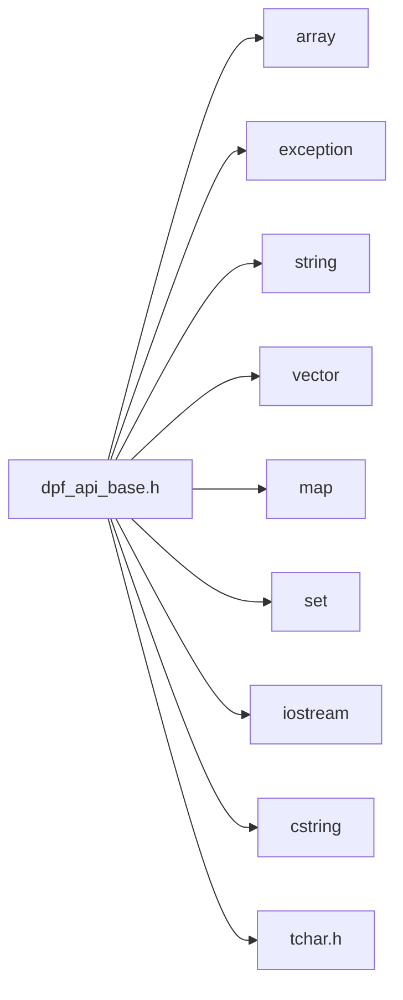

<a id="dpf__api__base_8h"></a>
# File dpf\_api\_base.h

![][C++]

**Location**: `dpf\_api\_base.h`


## Classes

* [ansys::dpf::reflect](structansys_1_1dpf_1_1reflect.md#structansys_1_1dpf_1_1reflect)
* [ansys::dpf::QuantityType](structansys_1_1dpf_1_1QuantityType.md#structansys_1_1dpf_1_1QuantityType)
* [ansys::dpf::quantity\_types](structansys_1_1dpf_1_1quantity__types.md#structansys_1_1dpf_1_1quantity__types)
* [ansys::dpf::Location](structansys_1_1dpf_1_1Location.md#structansys_1_1dpf_1_1Location)
* [ansys::dpf::locations](structansys_1_1dpf_1_1locations.md#structansys_1_1dpf_1_1locations)
* [ansys::dpf::PropertyType](structansys_1_1dpf_1_1PropertyType.md#structansys_1_1dpf_1_1PropertyType)
* [ansys::dpf::property\_types](structansys_1_1dpf_1_1property__types.md#structansys_1_1dpf_1_1property__types)
* [ansys::dpf::Homogeneity](classansys_1_1dpf_1_1Homogeneity.md#classansys_1_1dpf_1_1Homogeneity)
* [ansys::dpf::homogeneities](structansys_1_1dpf_1_1homogeneities.md#structansys_1_1dpf_1_1homogeneities)
* [ansys::dpf::UnitSystem](structansys_1_1dpf_1_1UnitSystem.md#structansys_1_1dpf_1_1UnitSystem)
* [ansys::dpf::unit\_systems](structansys_1_1dpf_1_1unit__systems.md#structansys_1_1dpf_1_1unit__systems)
* [ansys::dpf::Label](structansys_1_1dpf_1_1Label.md#structansys_1_1dpf_1_1Label)
* [ansys::dpf::labels](structansys_1_1dpf_1_1labels.md#structansys_1_1dpf_1_1labels)
* [ansys::dpf::ShellDescriptor](structansys_1_1dpf_1_1ShellDescriptor.md#structansys_1_1dpf_1_1ShellDescriptor)
* [ansys::dpf::ElementDescriptor](structansys_1_1dpf_1_1ElementDescriptor.md#structansys_1_1dpf_1_1ElementDescriptor)
* [ansys::dpf::elements](structansys_1_1dpf_1_1elements.md#structansys_1_1dpf_1_1elements)
* [ansys::dpf::TypeDescriptor](structansys_1_1dpf_1_1TypeDescriptor.md#structansys_1_1dpf_1_1TypeDescriptor)
* [ansys::dpf::types](structansys_1_1dpf_1_1types.md#structansys_1_1dpf_1_1types)
* [ansys::dpf::Dimensionality](structansys_1_1dpf_1_1Dimensionality.md#structansys_1_1dpf_1_1Dimensionality)
* [ansys::dpf::dimensionalities](structansys_1_1dpf_1_1dimensionalities.md#structansys_1_1dpf_1_1dimensionalities)
* [ansys::dpf::spec](structansys_1_1dpf_1_1spec.md#structansys_1_1dpf_1_1spec)
* [ansys::dpf::spec::exposure](structansys_1_1dpf_1_1spec_1_1exposure.md#structansys_1_1dpf_1_1spec_1_1exposure)
* [ansys::dpf::spec::category](structansys_1_1dpf_1_1spec_1_1category.md#structansys_1_1dpf_1_1spec_1_1category)
* [ansys::dpf::spec::plugin](structansys_1_1dpf_1_1spec_1_1plugin.md#structansys_1_1dpf_1_1spec_1_1plugin)
* [ansys::dpf::spec::license](structansys_1_1dpf_1_1spec_1_1license.md#structansys_1_1dpf_1_1spec_1_1license)
* [ansys::dpf::DpfTypes](classansys_1_1dpf_1_1DpfTypes.md#classansys_1_1dpf_1_1DpfTypes)
* [ansys::dpf::Client](classansys_1_1dpf_1_1Client.md#classansys_1_1dpf_1_1Client)
* [ansys::dpf::DpfError](classansys_1_1dpf_1_1DpfError.md#classansys_1_1dpf_1_1DpfError)
* [ansys::dpf::DpfException](classansys_1_1dpf_1_1DpfException.md#classansys_1_1dpf_1_1DpfException)
* [ansys::dpf::DpfVectorDataHelper](structansys_1_1dpf_1_1DpfVectorDataHelper.md#structansys_1_1dpf_1_1DpfVectorDataHelper)
* [ansys::dpf::DpfVectorData](classansys_1_1dpf_1_1DpfVectorData.md#classansys_1_1dpf_1_1DpfVectorData)
* [ansys::dpf::DpfVector](classansys_1_1dpf_1_1DpfVector.md#classansys_1_1dpf_1_1DpfVector)
* [ansys::dpf::DpfVector\< std::string \>](classansys_1_1dpf_1_1DpfVector_3_01std_1_1string_01_4.md#classansys_1_1dpf_1_1DpfVector_3_01std_1_1string_01_4)
* [ansys::dpf::Context](classansys_1_1dpf_1_1Context.md#classansys_1_1dpf_1_1Context)
* [ansys::dpf::LibraryHandle](classansys_1_1dpf_1_1LibraryHandle.md#classansys_1_1dpf_1_1LibraryHandle)
* [ansys::dpf::LibraryHolder](classansys_1_1dpf_1_1LibraryHolder.md#classansys_1_1dpf_1_1LibraryHolder)
* [ansys::dpf::reflect\< std::string \>](structansys_1_1dpf_1_1reflect_3_01std_1_1string_01_4.md#structansys_1_1dpf_1_1reflect_3_01std_1_1string_01_4)
* [ansys::dpf::reflect\< int \>](structansys_1_1dpf_1_1reflect_3_01int_01_4.md#structansys_1_1dpf_1_1reflect_3_01int_01_4)
* [ansys::dpf::reflect\< double \>](structansys_1_1dpf_1_1reflect_3_01double_01_4.md#structansys_1_1dpf_1_1reflect_3_01double_01_4)
* [ansys::dpf::reflect\< bool \>](structansys_1_1dpf_1_1reflect_3_01bool_01_4.md#structansys_1_1dpf_1_1reflect_3_01bool_01_4)
* [ansys::dpf::reflect\< size\_t \>](structansys_1_1dpf_1_1reflect_3_01size__t_01_4.md#structansys_1_1dpf_1_1reflect_3_01size__t_01_4)
* [ansys::dpf::reflect\< char \>](structansys_1_1dpf_1_1reflect_3_01char_01_4.md#structansys_1_1dpf_1_1reflect_3_01char_01_4)
* [ansys::dpf::reflect\< wchar\_t \>](structansys_1_1dpf_1_1reflect_3_01wchar__t_01_4.md#structansys_1_1dpf_1_1reflect_3_01wchar__t_01_4)
* [ansys::dpf::reflect\< float \>](structansys_1_1dpf_1_1reflect_3_01float_01_4.md#structansys_1_1dpf_1_1reflect_3_01float_01_4)
* [ansys::dpf::reflect\< unsigned int \>](structansys_1_1dpf_1_1reflect_3_01unsigned_01int_01_4.md#structansys_1_1dpf_1_1reflect_3_01unsigned_01int_01_4)
* [ansys::dpf::reflect\< short \>](structansys_1_1dpf_1_1reflect_3_01short_01_4.md#structansys_1_1dpf_1_1reflect_3_01short_01_4)
* [ansys::dpf::reflect\< std::vector\< int \> \>](structansys_1_1dpf_1_1reflect_3_01std_1_1vector_3_01int_01_4_01_4.md#structansys_1_1dpf_1_1reflect_3_01std_1_1vector_3_01int_01_4_01_4)
* [ansys::dpf::reflect\< std::vector\< double \> \>](structansys_1_1dpf_1_1reflect_3_01std_1_1vector_3_01double_01_4_01_4.md#structansys_1_1dpf_1_1reflect_3_01std_1_1vector_3_01double_01_4_01_4)
* [ansys::dpf::reflect\< std::vector\< std::string \> \>](structansys_1_1dpf_1_1reflect_3_01std_1_1vector_3_01std_1_1string_01_4_01_4.md#structansys_1_1dpf_1_1reflect_3_01std_1_1vector_3_01std_1_1string_01_4_01_4)

## Namespaces

* [ansys](namespaceansys.md#namespaceansys)
* [ansys::dpf](namespaceansys_1_1dpf.md#namespaceansys_1_1dpf)
* [ansys::dpf::so](namespaceansys_1_1dpf_1_1so.md#namespaceansys_1_1dpf_1_1so)
* [helper](namespacehelper.md#namespacehelper)
* [ansys::dpf::opaque](namespaceansys_1_1dpf_1_1opaque.md#namespaceansys_1_1dpf_1_1opaque)

## Includes

* <array>
* <exception>
* <string>
* <vector>
* <map>
* <set>
* <iostream>
* <cstring>
* tchar.h



## Included by

* [dpf_api.h](dpf__api_8h.md#dpf__api_8h)

## Source

```cpp
//
// COPYRIGHT ANSYS. ALL RIGHTS RESERVED.
//
#pragma once

#include <array>
#include <exception>
#include <string>
#include <vector>
#include <map>
#include <set>
#include <iostream>
#include <cstring>
#ifdef LINUX 
#include <dlfcn.h>
#define _TCHAR  wchar_t
#else
#include "tchar.h"
#endif

struct IAnsDispatch;

namespace ansys
{
    namespace dpf
    {
        namespace so
        {
            class API; 
            static API* _api=nullptr;
        }
    }
}

namespace helper
{

    template <typename FunctionT, typename ...ArgsT>
    static inline void call_function(FunctionT f, ansys::dpf::so::API const* api, ArgsT... args);

    void throw_dpf_exception_if_necessary(std::string const& origin, int error_size, _TCHAR* text, const ansys::dpf::so::API* api);
}
namespace ansys
{
    namespace dpf
    {
        typedef int dp_int;
        typedef int dp_id;
        typedef int dp_index;
        typedef double dp_double;


        template <typename DpfTypeT>
        struct reflect
        {
            static std::string type_name() { return "unknown"; }
        };

        struct QuantityType
        {
        private:
            std::string _value;

        public:
            explicit QuantityType(std::string const& name = "" 
            );
            QuantityType(QuantityType const&) = default;
            bool operator==(QuantityType const&) const;
            bool operator<(QuantityType const&) const;
            bool operator<=(QuantityType const&) const;
            bool operator!=(QuantityType const&) const;
            operator std::string() const;
            bool empty() const;
            const char* c_str() const;
        };

        struct quantity_types
        {
        private:
            static std::vector<QuantityType> _existing_quantity_types;

        public:
            static std::vector<QuantityType> const& all();
            static void add_custom(QuantityType const& 
            );
            static const QuantityType discret;
            static const QuantityType continuous;
            static const QuantityType integrated;
            static const QuantityType position;
            static const QuantityType increment;
            static const QuantityType time;
            static const QuantityType frequency;
            static const QuantityType mode;
    
            static const QuantityType unknown;
        };


        struct Location
        {
        private:
            std::string _value;

        public:
            explicit Location(std::string const& name = "" 
            );
            Location(Location const&) = default;
            bool operator==(Location const&) const;
            bool operator<(Location const&) const;
            bool operator<=(Location const&) const;
            bool operator!=(Location const&) const;
            operator std::string() const;
            bool empty() const;
            const char* c_str() const;
        };

        struct locations
        {
        private:
            static std::vector<Location> _existing_locations;

        public:
            static std::vector<Location> const& all();
            static void add_custom(Location const& 
            );
            static const Location nodal;
            static const Location elemental;
            static const Location elemental_nodal;
            static const Location elemental_nodal_centroid;
            static const Location overall;
            static const Location nodal_elemental;
            static const Location faces;
            static const Location body;
            static const Location contact;
            static const Location joint;
            static const Location topology;
            static const Location udf_criteria;
            static const Location time_step;
            static const Location time_set;
            static const Location harmonic_index;
            static const Location phase;
            static const Location species;
            static const Location zone;
            static const Location band;
            static const Location unknown;
        };

        struct PropertyType
        {
        private:
            std::string _value;

        public:
            explicit PropertyType(std::string const& name 
            );
            PropertyType(PropertyType const&) = default;
            bool operator==(PropertyType const&) const;
            bool operator<(PropertyType const&) const;
            bool operator<=(PropertyType const&) const;
            bool operator!=(PropertyType const&) const;
            operator std::string() const;
            const char* c_str() const;
        };

        struct property_types
        {
        private:
            static std::vector<PropertyType> _existing_props;

        public:
            static std::vector<PropertyType> const& all();
            static void add_custom(PropertyType const& rhs 
            );
            static const PropertyType material;
            static const PropertyType element_shape;
            static const PropertyType element_type;
            static const PropertyType element_properties;
            static const PropertyType connectivity;
            static const PropertyType apdl_element_type;
            static const PropertyType faces_nodes_connectivity;
            static const PropertyType elements_faces_connectivity;
            static const PropertyType elements_faces_reversed;
            static const PropertyType coordinates;
            static const PropertyType faces_type;
            static const PropertyType time_freqs;
            static const PropertyType imaginary_freqs;
            static const PropertyType rpms;
            static const PropertyType harmonic_indices;
            static const PropertyType time_freqs_substep_ids;
            static const PropertyType time_freqs_cumulative_ids;
            static const PropertyType imaginary_freqs_substep_ids;
            static const PropertyType imaginary_freqs_cumulative_ids;
            static const PropertyType names;

        };

        class Homogeneity
        {
        private:
            std::string _name;

        public:
            Homogeneity(std::string const& name = "Unknown" 
            );
            Homogeneity(Homogeneity const&) = default;
            Homogeneity(Homogeneity&&) = default;
            Homogeneity& operator=(Homogeneity const&);
            bool operator==(Homogeneity const& rhs) const;
            bool operator!=(Homogeneity const& rhs) const;
            operator std::string() const;
            const char* c_str() const;
        };

        struct homogeneities
        {
            static const Homogeneity length;
            static const Homogeneity mass;
            static const Homogeneity time;
            static const Homogeneity angle;
            static const Homogeneity temperature;
            static const Homogeneity electric_charge;
            static const Homogeneity surface;
            static const Homogeneity volume;
            static const Homogeneity force;
            static const Homogeneity moment;
            static const Homogeneity pressure;
            static const Homogeneity velocity;
            static const Homogeneity acceleration;
            static const Homogeneity density;
            static const Homogeneity power;
            static const Homogeneity energy;
            static const Homogeneity frequency;
            static const Homogeneity heat_flux;
            static const Homogeneity angular_velocity;
            static const Homogeneity capacitance;
            static const Homogeneity electric_charge_density;
            static const Homogeneity current;
            static const Homogeneity current_density;
            static const Homogeneity electric_conductivity;
            static const Homogeneity electric_field;
            static const Homogeneity electric_flux_density;
            static const Homogeneity resistance;
            static const Homogeneity resistivity;
            static const Homogeneity force_intensity;
            static const Homogeneity moment_inertia;
            static const Homogeneity stiffness;
            static const Homogeneity voltage;
            static const Homogeneity stress_intensity_factor;
            static const Homogeneity thermal_gradient;
            static const Homogeneity viscosity;
            static const Homogeneity angular_acceleration;
            static const Homogeneity specific_energy;
            static const Homogeneity epsilon;
            static const Homogeneity mass_flow;
            static const Homogeneity volume_flow;
            static const Homogeneity specific_heat;
            static const Homogeneity thermal_conductivity;
            static const Homogeneity specific_entropy;

            static const Homogeneity dimension_less;
        };

        struct UnitSystem
        {
        private:
            std::string _name;
            int _ansys_id;
            std::string _unit_names;

        public:
            explicit UnitSystem(std::string const& name, 
                int id 
            );
            explicit UnitSystem(std::string const& name, 
                std::string const& unit_names 
            );
            operator std::string() const;
            const char* c_str() const;
            dp_id getId() const;
            std::string getUnitNames() const;
            bool operator==(UnitSystem const& rhs) const;
        };

        typedef UnitSystem UnitSytem;
        struct unit_systems
        {
            static const UnitSystem SI;
            static const UnitSystem ansys_cgs;
            static const UnitSystem ansys_nmm;
            static const UnitSystem ansys_bin;
            static const UnitSystem ansys_umks;
            static const UnitSystem ansys_cust;
            static const UnitSystem ansys_nmm_ton;
            static const UnitSystem ansys_nmm_dat;
            static const UnitSystem ansys_knms;
            static const UnitSystem solver_mks;
            static const UnitSystem solver_cgs;
            static const UnitSystem solver_bft;
            static const UnitSystem solver_nmm;
            static const UnitSystem solver_bin;
            static const UnitSystem solver_umks;
            static const UnitSystem solver_knms;
            static const UnitSystem undefined;
            static const std::vector<UnitSystem> all;
            static UnitSystem const& from_ansys_id(dp_id id 
            );
        };

        struct Label
        {
        private:
            std::string _value;

        public:
            explicit Label(std::string const& name 
            );
            Label(Label const&) = default;
            bool operator==(Label const&) const;
            bool operator<(Label const&) const;
            bool operator<=(Label const&) const;
            bool operator!=(Label const&) const;
            operator std::string() const;
            const char* c_str() const;
        };

        struct labels
        {
            static const Label time;
            static const Label dofs;
            static const Label domain;
            static const Label complex;
            static const Label body;
            static const Label derivative_order;
            static const Label phase;
            static const Label zone;
            static const Label species;
        };

        typedef enum {
            eTop = 0,
            eBottom = 1,
            eTopBottom = 2,
            eMid = 3,
            eTopBottomMid = 4,
            eNoneLayer = 5,
            eLayerIndependent = 6
        } eshellLayers;

        struct ShellDescriptor
        {
            static dp_int numShellLayers(eshellLayers eshell_layer 
            );
        };

        struct ElementDescriptor
        {
            int id;
            std::string name;
            std::string short_name;
            dp_int number_of_corner_nodes;
            dp_int number_of_mid_nodes;
            dp_int number_of_nodes;
            bool solid;
            bool shell;
            bool beam;
            bool quadratic;

            ElementDescriptor(dp_int id, 
                std::string const& name, 
                std::string const& short_name, 
                dp_int corner, 
                dp_int mid, 
                dp_int all, 
                bool is_solid, 
                bool is_shell, 
                bool is_beam 
            );
            inline bool operator==(ElementDescriptor const& rhs) const { return id == rhs.id; }
            bool unknownNumNodes()const;
        };

        struct elements
        {
        private:
            static const std::vector<ElementDescriptor> dpf_index_to_descriptor;

        public:
            typedef enum EElementType
            {
                kAnsGeneral = -2,
                kAnsAll = -1,
                kAnsTet10 = 0,
                kAnsHex20 = 1,
                kAnsWedge15 = 2,
                kAnsPyramid13 = 3,
                kAnsTri6 = 4,
                kAnsTriShell6 = 5,
                kAnsQuad8 = 6,
                kAnsQuadShell8 = 7,
                kAnsLine3 = 8,
                kAnsPoint1 = 9,
                kAnsTet4 = 10,
                kAnsHex8 = 11,
                kAnsWedge6 = 12,
                kAnsPyramid5 = 13,
                kAnsTri3 = 14,
                kAnsTriShell3 = 15,
                kAnsQuad4 = 16,
                kAnsQuadShell4 = 17,
                kAnsLine2 = 18,
                kAnsNumElementTypes = 19,
                kAnsUnknown = 20,
                kAnsEMagLine = 21,
                kAnsEMagArc = 22,
                kAnsEMagCircle = 23,
                kAnsSurface3 = 24,
                kAnsSurface4 = 25,
                kAnsSurface6 = 26,
                kAnsSurface8 = 27,
                kAnsEdge2 = 28,
                kAnsEdge3 = 29,
                kAnsBeam3 = 30,
                kAnsBeam4 = 31,
                kAnsGeneralPlaceholder = 32,
                kAnsPolygon = 33,
                kAnsPolyhedron = 34,
                kAnsActualNumElementTypes = 35
            } EElementType;
            typedef enum { eShell = 0, eSolid = 1, eBeam = 2, eUnknownShape = 3 } EShape;

            static const ElementDescriptor tet4;
            static const ElementDescriptor tet10;
            static const ElementDescriptor tri3;
            static const ElementDescriptor triShell3;
            static const ElementDescriptor tri6;
            static const ElementDescriptor triShell6;
            static const ElementDescriptor quad4;
            static const ElementDescriptor quadShell4;
            static const ElementDescriptor quad8;
            static const ElementDescriptor quadShell8;
            static const ElementDescriptor pyramid5;
            static const ElementDescriptor pyramid13;
            static const ElementDescriptor wedge6;
            static const ElementDescriptor wedge15;
            static const ElementDescriptor hex8;
            static const ElementDescriptor hex20;
            static const ElementDescriptor line2;
            static const ElementDescriptor line3;
            static const ElementDescriptor point1;
            static const ElementDescriptor polygon;
            static const ElementDescriptor polyhedron;
            static const ElementDescriptor unknown;
            static const std::vector<ElementDescriptor> linears;
            static const std::vector<ElementDescriptor> quadratics;
            static const std::vector<ElementDescriptor> solid_elements;
            static inline ElementDescriptor const& descriptor(dp_index element_index) { return dpf_index_to_descriptor[element_index]; }
        };

        struct types;

        struct TypeDescriptor
        {
            friend struct types;
            friend class OperatorSpecification;
        private:
            std::string _name;
            TypeDescriptor(std::string const& name);

        public:
            TypeDescriptor(TypeDescriptor const&) = default;
            TypeDescriptor(TypeDescriptor&&) = default;
            TypeDescriptor& operator=(TypeDescriptor const&) = default;
            TypeDescriptor& operator=(TypeDescriptor&&) = default;
            bool operator==(TypeDescriptor const&) const;
            bool operator<(TypeDescriptor const&) const;
            bool operator<=(TypeDescriptor const&) const;
            bool operator!=(TypeDescriptor const&) const;
            operator std::string() const;
            const char* c_str() const;
        };

        struct types
        {
            static const TypeDescriptor field;
            static const TypeDescriptor fields_container;
            static const TypeDescriptor scoping;
            static const TypeDescriptor scopings_container;
            static const TypeDescriptor meshed_region;
            static const TypeDescriptor meshes_container;
            static const TypeDescriptor property_field;
            static const TypeDescriptor data_sources;
            static const TypeDescriptor streams;
            static const TypeDescriptor data_tree;
            static const TypeDescriptor support;
            static const TypeDescriptor workflow;
            static const TypeDescriptor operators;
            static const TypeDescriptor result_info;
            static const TypeDescriptor time_freq_support;
            static const TypeDescriptor label_space;
            static const TypeDescriptor string_field;
            static const TypeDescriptor custom_type_field;
            static const TypeDescriptor any;
            static const TypeDescriptor string;
            static const TypeDescriptor integer;
            static const TypeDescriptor doubleValue;
            static const TypeDescriptor boolean;
            static const TypeDescriptor intVector;
            static const TypeDescriptor doubleVector;
            static const TypeDescriptor stringVector;
            static const TypeDescriptor unit_system;
        };

        struct Dimensionality
        {
            typedef enum { eScalar = 0, eVector = 1, eMatrix = 2, eThirdOrderTensor = 3, eFourthOrderTensor = 4, eSymmetricalMatrix = 5, eDiagonalMatrix = 6, eSymetricVoigtMatrix = 7, eIdentityMatrix = 8, eFourthOrderIdentityTensor = 9} ENature;
            
            std::vector<int> components;
            ENature nature;

            Dimensionality() = delete;
            Dimensionality(ENature innature, 
                std::vector<int> const& incomponents); 
            dp_int numberOfComponents()const;
        };

        struct dimensionalities
        {
            static const Dimensionality scalar;
            static const Dimensionality vector3D;
            static const Dimensionality symmetrical3x3Matrix;
        };
        struct spec
        {
        public:
            static std::string sUserName;
            static std::string sScriptingName;

            struct exposure
            {
                static std::string sExposure;
                static std::string sPublic;
                static std::string sHidden;
                static std::string sPrivate;
            };

            struct category
            {
                static std::string sCategory;
                static std::string sResult;
                static std::string sMath;
                static std::string sMesh;
                static std::string sScoping;
                static std::string sMapping;
                static std::string sMinMax;
                static std::string sGeo;
                static std::string sFilter;
                static std::string sUtility;
                static std::string sAveraging;
                static std::string sSerialization;
                static std::string sInvariant;
                static std::string sLogic;
                static std::string sMetadata;
                static std::string sServer;
            };

            struct plugin
            {
                static std::string sPlugin;
            };

            struct license
            {
                static std::string sLicense;
                static std::string sDpf;
            };

        };

        class LibraryHandle;
        class DpfError;
        class Client;

        namespace opaque
        {
            class DpfObject;
            class DpfExternal;
            class DpfOperatorData;
            class DpfVariant;
            class DpfError;
            class DpfVector;
            class DpfString;
            typedef void DpfCustomType;


            class DpfInternalSharedObject;
        }

        class DpfTypes
        {
        private:
            friend class Workflow;
            friend class core;
            template <typename T> friend class DpfVector;
            opaque::DpfInternalSharedObject* _main_dpf_object;
        protected:
            opaque::DpfObject*& internalObj();
            opaque::DpfObject* const internalObj() const;
            void setInternalObj(opaque::DpfObject*);
            void setMainAPI(so::API const* api);
    
            template <typename ReturnT, typename FunctionT, typename ...ArgsT>
            inline ReturnT self_call(FunctionT f, ArgsT... args) const;

            template <typename ReturnT, typename FunctionT>
            inline ReturnT self_call(FunctionT f) const;

            template <typename FunctionT, typename ...ArgsT>
            inline opaque::DpfInternalSharedObject* dpf_type_return_self_call(FunctionT f, ArgsT... args) const;

            template <typename FunctionT>
            inline opaque::DpfInternalSharedObject* dpf_type_return_self_call(FunctionT f) const;

            template <typename FunctionT, typename ...ArgsT>
            inline void void_return_self_call(FunctionT f, ArgsT... args) const;

            template <typename ReturnT, typename FunctionT, typename ...ArgsT>
            inline ReturnT call(FunctionT f, ArgsT... args) const;

            template <typename ReturnT, typename FunctionT>
            inline ReturnT call(FunctionT f) const;

            template <typename FunctionT, typename ...ArgsT>
            inline void void_return_call(FunctionT f, ArgsT... args) const;

            template <typename ReturnT, typename FunctionT, typename ...ArgsT>
            inline ReturnT safe_self_call(DpfError& error, FunctionT f, ArgsT... args) const;

            template <typename FunctionT, typename ...ArgsT>
            inline opaque::DpfInternalSharedObject* dpf_type_return_safe_self_call(DpfError& error, FunctionT f, ArgsT... args) const;

            template <typename FunctionT>
            inline void void_return_safe_self_call(DpfError& error, FunctionT f) const;


            void operatorEq(DpfTypes const&);
            void operatorEq(DpfTypes&&);

            DpfTypes();
            DpfTypes(const LibraryHandle& library_handle);
            DpfTypes(opaque::DpfObject* obj, so::API const* api);
            DpfTypes(opaque::DpfInternalSharedObject* obj);
            DpfTypes(so::API const* api);
    
            opaque::DpfObject* const& getMainInternalObject()const;
            inline so::API const* const getMainAPI()const;

            opaque::DpfInternalSharedObject* deep_copy(ansys::dpf::Client const* client) const;
        
        private:
            inline void throw_dpf_exception_if_necessary(std::string const& origin, int error_size, _TCHAR* text)const;
            inline ::ansys::dpf::DpfError create_dpf_error(std::string const& origin, int error_size, _TCHAR* text)const;
        public:
            virtual ~DpfTypes();
            virtual bool empty() const;
            virtual std::string describe() const;
            inline so::API const* callAPI()const;
            bool isOnCommonAPI()const;
            bool getClient(Client& client)const;
            bool hasBeenMovedLocally()const; 
            bool isSameObject(DpfTypes const& rhs) const;
        };

        enum class OperatorState
        {
            eNotUptodate,
            eUpToDate,
            eFailed,
            eRunning
        };


    class Client : public DpfTypes
    {
    private:
        friend class Workflow;
        friend class RemoteWorkflow;
        friend class LabelSpace;
        friend class core;
        friend class DpfTypes;

        Client(opaque::DpfInternalSharedObject * obj);
        Client(std::string const& address, so::API const* library_handle);
    public:
        Client(std::string const& ip, 
            std::string const& port 
        );
        Client(std::string const& ip, 
            std::string const& port, 
            LibraryHandle const& library_handle 
        );
        Client(std::string const& address 
        );
        Client(std::string const& address, 
            LibraryHandle const& library_handle 
        );
        Client(Client const&);
        Client(Client&&);
        Client& operator=(Client const&);
        Client& operator=(Client&&);
        virtual ~Client();
        opaque::DpfObject*& internalObj();
        opaque::DpfObject* const internalObj() const;
        std::string getChannelAddress()const;
        std::string getProtocolName()const;

        inline so::API const* callAPI()const { return DpfTypes::callAPI(); }

        static Client emptyClient();
    };

    class DpfError
    {
    public:
        enum ErrorNature
        {
            eUnknown,
            eOk,
            eComponentLoading,
            eFileNotFound,
            eRuntimeError,
            eWrongOutputType,
            eFailure,
            eUnexpectedVoidReturn,
            eUnexpectedVoidEntity,
            eUnimplemented,
            eUserInterrupted,
            eLicensingFailure,
        };

        DpfError(ErrorNature nature, 
            std::string const& origin, 
            std::string const& message 
        );
        DpfError();
        virtual ~DpfError();
        virtual const char* what() const noexcept;
        const char * message() const noexcept;
        const char * origin() const noexcept;
        ErrorNature nature() const noexcept;
        bool isOk() const noexcept;
        void clear() noexcept;

    private:
        std::string _message;
        std::string _origin;
        ErrorNature _nature;
        std::string _what_message;
    };

    class DpfException : public std::exception
    {
    private:
        DpfError _error;

    public:
        DpfException(DpfError::ErrorNature nature, 
            std::string const& origin, 
            std::string const& message 
        );
        DpfException(DpfError const& error
        );

    public:
        virtual ~DpfException();
        virtual const char* what() const noexcept;
        const char * message() const noexcept;
        const char * origin() const noexcept;
        DpfError::ErrorNature nature() const noexcept;
        DpfError error() const noexcept;
    };

    struct DpfVectorDataHelper
    {
        static opaque::DpfVector* initDpfVector(opaque::DpfObject const* object = nullptr);
        static void deleteDpfVector(opaque::DpfVector* vector);
        static void releaseCharVector(opaque::DpfVector* vector, char* data, dp_int size, bool modified);
        static void commitCharVector(opaque::DpfVector* vector, char* data, dp_int size, bool modified);
    };
    template <typename T>
    class DpfVectorData
    {
    public:
        dp_int _size;
        bool _modified;
        bool _handle_as_char;
        opaque::DpfVector* _vector;
        T* _data;
    public:
        DpfVectorData(opaque::DpfObject const* object, bool handle_as_char=false) :
            _size(0), _modified(false), _data(nullptr), _handle_as_char(handle_as_char)
        {
            _vector = DpfVectorDataHelper::initDpfVector(object);
        }
        DpfVectorData() :
            _size(0), _modified(false), _data(nullptr), _handle_as_char(false)
        {
            _vector = DpfVectorDataHelper::initDpfVector();
        }
        ~DpfVectorData();
        void release();
        void commit();
        T operator[](dp_index i) const { return _data[i]; }
        T& operator[](dp_index i) { return _data[i]; }
        T const* const data() const { return _data; }
        T* const data() { return _data; }

    private:
        void releaseAsChar();
        void commitAsChar();
        
    };
    template <typename T>
    DpfVectorData<T>::~DpfVectorData()
    {
        release();
        DpfVectorDataHelper::deleteDpfVector(_vector);
    }
    template <typename T>
    void DpfVectorData<T>::releaseAsChar()
    {
        auto real_size = sizeof(T) * _size;
        DpfVectorDataHelper::releaseCharVector(_vector, (char*)_data, (dp_int)real_size, _modified);
    }
    template <typename T>
    void DpfVectorData<T>::commitAsChar()
    {
        auto real_size = sizeof(T) * _size;
        DpfVectorDataHelper::commitCharVector(_vector, (char*)_data, (dp_int)real_size, _modified);
        _modified = false;
    }
    template <typename T>
    void DpfVectorData<T>::release()
    {
        releaseAsChar();
    }
    template <>
    void DpfVectorData<int>::release();
    template <>
    void DpfVectorData<double>::release();
    template <>
    void DpfVectorData<char*>::release();

    template <typename T>
    void DpfVectorData<T>::commit()
    {
        commitAsChar();
    }
    template <>
    void DpfVectorData<int>::commit();
    template <>
    void DpfVectorData<double>::commit();
    template <>
    void DpfVectorData<char*>::commit();

    template <typename T> 
    class DpfVector
    {
    private:
        friend class Field;
        friend class PropertyField;
        friend class CustomTypeField;
        friend class StringField;
        friend class Scoping;
        friend class Operator; 
        friend class Workflow; 

        DpfVectorData<T>* _data;

        typedef void (*fillFuncByInt)(opaque::DpfObject const* const obj, opaque::DpfVector*, T**, int*, int, int&, _TCHAR*&);
        typedef void (*fillFunc)(opaque::DpfObject const* const obj, opaque::DpfVector*, T**, int*, int&, _TCHAR*&);
        typedef void (*fillVoidDataFuncByInt)(opaque::DpfObject const* const obj, opaque::DpfVector*, void**, int*, int, int&, _TCHAR*&);
        typedef void (*fillVoidDataFunc)(opaque::DpfObject const* const obj, opaque::DpfVector*, void**, int*, int&, _TCHAR*&);

        DpfVector(fillFunc const& constructor, opaque::DpfObject* const obj);
        DpfVector(fillFuncByInt const& constructor, int id_index, opaque::DpfObject* const obj);
        DpfVector(fillVoidDataFunc const& constructor, opaque::DpfObject* const obj);
        DpfVector(fillVoidDataFuncByInt const& constructor, int id_index, opaque::DpfObject* const obj);

        void fill(fillFunc const&fill, opaque::DpfObject *const obj);
        void fill(fillFuncByInt const&fill, int id_index, opaque::DpfObject* const obj);
        void fill(fillVoidDataFunc const& fill, opaque::DpfObject* const obj);
        void fill(fillVoidDataFuncByInt const& fill, int id_index, opaque::DpfObject* const obj);
    public:
        DpfVector();
        DpfVector(DpfTypes const& for_object);
        DpfVector(LibraryHandle const& library_handle);
        ~DpfVector();
        DpfVector(DpfVector const&) = delete;
        DpfVector(DpfVector&&);
        DpfVector& operator=(DpfVector const&) = delete;
        DpfVector& operator=(DpfVector&&);
        T& operator[](dp_index idx);
        T operator[](dp_index idx) const;
        T const*const data() const;
        T *const data();
        dp_int size() const;
        bool defined() const;
        void commit()const;

        void copy(std::vector<T>& to_fill)const;
        std::vector<T> copy()const;
    };


    template <typename T>
    DpfVector<T>::DpfVector(fillFunc const& constructor, opaque::DpfObject* obj)
    {
        _data = new DpfVectorData<T>(obj);
        helper::call_function(constructor, so::_api, obj, _data->_vector, &_data->_data, &_data->_size);
    }

    template <typename T>
    DpfVector<T>::DpfVector(fillFuncByInt const& constructor, int id_index, opaque::DpfObject* obj)
    {
        _data = new DpfVectorData<T>(obj);
        helper::call_function(constructor, so::_api, obj, _data->_vector, &_data->_data, &_data->_size, id_index);
    }

    template <typename T>
    DpfVector<T>::DpfVector(fillVoidDataFunc const& constructor, opaque::DpfObject* obj)
    {
        typedef void (*typedFillFunc)(opaque::DpfObject const* const obj, opaque::DpfVector*, T * *, int*, int&, _TCHAR * &);

        _data = new DpfVectorData<T>(obj, true);
        helper::call_function((typedFillFunc)constructor, so::_api, obj, _data->_vector, &_data->_data, &_data->_size);
    }

    template <typename T>
    DpfVector<T>::DpfVector(fillVoidDataFuncByInt const& constructor, int id_index, opaque::DpfObject* obj)
    {
        typedef void (*typedFillFuncByInt)(opaque::DpfObject const* const obj, opaque::DpfVector*, T * *, int*, int, int&, _TCHAR * &);

        _data = new DpfVectorData<T>(obj, true);
        helper::call_function((typedFillFuncByInt)constructor, so::_api, obj, _data->_vector, &_data->_data, &_data->_size, id_index);
    }
    template <typename T>
    void DpfVector<T>::fill(fillFuncByInt const& fill, int id_index, opaque::DpfObject* const obj)
    {
        _data->release(); _data->_handle_as_char = false;
        helper::call_function(fill, so::_api, obj, _data->_vector, &_data->_data, &_data->_size, id_index);
    }
    template <typename T>
    void DpfVector<T>::fill(fillVoidDataFunc const& fill, opaque::DpfObject* const obj)
    {
        _data->release(); 
        _data->_handle_as_char = true;
        typedef void (*typedFillFunc)(opaque::DpfObject const* const obj, opaque::DpfVector*, T * *, int*, int&, _TCHAR * &);

        helper::call_function((typedFillFunc)fill, so::_api, obj, _data->_vector, &_data->_data, &_data->_size);
    }
    template <typename T>
    void DpfVector<T>::fill(fillVoidDataFuncByInt const& fill, int id_index, opaque::DpfObject* const obj)
    {
        _data->release(); 
        typedef void (*typedFillFuncByInt)(opaque::DpfObject const* const obj, opaque::DpfVector*, T * *, int*, int, int&, _TCHAR * &);
        _data->_handle_as_char = true;
        helper::call_function((typedFillFuncByInt)fill, so::_api, obj, _data->_vector, &_data->_data, &_data->_size, id_index);
    }
    template <typename T>
    void DpfVector<T>::fill(fillFunc const& fill, opaque::DpfObject* const obj)
    {
        _data->release(); _data->_handle_as_char = false;
        helper::call_function(fill, so::_api, obj, _data->_vector, &_data->_data, &_data->_size);
    }

    template <typename T>
    DpfVector<T>::DpfVector()
    {
        _data = new DpfVectorData<T>();
    }
    template <typename T>
    DpfVector<T>::DpfVector(DpfTypes const& for_object)
    {
        _data = new DpfVectorData<T>(for_object.internalObj());
    }
    template <typename T>
    DpfVector<T>::DpfVector(LibraryHandle const& library_handle)
    {
        _data = new DpfVectorData<T>();
    }
    template <typename T>
    DpfVector<T>::~DpfVector()
    {
        if (_data)
            delete _data;
    }
    template <typename T>
    DpfVector<T>::DpfVector(DpfVector&& rhs)
    {
        std::swap(_data, rhs._data);
    }
    template <typename T>
    DpfVector<T>& DpfVector<T>::operator=(DpfVector&& rhs)
    {
        std::swap(_data, rhs._data);
        return *this;
    }
    template <typename T>
    T& DpfVector<T>::operator[](dp_index i)
    {
        _data->_modified = true;
        return _data->operator[](i);
    }
    template <typename T>
    T DpfVector<T>::operator[](dp_index i) const
    {
        return _data->operator[](i);
    }
    template <typename T>
    T const* const DpfVector<T>::data() const
    {
        return _data->data();
    }
    template <typename T>
    T* const DpfVector<T>::data()
    {
        return _data->data();
    }
    template <typename T>
    dp_int DpfVector<T>::size() const
    {
        return _data->_size;
    }
    template <typename T>
    bool DpfVector<T>::defined() const
    {
        return _data->data() != nullptr;
    }
    template <typename T>
    void DpfVector<T>::copy(std::vector<T>& to_fill)const
    {
        to_fill.resize(size());
        T* idsptr = to_fill.data();
        memcpy(idsptr, data(), size() * sizeof(T));
    }
    template <typename T>
    std::vector<T> DpfVector<T>::copy()const
    {
        std::vector<T> out(size());
        T* idsptr = out.data();
        memcpy(idsptr, data(), size() * sizeof(T));
        return out;
    }
    template <typename T>
    void DpfVector<T>::commit()const
    {
        return _data->commit();
    }


    template <>
    class DpfVector<std::string>
    {
    private:
        friend class StringField;

        DpfVectorData<char*>* _data;
        typedef void (*fillFuncByIntChar)(opaque::DpfObject const* const obj, opaque::DpfVector*, char***, int*, int, int&, _TCHAR*&);
        typedef void (*fillFuncChar)(opaque::DpfObject const* const obj, opaque::DpfVector*, char***, int*, int&, _TCHAR*&);

        DpfVector(fillFuncChar const& constructor, opaque::DpfObject* const obj);
        DpfVector(fillFuncByIntChar const& constructor, int id_index, opaque::DpfObject* const obj);

        void fill(fillFuncChar const& fill, opaque::DpfObject* const obj);
        void fill(fillFuncByIntChar const& fill, int id_index, opaque::DpfObject* const obj);
    public:
        DpfVector();
        DpfVector(DpfTypes const& for_object);
        DpfVector(LibraryHandle const& library_handle);
        ~DpfVector();
        DpfVector(DpfVector const&) = delete;
        DpfVector(DpfVector&&);
        DpfVector& operator=(DpfVector const&) = delete;
        DpfVector& operator=(DpfVector&&) = delete;
        std::string operator[](dp_index idx) const;
        char**const data() const;

        dp_int size() const;
        bool defined() const;
        void copy(std::vector<std::string>& to_fill)const;
        std::vector<std::string> copy()const;
    };


    enum class ApiType
    {
        local,
        remote
    };

    enum class LoadType
    {
        assert_load,
        try_load
    };

    enum class EDpfContext
    {
        eDefault, 
        eStandalone, 
        eUserDefined, 
        eCustomDefinedLocation, 
        eEntry 
    };

    class Context
    {
    private: 
        EDpfContext _context;
        std::string _setup_file_path;

    public:
        Context(EDpfContext context = EDpfContext::eDefault, 
            std::string const& setup_file_path = "" 
        );

        EDpfContext getContext() const;
        std::string const& getSetupFilePath() const;

        static Context entryContext();
        static Context premiumContext();
    };

    class LibraryHandle
    {
    private:
        so::API * _api=nullptr;
        std::string _key;
        ansys::dpf::DpfError _error;
    public:
    
        LibraryHandle(std::string const& key = "common", 
            std::string const& shared_object_root_name = "DataProcessingCore",  
            LoadType load_type = LoadType::try_load, 
            std::string const& dpf_client_api = "DPFClientAPI"
        );

        LibraryHandle(Context const& context, 
            std::string const& key = "common", 
            std::string const& shared_object_root_name = "DataProcessingCore", 
            LoadType load_type = LoadType::try_load, 
            std::string const& dpf_client_api = "DPFClientAPI" 
        );
        LibraryHandle(std::string const& path_to_shared_object, 
            Context const& context, 
            std::string const& key = "common", 
            std::string const& shared_object_root_name = "DataProcessingCore", 
            LoadType load_type = LoadType::try_load, 
            std::string const& path_to_dpf_client_api="", 
            std::string const& dpf_client_api = "DPFClientAPI"
        );

        LibraryHandle(std::string const& key, std::string const& shared_object_root_name, ApiType api_type, LoadType load_type = LoadType::try_load, std::string const& dpf_client_api = "DPFClientAPI");

        LibraryHandle(so::API* api) :_api(api) {}
        LibraryHandle(const LibraryHandle &) = delete;
        LibraryHandle(LibraryHandle &&) = delete;
        ~LibraryHandle();

        LibraryHandle &operator=(const LibraryHandle &) = delete;
        LibraryHandle &operator=(LibraryHandle &&) = delete;

        inline so::API const* callAPI()const;

        ansys::dpf::DpfError const& error()const;
    };
    
    template <typename T>
    class LibraryHolder : public T
    {
    private:
        LibraryHandle _handle;

    public:
        LibraryHolder(){}
        virtual ~LibraryHolder() {}
    };

    template <> struct reflect<std::string>
    {
        static std::string type_name() { return "string"; }
    };
    template <> struct reflect<int>
    {
        static std::string type_name() { return "int32"; }
    };
    template <> struct reflect<double>
    {
        static std::string type_name() { return "double"; }
    };
    template <> struct reflect<bool>
    {
        static std::string type_name() { return "bool"; }
    };
    template <> struct reflect<size_t>
    {
        static std::string type_name() { return "uint64"; }
    };
    template <> struct reflect<char>
    {
        static std::string type_name() { return "char"; }
    };
    template <> struct reflect<wchar_t>
    {
        static std::string type_name() { return "wchar"; }
    };
    template <> struct reflect<float>
    {
        static std::string type_name() { return "float"; }
    };
    template<>
    struct reflect<unsigned int>
    {
        static std::string type_name() { return "uint32"; }
    };

    template <> struct reflect<short>
    {
        static std::string type_name() { return "int16"; }
    };
    template <> struct reflect<std::vector<int>>
    {
        static std::string type_name() { return "vector<int32>"; }
    };
    template <> struct reflect<std::vector<double>>
    {
        static std::string type_name() { return "vector<double>"; }
    };
    template <> struct reflect<std::vector<std::string>>
    {
        static std::string type_name() { return "vector<string>"; }
    };
} // end of namespace dpf
} // end of namepsace ansys


namespace helper
{

    template <typename FunctionT, typename ...ArgsT>
    static inline void call_function(FunctionT f, ansys::dpf::so::API const* api, ArgsT... args)
    {
        int error_size = 0;
        _TCHAR* text = nullptr;
        f(args..., error_size, text);
        throw_dpf_exception_if_necessary("dpf core function call", error_size, text, api);
    }
}
```

[public]: https://img.shields.io/badge/-public-brightgreen (public)
[C++]: https://img.shields.io/badge/language-C%2B%2B-blue (C++)
[private]: https://img.shields.io/badge/-private-red (private)
[const]: https://img.shields.io/badge/-const-lightblue (const)
[static]: https://img.shields.io/badge/-static-lightgrey (static)
[Markdown]: https://img.shields.io/badge/language-Markdown-blue (Markdown)