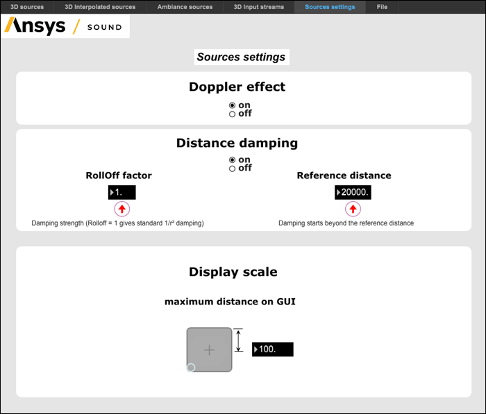

# Sources Settings {#sources_settings}

This button allows you to control the parameters for the distance effect and Doppler effect, by opening the following window:

The **Doppler effect**, which corresponds to the perceived frequency shift in the sound when the distance between the source and the listener varies quickly, can be set to either **on** or **off**.

**Distance damping** can be set to **on** or **off** and is controlled by two parameters:

-   **RollOff factor**: This factor determines the slope of the damping. The higher the value, the highest the damping evolves with distance. A value of 1 gives standard 1/r2 damping as shown in the figure below.
-   **Reference distance**: The damping starts when the distance between the sound source and the listener is greater that the reference distance. When the distance is less than this, no gain is applied to the sound.

This graph shows the influence of these 2 parameters:

.jpg)

Regarding the display scale on the source positioning interface, the chosen value corresponds to half the size of the square used to move the source.

**Note:** Either or both of these controls can be deactivated if Doppler effect or distance damping are already contained in the recording.

