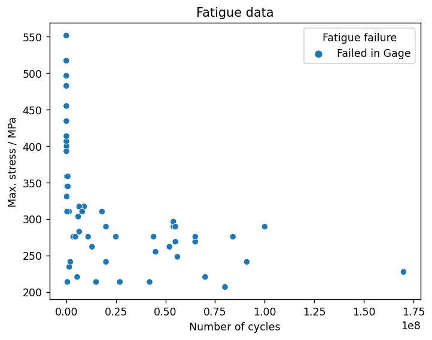
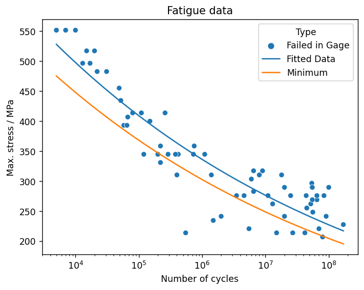

# Fit series data and import fit results

Analyze high-cycle fatigue test data and fit a fatigue model using SciPy, using an approach suitable for automation
with either MI Data Flow or as a simple scheduled task (cron job).

## Connect to Granta MI

Specify a database and tables.


```python
from GRANTA_MIScriptingToolkit import granta as mpy

mi = mpy.connect("http://my.server.name/mi_servicelayer", autologon=True)
database = mi.get_db('MI Training')
statistics_table = database.get_table('Fatigue Statistical Data')
test_data_table = database.get_table('Fatigue Test Data')
```

## Search for records with statistical data

This script will perform a fatigue analysis on the first record whose *Statistical Analysis Status* is set to 'In Progress', but it can easily be generalised to operate on multiple statistical data records.

First, perform a criteria search to find the target record.


```python
criterion_type = statistics_table.attributes['Material type'].search_criterion(contains='Aluminum alloys')
criterion_status = statistics_table.attributes['Statistical Analysis Status'].search_criterion(contains='In Progress')
records = statistics_table.search_for_records_where([criterion_type, criterion_status])
print('Found ' + str(len(records)) + ' corresponding HCF test results.')

r = records[0]
print('Analyzing fatigue data for "' + str(r.name) + '".')
```

    Found 1 corresponding HCF test results.
    Analyzing fatigue data for "7075 T6, R=0, T=430F".
    

## Get the source data for the record

Get the *R-Ratio* and *Test Temperature* values from the record, and fetch the corresponding test results. Then read the attribute values from the test result records into a `pandas` DataFrame for plotting and analysis.


```python
import pandas as pd
import statistics

r_ratio = statistics.mean(r.attributes['Target R-Ratio Range'].value.values())
test_temperature = statistics.mean(r.attributes['Test Temperature Range'].value.values())
material_id = r.attributes['Alloy'].value + '-' + r.attributes['Condition'].value + '/' + r.attributes['Form'].value

criterion_r_ratio = test_data_table.attributes['Target r-ratio'].search_criterion(less_than=r_ratio,
                                                                                  greater_than=r_ratio)
criterion_temperature = test_data_table.attributes['Test temperature'].search_criterion(less_than=test_temperature,
                                                                                        greater_than=test_temperature)
criterion_material_id = test_data_table.attributes['Material ID'].search_criterion(contains=material_id)
records = test_data_table.search_for_records_where([criterion_r_ratio, criterion_temperature, criterion_material_id])

print("Found " + str(len(records)) + " corresponding HCF test results.")

t_results = ["Cyclic life", "Maximum stress", "Fatigue failure"]

rs_dict = {attribute: [r.attributes[attribute].value for r in records] for attribute in t_results}
rs_dict.update({"ShortName": [r.short_name for r in records]})

rs_df = pd.DataFrame(rs_dict)
```

    Found 66 corresponding HCF test results.
    

## Fit the data

Fit the fatigue test data using the SciPy `curve_fit()` function, and create a new DataFrame for the fitted data and the lower bound.


```python
from scipy.optimize import curve_fit
import numpy as np

def fatigue_func(x, A1, A2):
    return 10 **(A2 * np.log10(x) - A1)
                   
(A1, A2), pcov = curve_fit(fatigue_func, rs_df['Cyclic life'], rs_df['Maximum stress'],
                           bounds=([-500.0, -500.0], [500.0, 500.0]))

min_coefficient = 0.9
x = np.geomspace(rs_df['Cyclic life'].min(), rs_df['Cyclic life'].max(), rs_df['Cyclic life'].count())
fitted_series = 10 **(A2 * np.log10(x) - A1)

fitted_df = pd.DataFrame(index=x,
                         data=np.transpose([fitted_series, min_coefficient*fitted_series]),
                         columns=['Fitted Data', 'Minimum']).reset_index().melt(id_vars=['index'])\
                    .rename(columns={'index': 'Cyclic life', 'value': 'Maximum stress', 'variable': 'Type'})

fitted_df.head()
```


<div>
<style scoped>
    .dataframe tbody tr th:only-of-type {
        vertical-align: middle;
    }

    .dataframe tbody tr th {
        vertical-align: top;
    }

    .dataframe thead th {
        text-align: right;
    }
</style>
<table border="1" class="dataframe">
  <thead>
    <tr style="text-align: right;">
      <th></th>
      <th>Cyclic life</th>
      <th>Type</th>
      <th>Maximum stress</th>
    </tr>
  </thead>
  <tbody>
    <tr>
      <th>0</th>
      <td>5000.000000</td>
      <td>Fitted Data</td>
      <td>527.961774</td>
    </tr>
    <tr>
      <th>1</th>
      <td>5870.634799</td>
      <td>Fitted Data</td>
      <td>520.792043</td>
    </tr>
    <tr>
      <th>2</th>
      <td>6892.870589</td>
      <td>Fitted Data</td>
      <td>513.719678</td>
    </tr>
    <tr>
      <th>3</th>
      <td>8093.105189</td>
      <td>Fitted Data</td>
      <td>506.743355</td>
    </tr>
    <tr>
      <th>4</th>
      <td>9502.332991</td>
      <td>Fitted Data</td>
      <td>499.861771</td>
    </tr>
  </tbody>
</table>
</div>


## Plot the data

Create a scatter plot of the source data (*Maximum stress* vs *Number of cycles*).


```python
import seaborn as sns
from matplotlib import pyplot as plt

plt.rcParams['figure.dpi'] = 125

fig, ax = plt.subplots()
ax = sns.scatterplot(data=rs_df, y='Maximum stress', x='Cyclic life', hue='Fatigue failure', ax=ax)

plt.title("Fatigue data")
plt.xlabel("Number of cycles")
plt.ylabel("Max. stress / " + test_data_table.attributes['Maximum stress'].unit)
plt.show()
```


    

    


Add the fitted curve and the minimum curve to the plot, and set the x-axis scale to logarithmic.


```python
sns.lineplot(data=fitted_df, x='Cyclic life', y='Maximum stress', hue='Type', ax=ax)
ax.set(xscale='log')

fig
```


    

    


## Import the fitted data to Granta MI

Replace the data in the original record's functional attribute *Maximum Stress v Cycles (Equivalent Stress)* with the fitted data. Use `Session.update()` to push the changes to Granta MI.


```python
fit = r.attributes['Maximum Stress v Cycles (Equivalent Stress)']
fit.clear()
fit.unit = test_data_table.attributes['Maximum stress'].unit

for _, row in fitted_df.iterrows():
    fit.add_point({'y': row['Maximum stress'],
                   'Number of Cycles': row['Cyclic life'],
                   'Data Type': row['Type'],
                   'Stress Ratio': r_ratio})
for _, row in rs_df.iterrows():
    fit.add_point({'y': row['Maximum stress'],
                   'Number of Cycles': row['Cyclic life'],
                   'Data Type': 'Test Data',
                   'Stress Ratio': r_ratio})

fit.series_linestyles[3] = 'Markers'

r.attributes["Equivalent Stress, A1"].value = A1
r.attributes["Equivalent Stress, A2"].value = A2
r.attributes["Statistical Analysis Status"].value = ["Complete"]
r.set_attributes([
    r.attributes["Equivalent Stress, A1"],
    r.attributes["Equivalent Stress, A2"],
    # The status is not updated; this allows the notebook to be re-run.
    #r.attributes["Statistical Analysis Status"],
    fit
])
fit.value
mi.update([r])
print('Updated attributes in ' + str(r.name) + '.')
```

    Updated attributes in 7075 T6, R=0, T=430F.
    

## Create traceability links

Add a record link group, and use `Session.update_links()` to push the changes to Granta MI.


```python
rec_link_group = r.links['Fatigue Test Data']
for rsi in records:
    rec_link_group.add(rsi)
r.set_links('Fatigue Test Data', rec_link_group)
mi.update_links([r])
print('Updated links in ' + str(r.name) + '.')
```

    Updated links in 7075 T6, R=0, T=430F.
    
