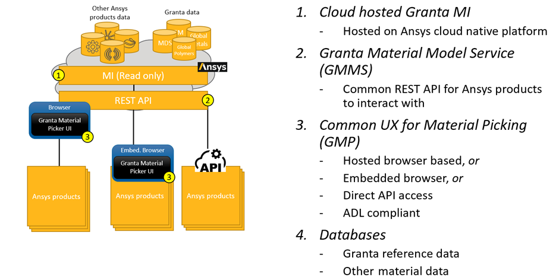

# Granta Cloud Connected Materials Data

## Our Vision 

Within the Ansys Materials Business Unit (formerly Granta Design) we specialize in offering material data management software to store, control, and analyze, creating a “gold-source” of materials data.  Alongside software we have a comprehensive range of Materials Data created and curated by our world-class team of materials specialists. 

Our vision statement for Granta Cloud Connected Materials is to provide access to this data from the full portfolio of Ansys products:

> Our vision is for every single Ansys product to use a central source of high-quality, curated materials data, reference libraries and material information which can be accessed via a single, unified, cloud-hosted UI. 

> Ansys products will use a lightweight plugin with minimal coding that connects to a consistent out-of-the-box application for material selection.
 
## System Architecture 

To achieve this vision, we are providing an Ansys Cloud Native Platform hosted solution using the Granta MI software as a backend to host materials data and allow other Ansys products to connect to this service either directly via API calls, or (preferably) via our Granta Material Picker:

## Materials Data

The Ansys Materials Business Unit will make many of our standard simulation ready datasets available.  The customer of the Ansys product can then license specific data sets to access. 

Example datasets in the first release include:

- Free data (smaller subset of Material Universe) 
- Material Universe 
- Electromagnetics 
- Global Polymers 

The system also allows for a customer-specific database to be created using an approved simulation-ready schema.  This can be done collaboratively in discussion with the Ansys Materials Business Unit.  

For further information use the Teams channel: [Granta Cloud Connected Materials Questions and Feedback](https://teams.microsoft.com/l/channel/19%3AZZ7_UUt4IZ5UZppC3BhIZcR1NlXWhphtIe3YwyONsCU1%40thread.tacv2/Questions%20and%20Feedback?groupId=3ba720a6-d1c0-4d0c-bce0-23a5edd266f1&tenantId=34c6ce67-15b8-4eff-80e9-52da8be89706)

## Resources
The following information is available:

- [Getting Started - creating a session that launches the Granta Material Picker](/docs/getting-started.html)
- [User Guide - covers the core concepts needed to create a plugin](/docs/basic-concepts.html)
- [Examples - worked examples to speed up your development](/docs/getting-started-example.html)
- [API reference - the full list of available API calls ](/integration_service.html)

## Contact Information

To work with us to start integrating your product and data into Granta Cloud Connected Materials, or for further information, contact us:

 

- [Stephen.Grantham@ansys.com](mailto:Stephen.Grantham@ansys.com) (Program Lead) 
- [Charlie.Bream@ansys.com](mailto:Charlie.Bream@ansys.com) (Granta Cloud Connected Materials Product Manager) 

 

Or post requests, questions, or feedback to our Teams channel:

[Granta Cloud Connected Materials Questions and Feedback](https://teams.microsoft.com/l/channel/19%3AZZ7_UUt4IZ5UZppC3BhIZcR1NlXWhphtIe3YwyONsCU1%40thread.tacv2/Questions%20and%20Feedback?groupId=3ba720a6-d1c0-4d0c-bce0-23a5edd266f1&tenantId=34c6ce67-15b8-4eff-80e9-52da8be89706)

 
