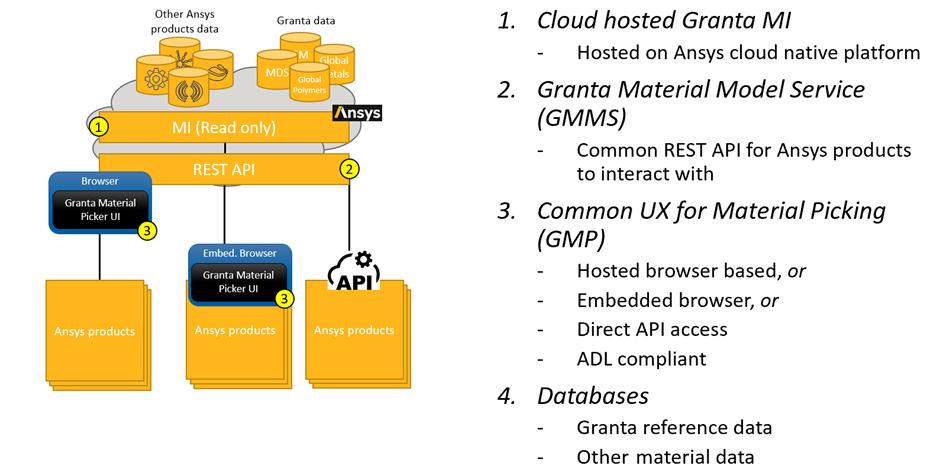

# Granta Connected Data

Ansys Materials specialize in offering material data management software to store, control, and analyze materials data, creating a “golden-source”.  Alongside software, a comprehensive range of Materials Data is supplied. 

## System architecture 

An Ansys Cloud Native Platform hosted solution is provided that uses Granta MI to host materials data and allow other products to connect to this service via the Granta Material Picker:

## Materials data

Standard simulation-ready data sets are available.  The customer can license specific data sets to access. 

Example data sets in the first release include:

- Free data (smaller subset of MaterialUniverse) 
- MaterialUniverse 
- Electromagnetic Materials 
- Global Polymers 

The system also allows for a customer-specific database to be created using an approved simulation-ready schema.  

## Contact information

To work with us to start integrating your product and data, or for further information, contact your Ansys representative.
 
 
