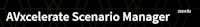

# Metadata and SearchStax upd

## Common remarks

The following sections detail the current metadata management across different content types and outline the required changes. In summary, we require all content types to include "Product collection" metadata that can be configured either through a configuration file (for MD doc) or the Admin UI (for the other content types), ensuring it is accessible to SearchStax.

In addition to managing this metadata, there is a need for a bulk action to update existing content in the Prod env concerning:

- Product collection
- Version
- Physics (less urgent)

Two less urgent requests:

- Documentation Title metadata
  - Preservative implementation: rename "Product" and "Product Name" fields to DocTitleVersion (e.g., "AVxcelerate Simulation Framework 2025 R1"). This aligns with the current behavior, where the document title includes the version. This version is only used in this title. The actual version value is already stored in the dedicated Version metadata field. By doing this, we could later introduce a separate Product metadata field that truly reflects the product name (e.g., "Ansys AVxcelerate").
  - Ideal implementation: Standardize the document title metadata across all content types. That would facilitate working in a more consistent environment. Currently, as described in the tables below, this is not the case. The term "Product/Product name" is used and actually represents the document title + the version (e.g., "AVxcelerate Simulation Framework 2025 R1"). Renaming this metadata to "Doc title" or "Documentation title" universally would be more logical. The version should be clearly separated, and in the UI, the document title should appear as 'Doc title + Version'. Subsequently, we could potentially create a "Product" metadata that accurately represents the product (e.g., "Ansys AVxcelerate").
- Implement status metadata management for the MD and Doxygen content types as already implemented for REST APIs. This will allow us to efficiently push specific content to Production in an unpublished state with a single action.

Note that Version can be as follows:
 "2025 R1", "2025 R1 SP01", "4.1", and "1.0.0.0"

## MD Documentation

### Current behavior

| Config file: docfx.json | Admin UI: Migration process | Admin UI: File edited |  Metadata name | Available to SearchStax | Note
|-------------------------|-----------------------------|-----------------------|------|------|---|
| `title`: read. Example: "System Coupling Participant Library 2025 R1" | Not visible | **Product:** set. Example: "System Coupling Participant Library 2025 R1". | **Product** | No | The document title includes the version and is displayed in the UI exactly as it appears. |
| `version:` read. Example: "2025 R1" | Not visible | **Version:** set. Example: 2025 R1 |**Version** | Yes|
| `physics`: read. Example: "Multiphysics" | Not visible | **Physics:** set. Example: "Multiphysics"| **Physics** | Yes|

### Expected behavior

#### Preservative implementation

| Config file: docfx.json | Admin UI: Migration process | Admin UI: File edited |  Action |  Metadata name | Available to SearchStax 
|-------------------------|-----------------------------|-----------------------|------| ------|------|
| `title`: read. Example: "System Coupling Participant Library" | Not visible | **DocTitleVersion:** set. Example: "System Coupling Participant Library 2025 R2" | Rename to **DocTitleVersion**. | **DocTitleVersion** | No | 
| `version`: read. Example: "2025 R1" | Not visible | **Version:** set. Example: 2025 R1 | Work as expected | **Version** | Yes |
| `physics`: read. Example: "Multiphysics" | Not visible | **Physics:** set. Example: "Multiphysics"| Work as expected  |**Physics** | Yes |
| `product collection`: read. Example: "Shared Technology" | Not visible | **Product collection:** set. Example: "Shared Technology"| Manage as metadata and make it available for SearchStax |**Product collection** | Yes |
| `status`: read. Example: "Published" | Not visible | **Published:** flagged or not |Manage as metadata |**Status** | No |

#### Ideal implementation

| Config file: docfx.json | Admin UI: Migration process | Admin UI: File edited |  Action |  Metadata name | Available to SearchStax | Note
|-------------------------|-----------------------------|-----------------------|------| ------|------|---|
| `title`: read. Example: "System Coupling Participant Library" | Not visible | **Doc title:** set. Example: "System Coupling Participant Library" | Manage as metadata and rename to **Doc title**. | **Doc title** | Yes | The UI should display the document title followed by its version **Doc title** + **Version**, mirroring the format used for REST API documentation. 
| `version`: read. Example: "2025 R1" | Not visible | **Version:** set. Example: 2025 R1 | Work as expected | **Version** | Yes |
| `physics`: read. Example: "Multiphysics" | Not visible | **Physics:** set. Example: "Multiphysics"| Work as expected  |**Physics** | Yes |
| `product collection`: read. Example: "Shared Technology" | Not visible | **Product collection:** set. Example: "Shared Technology"| Manage as metadata and make it available for SearchStax |**Product collection** | Yes |
| `status`: read. Example: "Published" | Not visible | **Published:** flagged or not |Manage as metadata |**Status** | No |

## Doxygen Documentation

### Current behavior

| Config file | Admin UI: Migration process | Admin UI: File edited |Available to SearchStax
|-------------|-----------------------------|-----------------------|----|
| No file | **Product Name:** to be set. Example: "System Coupling Participant Library 2025 R1" | **Product:** set. Example: "System Coupling Participant Library 2025 R1"| No
| No file | **Physics:** to be set. Example: "Multiphysics" | **Physics:** set. Example: "Multiphysics" | Yes
| No file | **Version:** to be set. Example: "2025 R1" | **Version:** set. Example: "2025 R1" | Yes
| No file | **Access Control:** to be set. Example: "Public" | **Internal:** flagged or not | No

### Expected behavior

#### Preservative implementation

| Config file | Admin UI: Migration process | Admin UI: File edited | Action |Metadata name| Available to SearchStax | 
|-------------|-----------------------------|-----------------------|--------|--------|--------|
| No file | **DocTitleVersion:** to be set. Example: "System Coupling Participant Library 2025 R1" | **DocTitleVersion:** set. Example: "System Coupling Participant Library 2025 R1" | Rename to **DocTitleVersion**.  | **DocTitleVersion**| No | 
| No file | **Version:** to be set. Example: "2025 R1" | **Version:** set. Example: "2025 R1" | Work as expected| **Version** |Yes |
| No file | **Physics:** to be set. Example: "Multiphysics" | **Physics:** set. Example: "Multiphysics" | Work as expected | **Physics** | Yes |
| No file | **Access Control:** to be set. Example: "Public" | **Internal:** flagged or not |Work as expected | **Access Control**| No |
| No file | **Product collection:** to be set. Example: "Shared Technology" | **Product collection:** flagged or not | Manage as metadata and make it available for SearchStax| **Product collection** | Yes |
| No file | **Status:** to be set. Example: "Published" | **Published:** flagged or not | Manage as metadata| **Status** | No |

#### Ideal implementation

| Config file | Admin UI: Migration process | Admin UI: File edited | Action |Metadata name| Available to SearchStax | Note
|-------------|-----------------------------|-----------------------|--------|--------|--------|---|
| No file | **Doc title:** to be set. Example: "System Coupling Participant Library" | **Doc title:** set. Example: "System Coupling Participant Library" | Manage as metadata and rename to **Doc title**.  | **Doc title**| Yes | The UI should display the document title followed by its version **Doc title** + **Version**, mirroring the format used for REST API documentation. 
| No file | **Version:** to be set. Example: "2025 R1" | **Version:** set. Example: "2025 R1" | Work as expected| **Version** |Yes |
| No file | **Physics:** to be set. Example: "Multiphysics" | **Physics:** set. Example: "Multiphysics" | Work as expected | **Physics** | Yes |
| No file | **Access Control:** to be set. Example: "Public" | **Internal:** flagged or not |Work as expected | **Access Control**| No |
| No file | **Product collection:** to be set. Example: "Shared Technology" | **Product collection:** flagged or not | Manage as metadata and make it available for SearchStax| **Product collection** | Yes |
| No file | **Status:** to be set. Example: "Published" | **Published:** flagged or not | Manage as metadata| **Status** | No |

## REST API Documentation

Remove **API category** that we are not using or at least do not provide to SearchStax. All changes listed below refer to the following three content types as REST API documentation include them:

- API reference
- API description
- API Basic page

### Current behavior

| Config file: JSON/YAML | Admin UI: Migration process | Admin UI: File edited | Note
|------------------------|-----------------------------|-----------------------|--|
| `title`: | Not visible | Not visible | Already correct 
| `version`: | Not visible |Not visible | |
| Not defined or read | **Physics:** to be set. Example: "Multiphysics"  | **Physics:** set. Example: "Multiphysics"| |
| Not defined or read | **Access Control:** to be set. Example: "Public" | **Internal:** flagged or not | |
| Not defined or read | **Status:** to be set. Example: "Published" | **Published:** flagged or not | |

### Expected behavior

| Config file: JSON/YAML | Admin UI: Migration process | Admin UI: File edited | Action |  Metadata name| Available to SearchStax | Note
|------------------------|-----------------------------|-----------------------|--------|----------|----------|--|
| `title`: | Not visible | Not visible | Manage as metadata | | Yes | Already correct 
| `version`: | Not visible | Not visible | Manage as metadata | **Version** | Yes |
| Not defined | **Physics:** to be set. Example: "Multiphysics"  | **Physics:** set. Example: "Multiphysics"| Work as expected| **Physics**| Yes |
| Not defined  | **Access Control:** to be set. Example: "Public" | **Internal:** flagged or not | Work as expected | **Access Control**| No |
| Not defined  | **Status:** to be set. Example: "Published" | **Published:** flagged or not | Work as expected | **Status**| No |
| Not defined  | **Product collection:** to be set. Example: "Optics" | **Product collection:** set. Example: "Optics" | Manage as metadata and make it available for SearchStax | **Product collection** |  Yes |

