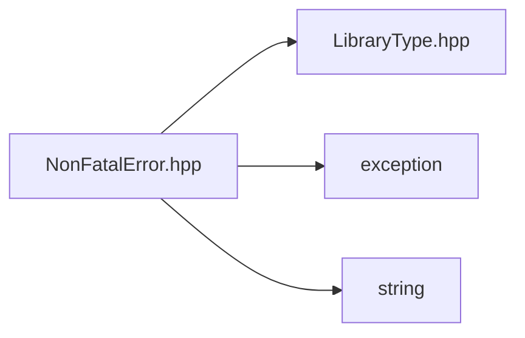

# File NonFatalError.hpp

![][C++]

**Location**: `NonFatalError.hpp`


## Classes

* [sysc::NonFatalError](classsysc_1_1NonFatalError.md#classsysc_1_1NonFatalError)

## Namespaces

* [sysc](namespacesysc.md#namespacesysc)

## Includes

* [LibraryType.hpp](LibraryType_8hpp.md#LibraryType_8hpp)
* <exception>
* <string>



## Source

```cpp

/*
 * Copyright ANSYS. All rights reserved.
 */
#pragma once

#include "LibraryType.hpp"

#include <exception>
#include <string>

namespace sysc {

class NonFatalError : public std::exception {
public:
  NonFatalError(std::string str) :
      m_str("NonFatalError: " + std::move(str))
  {
  }
  ~NonFatalError() noexcept override = default;
  const char* what() const noexcept override { return m_str.c_str(); }

private:
  std::string m_str;
};

void SYSTEM_COUPLING_PARTICIPANT_DLL throwNonFatalError(const std::string& errorMessage);

}  // namespace sysc
```

[public]: https://img.shields.io/badge/-public-brightgreen (public)
[C++]: https://img.shields.io/badge/language-C%2B%2B-blue (C++)
[private]: https://img.shields.io/badge/-private-red (private)
[const]: https://img.shields.io/badge/-const-lightblue (const)