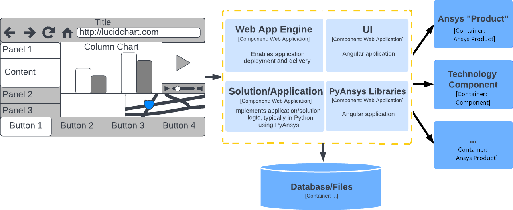

# What is a solution application?

Each Ansys flagship product is a simulation tool designed to accurately model physics phenomena in a given domain, such as mechanics, heat transfer, or fluids.

By contrast, a *solution web app* (often referred to simply as a “solution” or an “app”) encapsulates simulation workflows, combining multiple Ansys simulation products into a single, targeted sequence of steps designed to tackle a multi-domain engineering problem.

An Ansys solution application is a:

* Step-by-step workflow that guides the user through a specialized engineering process
* Vertical application that provides the user with end-to-end simulation support
* Consolidation of engineering experience and expertise for a specific type of modeling
* Tool for promoting collaboration between simulation analysts from different backgrounds

## Composition

Each solution application is composed of two parts:

* The *backend*, where the calls to solvers and physics-specific scripts take place and
  where computational operations occurs
* The *frontend*, a user interface where the user orchestrates the workflow, provides inputs, and collects outputs

Each solution includes a user interface, application logic, and data:

## Deployment

By design, solution applications can support multiple deployment strategies. Solution applications are expected to be deployable as:

* Desktop applications
* Web-based applications (on-premise platforms)
* Cloud-based applications (pending)
  * Public
  * Private

## Business benefits

Customers who use Ansys solution applications can expect to receive the following added-value benefits:

* A stable, accurate interface between Ansys products
* Integration of the combined system-coupling expertise of Ansys professionals
* Reduced risk of errors in the simulation process
* Automation of basic, non-specialized simulation tasks

<!-- Definitions of interpreted text roles (classes) for S5/HTML data. -->
<!-- This data file has been placed in the public domain. -->
<!-- Colours
======= -->
<!-- Text Sizes
========== -->
<!-- Display in Slides (Presentation Mode) Only
========================================== -->
<!-- Display in Outline Mode Only
============================ -->
<!-- Display in Print Only
===================== -->
<!-- Display in Handout Mode Only
============================ -->
<!-- Incremental Display
=================== -->
