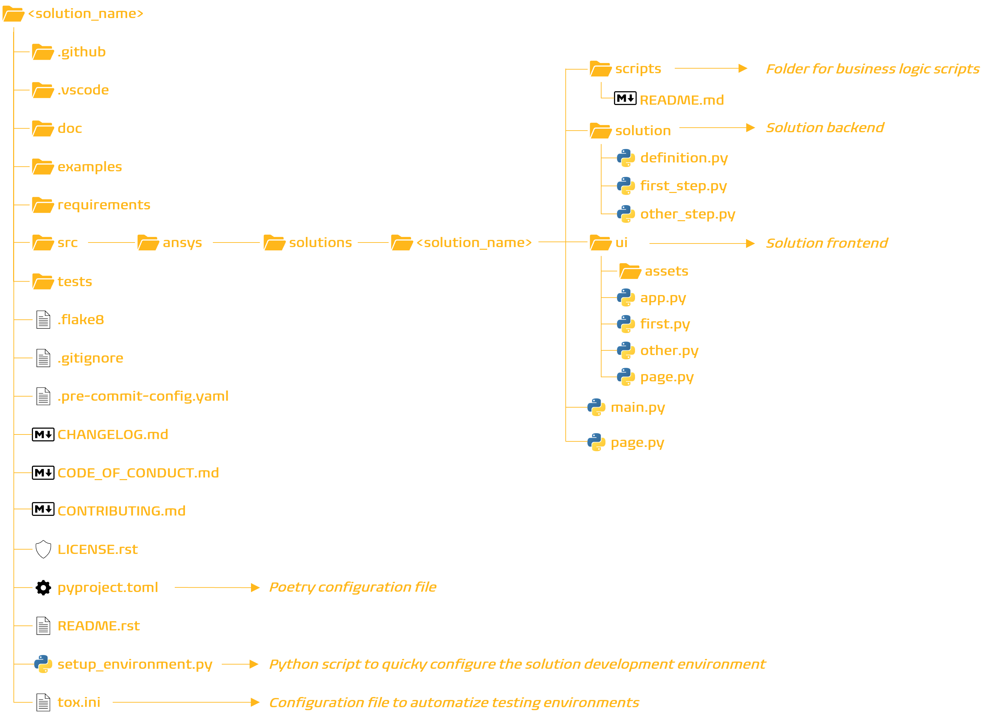

# Generate a solution

> ##### Summary
> 
> Generate a solution application project using the `ansys-templates` tool.

<a id="solution-naming-convention"></a>

<a id="solution-naming-conventions"></a>

## Solution naming conventions

Make sure your solution name follows these conventions:

* All solutions in a given directory must have unique names.
* A solution name cannot be a path.
* A solution name cannot contain:
  * Spaces
  * Forward-slash (`/`) or backward-slash (`\`) characters
  * Invalid characters: colons (`:`), semi-colons (`;`), asterisks (`*`), question marks (`?`), or angle quotations (`<`, `>`)

<a id="generate-solution"></a>

<a id="generate-a-solution-project"></a>

## Generate a solution project

Generate a solution project in the current (default) directory using the `ansys-templates` tool.

#### NOTE
These commands must be executed from an initial base console environment, rather than within a virtual environment.

1. Instantiate the solution template:
   ```bash
   ansys-templates new solution
   ```
2. Enter the project name in the command prompt:
   ```bash
   project_name []: <project-name>
   ```

   ```bash
   project_name []: minimal-solution
   ```

   Press Enter to validate. The `project_name` is the name of the root directory
   of the solution.

   #### NOTE
   To comply with the naming convention expected by SAF, the `project_name` is transformed as follows: all letters are written in lower case and underscores are replaced by hyphens.
3. Enter the solution name in the command prompt:
   ```bash
   solution_name []: <solution_name>
   ```

   ```bash
   solution_name []: minimal
   ```

   Press Enter to validate.

   #### NOTE
   To comply with the naming convention expected by SAF, the `solution_name` is transformed as follows: all letters are written in lower case and hyphens are replaced by underscores.
4. Enter the solution display name in the command prompt:
   ```bash
   solution_display_name []: <solution display name>
   ```

   ```bash
   solution_display_name []: My Minimal Solution
   ```

   Press Enter to validate.
5. Select `no_ui` mode:
   ```bash
   Select no_ui:
   1 - False
   2 - True
   Choose from 1, 2 [1]: 1
   ```

   ```bash
   Select no_ui:
   1 - False
   2 - True
   Choose from 1, 2 [1]: 2
   ```

   Press Enter to validate.

A solution directory with the provided name is created in the current directory.

<a id="solution-project-structure"></a>

<a id="solution-directory-contents"></a>

## Solution directory contents

When you create a solution, the solution project directory is created with at least the following contents:


<!-- Definitions of interpreted text roles (classes) for S5/HTML data. -->
<!-- This data file has been placed in the public domain. -->
<!-- Colours
======= -->
<!-- Text Sizes
========== -->
<!-- Display in Slides (Presentation Mode) Only
========================================== -->
<!-- Display in Outline Mode Only
============================ -->
<!-- Display in Print Only
===================== -->
<!-- Display in Handout Mode Only
============================ -->
<!-- Incremental Display
=================== -->
