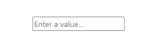
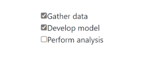
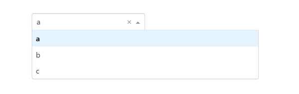
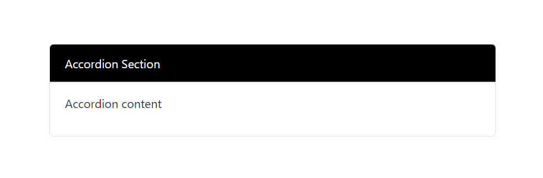

# Common Dash components

<!-- Internal note:  The other two sections for Ansys Solutions Dash components and Ansys viewers have been removed, as these are not available to external users. -->
> ##### Summary
> 
> Use common Dash components to build page layouts for solution application steps.
> 
> <!-- Source code for this example is in the `tutorial-common-dash-components <https://github.com/ansys-internal/tutorial-common-dash-components>`_ repository. -->

<a id="svg-version-4-0-0-63c5cb3-width-1-25em-height-1-25em-class-sd-material-icon-sd-material-icon-ads-click-sd-text-secondary-viewbox-0-0-20-20-aria-hidden-true-rect-fill-none-height-20-width-20-rect-path-d-m17-09-18-5l-3-47-3-47l12-5-18l10-10l8-2-5l-2-97-1-11l3-47-3-47l17-09-18-5z-m10-3-5c-3-58-0-6-5-2-92-6-5-6-5-s2-92-6-5-6-5-6-5c0-15-0-0-3-0-01-0-45-0-02l0-46-1-46c10-61-17-98-10-31-18-10-18c-4-42-0-8-3-58-8-8s3-58-8-8-8l0-0-c4-42-0-8-3-58-8-8c0-0-31-0-02-0-61-0-05-0-91l-1-46-0-46c0-01-0-15-0-02-0-3-0-02-0-45c16-5-6-42-13-58-3-5-10-3-5-m10-6-5-c-1-93-0-3-5-1-57-3-5-3-5c0-1-76-1-31-3-23-3-01-3-47l10-15c0-0-0-01-0-0-01-0c7-23-15-5-12-76-5-10c0-2-76-2-24-5-5-5l0-0-c2-76-0-5-2-23-5-4-99c0-0-0-0-01-0-0-01l-1-53-0-49c13-23-7-81-11-76-6-5-10-6-5-path-svg-objective"></a>

## <svg version="4.0.0.63c5cb3" width="1.25em" height="1.25em" class="sd-material-icon sd-material-icon-ads_click sd-text-secondary" viewBox="0 0 20 20" aria-hidden="true"><rect fill="none" height="20" width="20"></rect><path d="M17.09,18.5l-3.47-3.47L12.5,18L10,10l8,2.5l-2.97,1.11l3.47,3.47L17.09,18.5z M10,3.5c-3.58,0-6.5,2.92-6.5,6.5 s2.92,6.5,6.5,6.5c0.15,0,0.3-0.01,0.45-0.02l0.46,1.46C10.61,17.98,10.31,18,10,18c-4.42,0-8-3.58-8-8s3.58-8,8-8l0,0 c4.42,0,8,3.58,8,8c0,0.31-0.02,0.61-0.05,0.91l-1.46-0.46c0.01-0.15,0.02-0.3,0.02-0.45C16.5,6.42,13.58,3.5,10,3.5 M10,6.5 c-1.93,0-3.5,1.57-3.5,3.5c0,1.76,1.31,3.23,3.01,3.47L10,15c0,0-0.01,0-0.01,0C7.23,15,5,12.76,5,10c0-2.76,2.24-5,5-5l0,0 c2.76,0,5,2.23,5,4.99c0,0,0,0.01,0,0.01l-1.53-0.49C13.23,7.81,11.76,6.5,10,6.5"></path></svg> Objective

[Dash](https://dash.plotly.com) is a Python framework for building interactive web applications. This is the recommended frontend framework for solution applications for the following reasons:

* Ease of adoption among non-software developers or application engineers
* Strong online community
* Large set of open source component libraries, including:
  * [Dash Core Components](https://dash.plotly.com/dash-core-components)
  * [Dash HTML Components](https://dash.plotly.com/dash-html-components)
  * [Dash Bootstrap Components](https://dash-bootstrap-components.opensource.faculty.ai/)
  * [Community Components Index](https://community.plotly.com/t/community-components-index/60098)

The objective of this example is to introduce common UI components used in solution applications, so that you can start using these to build the layout of your steps.

<a id="svg-version-4-0-0-63c5cb3-width-1-25em-height-1-25em-class-sd-material-icon-sd-material-icon-task-sd-text-secondary-viewbox-0-0-24-24-aria-hidden-true-g-path-d-m0-0h24v24h0v0z-fill-none-path-g-g-path-d-m14-2h6c4-9-2-4-01-2-9-4-01-4l4-20c0-1-1-0-89-2-1-99-2h18c1-1-0-2-0-9-2-2v8l14-2z-m18-20h6v4h7v5h5v20z-m8-82-13-05-l7-4-14-46l10-94-18l5-66-5-66l-1-41-1-41l-4-24-4-24l8-82-13-05z-path-g-svg-prerequisites"></a>

## <svg version="4.0.0.63c5cb3" width="1.25em" height="1.25em" class="sd-material-icon sd-material-icon-task sd-text-secondary" viewBox="0 0 24 24" aria-hidden="true"><g><path d="M0,0h24v24H0V0z" fill="none"></path></g><g><path d="M14,2H6C4.9,2,4.01,2.9,4.01,4L4,20c0,1.1,0.89,2,1.99,2H18c1.1,0,2-0.9,2-2V8L14,2z M18,20H6V4h7v5h5V20z M8.82,13.05 L7.4,14.46L10.94,18l5.66-5.66l-1.41-1.41l-4.24,4.24L8.82,13.05z"></path></g></svg> Prerequisites

To test out the UI components introduced in this example, create a solution and build the page layout for your solution steps.

Create a solution using the `ansys-templates` tool, as described in [Generate a solution](../develop/dev_prepare/create_solution.md#create-solution). Then review the steps in the minimal solution that was generated.

### Minimal solution file structure

* In the `solution` directory, there are three steps, identified as first, second, and third.
* For each step, there is an associated page module (`<step_name>_page.py`) in the `ui/pages`
  directory.

```none
   minimal-solution/
   ├── .github/
   ├── .vscode/
   ├── doc/
   ├── examples/
   ├── src/ansys/solutions/minimal_solution/
   │   │   └──scripts/
   │   ├── solution/
   │   │   ├── definition.py
   │   │   ├── first_step.py
   │   │   ├── second_step.py
   │   │   └── third_step.py
   │   ├── ui/
   │   │   |── assets/
   │   │   |── components/
   │   │   |── pages/
   │   │   │   ├── first_page.py
   │   │   │   |── page.py
   │   │   │   ├── second_page.py
   │   │   │   └── third_page.py
   │   │   └── app.py
   │   └── __init__.py
   ├── tests
   ├── .flake8
   ├── .gitignore
   ├── .pre-commit-config.yaml
   ├── CHANGELOG.md
   ├── CODE_OF_CONDUCT.md
   ├── CONTRIBUTING.md
   ├── LICENSE.rst
   ├── pyproject.toml
   ├── README.rst
   ├── setup_environment.py
   └── tox.ini
```

The layout of a step is defined in the `layout` function of the `<step_name>_page.py` module. Build the step layout by adding Dash components to the `html.Div` container in this function.

### Step layout function

```python
from dash_extensions.enrich import dcc, html


def layout():

   return html.Div(
      [
            # Add the UI components here
      ]
   )
```

<a id="saf-ex-dash-components-solution"></a>

<a id="svg-version-1-1-width-1-0em-height-1-0em-class-sd-octicon-sd-octicon-code-square-sd-text-secondary-viewbox-0-0-16-16-aria-hidden-true-path-d-m0-1-75c0-784-784-0-1-75-0h12-5c15-216-0-16-784-16-1-75v12-5a1-75-1-75-0-0-1-14-25-16h1-75a1-75-1-75-0-0-1-0-14-25zm1-75-25a-25-25-0-0-0-25-25v12-5c0-138-112-25-25-25h12-5a-25-25-0-0-0-25-25v1-75a-25-25-0-0-0-25-25zm7-47-3-97a-75-75-0-0-1-1-06-0l2-2a-75-75-0-0-1-0-1-06l-2-2a-749-749-0-0-1-1-275-326-749-749-0-0-1-215-734l10-69-8-9-22-6-53a-75-75-0-0-1-0-1-06zm6-78-6-53-5-31-8l1-47-1-47a-749-749-0-0-1-326-1-275-749-749-0-0-1-734-215l-2-2a-75-75-0-0-1-0-1-06l2-2a-751-751-0-0-1-1-042-018-751-751-0-0-1-018-1-042z-path-svg-dash-components"></a>

## <svg version="1.1" width="1.0em" height="1.0em" class="sd-octicon sd-octicon-code-square sd-text-secondary" viewBox="0 0 16 16" aria-hidden="true"><path d="M0 1.75C0 .784.784 0 1.75 0h12.5C15.216 0 16 .784 16 1.75v12.5A1.75 1.75 0 0 1 14.25 16H1.75A1.75 1.75 0 0 1 0 14.25Zm1.75-.25a.25.25 0 0 0-.25.25v12.5c0 .138.112.25.25.25h12.5a.25.25 0 0 0 .25-.25V1.75a.25.25 0 0 0-.25-.25Zm7.47 3.97a.75.75 0 0 1 1.06 0l2 2a.75.75 0 0 1 0 1.06l-2 2a.749.749 0 0 1-1.275-.326.749.749 0 0 1 .215-.734L10.69 8 9.22 6.53a.75.75 0 0 1 0-1.06ZM6.78 6.53 5.31 8l1.47 1.47a.749.749 0 0 1-.326 1.275.749.749 0 0 1-.734-.215l-2-2a.75.75 0 0 1 0-1.06l2-2a.751.751 0 0 1 1.042.018.751.751 0 0 1 .018 1.042Z"></path></svg> Dash components

Explore the open-source Dash components available in the [Dash Core Components](https://dash.plotly.com/dash-core-components), [Dash HTML Components](https://dash.plotly.com/dash-html-components), and [Dash Bootstrap Components](https://dash-bootstrap-components.opensource.faculty.ai/) libraries.

<a id="getting-started"></a>

### Getting started

1. The `dcc` and `html` modules from `dash_extensions.enrich` give you access
   to many components, including inputs, checklists, buttons, dropdowns, and more. To use these components, import `dcc` and `html` with:
   ```python
   from dash_extensions.enrich import dcc, html
   ```
2. To access the components from
   [Dash Bootstrap Components](https://dash-bootstrap-components.opensource.faculty.ai/) library, import `dash_bootstrap_components`:
   ```python
   import dash_bootstrap_components as dbc
   ```

<a id="examples"></a>

### Examples

Review the component code and output examples that follow.

### Input

```python
dcc.Input(
   id="input-example",
   value="",
   placeholder="Enter a value...",
   type="text",
)
```



### Checklist

```python
dcc.Checklist(
   id="checklist-example",
   options=["Gather data", "Develop model", "Perform analysis"],
   value=["Gather data", "Develop model"],
)
```



### RadioItems

```python
dcc.RadioItems(
   id="radio-items-example", options=["Option 1", "Option 2", "Option 3"], value="Option 2"
)
```


### Button

```python
html.Button(id="button-example", children="Submit")
```


### Dropdown

```python
dcc.Dropdown(id="dropdown-example", options=["a", "b", "c"], value="a")
```



### Accordion

```python
dbc.Accordion(
   [
      dbc.AccordionItem(
            [
               html.P("Accordion content"), # Add UI components here
            ],
            title="Accordion Section",
            item_id="accordion-example",
      )
   ]
)
```


<!-- Definitions of interpreted text roles (classes) for S5/HTML data. -->
<!-- This data file has been placed in the public domain. -->
<!-- Colours
======= -->
<!-- Text Sizes
========== -->
<!-- Display in Slides (Presentation Mode) Only
========================================== -->
<!-- Display in Outline Mode Only
============================ -->
<!-- Display in Print Only
===================== -->
<!-- Display in Handout Mode Only
============================ -->
<!-- Incremental Display
=================== -->
