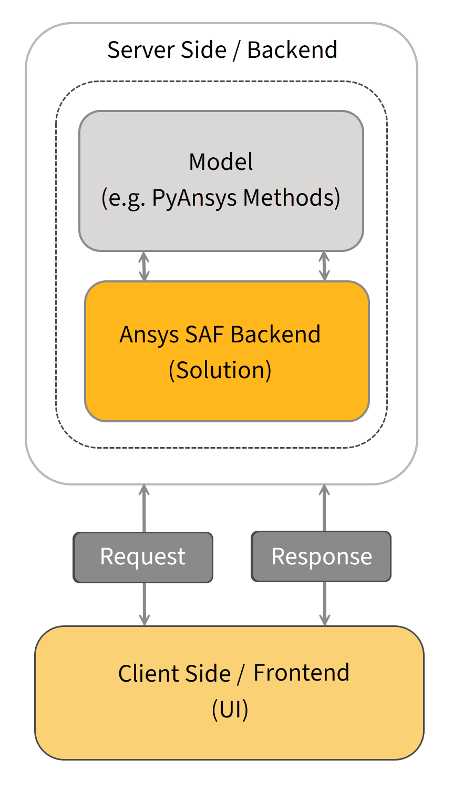

# SAF overview

## What is SAF?

The Ansys **Solution Applications Framework (SAF)** is an inner-source, Python-based framework designed for the development and deployment of custom Ansys-driven **solution applications** (generally referred to just as *solutions*).

## Why use SAF?

SAF enables you to create and modify simulation applications of varying levels of complexity, from extended multi-solver workflow applications to more straightforward applications consisting of a single form. For example, you can use SAF to:

* Streamline the development and UI exposure of a solution that guides a non-expert user
  through a complex, multi-step workflow involving multiple Ansys flagship products
* Quickly develop a light script-based, single-solver solution with no UI exposure

## SAF components

SAF consists of two component Python packages: **SAF GLOW** and the **SAF Portal**.

These packages may be installed either together or separately, but are usually installed and implemented together. Currently, they are both auto-installed by the `setup_environment.py` script described in [Set up your development environment](../getting_started/prerequisites.md#canonical-development-environment).

SAF Guided Low-Code Workflow (GLOW):
: Provides a low-code development with a Solution API for building the backend solution definition, a Client API for building the frontend solution interface, and a solution-specific API server.
   
  For more information on GLOW, see the [Ansys® Guided Low-Code Workflow (GLOW)](https://saf.docs.solutions.ansys.com/version/stable/index.html) documentation.

SAF Portal:
: Provides a portal interface that serves as a solution’s “landing page” for creating, accessing, and working with solution projects.
   
  For more information on the Portal, see the [Ansys® SAF Portal](https://potential-adventure-ovlqkq9.pages.github.io/version/stable/) documentation.
   
  <!-- * For instructions on implementing the Portal in a Dash-based application, see :ref:`creating-a-solution-ui-index`. -->

## SAF features

To learn more about the functionality provided in a SAF desktop deployment, see [Current SAF features](https://saf.docs.solutions.ansys.com/version/stable/getting_started/features.html).

## SAF architecture

SAF’s frontend and backend components interact as follows:

<!-- SAF within the Solutions ecosystem -->
<!-- ---------------------------------- -->
<!-- ..  image:: /../_static/getting_started/saf_diagram_02.png -->
<!-- SAF system context -->
<!-- ------------------- -->
<!-- ..  image:: /../_static/getting_started/saf_arch_01.png -->
<!-- For more detailed information about SAF's architecture, check out the `GLOW C4 Model <https://nicw19soneprd1.win.ansys.com:9081/share/19>`_ (accessible only through the Ansys Internal Network). -->

## Where can I find more information?

To access more detailed information on SAF components, follow the links provided on the [SAF hub](index.md#saf-hub-index) page.

<!-- Definitions of interpreted text roles (classes) for S5/HTML data. -->
<!-- This data file has been placed in the public domain. -->
<!-- Colours
======= -->
<!-- Text Sizes
========== -->
<!-- Display in Slides (Presentation Mode) Only
========================================== -->
<!-- Display in Outline Mode Only
============================ -->
<!-- Display in Print Only
===================== -->
<!-- Display in Handout Mode Only
============================ -->
<!-- Incremental Display
=================== -->
