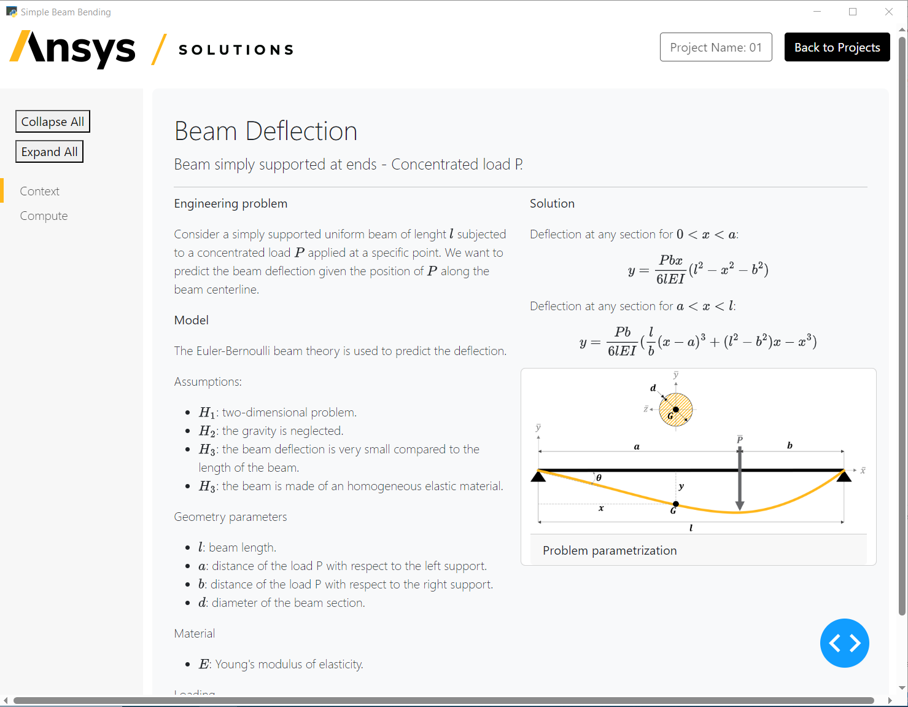
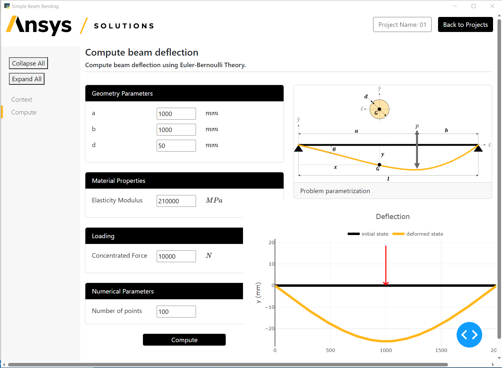

# Development

Welcome to the third phase of the solution development lifecycle. Here, you’ll need to address the steps shown below.

### 1️⃣ Logic

### Why?

The business logic refers to the methods that contain the knowledge to solve the engineering problem. This is the core part of the solution. No business logic, no solution.

In the case of the simple beam bending, the business logic is the function that returns the beam deflection given the geometry, material, and loading parameters.

Objective
: Implement the business logic for the solution.

### How?

Action

1. Create a module named `beam_deflection.py` in the `logic` directory of your solution.
2. Expand the following code sample and add it to the file.

   ### <svg version="4.0.0.63c5cb3" width="2.0em" height="2.0em" class="sd-material-icon sd-material-icon-code sd-text-success" viewBox="0 0 24 24" aria-hidden="true"><path d="M0 0h24v24H0V0z" fill="none"></path><path d="M9.4 16.6L4.8 12l4.6-4.6L8 6l-6 6 6 6 1.4-1.4zm5.2 0l4.6-4.6-4.6-4.6L16 6l6 6-6 6-1.4-1.4z"></path></svg>

   ```bash
   import numpy as np

   def compute_beam_deflection(a: float, b: float, d: float, E: float, p: float, n: int = 100) -> tuple:
       """Computes the deflection of a simply supported beam at ends with concentrated load P. The beam has a circular section of diameter d.

       Parameters
       ----------
       a : float
           Distance of load P with respect to the left support (mm).
       b : float
           Distance of load P with respect to the right support (mm).
       d: float
           Diameter of the beam section (mm).
       E: float
           Elastic modulus of the material the beam is made of (MPa).
       p : float
           Amplitude of the vertical load P (N).
       n: int
           Number of points along the beam axis on which the deflection is computed.

       Returns
       -------
       list
           X coordinates of the beam center line.
       list
           Vertical displacement of the beam center line evaluated for each `nx` point.
       """

       # Total beam length (mm)
       l = a + b

       # Moment of inertia (mm^4)
       I3 = np.pi*d**4/64

       # Space discretization
       x1 = np.linspace(0, a+b, n)

       # Initialize the deflection (mm)
       u2 = np.zeros_like(x1)

       # Compute deflection (mm)
       for i, x in enumerate(x1):
           if x <= a:
               u2[i] = -p*b*x*(l**2-x**2-b**2)/(6*l*E*I3)
           else:
               u2[i] = -p*b*(l/b*(x-a)**3+(l**2-b**2)*x-x**3)/(6*l*E*I3)

       return [x1.tolist(), u2.tolist()]
   ```

Note that `compute_beam_deflection` is an implementation of the analytical equation for the beam deflection according to Euler-Bernoulli Beam Theory.

### 2️⃣ Definition

### Why?

The solution definition refers to the `definition.py` module located in the `solution` directory. More information about the solution definition is available in [Solution defintion](https://saf.external.desktop.docs.solutions.ansys.com/version/dev/user_guide/solution_definition.html#solution-definition) in the .

Objective
: Edit the solution definition to match your needs.

### How?

The minimal solution generated from `ansys-templates` comes with a three-step solution definition: `intro_step`, `first_step` and `second_step`.

In the case of the `simple-beam-bending` solution, however, we want a two-step workflow: `context_step` and `compute_step`.

Action
: Remove the unnecessary steps and to proceed to the step renaming.

### Backend

In `src/ansys/simple_beam_bending/solution`:

1. Delete `second_step.py`.
2. Rename all of instances `intro_step.py` to `context_step.py`.
3. Rename all instances of `first_step.py` to `compute_step.py`.
4. Edit `context_step.py`, changing the `StepModel` name from `IntroStep`
   to `ContextStep` and save.
5. Edit `compute_step.py`, changing the `StepModel` name from `FirstStep`
   into `ComputeStep` and save.
6. Edit `definition.py` to adjust for the previous changes as shown below:

   ### <svg version="4.0.0.63c5cb3" width="2.0em" height="2.0em" class="sd-material-icon sd-material-icon-code sd-text-success" viewBox="0 0 24 24" aria-hidden="true"><path d="M0 0h24v24H0V0z" fill="none"></path><path d="M9.4 16.6L4.8 12l4.6-4.6L8 6l-6 6 6 6 1.4-1.4zm5.2 0l4.6-4.6-4.6-4.6L16 6l6 6-6 6-1.4-1.4z"></path></svg>

   ```bash
   from ansys.saf.glow.solution import Solution, StepsModel
   from ansys.solutions.simple_beam_bending.solution.context_step import ContextStep
   from ansys.solutions.simple_beam_bending.solution.compute_step import ComputeStep


   class Steps(StepsModel):
       """Workflow definition."""
       context_step: ContextStep
       compute_step: ComputeStep


   class Simple_Beam_BendingSolution(Solution):
       """Solution definition."""
       display_name: str = "Simple Beam Bending"
       steps: Steps
   ```

### Frontend

Each step in the solution has its counterpart in the UI side. So the next step is to apply the same changes in `src/ansys/simple_beam_bending/ui/pages`:

1. Delete `second_page.py`.
2. Rename all instances of `intro_page.py` to `context_page.py`.
3. Rename all instances of `first_page.py` into `compute_page.py`.
4. Edit `context_page.py`:
   * Replace `intro_step` with `context_step`.
   * Replace `IntroStep` with `ContextStep`.
   * Save.
5. Edit `compute_page.py`:
   * Replace `first_step` with `compute_step`.
   * Replace `FirstStep` with `ComputeStep`.
   * Save.
6. Edit `page.py`:
   * Delete the `second_page` import.
   * Rename all instances of `intro_page` to `context_page`.
   * Rename all instances of `first_page` to `compute_page`.
   * Remove the item corresponding to the former `second_step` of the `step_list` object, as shown below:

   ### <svg version="4.0.0.63c5cb3" width="2.0em" height="2.0em" class="sd-material-icon sd-material-icon-code sd-text-success" viewBox="0 0 24 24" aria-hidden="true"><path d="M0 0h24v24H0V0z" fill="none"></path><path d="M9.4 16.6L4.8 12l4.6-4.6L8 6l-6 6 6 6 1.4-1.4zm5.2 0l4.6-4.6-4.6-4.6L16 6l6 6-6 6-1.4-1.4z"></path></svg>

   ```bash
   step_list = [
       {
           "key": "context_step",
           "text": "Context",
           "depth": 0,
       },
       {
           "key": "compute_step",
           "text": "Compute",
           "depth": 0,
       }
   ]
   ```
7. In the `display_page` callback function, remove the third `elif` statement
   related to the second step.

### 3️⃣ Steps

### Why?

This step aims at building the backend of the solution according to SAF. A `StepModel` contains fields and transaction methods.

Objective
: Adjust the existing step models in the backend of the solution.

### How?

Action
: Customize each step model to trigger the appropriate processes in the backend.

### Context step

This step provides a general description of the solution. You want to display only text, images, and equations in the user interface.

There is no interactivity, and most importantly, there are no backend processes to be triggered. Because of this, you can leave the `context_step.py` module as
it is. No changes are required.

### Compute step

In the compute step, you want to expose some parameters and plot the deformed state of the beam. This is the step in which the business logic is invoked to compute the beam deflection.

**1. Create input fields**

First, you need a step field for each of the input parameters you want to expose in the user interface.

Open the `compute_step.py` module, then expand the following code and use it to add attributes to the `ComputeStep` class. (The parameters are listed in the table below the code.)

### <svg version="4.0.0.63c5cb3" width="2.0em" height="2.0em" class="sd-material-icon sd-material-icon-code sd-text-success" viewBox="0 0 24 24" aria-hidden="true"><path d="M0 0h24v24H0V0z" fill="none"></path><path d="M9.4 16.6L4.8 12l4.6-4.6L8 6l-6 6 6 6 1.4-1.4zm5.2 0l4.6-4.6-4.6-4.6L16 6l6 6-6 6-1.4-1.4z"></path></svg>

```bash
class ComputeStep(StepModel):
    """Step definition of the first step."""
    length_a: float = 1000 # mm
    length_b: float = 1000 # mm
    diameter: float = 50 # mm
    elasticity_modulus: float = 210E3 # MPa
    load: float = 10E3 # N
```

| Step field           | Parameter   | Description                                                | Default value   |
|----------------------|-------------|------------------------------------------------------------|-----------------|
| `length_a`           | `a`         | Distance of load P with respect to the left support (mm).  | 1000 mm         |
| `length_b`           | `b`         | Distance of load P with respect to the right support (mm). | 1000 mm         |
| `diameter`           | `d`         | Diameter of the beam section (mm).                         | 50 mm           |
| `elasticity_modulus` | `E`         | Elastic modulus of the material the beam is made of (MPa). | 210 GPa         |
| `load`               | `P`         | Amplitude of the vertical load P (N).                      | 10000 N         |

**2. Create an output field**

Next, create one field for output. If you check the `compute_beam_deflection` function in the logic directory, you can see that it returns a tuple with two lists. Record this output in a field named `deflection`.

Expand the following code sample and use it to add the `deflection` field:

### <svg version="4.0.0.63c5cb3" width="2.0em" height="2.0em" class="sd-material-icon sd-material-icon-code sd-text-success" viewBox="0 0 24 24" aria-hidden="true"><path d="M0 0h24v24H0V0z" fill="none"></path><path d="M9.4 16.6L4.8 12l4.6-4.6L8 6l-6 6 6 6 1.4-1.4zm5.2 0l4.6-4.6-4.6-4.6L16 6l6 6-6 6-1.4-1.4z"></path></svg>

```bash
class ComputeStep(StepModel):
    """Step definition of the first step."""
    length_a: float = 1000 # mm
    length_b: float = 1000 # mm
    diameter: float = 50 # mm
    elasticity_modulus: float = 210E3 # MPa
    load: float = 10E3 # N
    deflection: Optional[List[List[float]]] = None # (mm, mm)
```

**3. Add the transcation method**

Finally, implement the transaction method that invokes the business logic and compute the deflection.

Expand the following code sample and add it under the attributes:

### <svg version="4.0.0.63c5cb3" width="2.0em" height="2.0em" class="sd-material-icon sd-material-icon-code sd-text-success" viewBox="0 0 24 24" aria-hidden="true"><path d="M0 0h24v24H0V0z" fill="none"></path><path d="M9.4 16.6L4.8 12l4.6-4.6L8 6l-6 6 6 6 1.4-1.4zm5.2 0l4.6-4.6-4.6-4.6L16 6l6 6-6 6-1.4-1.4z"></path></svg>

```bash
class ComputeStep(StepModel):
    """Step definition of the first step."""
    length_a: float = 1000  # mm
    length_b: float = 1000  # mm
    diameter: float = 50  # mm
    elasticity_modulus: float = 210E3  # MPa
    load: float = 10E3  # N
    deflection: Optional[List[List[float]]] = None # (mm, mm)

    @transaction(
        self=StepSpec(
            download=[
                "length_a",
                "length_b",
                "diameter",
                "elasticity_modulus",
                "load"
            ],
            upload=[
                "deflection"
            ]
        )
    )
    def compute_beam_deflection(self) -> None:
        """Method to compute the deflection of a simply supported beam."""
        self.deflection = compute_beam_deflection(
            self.length_a, self.length_b, self.diameter, self.elasticity_modulus, self.load)
```

* The method name is `compute_beam_deflection`.
* The `@transaction` specifies that the method is a synchronous method.
* It takes as inputs the parameters `length_a`, `length_b`, `diameter`, `elasticity_modulus` and `load`.
* It returns the output `deflection`.

**4. Import the method**

Inside the method, the `compute_beam_deflection` is invoked.

Import the method from the business logic by expanding the following code sample and adding it to the top of the module:

### <svg version="4.0.0.63c5cb3" width="2.0em" height="2.0em" class="sd-material-icon sd-material-icon-code sd-text-success" viewBox="0 0 24 24" aria-hidden="true"><path d="M0 0h24v24H0V0z" fill="none"></path><path d="M9.4 16.6L4.8 12l4.6-4.6L8 6l-6 6 6 6 1.4-1.4zm5.2 0l4.6-4.6-4.6-4.6L16 6l6 6-6 6-1.4-1.4z"></path></svg>

```bash
from ansys.solutions.simple_beam_bending.logic.beam_deflection import compute_beam_deflection
```

### 4️⃣ Pages

### Why?

This step customizes the solution user interface.

Objective
: Add text, images, graphs, and the interactivity to trigger the backend transaction methods.

### How?

Action
: Customize each page to trigger the the backend transaction methods.

### Context page

### Left side

Start by adding a short description of the solution and the engineering
problem it solves.

**1. Clean up the layout function**

Open `context_page.py` and replace the `layout` function by the code sample:

### <svg version="4.0.0.63c5cb3" width="2.0em" height="2.0em" class="sd-material-icon sd-material-icon-code sd-text-success" viewBox="0 0 24 24" aria-hidden="true"><path d="M0 0h24v24H0V0z" fill="none"></path><path d="M9.4 16.6L4.8 12l4.6-4.6L8 6l-6 6 6 6 1.4-1.4zm5.2 0l4.6-4.6-4.6-4.6L16 6l6 6-6 6-1.4-1.4z"></path></svg>

```bash
def layout(step: ContextStep):
    """Layout of the first step UI."""
    return html.Div(
        dbc.Container(
            [],
            fluid=True,
            className="py-3",
        ),
        className="p-3 bg-light rounded-3"
    )
```

The empty list passed to the `dbc.Container` component holds all the content of the page. Let’s call this list the children of `dbc.Container`.

**2. Add the title and subtitle**

Add the title and the subtitle to the children of `dbc.Container`:

### <svg version="4.0.0.63c5cb3" width="2.0em" height="2.0em" class="sd-material-icon sd-material-icon-code sd-text-success" viewBox="0 0 24 24" aria-hidden="true"><path d="M0 0h24v24H0V0z" fill="none"></path><path d="M9.4 16.6L4.8 12l4.6-4.6L8 6l-6 6 6 6 1.4-1.4zm5.2 0l4.6-4.6-4.6-4.6L16 6l6 6-6 6-1.4-1.4z"></path></svg>

```bash
def layout(step: ContextStep):
    """Layout of the first step UI."""
    return html.Div(
        dbc.Container(
            [
                html.H1("Beam Deflection", className="display-3", style={"font-size": "35px"}),
                html.P(
                    "Beam simply supported at ends - Concentrated load P.",
                    className="lead",
                    style={"font-size": "20px"},
                ),
                html.Hr(className="my-2"),
            ],
            fluid=True,
            className="py-3",
        ),
        className="p-3 bg-light rounded-3"
    )
```

**3. Divide the page body**

Based on the sketches delivered in the design step, we know that the page body is divided in two parts. Let’s make this separation. For this, we can use the `dbc.Row` and `dbc.Col` components that enable laying out the page.

Add the following lines to the children of the `dbc.Container` component:

### <svg version="4.0.0.63c5cb3" width="2.0em" height="2.0em" class="sd-material-icon sd-material-icon-code sd-text-success" viewBox="0 0 24 24" aria-hidden="true"><path d="M0 0h24v24H0V0z" fill="none"></path><path d="M9.4 16.6L4.8 12l4.6-4.6L8 6l-6 6 6 6 1.4-1.4zm5.2 0l4.6-4.6-4.6-4.6L16 6l6 6-6 6-1.4-1.4z"></path></svg>

```bash
dbc.Row(
    [
        dbc.Col(
            [
                dbc.Row(
                    []
                )
            ],
            width=6
        ),
        dbc.Col(
            [
                dbc.Row(
                    []
                )
            ],
            width=6
        )
    ]
)
```

With the above lines, we secured a rectangular area along the width of the body and we split it in two columns of the same size.
Columns are based on a 12-column system, which can adapt to the size of the viewing screen. “12” means full width.

**4. Add the first text block**

Now, let’s add the text block corresponding to the engineering problem as illustrated in the sketches of the design phase.

Modify the second `dbc.Row` above so that it looks like the following:

### <svg version="4.0.0.63c5cb3" width="2.0em" height="2.0em" class="sd-material-icon sd-material-icon-code sd-text-success" viewBox="0 0 24 24" aria-hidden="true"><path d="M0 0h24v24H0V0z" fill="none"></path><path d="M9.4 16.6L4.8 12l4.6-4.6L8 6l-6 6 6 6 1.4-1.4zm5.2 0l4.6-4.6-4.6-4.6L16 6l6 6-6 6-1.4-1.4z"></path></svg>

```bash
dbc.Row(
    [
        dbc.Col(
            [
                dbc.Row(
                    [
                        dcc.Markdown(
                            """
                            **Engineering problem**

                            Consider a simply supported uniform beam of length $l$ subjected to a concentrated
                            load $P$ applied at a specific point. We want to predict the beam deflection
                            given the position of $P$ along the beam center line.
                            """,
                            mathjax=True,
                            className="lead",
                            style={
                                "textAlign": "left",
                                "marginLeft": "auto",
                                "marginRight": "auto",
                                "font-size": "16px",
                            },
                        ),
                    ]
                )
            ],
            width=6
        ),
        dbc.Col(
            [
                dbc.Row(
                    []
                )
            ],
            width=6
        )
    ]
)
```

* The `dcc.Markdown` component enables text integration.
* The `mathjax` attribute is set to `True` to allow math syntax.
* If you check the children of `dcc.Markdown`, you can find text surrounded by `$` symbols. This text is rendered in math syntax.

**5. Add the second text block**

Now let’s add the second text block related to the model. Under the previous `dcc.Markdown`, add the following code sample:

### <svg version="4.0.0.63c5cb3" width="2.0em" height="2.0em" class="sd-material-icon sd-material-icon-code sd-text-success" viewBox="0 0 24 24" aria-hidden="true"><path d="M0 0h24v24H0V0z" fill="none"></path><path d="M9.4 16.6L4.8 12l4.6-4.6L8 6l-6 6 6 6 1.4-1.4zm5.2 0l4.6-4.6-4.6-4.6L16 6l6 6-6 6-1.4-1.4z"></path></svg>

```bash
html.Br(),
dcc.Markdown(
    """
    **Model**

    The Euler-Bernoulli beam theory is used to predict the deflection.

    Assumptions:
    - $H_1$: two-dimensional problem.
    - $H_2$: the gravity is neglected.
    - $H_3$: the beam deflection is very small compared to the length of the beam.
    - $H_3$: the beam is made of an homogeneous elastic material.

    Geometry parameters
    - $l$: beam length.
    - $a$: distance of the load P with respect to the left support.
    - $b$: distance of the load P with respect to the right support.
    - $d$: diameter of the beam section.

    Material
    - $E$: Young's modulus of elasticity.

    Loading
    - $P$: concentrated force.
    """,
    mathjax=True,
    className="lead",
    style={
        "textAlign": "left",
        "marginLeft": "auto",
        "marginRight": "auto",
        "font-size": "16px",
    },
)
```

`html.Br()` creates a line break and allow to put some space between components. With this, the left side of the page body is done.

### Right side<br/> :color: success

> On the right side, we need to integrate one additional text block and one image. Let’s start with the text block.

> **1. Add the text block**

> Add the following code samples to the `dbc.Row` list under the second `dbc.Col`:

> ### <svg version="4.0.0.63c5cb3" width="2.0em" height="2.0em" class="sd-material-icon sd-material-icon-code sd-text-success" viewBox="0 0 24 24" aria-hidden="true"><path d="M0 0h24v24H0V0z" fill="none"></path><path d="M9.4 16.6L4.8 12l4.6-4.6L8 6l-6 6 6 6 1.4-1.4zm5.2 0l4.6-4.6-4.6-4.6L16 6l6 6-6 6-1.4-1.4z"></path></svg>

> ```bash
> dcc.Markdown(
>     """
>     **Solution**

>     Deflection at any section for $0<x<a$:
>     $$
>     y = \\frac{Pbx}{6lEI} (l^2-x^2-b^2)
>     $$

>     Deflection at any section for $a<x<l$:
>     $$
>     y = \\frac{Pb}{6lEI} (\\frac{l}{b}(x-a)^3+(l^2-b^2)x-x^3)
>     $$
>     """,
>     mathjax=True,
>     className="lead",
>     style={
>         "textAlign": "left",
>         "marginLeft": "auto",
>         "marginRight": "auto",
>         "font-size": "16px",
>     },
> ),
> ```

> Note that with the above `dcc.Markdown` we take full advantage of the `mathjax` option as we introduce equations.

> The last item is the image.

> **2. Download the image**

First, download the image from the tutorial and add it to your solution in `src/ansys/solutions/simple_beam_bending/ui/assets/images`.

> **3. Read the image**

> Next, you need to read the image. Add the following codes lines before the `return` statement of the `layout` function:

> ### <svg version="4.0.0.63c5cb3" width="2.0em" height="2.0em" class="sd-material-icon sd-material-icon-code sd-text-success" viewBox="0 0 24 24" aria-hidden="true"><path d="M0 0h24v24H0V0z" fill="none"></path><path d="M9.4 16.6L4.8 12l4.6-4.6L8 6l-6 6 6 6 1.4-1.4zm5.2 0l4.6-4.6-4.6-4.6L16 6l6 6-6 6-1.4-1.4z"></path></svg>

> ```bash
> sketch = base64.b64encode(
>     open(
>         os.path.join(Path(__file__).absolute().parent.parent, "assets", "images", "beam_model.png"), "rb"
>     ).read()
> )
> ```

> In the code above, the variable `sketch` contains Base64-encoded bytes readed with `open().read()`.

> **4. Insert the image**

> To insert the image in the layout, add the following code sample just under the previous `dcc.Markdown` component:

> ```bash
> html.Br(),
> dbc.Card(
>     [
>         dbc.CardImg(
>             src="data:image/png;base64,{}".format(
>                 sketch.decode()
>             ),
>         ),
>         dbc.CardFooter("Problem parametrization"),
>     ],
>     style={"width": "50rem"},
> )

> ``dbc.Card`` and ``dbc.CardImg`` enablems you to:

> * Insert the image using the ``src`` argument
> * Change the image size using the ``width`` key of the ``style`` argument.
> ```

### Compute page

### First column

**1. Clean up the layout function**

Open `context_page.py` and use the following code sample to clean up the `layout` function:

### <svg version="4.0.0.63c5cb3" width="2.0em" height="2.0em" class="sd-material-icon sd-material-icon-code sd-text-success" viewBox="0 0 24 24" aria-hidden="true"><path d="M0 0h24v24H0V0z" fill="none"></path><path d="M9.4 16.6L4.8 12l4.6-4.6L8 6l-6 6 6 6 1.4-1.4zm5.2 0l4.6-4.6-4.6-4.6L16 6l6 6-6 6-1.4-1.4z"></path></svg>

```bash
def layout(step: ComputeStep):
    """Layout of the first step UI."""
    return html.Div([])
```

**2. Add the title and subtitle**

Use the following code:

### <svg version="4.0.0.63c5cb3" width="2.0em" height="2.0em" class="sd-material-icon sd-material-icon-code sd-text-success" viewBox="0 0 24 24" aria-hidden="true"><path d="M0 0h24v24H0V0z" fill="none"></path><path d="M9.4 16.6L4.8 12l4.6-4.6L8 6l-6 6 6 6 1.4-1.4zm5.2 0l4.6-4.6-4.6-4.6L16 6l6 6-6 6-1.4-1.4z"></path></svg>

```bash
def layout(step: ComputeStep):
    """Layout of the first step UI."""
    return html.Div(
        [
            dcc.Markdown("""#### Compute beam deflection""", className="display-3"),
            dcc.Markdown("""###### Compute beam deflection using Euler-Bernoulli Theory.""", className="display-3"),
            html.Hr(className="my-2"),
            html.Br(),
        ]
    )
```

**3. Divide the page body**

For the `context_step`, use the following code sample to split the page body into two parts:

### <svg version="4.0.0.63c5cb3" width="2.0em" height="2.0em" class="sd-material-icon sd-material-icon-code sd-text-success" viewBox="0 0 24 24" aria-hidden="true"><path d="M0 0h24v24H0V0z" fill="none"></path><path d="M9.4 16.6L4.8 12l4.6-4.6L8 6l-6 6 6 6 1.4-1.4zm5.2 0l4.6-4.6-4.6-4.6L16 6l6 6-6 6-1.4-1.4z"></path></svg>

```bash
dbc.Row(
    [
        dbc.Col(
            [

            ],
            width=6
        ),
        dbc.Col(
            [

            ],
            width=6
        )
    ]
)
```

**4. Add geometry parameters**

On the first column, we want to add three groups of parameters: geometry, material and loading. There are multiple ways to do this with Dash. One way is to use the `dbc.Card` and `dbc.CardBody` components.

Add the following lines in the first column to create the **Geometry Parameters** card related to the geometry parameters:

### <svg version="4.0.0.63c5cb3" width="2.0em" height="2.0em" class="sd-material-icon sd-material-icon-code sd-text-success" viewBox="0 0 24 24" aria-hidden="true"><path d="M0 0h24v24H0V0z" fill="none"></path><path d="M9.4 16.6L4.8 12l4.6-4.6L8 6l-6 6 6 6 1.4-1.4zm5.2 0l4.6-4.6-4.6-4.6L16 6l6 6-6 6-1.4-1.4z"></path></svg>

```bash
dbc.Card(
    [
        dbc.CardHeader(
            "Geometry Parameters",
            style={
                "background-color": "rgba(0, 0, 0, 1)",
                "color": "rgba(255, 255, 255, 1)"
            }
        ),
        dbc.CardBody(
            [
            ]
        )
    ]
),
html.Br(),
```

* `dbc.CardBody` defines the area in the body where the geometry parameters fall.
* `dbc.CardHeader` defines the title of the card.

**5. Add other parameters**

Duplicate the above code and adapt the titles for the remaining cards, **Material Parameters**, **Loading** and **Numerical Parameters**.
You should come up with something like this:

### <svg version="4.0.0.63c5cb3" width="2.0em" height="2.0em" class="sd-material-icon sd-material-icon-code sd-text-success" viewBox="0 0 24 24" aria-hidden="true"><path d="M0 0h24v24H0V0z" fill="none"></path><path d="M9.4 16.6L4.8 12l4.6-4.6L8 6l-6 6 6 6 1.4-1.4zm5.2 0l4.6-4.6-4.6-4.6L16 6l6 6-6 6-1.4-1.4z"></path></svg>

```bash
dbc.Card(
    [
        dbc.CardHeader(
            "Geometry Parameters",
            style={
                "background-color": "rgba(0, 0, 0, 1)",
                "color": "rgba(255, 255, 255, 1)"
            }
        ),
        dbc.CardBody(
            [
            ]
        )
    ]
),
html.Br(),
dbc.Card(
    [
        dbc.CardHeader(
            "Material Parameters",
            style={
                "background-color": "rgba(0, 0, 0, 1)",
                "color": "rgba(255, 255, 255, 1)"
            }
        ),
        dbc.CardBody(
            [
            ]
        )
    ]
),
html.Br(),
dbc.Card(
    [
        dbc.CardHeader(
            "Loading",
            style={
                "background-color": "rgba(0, 0, 0, 1)",
                "color": "rgba(255, 255, 255, 1)"
            }
        ),
        dbc.CardBody(
            [
            ]
        )
    ]
),
html.Br(),
dbc.Card(
    [
        dbc.CardHeader(
            "Numerical Parameters",
            style={
                "background-color": "rgba(0, 0, 0, 1)",
                "color": "rgba(255, 255, 255, 1)"
            }
        ),
        dbc.CardBody(
            [
            ]
        )
    ]
)
```

**6. Populate cards with geometry parameters**

Now we need to populate each card with the associated parameters. All the inputs parameters are scalars. So we need a Dash component to enter a value. The `dcc.Input` component does that.

However, we also want to display the parameter name and units, and we want the value and the texts to be exactly aligned. To achieve this, we need extra components like `html.Label` for text and `dbc.Row`/ `dbc.Col` for the layout.

To reduce the overhead of managing all these components, the `ansys-solutions-dash-lib` library provides the meta-component `InputRow`.

In the **Geometry Parameters** card body, use the following code to add the geometry parameters:

### <svg version="4.0.0.63c5cb3" width="2.0em" height="2.0em" class="sd-material-icon sd-material-icon-code sd-text-success" viewBox="0 0 24 24" aria-hidden="true"><path d="M0 0h24v24H0V0z" fill="none"></path><path d="M9.4 16.6L4.8 12l4.6-4.6L8 6l-6 6 6 6 1.4-1.4zm5.2 0l4.6-4.6-4.6-4.6L16 6l6 6-6 6-1.4-1.4z"></path></svg>

```bash
dbc.Card(
    [
        dbc.CardHeader(
            "Geometry Parameters",
            style={
                "background-color": "rgba(0, 0, 0, 1)",
                "color": "rgba(255, 255, 255, 1)"
            }
        ),
        dbc.CardBody(
            [
                InputRow(
                    "number",
                    "length_a",
                    "a",
                    row_default_value=step.length_a,
                    row_unit="mm",
                    label_width=4,
                    value_width=3,
                    unit_width=1,
                    description_width=4,
                    font_size="16px"
                ).get(),
                InputRow(
                    "number",
                    "length_b",
                    "b",
                    row_default_value=step.length_b,
                    row_unit="mm",
                    label_width=4,
                    value_width=3,
                    unit_width=1,
                    description_width=4,
                    font_size="16px"
                ).get(),
                InputRow(
                    "number",
                    "diameter",
                    "d",
                    row_default_value=step.diameter,
                    row_unit="mm",
                    label_width=4,
                    value_width=3,
                    unit_width=1,
                    description_width=4,
                    font_size="16px"
                ).get()
            ]
        )
    ]
),
```

* The first argument defines the type of input—in this case, a number.
* The second argument defines the identifier of the component.
* The third argument defines the name of the parameter.
* `row_default_value` defines the initial value.
* `row_unit` defines the units.
* The remaining arguments define the layout.

**6. Define default parameter values**

Note that to define the default value of each parameters, we refer to the `StepModel` of the `compute_step`:

### <svg version="4.0.0.63c5cb3" width="2.0em" height="2.0em" class="sd-material-icon sd-material-icon-code sd-text-success" viewBox="0 0 24 24" aria-hidden="true"><path d="M0 0h24v24H0V0z" fill="none"></path><path d="M9.4 16.6L4.8 12l4.6-4.6L8 6l-6 6 6 6 1.4-1.4zm5.2 0l4.6-4.6-4.6-4.6L16 6l6 6-6 6-1.4-1.4z"></path></svg>

```bash
class ComputeStep(StepModel):
"""Step definition of the first step."""

length_a: float = 1000 # mm
length_b: float = 1000 # mm
diameter: float = 50 # mm
```

**6. Populate cards with other parameters**

Use the `InputRow` component to populate the **Material Parameters**, **Loading** and **Numerical Parameters** cards.
You should end up with something like this:

### <svg version="4.0.0.63c5cb3" width="2.0em" height="2.0em" class="sd-material-icon sd-material-icon-code sd-text-success" viewBox="0 0 24 24" aria-hidden="true"><path d="M0 0h24v24H0V0z" fill="none"></path><path d="M9.4 16.6L4.8 12l4.6-4.6L8 6l-6 6 6 6 1.4-1.4zm5.2 0l4.6-4.6-4.6-4.6L16 6l6 6-6 6-1.4-1.4z"></path></svg>

```bash
dbc.Card(
    [
        dbc.CardHeader(
            "Geometry Parameters",
            style={
                "background-color": "rgba(0, 0, 0, 1)",
                "color": "rgba(255, 255, 255, 1)"
            }
        ),
        dbc.CardBody(
            [
                InputRow(
                    "number",
                    "length_a",
                    "a",
                    row_default_value=step.length_a,
                    row_unit="mm",
                    label_width=4,
                    value_width=3,
                    unit_width=1,
                    description_width=4,
                    font_size="16px"
                ).get(),
                InputRow(
                    "number",
                    "length_b",
                    "b",
                    row_default_value=step.length_b,
                    row_unit="mm",
                    label_width=4,
                    value_width=3,
                    unit_width=1,
                    description_width=4,
                    font_size="16px"
                ).get(),
                InputRow(
                    "number",
                    "diameter",
                    "d",
                    row_default_value=step.diameter,
                    row_unit="mm",
                    label_width=4,
                    value_width=3,
                    unit_width=1,
                    description_width=4,
                    font_size="16px"
                ).get()
            ]
        )
    ]
),
html.Br(),
dbc.Card(
    [
        dbc.CardHeader(
            "Material Properties",
            style={
                "background-color": "rgba(0, 0, 0, 1)",
                "color": "rgba(255, 255, 255, 1)"
            }
        ),
        dbc.CardBody(
            [
                InputRow(
                    "number",
                    "elasticity_modulus",
                    "Elasticity Modulus",
                    row_default_value=step.elasticity_modulus,
                    row_unit="MPa",
                    label_width=4,
                    value_width=3,
                    unit_width=1,
                    description_width=4,
                    font_size="16px"
                ).get()
            ]
        )
    ]
),
html.Br(),
dbc.Card(
    [
        dbc.CardHeader(
            "Loading",
            style={
                "background-color": "rgba(0, 0, 0, 1)",
                "color": "rgba(255, 255, 255, 1)"
            }
        ),
        dbc.CardBody(
            [
                InputRow(
                    "number",
                    "load",
                    "Concentrated Force",
                    row_default_value=step.load,
                    row_unit="N",
                    label_width=4,
                    value_width=3,
                    unit_width=1,
                    description_width=4,
                    font_size="16px"
                ).get()
            ]
        )
    ]
),
html.Br(),
dbc.Card(
    [
        dbc.CardHeader(
            "Numerical Parameters",
            style={
                "background-color": "rgba(0, 0, 0, 1)",
                "color": "rgba(255, 255, 255, 1)"
            }
        ),
        dbc.CardBody(
            [
                InputRow(
                    "number",
                    "nbr_of_pts",
                    "Number of points",
                    row_default_value=step.nbr_of_pts,
                    row_unit="",
                    label_width=4,
                    value_width=3,
                    unit_width=1,
                    description_width=4,
                    font_size="16px"
                ).get()
            ]
        )
    ]
),
```

### Second column

**1. Add the image**

First, we need to add the sketch of the model at the top of the column. This has already been done in the `context_step`. Use the same logic here.

For the second column, you should get something like the following code sample:

### <svg version="4.0.0.63c5cb3" width="2.0em" height="2.0em" class="sd-material-icon sd-material-icon-code sd-text-success" viewBox="0 0 24 24" aria-hidden="true"><path d="M0 0h24v24H0V0z" fill="none"></path><path d="M9.4 16.6L4.8 12l4.6-4.6L8 6l-6 6 6 6 1.4-1.4zm5.2 0l4.6-4.6-4.6-4.6L16 6l6 6-6 6-1.4-1.4z"></path></svg>

```bash
dbc.Col(
    [
        html.Div(
            dbc.Card(
                [
                    dbc.CardImg(
                        src="data:image/png;base64,{}".format(
                            sketch.decode()
                        ),
                    ),
                    dbc.CardFooter("Problem parametrization"),
                ],
                style={"width": "40rem"},
            ),
            style={
                "width": "100%", "display": "flex", "align-items": "center", "justify-content": "center"
            }
        ),
    ],
    width=6
)
```

`sketch` is a variable defined inside the `layout` function before the return statement. Here, it has the exact same definition as in the `context_step` step.

**2. Add the graph**

In addition to the image, the second column also contains a graph. `dcc.Graph` is the component to use when it come to displaying plotly-powered plots.

Add the following lines after the sketch:

### <svg version="4.0.0.63c5cb3" width="2.0em" height="2.0em" class="sd-material-icon sd-material-icon-code sd-text-success" viewBox="0 0 24 24" aria-hidden="true"><path d="M0 0h24v24H0V0z" fill="none"></path><path d="M9.4 16.6L4.8 12l4.6-4.6L8 6l-6 6 6 6 1.4-1.4zm5.2 0l4.6-4.6-4.6-4.6L16 6l6 6-6 6-1.4-1.4z"></path></svg>

```bash
html.Div(
    dcc.Graph(
        id="deflection_graph",
        figure = {
            "data": [
                {
                    "type": "scatter",
                    "name": "initial state",
                    "x": [0, step.length_a + step.length_b],
                    "y": [0, 0],
                    "marker": {
                        "color": "rgba(0,0,0,1)"
                    },
                    "line": {
                        "width": 6
                    }
                },
                {
                    "type": "scatter",
                    "name": "deformed state",
                    "x": step.deflection[0] if len(step.deflection) > 0 else [],
                    "y": step.deflection[1] if len(step.deflection) > 0 else [],
                    "marker": {
                        "color": "rgba(255,183,27,1)"
                    },
                    "line": {
                        "width": 6
                    }
                }
            ],
            "layout": {
                "title": "Deflection",
                "legend": {
                    "orientation": "h",
                    "x": 0.3,
                    "y": 1.1
                },
                "xaxis": {
                    "title": "x (mm)",
                    "range": [0, None]
                },
                "yaxis": {
                    "title": "y (mm)"
                },
                "width": 750,
                "annotations": [
                    {
                        "ax": step.length_a,
                        "axref":  "x",
                        "ay":  20,
                        "ayref": "y",
                        "x":  step.length_a,
                        "arrowcolor": "red",
                        "xref": "x",
                        "y": 0,
                        "yref": "y",
                        "arrowwidth": 2.5,
                        "arrowside": "end",
                        "arrowsize": 1,
                        "arrowhead": 4
                    }
                ]
            }
        }
    ),
    style={
        "width": "100%", "display": "flex", "align-items": "center", "justify-content": "center"
    }
)
```

**3. Enable business logic activation**

A key aspect of the `compute_page` is to enable the activation of the business logic on the backend. The last part of the
user interface customization is to implement the components that enable this interactivity.

First, add a button at the bottom of the first column so the user can trigger the business logic.

### <svg version="4.0.0.63c5cb3" width="2.0em" height="2.0em" class="sd-material-icon sd-material-icon-code sd-text-success" viewBox="0 0 24 24" aria-hidden="true"><path d="M0 0h24v24H0V0z" fill="none"></path><path d="M9.4 16.6L4.8 12l4.6-4.6L8 6l-6 6 6 6 1.4-1.4zm5.2 0l4.6-4.6-4.6-4.6L16 6l6 6-6 6-1.4-1.4z"></path></svg>

```bash
html.Br(),
html.Div(
    dbc.Button(
        "Compute",
        id="compute_deflection",
        disabled=False,
        style = {
            "display": "flex",
            "justify-content": "center",
            "align-items": "center",
            "fontSize": "100%",
            "background-color": "rgba(0, 0, 0, 1)",
            "border-color": "rgba(0, 0, 0, 1)",
            "height": "30px",
        }
    ),
    className="d-grid gap-2 col-5 mx-auto",
)
```

Next, you need to tell the user that the process is running when the button is clicked. Add a loading component anywhere in the main `html.Div`:

### <svg version="4.0.0.63c5cb3" width="2.0em" height="2.0em" class="sd-material-icon sd-material-icon-code sd-text-success" viewBox="0 0 24 24" aria-hidden="true"><path d="M0 0h24v24H0V0z" fill="none"></path><path d="M9.4 16.6L4.8 12l4.6-4.6L8 6l-6 6 6 6 1.4-1.4zm5.2 0l4.6-4.6-4.6-4.6L16 6l6 6-6 6-1.4-1.4z"></path></svg>

```bash
dcc.Loading(
    type="circle",
    fullscreen=True,
    color="#ffb71b",
    style={
        "background-color": "rgba(55, 58, 54, 0.1)",
    },
    children=html.Div(id="wait_for_completion"),
),
```

Finally, add a callback function to trigger the backend transaction method:

### <svg version="4.0.0.63c5cb3" width="2.0em" height="2.0em" class="sd-material-icon sd-material-icon-code sd-text-success" viewBox="0 0 24 24" aria-hidden="true"><path d="M0 0h24v24H0V0z" fill="none"></path><path d="M9.4 16.6L4.8 12l4.6-4.6L8 6l-6 6 6 6 1.4-1.4zm5.2 0l4.6-4.6-4.6-4.6L16 6l6 6-6 6-1.4-1.4z"></path></svg>

```bash
@callback(
    Output("deflection_graph", 'figure'),
    Output("wait_for_completion", "children"),
    Input("compute_deflection", "n_clicks"),
    State("length_a", "value"),
    State("length_b", "value"),
    State("diameter", "value"),
    State("elasticity_modulus", "value"),
    State("load", "value"),
    State("nbr_of_pts", "value"),
    State("url", "pathname"),
    State("deflection_graph", "figure"),
    prevent_initial_call=True,
)
def compute_beam_deflection(n_clicks, length_a, length_b, diameter, elasticity_modulus, load, nbr_of_pts, pathname, figure):
    """Callback function to trigger the computation."""
    project = DashClient[Simple_Beam_BendingSolution].get_project(pathname)
    step = project.steps.compute_step
    step.length_a = length_a
    step.length_b = length_b
    step.diameter = diameter
    step.elasticity_modulus = elasticity_modulus
    step.load = load
    step.nbr_of_pts = nbr_of_pts
    step.compute_beam_deflection()

    figure["data"][1]["x"] = step.deflection[0]
    figure["data"][1]["y"] = step.deflection[1]

    return figure, True
```

### 5️⃣ Output

### Why?

Now that you’ve completed the development of your solution, it’s time to see how it turned out.

Objective
: Verify your solution implementation.

### How?

Action
: Run your solution and make sure it looks and behaves as intended.
  <br/>
  1. Launch the solution by running the following command in the root directory:
     ```default
     saf run
     ```
  2. On the Solution Applications Portal, create a new project:
     1. Click the New project button.
     2. Enter a project name.
     3. Click Create.
  <br/>
        The project opens to the Context step.
  3. Compare this page with the expected result:
     
  4. In the navigation tree, click the Compute step.
  <br/>
     The project opens to the Compute step.
  5. Click the Compute button.
  6. When the operation is finished, compare this page with the expected result:
     

<!-- Definitions of interpreted text roles (classes) for S5/HTML data. -->
<!-- This data file has been placed in the public domain. -->
<!-- Colours
======= -->
<!-- Text Sizes
========== -->
<!-- Display in Slides (Presentation Mode) Only
========================================== -->
<!-- Display in Outline Mode Only
============================ -->
<!-- Display in Print Only
===================== -->
<!-- Display in Handout Mode Only
============================ -->
<!-- Incremental Display
=================== -->
